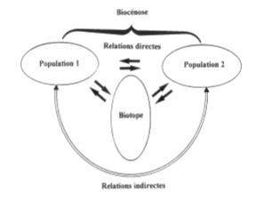

# Ecosystème, écocomplexe et biosphère

L'écologie est l'étude des intéractions entre les organismes vivants et le milieu, et des organismes vivants entre eux dans les conditions naturelles.

Distinction possible entre : 

* l'écologie des populations ou **autoécologie** qui s'intéresse aux espèces individuelles;
* l'écologie des communautés ou **synécologie** qui s'interesse aux ensembles d'espèces dans un milieu donné.

**Autoécologie** : recherches orientées sur l'adaptation d'une espèce vivante à son environnement, analyse des adaptations morphologiques, physiologique, comportemmentale, analyse de l'abondance de la répartition des espèces et de leurs réponses aux facteurs de l'environnement.

**Synécologie** : recherches orientées sur les règles d'assemblage et de coexistence des espèces à l'échelle des communautés.

**Ecologie des écosystèmes** : recherches orientées sur l'organisation, le fonctionnement et l'évolution des écosystèmes.

Ecologie des écosystèmes : étude et analyse des interactions entre les organismes et leur environnement physique.

Ecosystèmes : systèmes qui integrent des processus biotiques (au sein des populations et des communautés), des processus abiotiques (physico-chimiques) et leurs intéractions respectives.

Cette approche à l'échelle des ecosystèmes est fondamentale pour la gestion des ressources naturelles parce qu'elle s'intéresse aux interactions qui lient les systèmes biologiques, dont les sociétés humaines font partie, avec les systèmes physiques (non biologiques) dont ils dépendent.

Dans tout système naturel, il est possible de distinguer :

* biotope : ensemble de conditions physiques et chimiques, relativement homogènes sur une aire géographique donnée, à un instant "*t*".
* biocénose : totalité des organismes peuplant ce biotope (bactéries, champignons, végétaux et animaux)
* population : ensemble des individus appartenant à une même espèce (unité de base)
* communauté : ensemble des populations d'un biotope

C'est grâce à l'existence de multiples interactions entre biotope et biocénose, et au sein de la biocénose entre organismes que se met en place un système fonctionnel, dénommé écosystème.

Le concept d'hydrosystème fluvial est une interdépendance entre le cours d'eau et les écosystèmes riverains. C'est un système à **4 dimensions** : 3 dimensions spatiales et la dimension temporelle. C'est un système composé de **niveaux hiérarchiques emboîtés** : 3 niveaux (secteurs, ensembles et unités fonctionnelles).

La plupart des éléments de l'hydrosystème fluvial sont des écosystèmes :

* l'eau courante, 
* un îlot 
* un marais
* un plan d'eau stagnante
* une forêt riveraine 
* un bras mort...

L'hydrosystème fluvial : **ensemble d'écosystèmes interactifs** soumis à un même **régime de perturbations**, et dont l'**agencement spatial**, les relations particulières et l'histoire commune font émerger un fonctionnement propre.

Par le biais des mouvements d'air et d'eau et grâce aux déplacements dont sont capables la plupart des êtres vivants, tous les écosystèmes sont en interrelation étroite au sein de la **biosphère**.

**Biosphère** : partie superficielle de la planète renfermant l'ensemble des êtres vivants, et dans laquelle la vie est possible en permanence. Ce terme recouvre partiellement les 3 compartiments qui composent la terre : **lithosphère**, l'**hydrosphère** et l'**atmosphère**.

Un écosystème doit donc considéré comme un **réseau fonctionnelle d'interactions** entre ses composantes (biotiques et abiotiques). Dans cet ensemble d'interactions, complexe mais structuré naissent des propriétés globales nouvelles par rapport à celles des éléments en interaction.

# II) Quelques éléments de la théorie des systèmes : structure des écosystèmes et contrôles des processus écosystémiques 

Les systèmes dépendent les uns des autres dans leur fonctionnements et leur évolutions. Il en résultent l'**émergence de propriétés globales**. En retour, l'ensemble agit sur les parties.

L'ensemble de parties (ou d'éléments) peut - être représenté sous forme d'un ornigramme d'intéractions.

* Notion d'interactions directes ou indirectes
* Notion d'interactions "fortes" ou "faibles"

On peut simplifier la représentation d'un réseau d'interaction en retenant que les interactions fortes, ou que les interactions rapides (**théorie des graphes**). Un ecosystème est la *fermeture transitive* d'un réseau d'intéractions entre des populations vivantes et le milieu.

Notion de **transitivité** : 

* si A agit sur B et B agit sur C, alors A agit indirectement sur C;
* la nouvelle relation est indirecte, la transitivité ne conserve par les caractères de force et de rapidité d'une action initiale
* la **fermeture transitive d'un réseau** est l'ensemble des interactions directes et des actions indirectes qu'elles suscitent

En écologie, l'émergence de propriétés globales nouvelles, non entièrement prévues par les propriétés des constituants, est centrale.

Le système agit sur les propriétés, le fonctionnement, l'évolution des éléments. Les propriétés d'un élément ne sont pas la même si elle est isolée (élevage), ou si elle developpe en présence d'autres espèces qui constituent son "environnement biotique".

# III) Propriétés et organisation de systèmes écologiques

**Rétroaction** ou **feed - back** (cybernétique) : dans une action réciproque entre deux éléments A et B, une action dans un sens (A vers B) a pour corollaire une action en sens inverse (B vers A). Toute modification de A perçu par B va susciter une action en retour.

* **Feed - backs positifs** : une modification entraîne par rétroaction une accélération de cette modification, **extinction** ou **emballement**   
* **Feed - backs négatifs** : une modification entraîne l'apparition de forces qui s'y opposent et la ralentissent, **régulation**.

En analysant un système complexe, on constate en général que : 

* les éléments qui le constituent sont également complexes, chacun pouvant être analysé en tant que sous - système
* tout système fait lui - même partie d'un système plus vaste dont il est un élément ou sous - système.

Exemple : un **hydrosytème** est un sous - système du **système fluvial** composé du réseau hydrographique et de son bassin versant

**Hydrosytème fluvial** : système écologique à organisation hiérarchisée enboîtée dont les niveaux successifs se réalisant à différents pas de temps.

Etude de la dynamique des systèmes hiérarchisés montre qu'il existe une très **forte interaction entre la durée de réalisation des processus** ( ou leur fréquence) **et l'extension spatiale des sous - systèmes qu'ils affectent**.

L'hydrosystème est une parfaite illustration des concepts d'écosystème et d'écocomplexe.

Hydrosystème : milieu complexe, à forte productivité et diversité biologique et aux fonctionnalités importantes dans le cycle de l'eau et les cycles des éléments nutritifs. Nécessité d'avoir une vision globale pour gérer localement : importance de la gestion sectorisée.

Au - delà de la valeur patrimoniale, il est nécessaire de prendre en compte les fonctionnalités de ces milieux et les services (écosystémiques) qu'ils procurent (infrastructures naturelles).

Chaque **niveau hierarchique** est un **niveau d'observation** mais aussi un **niveau d'organisation** (niveau d'intégration). Chaque niveau à ses lois spécifiques, donc possède " sa science" et " ses spécialistes". Ce principe de hierarchie régit l'organisation de la matière vivante à toutes les échelles d'observation. Se demander quel est le "système et quels doivent être les "sous - systèmes" n'a de sens qu'au niveau de l'analyse particulière, après s'être fixé une échelle d'observation. Question des niveaux hiérarchiques d'organisation et des échelles d'observation pertinentes est très importante en écologie.

**Approche réductionniste** (ou analytique, cartésienne) : consiste à réduire un système ou des phénomènes complexes à leurs composants plus simples et à considérer ces derniers comme plus fondamentaux que la totalité complexe.

**Approche holistique** (ou systémique, synthétique) : consiste à considérer qu'un système complexe est une entité qui possède des caractéristiques émergentes liées à sa totalité, propriétés qui ne sont pas réductibles à une simple addition de celles de ses éléments.

Organisation hiérarchisée : constante des systèmes complexes car condition nécessaire à la survie et au fonctionnement cohérent de l'ensemble.

Hypothèse : pour qu'un système soit à la fois **complexe** et **stable**, il doit associer de façon coordonnée, par un nombre limité d'interactions, un grand nombre d'éléments. 

Le système devient obligatoirement hiérarchique, c'est - à - dire formé d'ensembles petits, ces ensembles étant groupés entre eux par des interactions plus faibles et cela, selon plusieurs niveaux emboîtés.

Les **écosystèmes sont fondalement structurés dans l'espace et le temps**. Les **interactions sont portées par des flux d'énergie et de matière**. Les lois de la thermodynamique applicables aux systèles vivants sont celles des **systèmes ouverts** traversés par un "torrent d'énergie". Ce "torrent d'énergie" permet le développement et le maintien des systèmes vivants. Ce sont les **flux de matière/énergie** qui font naître et entrentiennent des **structures spatio - temporelles**.

Les écosystèmes sont :

* des systèmes **complexes**, 
* structurés par un **réseau d'intéractions** (cohésion cybernétique),
* **répondant aux lois de la thermodynamique** (des systèmes dissipatifs)
* **organisés sur le plan hiérarchiques** (théorie des hiérarchies)
* **dynamiques dans le temps et l'espace** (théorie des systèmes dynamiques non linéaires)

