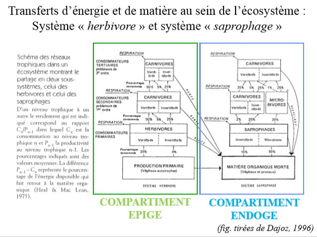

# Flux d'énergie dans l'écosystème

## I) L'énergie solaire

Le **flux radiatif solaire** constitue l'essentiel de la source énergétique dans la plupart des écosystèmes. La **photosynthèse**, processus de réduction chimique n'utilise q'une partie du spectre de longueurs d'onde, et l'énergie fixée se retrouve pour un temps stockée dans la biomasse sous formes de liaisons chimiques.

Autres sources d'énergie existantes : bactéries spécialisées dans la chimiosynthèse = extraction de l'énergie par oxydation de susbstances minérales telles que S ou H2S (hydrogène sulfuré).

Ex : cas des bactéries symbiotiques des communautés animales au voisinage de sources thermales dans les grands fonds océaniques. L'Homme utilise depuis peu d'années l'énergie nucléaire.

Les phénomènes d'absorption de l'IR se répercutent sous forme d'échauffements et ont les conséquences écologiques suivantes :

* **élévation de la température du milieu ambiant**, condition nécéssaire à l'existence d'une biomasse active
* **évaporation de l'eau liquide et mouvements de convexion** permettant à l'eau gazeuse d'atteindre les couches élevées de l'atmosphère
* **mise en mouvement des fluides** à cause de l'inégale répartition de ces élévations de température en fonction de la latitude, de l'altitude et de la saison.

L'apparition de mouvements de masses d'eau et d'air sont dus en majeure partie à l'inégale répartition du rayonnement solaire selon les latitudes et les saisons, **toutes les fluctuations climatiques en découlent**.

**Constante solaire** : énergie reçue par la Terre à la limite supérieure de l'atmosphère, toutes les longueurs d'ondes comprises et avant toutes absorptions et mesurée perpendiculairement auxx rayons solaire.

Rotation de la Terre : le rayonnement mesuré perpendiculaire à la radiation se répartit statistiquement sur une surface planétaire égale à 4 fois celle de la section droite du cylindre intercepté par la sphère terrestre.

**Unité de puissance** ou unités énergie - temps : exemple le watt, symbole W, contient le facteur temps dans sa définition

**Unité d'énergie potentielle** : exemple = la calorie, symbole cal est sans spécificité quant au facteur temps, il faut leur ajouter une unité de temps pour les transformer en unité de puissance. 

La **quantité totale d'énergie reçue en un lieu donné** pendant une journée **dépend de la durée du jour** mais aussi de **l'incidence des rayons** et de **l'absorption atmosphérique**.

Le flux solaire au niveau du sol est conditionné par :

* la hauteur du soleil sur la voûte terrestre
* les composantes, liées au rayonnement diffus, qui dépendent des caractéristiques de l'atmosphère (teneur de l'air en vapeur d'eau, poussières, nébulosité...)

**Dans l'atmosphère**, l'énergie radiative est :

* **réfléchie** dans une proportion qui varie selon la nature de l'objet réfléchissant (notion d'albédo);
* **diffusée** par les molécules d'air, les poussières et les aérosols;
* **absorbée** soit par l'air lui - même ou soit au niveau des surfaces des plantes;
* **rayonnée** par les surfaces ou les particules qui l'ont absorbée (rayonnement ayant son maximum sur une autre longueur d'onde que celle du rayonnement reçu est absorbé = IR thermique de 10 à 15µm)

**Dans l'eau** , l'énergie radiative est :

* **réfléchie** à la surface, seule pénètre une certaine proportion de la lumière incidente;
* **absorbée** à la fois par l'eau pure, les substances dissoutes et les particules en suspension inertes ou vivantes. L'extinction y est plus rapide que dans l'atmosphère. L'absorption des radiations par l'eau transforme l'énergie du rayonnement en chaleur, le milieu s'échauffe notamment en surface.

Les **êtres vivants autotrophes** sont capables de synthétiser eux mêmes leur matière organique à partir d'éléments minéraux et d'un apport énergétique. Dans la biosphère, les végétaux représentent la plus grande partie de ces êtres vivants. Grâce à leur chlorophylle, ils captent l'énergie solaire pour la convertir en énergie biochimique, c'est la **photosynthèse** dont l'équation générale peut s'écrire 

*n*CO2 + 2*n*H2X + énergie lumineuse -> *n*(CH2O) + *n*/2 X2 + nH2X

XH2 = donneur d'électron

X = l'oxygène, le souffre ou diverses matières organiques réductrices

Il faut voir, dans la **biomasse**, de l'énergie stockée jusqu'à sa libération par les mécanismes inverses de respiration et de fermentation.

On parle d'une **stase de l'énergie** = arrêt ou ralentissement du flux d'énergie traversant les structures vivantes et conduisant cette énergie de l'état de radiation à l'état de chaleur.

La conversion des biomasses en leur équivalent énergétique est obtenue par la mesure de la quantité de chaleur dégagée par combustion.

Efficience énergétique = rapport entre la quantité d'énergie stockée dans la biomasse végétale produite et la quantité d'énergie disponible du rayonnement solaire nécessaire pour la photosynthèse de cette biomasse.

La fraction du flux radiatif totale reçu à la surface du globe et utilisable est de 20%.

Pour tout végétal, l'activité photosynthétique s'intensifie avec l'augmentation de l'énergie lumineuse reçue jusqu'à un seuil d'intensité optimale au - delà duquel la photosynthèse diminue en raison d'une **photoinhibition** (destruction de certaines enzymes de la synthèse protéique) et d'une **photo - oxydation** (réaction oxydative non respiratoire). Les espèces végétales se classent le long d'un gradient d'exigence : **héliophiles** (nécéssitant de forts éclairement) à **sciaphiles** (ne se developpant qu'en lumière atténuées)

La lumière n'exerce pas seulement une influence par son intensité ou sa qualité mais aussi par sa **périodicité ou photopériode**. On distingue les **rythmes journaliers** :

* circadiens, périodicité de 24h, qui persitent même si on place les individus dans des conditions photopériodiques différentes;
* nycthéméraux qui sont liés à l'alternance des jours et des nuits et les **rythmes saisonniers ou rythmes annuels**.

## II) L'énergie auxiliaire

Quantités d'énergie indispensables au fonctionnement des ecosystèmes (création et maintien des conditions de vie) qui ont un transit purement physique et ne transitent donc pas par la matière organique.

Une partie importante de cette énergie auxiliaire est consacrée à la mise en mouvements des fluides (air et eau).

L'eau est le véhicule le plus important de cette énergie auxiliaire.

Le cycle de l'eau dépasse le cadre de la biomasse proprement dite, mais non celui de l'écosystème, qui ne fonctionne que traversé en permanence par ce cycle.

Ce cycle est par ailleurs lié à l'**alternance d'évaporation et de condensation** :

* la vapeur se condense sous l'effet du froid; 
* elle précipite par les pluies et la neige puis tombe sur terre, ruisselle, percole en direction des lacs et de la mer, 
* elle peut ensuite s'évaporer à nouveau à partir des surfaces d'eau libre, du sol ou des organismes.

2 exemples de transports de matière :

* le flux d'eau traversant la plante simultanément à la photosynthèse
* les remontées d'éléments nutritifs du fond des lacs ou des océans par les mouvements d'eau provoqués par l'énergie cynétique du vent ou de courants d'eau.

L'énergie auxiliaire est une **énergie de covariance** : pour que l'écosystème soit efficient, les répartitions des éléments destinés à interagir doivent coïncider dans l'espace et temps, ils doivent varier ensemble.

L'**énergie auxiliaire secondaire** est l'énergie de covariance assurée par les organismes eux - mêmes et toute l'énergie consacrée par les organismes à l'organisation de leur milieu ambiant, dans un but de développement et de survie.

L'**énergie auxiliaire secondaire** est extraite des aliments.

Chez les végétaux :

* Croissance vers la lumière chez les végétaux

Chez les animaux : 

* déplacements actifs des organismes (migration des éléments biogènes à l'échelle de l'écosystème)
* brassage du milieu (bioturbation dans le sol);
* édification de structures (structures biogéniques).

## III) Schéma général de l'écosystème

## IV) Transfert d'énergie et de matière dans l'écosystème : productivité et réseaux trophiques

### A) La production primaire

Flux d'énergie dû au rayonnement solaire à la surface de la planète est à l'origine :

1. d'une **mise en contact des cellules végétales avec des éléments minéraux dissous dans l'eau** des océans, des lacs ou la solution du sol ce qui aboutit à l'assimilation cellulaire.

2. de l'**apport d'énergie nécessaire à la chlorophylle** pour synthétiser de la matière organique.

La production primaire : Vitesse à laquelle se forme, par unité de temps une quantité donnée de matière organique, à partir de matière minérale et d'un apport d'énergie. Elle est exprimée en masse de carbone assimilé par unité de temps, elle correspond donc à un flux. Elle est réalisée par des **organismes autotrophes** ou **producteurs primaires** qui constituent le premier niveau trophique des **réseaux trophiques**.

Parmi les autotrophes, on distingue :

* les **phototrophes**, synthétisent leur matière par photosynthèse
* les **chimiotrophes**, tirent l'énergie nécessaire à leur synthèse de réactions chimiques

Equation générale de la production primaire de matière organique : 
 
nCO2 + 2n H2X + énergie -> n(CH2O) + nH2O +n/2 X2 

XH2 = donneur d’électron 

Les végétaux étant les organismes autotrophes majoritaires, la production primaire s’effectue principalement par voie photosynthétique (n= 6 et X=O)
 
Rappel : photosynthèse = transformation de l’énergie lumineuse en énergie chimique stockée dans des molécules organiques 

 Cette M.O. constituent la biomasse végétale = masse de matière vivante végétale présente à un moment donné dans un milieu donné.
 
**Biomasse** = masse des organismes vivants (végétaux + animaux + bactéries + champignons) compris dans un volume donné d’écosystème, au moment de l’observation. S’exprime en unité de masse sèche ou d’énergie par unité de surface ou de volume (kg/m3, g/m2, t/ha).  

**Nécromasse** = en écologie végétale, masse des organismes ou des organes morts encore attachés aux parties vivantes. 

**Litière** = masse des organismes ou organes détachés des parties vivantes et accumulés sur le sol, mais encore reconnaissables (horizon OLdes pédologues

**Phytomasse** = partie végétale de la biomasse, complétée de la nécromasse. Pour des raisons pratiques, elle se répartit en :

* phytomasse aérienne	
* phytomasse souterraine

**Zoomasse** = complément de la phytomasse, la zoomasse correspond à la biomasse animale

**Rendement** = rapport entre l’énergie retenue par les végétaux pour fixer leur biomasse et l’énergie mise à leur disposition. Notion d’efficience énergétique de la photosynthèse

**Productivité** = rapport entre la production pendant un temps donné et la biomasse présente dans le milieu (s’exprime en unité de temps -1)
 
**Productivité** = Production / Biomasse = **P/B**

Inverse de la productivité = B/P = **vitesse de renouvellement de la biomasse** ou **turn - over**.

**Production primaire brute** (PB) = quantité de matière organique produite par photosynthèse par unité de temps (ou quantité d’énergie utilisée pour la maintenance du système végétal) 

**Production primaire nette** (PN) = production primaire brute diminuée de la consommation respiratoire (R) 

d’où : **PN = PB - R** 

PB > 0 quand les conditions autorisant la photosynthèse sont réunies

R est un processus catabolique antagoniste de la photosynthèse :  (CH2O) + O2 -> CO2 + H2O + énergie

**Variation de biomasse végétale pdt un intervalle de temps donné** = différence entre la PN et la consommation ou toutes autres pertes de matériel organique (mortalité par ex.) pendant le même temps :

* si consommation ou pertes = PN => biomasse constante 
* si consommation ou pertes > PN => biomasse diminue 
* si consommation ou pertes < PN => augmentation de biomasse

Si la PN sert à l’accroissement de biomasse, elle n’en est pas synonyme, puisque, dans le temps considéré, une part de la biomasse produite a déjà pu être consommée, décomposée ou exportée.

Une variation de biomasse observée pendant un intervalle de temps donné n’est une mesure exacte de la production biologique que si aucune perte (par consommation ou mortalité) ne se produit dans le même intervalle de temps.

Méthode **destructive** ou directe (utilisée dans la majorité des cas) : prélèvement à des intervalles réguliers et sur des surfaces connues des parties aériennes, puis détermination du poids sec ou de l’équivalent énergétique. 

Pour connaître la valeur exacte de la production, il faudrait quantifier aussi les parties souterraines et ce qui a été prélevé par les herbivores au cours de la croissance. En fait, on récolte un accroissement de biomasse aérienne (phytomasse) et non une production. 

Il faut privilégier les **méthodes non destructives** ou indirectes.

Méthodes non destructives :

* mesure du flux de CO2 qui fait appel à la relation directe entre la photosynthèse et la production nette.
* **utilisation du Carbone 14 radioactif**, détecté comme traceur à partir d'une certaine quantité connue et injectée au printemps
* **dosage de la quantité de chlorophylle**, la relation est ici d'ordre chlorophylle -> photosynthèse -> production nette
* **détermination de l'indice foliaire** : rapport entre surface totales des feuilles d'un espèce et la surface de projection au sol, donne une idée de l'effort déployé par la plante pour obtenir une surface chlorophyllienne plus grande que la simple section interceptée de rayonnement solaire.
* **mesure des chutes de litières**, que l'on sait corrélé avec sa production

### B) La production secondaire

C'est la biomasse produite par unité de temps par des organismes dénommés **consommateurs**. Les consommateurs transforment la matière organique synthétisée à la base de la chaîne alimentaire par les organismes autotrophes ou producteurs primaire. Les consommateurs sont des **organismes hétérotrophes** et sont classiquement rangés en 3 catégories : les herbivores, les carnivores et les parasites.

Les herbivores : consommateurs primaires (C1). Ils consomment des végétaux et constituent le second niveau de la *chaîne alimentaire*. 

Les carnivores : consommateurs secondaires (C2) ou tertaire (C3). Ils capturent les proies et transforment donc la biomasse animale. On distingue :

* les consommateurs d'herbivores : consommateurs secondaires (C2) ou prédateurs : Taupe -> Ver blanc

* les consommateurs de carnivores = consommateurs tertiaires (C3) ou super-prédateurs : Buse -> Taupe -> Ver blanc

* les parasites, ils allongent les chaînes alimentaires 

Les consommateurs particuliers : les détritivores et les décomposeurs

Organismes qui assurent la décomposition plus ou moins lente des cadavres et des déchêts végétaux. Ils consomment la MO morte laissée par les producteurs I ou II pour assurer leur croissance, leur métabolisme et leur reproduction. Ils assurent un rôle important dans le **recyclage de la matière** car leur action aboutit à la minéralisation de la MO :

* les **détritivores** se nourrissent des restes d'organismes (détritus animaux ou végétaux) tombés au sol après leur mort;
* les **décomposeurs** (bactéries, champignons) achèvent la transformation amorcée par les détritivores et sont responsables de la minéralisation proprement dite.

#### 1/ Les détritivores

Rôle important dans la 1ère étape de la transformation de la MO morte laissée par les producteurs I ou II : 
 
* **action de fragmentation** des débris en éléments de plus en plus fins,

* ces éléments qui se retrouvent dans leurs excréments (ou dans les boulettes fécales) sont repris par d’autres transformateurs.

Les MO que les détritivores ingèrent sont dilacérées au cours du transit intestinal :

* une partie est transformée en biomasse, 
* le reste est rejeté dans les fèces, contient de la MO déjà plus dégradée (hydrolyse enzymatique dans le tube digestif).

On distingue : 
 
* les **saprophages** qui mangent de la MO non différenciée animale ou végétale (ex. Cloportes ingèrent des éléments végétaux en décomposition)
* les **nécrophages** qui se nourrissent exclusivement de cadavres d’animaux (ex. Nécrophores = Coléoptères); 
* les **coprophages** qui consomment des excréments (ex. Bousiers = Coléoptères); * les **géophages** qui ingèrent du sol et se nourrissent de la MO qu'il contient (ex. Vers de terre endogés, Oribates et certains Collemboles) -> rôle primordiale dans l’humification

### C) Les rendements énergétiques

**Efficiences ou rendements énergétiques** = rapport entre le flux énergétique sortant et le flux entrant pour un niveau trophique -> rapport énergie fixée/énergie reçue 

**Efficience de consommation** = rapport entre l’énergie ingérée par un consommateur (I) et celle qui est contenue dans la nourriture dont il dispose (N du niveau n-1). 

E (consommation) = I/N1 (du niveau n-1). 

**Efficience d’assimilation** = rapport entre l’énergie assimilée (A) des nutriments et l’énergie ingérée (I) des aliments. 

E (assimilation) = A/I

Efficience de production nette = rapport entre l’énergie fixée c’est à dire l’énergie nette (N) sur l’énergie assimilée (A). 

E (production nette) = N/A

**Efficience écologique** ou rendement écologique = rapport entre l’énergie fixée (N) dans la production nette d’un consommateur et l’énergie ingérée (I) contenue dans l’aliment consommé

E(écologique) = N/I

### D) Flux d'énergie et réseaux trophiques

Il existe le long des *chaînes alimentaires* et des réseaux trophiques des transferts de matière et d’énergie. La **matière se conserve** et **est constamment recyclée** dans l’écosystème (ou parfois exportée) tandis que la respiration des organismes produit de l’énergie dégradée sous forme de chaleur qui n’est pas recyclée et qui est perdue. Les schéma ne prenant en compte que les chaînes de broutageprédation (sous-système *herbivore*) doivent être complétés par le chaînes de détritus (sous-système *saprophage* ou *décomposition*).

Passe entre deux écosystèmes : **écotome**

Les bactéries et les champignons décomposent la MO et la minéralise. Les vers de terre sont des ingénieurs écologiques (créent des structures biologique dans le sols -> répartissent la matière organique différemment pour les bactéries et les champignons).

Plus le sol est fertile, plus la décomposition est importante. En forêt verte, une feuille se décompose en 2 - 3 ans.

### E) Organisation hiérarchisée

Chacun des niveaux trophiques de la chaîne alimentaire est le siège d’une importante dissipation, sous forme de chaleur, de l’énergie qu’il reçoit -> la structure des biocénoses et hiérarchisée

### F) Illustrations : structure et productivité de quelques écosystèmes, le cas des chaines de détritus

Prairie = milieu créé par l’homme pour assurer la subsistance du bétail après élimination de la forêt de chênes ou de hêtres
 
La végétation de la prairie normande parturée est divisées en 3 strates : 

* l'hypergaïon : la partie aérienne
* l'épigaïon : la surface du sol
* l'hypogaïon : le sol superficiel

Prairies temporaires (5ans) : moins diverses en matière végétale et où est utilisé des fertilisants

Prairie permanente : Prairie de plus de 5 ans

Ecosystèmes nouveau : tous les écosystèmes naturalistes, progressivement modifié par l'Homme. Peut avoir des conséquances dans la gestion des écosystèmes, préserver une surface pour un aspect de conservation (notion de rareté).

Protection d'espèces -> protection d'habitats -> protection d'un écosystème

Les chaînes de détritus (chaînes des décomposeurs = chaînes des phytosaprophages) sont constituées par les organismes agents de la minéralisation et de l’humification de la MO. Dans les écosystèmes terrestres, ces chaînes sont complexes et étroitement liées au sol. Elles sont formées de modules (ou compartiments) fonctionnels concernant des animaux appartenant successivement à : 

* la macrofaune (ex. Cloporte, 1 cm) 
* la mésofaune (ex. Oribate, 1 mm) 
* la microfaune (ex. Amibe, 10 à 100 µm) 

Champignons et Bactéries se trouvent en amont, à l’aval et à l’intérieur de ces 3 modules 

Fonctionnement des chaînes de détritus est donc très différent de celui des autres chaînes alimentaires (broutage-prédation, parasitoïdes, ectoparasites, endoparasites), 3 caractéristiques à retenir : 

* 3 groupes d’êtres vivants sont impliqués dans la décomposition (bactéries, champignons et animaux); 
* aux différents niveaux de la chaînes, les détritivores mangent et remangent la même feuille, à chaque fois un peu plus fragmentée et modifiée chimiquement par son passage dans différents tractus digestifs; 
* la taille des animaux diminue et leur nombre augmente de niveau en niveau (différence notable avec la chaîne broutage-prédation)

### G) Conclusion

Limitations de l'analyse par niveau trophique : 

* le régime alimentaire d'une espèce est souvent varié et variable  
* comment situer le matériel organique mort dont se nourrissent les détritivores et les décomposeurs 

La taille d'un organisme détermine largement ce qu'il fait dans l'écosystème. Plantes supérieurs et ses ressources consommées par un large éventail d'herbivores de tailles variés.

Théorie développée par Cousins : distinction entre 2 types de transferts alimentaires (valables pour les aliments vivants et les aliments détritiques). 

L'aliment-particule : 

* recherché activement par le prédateur (= particule de plus grande taille); 
* le long des chaînes trophiques : augmentation de la taille des particules vivantes, diminution du nombre des particules, concentration de la biomasse; * part importante de l'énergie assimilée consacré au déplacement (énergie auxiliaire IIaire) 

L'aliment-substrat 

* Aliment plus grand que son consommateur qui vit en lui ou sur lui ;  * Consommateur initie une chaîne alimentaire "à particules" ; 
* Détritivores de grandes taille avalent du substrat (Lombrics); bactéries de la décomposition organique ; 
* Végétaux utilisent l'aliment substrat.

Traits structurels d'un écosystème

Les éléments : 

* Identifiables, dénombrables et classables 
* Espèces biologiques, individus, stades de développement + composantes physiques (T°C, P mm, débits, …) et chimiques 

Les réservoirs :

* Stockage de l’énergie, des matières et de l’information 
* Autorisent l’adaptation du fonctionnement de l’écosystème 

Un réseau de communication :

* Permet les échanges d’informations, de matière et d’énergie entre les éléments et entre les réservoirs 
* Réseau trophique + sons, phéromones, vision, etc = réseaux de communication 

Une frontière :

* Sépare le système de son environnement,+/- perméable 
* Notion d’écotone

Traits fonctionnels d'un écosystème

Les flux d’entrées et de sorties 

* Rapports du système avec son environnement 
* Rapports +/- nombreux et intenses selon que le système et +/- ouverts sur l’extérieur 

 Les flux internes 

* Flux d’informations, d’énergie ou d’éléments qui circulent entre les réservoirs 
* Flux circulent dans les réseaux de communication, peuvent être modulés par des systèmes de régulation

Des boucles d’information dites de rétro-action (feed-back) 

* Rôle déterminant car combinent les effets des réservoirs et des flux 

Des délais de réponse 
 
*  Permettent de procéder aux ajustements dans le temps nécessaire à la bonne marche du système
