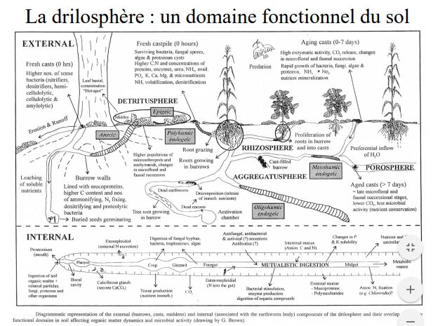
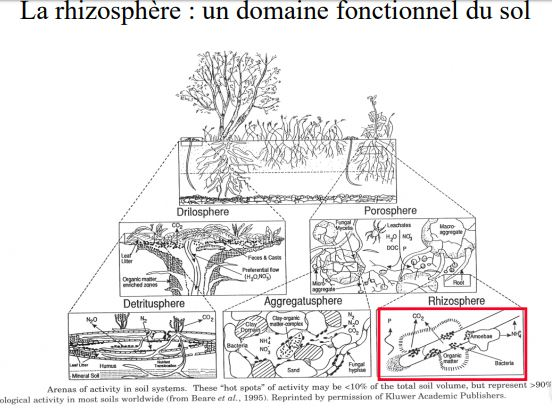
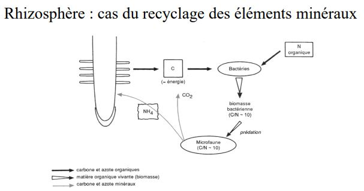
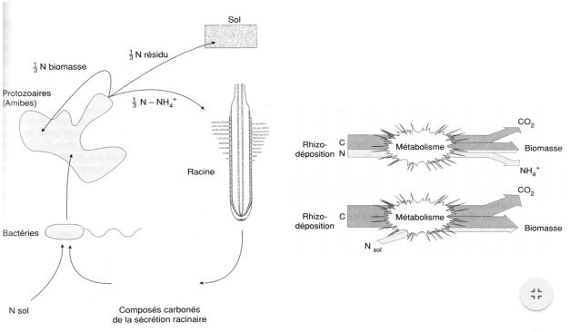

# 1. Les interactions biotiques au sein de l'écosystème

L'énergie entre et chemine dans les écosystèmes :

* transport de l'**énergie auxiliaire** principalement par l'eau;
* transit de l'**énergie liée à la biomasse** le long des réseaux trophiques

La **biomasse** regroupe de nombreuses espèces, diversifiées. Ces espèces interagissent entre elles soit **directement**, soit **indirectement** en passant par une modification des propriétés physico - chimique du milieu. Le degré le plus élevé d'intrégration, biomasse - milieu est sans doute réalisé dans le sol.

## I) Les interactions indirectes via la modification du milieu physico - chimiques 

Action sur la lumière disponible : les organismes les plus proches de l'arrivée des rayons solaires interceptent la lumière (-> diminution de la luminosité et modification de la composition en longueurs d'onde).

Les espèces *sciaphiles* se développent sous l'abri des espèces *héliophiles*.

Exemple des espèces forestières en milieu terrestre, des algues vertes unicellulaires (Chlorelles) symbiotiques des coraux constructeurs de récifs en milieu aquatique.

Compétition entre *microphytes* planctoniques et *macrophytes* dans les étangs (eau claire et pas de phytoplanctons sous les lentilles d'eau et les Nénuphars.)

La notion d'effet de serre :

L'énergie radiative est rayonnée par les surfaces qui l'ont absorbée, exemple par les peuplements végétaux vivants. Ce rayonnement possède une plus grande longueur d'onde que celle du rayonnement incident. Ces longueurs d'onde sont plus facilement absorbées par les gouttelettes et la vapeur d'eau atmosphériques, par le CO2 (provenant de l'oxydation de MO) et par le CH4 (provenant des dégradations anaérobies). Une quantité d'énergie  est donc piégée à l'intérieur du volume de milieu occupé par le peuplement.

La température se trouve augmentée l'échelle du microclimat.

**Dans les milieux aquatiques -> augmentation de la turbulence**. L'augmentation de rugosité créée par un banc d'organismes filtreurs fixés induit une turbulence qui permet une exploitation trophique de l'eau susjacente sur une épaisseur plus importante. Au sein d'un écoulement laminaire la couche d'eau à la portée du peuplement serait plus vite épuisée.

**Dans les sols et les sédiments : phénomènes de bioturbation** = action combinée des animaux fouisseurs et des racines et des organes souterrains des plantes supérieurs.

* Fouisseurs dans le sol = Lombrics, Insectes et Mammifères creusant terriers et galeries
* Fouisseurs dans les sédiments = Vers, Crustacés et Mollusques

Conséquences :

* ameublissement mécanique 
* oxygénation des parties profondes
* redistribution de la MO
* remontée en surface d'éléments minéraux
* neutralisation du pH

En milieu marin, la colonisation des sédiments vaseux par des *Polychètes tubicoles* enfoncés verticalement crée un feutrage dense :

* le feutrage de panaches filtreurs brise le courant favorisant la sédimentation des particules en suspension
* l'animal capture des particules fines grâce à son appareil filtreur, les agglutines, elles sont déposées ou ingérées par l'animal qui enrichit alors le sédiment en MO par ses excréments
* l'implantation de tubes nombreux consolide le sédiment et s'oppose à l'érosion

Formations de *Salsolacées* en région tempérées ou dans les mangroves des régions tropicales piègent les particules en suspension et fixent le sédiment par leurs racines, en plus elles l'enrichissent en MO

**Interactions aérodynamique** entre le vent et la végétation

* la géométrie et la souplesse des organes végétaux soumis au vent créent des turbulences dans toute masse d'air passant à travers la frondaison (ou canopée) -> ceci est favorable aux échanges gazeux par renouvellement incessant des surfaces de contact.
* une haie protège le sol contre le vent sur une distance égale à plusieurs fois sa hauteur

**Climat observé à l'intérieur d'une strate végétale** = microclimat. Exemple du microclimat forestier

* atmosphère plus humide qu'à l'extérieur (transpiration végétale et renouvellement ralenti de l'air)
* température moins variable qu'à l'extérieur (rôle de tampon thermique joué par la vapeur d'eau et l'effet de serre), le jour, l'évaporation au niveau des feuilles abaisse localement la température
* atmosphère des sous - bois plus riche en CO2 (respiration du sol)

Le climat est plus tempéré, plus tamponné : température plus basse et plus constante, humidité plus constante et plus élevée, lumière atténuée.

Action de la végétation sur le climat régional (mésoclimat) :

* pluviométrie moyenne augmente au - dessus d'une forêt : 696 mm de pluie/an en forêt de Fontainebleau contre 600 pour les champs avoisinant
* cycle circadien d'évaporation/précipitation au - dessus des forêts tropicales

**Actions sur la répartition de la MO**

Il s'agit ici des mouvements de biomasse et de nécromasse réalisés par les organismes eux - mêmes. Une grande partie de l'énergie auxiliaire est consacrée à la dispersion de la MO et à son déplacement hors des régions où elle a été formée (ex. zone d'upwelling en mer exploitées par une biomasse d'animaux capables de migration et qui, après s'être nourris, vont répartir la biomasse formée dans des zones moins productive; leurs excréments et cadavres se retrouvent à l'origine d'une nouvelle production végétale...)

On constate que la synthèse et la dégradation de la MO vivante sont généralement séparées dans l'espace : conditions créées par la dégradation d'une grande quantité de MO sont impropres au maintien de la plupart des organismes.

**Le sol**

Le sol peut - être considéré comme un cas extrême de contrôle du milieu physico - chimique par les organismes. Il est issu de produits de dégradation de la roche sous - jacente au niveau de son contact avec l'eau et l'air, auxquels s'incorpore de la MO provenant des horizons supérieurs. Les organismes interviennent à la fois dans la formation et l'évolution du sol :

* dégradation de la roche mère (actions mécaniques et modifications chimiques)
* incorporation de MO (dilacération et enfouissement de la litière, enfouissement de cadavres et d'excréments, transits intestinaux, actions biochimiques et enzymatiques, rôles des racines)

Toute évolution du sol se traduit au niveau macroscopique par une évolution de la végétation (= dynamique réciproque biomasse - milieu).

## II) Exemple de l'épisolum humifère : carrefour des interactions entre les êtres vivants et les constituants inertes du sol

**L’épisolum humifère** est la partie supérieure du sol où se rencontrent les matières minérales et organiques. Il est constitué des horizons humifères (O , H et/ou A) dont l’organisation est sous la dépendance essentielle de l’activité biologique (AFES, 1995).

La **forme d’humus** est la “traduction” macromorphologique et taxonomique de l’épisolum humifère. Elle est basée sur la séquence verticale particulière des horizons O , H et/ou A. 

Le terme d’**humus** *sensu stricto* est réservé à l’ensemble des matières organiques issues des processus d’humification. Il a donc un sens très précis de nature biochimique.

L'énergie solaire déploie dans l'épisolum tous ses effets, avec libération de l'énergie chimique contenue dans la MO et fixée préalablement par la photosynthèse. Selon le type de formation végétale, 50 à 90% de l'énergie contenue dans la production primaire entrent dans les réseaux trophiques du sol (chaînes de détritus). Les 50 à 10% restants nourrissent les réseaux trophiques hors sol (chaînes de broutage - prédation). Cette énergie permet la croissance des organismes, l'organisation de leurs relations mutuelles et la construction de nouvelles molécules biologiques.

La production de biomasse dans un écosystème se traduit à la mort des organismes ou des organes par le retour au sol des MO dites "fraîches".

Les MO fraîches sont consommées par les différents organismes décomposeurs (au sens large) du sol dont les vers de terre, les Anthropodes, les champignons et les bactéries.

Ces organismes ont des actions que l'on peut classer en trois grands types :

* **fragmentation** (animaux)
* **digestion** (transformations chimiques : enzymes des champignons et bactéries, sucs digestifs)
* **incorporation** de la MO à la matière minérale (animaux fouisseurs)

Les résultats des actions des organismes décomposeurs peuvent être étudiés sous 2 aspects :

1/ **transformation morphologiques des retombés** : individualisation des horizons O et A dont la succession définit **les formes d'humus**

2/ **devenir des constituants de la MO fraîches** : minéralisation de la cellulose, lignine, des sucres en ions et molécules simples + formation de molécules organiques complexes (humidification), plus ou moins liées aux argiles, formant l'**humus** *sensu stricto*.

### A) Transformation morphologiques des retombées : les classifications des formes d'humus

Comme en taxonomie des sols, l'unanimité n'existe pas pour les formes d'humus. Cependant, 2 critères de différenciation se retrouvent dans l'ensemble des classifications existantes :

* le **degré d'activité biologique** (minéralisation et humidification), révélé par la morphologie des horizons décrits sur le terrain
* le **degré d'aération** opposant les formes d'humus aérées aux formes hydromophes (engorgées en eau). Le niveau moyen et l'amplitude de la nappe déterminent des conditions oxiques ou anoxiques, temporaires ou permanentes, qui influencent la croissance et l'activité des organismes.

#### 1/ Classfication de Jabiol

Une démarche en 3 étapes :

* favoriser d'abord les caractères de l'horizon A
* s'intéresser ensuite aux caractères des horizons holorganiques O et H
* préciser enfin les particularités physico - chimiques ou fonctionnelles par l'adjonction de qualicatifs.

Chaque horizon est défini sur des **bases essentiellement morphologiques** alors que **le fonctionnement apparaît surtout au niveau des formes d'humus** dans leur ensemble.

#### 2/ Classification de Green

La démarche est différente de celle du Référentiel :

* la priorité est donnée aux critères liés au fonctionnement des horizons O et H
* l'horizon A est subsidiaire

L'approche des horizons est plutôt fonctionnelle et celle de la forme d'humus morphologique. On observe un décalage des mulls et des moders du Référentiel vers les moders et les mors au sens de Green. Ceci est dû à l'origine géographique différentes des 2 écoles : plus montagnarde et boréale chez Green, plus tempérée et collinéenne chez Jabiol.

### B) Devenir des constituants de la MO fraîche : Processus de minéralisation et d'humidification

Tous les épisolum humifères suivent le même mode de fonctionnement à 5 voies de transformation de la MO

* minéralisation primaire M1
* minéralisation secondaire M2
* humification par héritage H1
* humification par polycondensation H2
* humification par néosynthèse bactérienne H3

La minéralisation est le stade ultime de la biodégradation de l'humus en matière minérale ou gazeuse sous l'influence de micro - organismes du sol.

Lors de cette transformation, les sources de carbone se minéralisent jusqu'à la production de CO2. L'azote qui se minéralisent en passant par les stades NH4+, NO2- et NO3-

L'humification, au sens large, ensemble des processus de transformation de la MOF en humus sous l'influence des microorganismes du sol (par oxydation, condensation, polymérisation)

Les aspects qui changent de l'un à l'autre sont : 

* les poids relatifs de la minéralisation et de l'humification
* l'importance comparée de M1 et M2
* les intensités relatives de H1, H2, et H3
* la vitesse de transformations biochimiques et la stabilité des composés
* l'influence de la nature des litières
* les influences relatives des diverses catégories d'organismes

**La forme d'humus = intégrateur du fonctionnement biologique et des caractéristiques physico - chimiques de l'épisolum humifère**

Episolum humifère = carrefour des interactions entre activité biologique et caractéristiques physico - chimiques stationnelles

## III) Les interactions directes intra - et inter spécifiques

### A) Interactions intraspécifiques 

**Compétitions/facilitations** entre classes d'âge pour l'espace, la nourriture ou d'autres ressources : exemple de la compétition pour l'O2 chez les truites

**Compétition** entre générations pour l'espace : exemple des Annélides tubicoles installés sur fonds meubles constituent un tapis continu qui filtre toutes les particules y compris les larves d'invertébrés aquatiques d'autres espèces (antagonisme inter - spécifique) ou leur propres larves

**Facilitations** entre générations : exemple d'une population benthique dense émet des phéromones qui attirent les larves et facilitent leur fixation voire leur métamorphose 

**Communications chimiques** : exemple, les phéromones sexuellles qui gouvernent soit le comportement des adultes, soit l'attraction mutuelle des gamètes de sexes opposés dans l'eau.

**Communications comportementales** : exemple, il y a souvent un lien direct entre le comportement social et la physiologie de la reproduction, donc le taux de reproduction. Le taux de reproduction est densité - dépendant.

Chez les végétaux, il y a une **compétition pour les ressources** et **l'espace**. Elle est autant inter- que intraspécifique. Relation entre vitesse de croissance d'une population végétale et sa densité. La production primaire nette par hectare arrive à un palier en condition naturelle; ce palier se maintien lorsque les individus disparaissent et qu'en compensation les survivants croissent plus vite.

### B) Interactions interspécifiques

Les interactions trophiques sont les interactions directes entre organismes à partir des quelles sont bâtis les réseaux trophiques.

Différents types de régimes alimentaire :

* les producteurs primaires autotrophes utilisent le carbone minéral et l'incorporent à leur biomasse par photosynthèse (végétaux chlorophylliens) ou par chimiosynthèse (bactéries chimiosynthétiques)
* les producteurs primaires hétérotrophes décomposeurs de matière organique (tous les champignons et la plupart des bactéries)
* les herbivores, carnivores, détritivores..

**Spécificité alimentaire** :

* animaux filtreurs en milieu aquatique : fixation indifférenciée de particules d'une certaine taille
* spécificité totale vis - à - vis de l'espèce proie
* spécificité poussée dans le parasitisme vrai = insertion d'une espèce dans la physiologie d'une autre 

**Symbioses trophiques** :

* Protozoaires des tubes digestifs d'animaux herbivores ou détritivores (ciliés de la panse des ruminants digèrent la cellulose ingérée et la transforme en sucre assimilable)
* Bactéries sulfureuses symbiotiques d'invertébrés marins
* Dans les rhizosphères : associations symbiotiques étroites réalisées entre les micro - organismes (bactéries symbiotiques, champignons symbiotiques type mycorhizes) et les racines des plantes supérieurs

Les interactions non trophiques sont de nombreuses sortes d'interactions recouvrant toutes formes de **facilitation/inhibition**, de **commensalisme** et de **symbiose**.

* **phorésie** = relation par laquelle un organisme sert de support à l'autre, exemple chez les plantes = **épiphytes**
* **transport d'éléments reproducteurs**, exemple pollinisation des plantes par les insectes
* **transport d'organismes en diapauses**, exemple oeufs de grenouilles transportés sur les pattes des oiseaux
* **interactions par l'intermédiaire de substances oligo - dynamiques** :*phéromones* agissent sur la même espèce, *économes* sur des espèces différentes

Nombreuses sortes d'interactions recouvrant toutes formes de **facilitation/inhibition**, de **commensalisme** et de **symbiose**

* **inhibition mutuelle** de certaines plantes = **amensalisme** : exemple inhibition des herbacées à l’aplomb des noyers par un composé phénolique, la juglone; 
* **substances de croissance produites** dans le sol par des bactéries et des champignons et utilisées par les plantes
* **substances antibiotiques et bactériostatiques** à action spécifique produites par les Champignons du sol symbiotiques : protection des plantes contre des pathogènes, inhibition des bactéries du sol qui sont déjà défavorisées par un pH bas