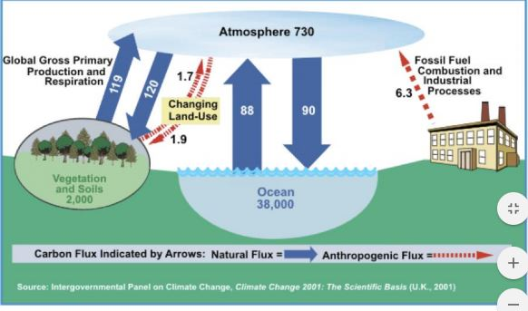

# 2. Cycles de matière : les grands cycles biogéochimiques

**Géochimie** : composition chimique de la Terre et aux échanges d'éléments entre les différentes parties de la croûte terrestre et ses milieux aquatiques, océans, rivières et le reste.

**Biogéochimie** : étude de l'intervention des êtres vivants dans les cycles géochimiques, càd les cycles d'éléments chimiques à l'échelle planétaire. 

**Cycles biogéochimiques** : ensemble des processus qui assurent le recyclage permanent et plus ou moins rapide des divers éléments constitutifs de la matière vivante, présents dans la biomasse et qui les font passer de l'état organique à l'état minérale et inversement.

Odum (1976) distingue 2 groupes de cycles biogéochimiques : 

* les **cycles gazeux** (carbone et azote) dans lesquels l’atmosphère est à la fois le grand réservoir et la soupape de sûreté du système; 
* les **cycles sédimentaires** (phosphore et soufre) dans lesquels le sol et les sédiments sont des sites de flux importants. 

Les quantités d’éléments mises en jeu dans les cycles biogéochimiques à l’échelle de la biosphère sont énormes : evaluations en milliards de tonnes ou Gigatonnes (Gt = 109 t). 

Les cycles biogéochimiques les plus importants intéressent 4 éléments majeurs comme le carbone, l’azote, le phosphore et le soufre; les éléments biogènes (calcium, sodium, magnésium) et des oligoéléments (fer); 1 corps simple l’eau.

Deux types fondamentaux de mécanismes qui assurent la transformation de la M.O. en éléments minéraux (= minéralisation): 

* voie de l’excrétion animale, prédominante dans les biocénoses planctoniques et communautés dont le flux d’énergie principale transite par la voie des chaînes alimentaires d’herbivores; 
* voie de la décomposition microbienne, prédominante dans les milieu terrestre où le flux d’énergie principal transite par la voie des chaînes de détritivores du sol. 

Une voie supplémentaire est le recyclage direct de la M.O. par des champignons symbiotiques formant des mycorhizes, fréquente dans les forêts équatoriales.

## I) Le cycle du carbone

Comme pour tous les cycles étudiés au niveau de l’ensemble de la biosphère, la détermination de l’importance des réservoirs et des flux de carbone est difficile -> les chiffres avancés peuvent légèrement changer avec les auteurs

Le carbone est présent sur le globe : 

* sous forme minérale = dioxyde de carbone (CO2), hydrogéno-carbonates (HCO3-) et carbonates (CaCO3); 
* sous forme organique =  élément constitutif des glucides, protides et lipides.

3 réservoirs à l’échelle de la planète : 

* l’atmosphère 
* les océans 
* la biosphère continentale 

L'atmosphère ne contient que du carbone sous forme minéral. Les océans et les écosystèmes continentaux associent les deux formes : la forme organique dans la biomasse et la forme minérale dans les sédiments carbonatés et les hydrogénocarbonates.

Echanges atmosphère - biosphère continentale : 

* Essentiellement liés à l’activité des êtres vivants; 
* Couple photosynthèse/respiration. 
* 700 Gt de carbone atmosphérique et 35 Gt/an fixée par photosynthèse 

Echanges atmosphère - océans : 

* Quantité de CO2 dissoute dans les océans est environ 50 fois plus grande que celle de l’atmosphère; 
* Totalité du C atmosphérique est renouvelée tous les 8 ans par des échanges avec les océans 
* se font par grâce au système carbonates-bicarbonates à savoir : 1er équilibre  dioxyde de carbone - ions hydrogéno-carbonates CO2 + H2O <=> H3O+ + HCO3, 2eme équilibre ions hydrogéno-carbonates - ions carbonates HCO3- + H2O <=> H3O+ + CO3 2 
* Carbonates de calcium (CaCO3) ou de magnésium (MgCO3) peu solubles précipitent et s’accumulent dans les sédiments => réserves de C minéral dans les roches carbonatées.

Activités humaines (combustion d’énergie fossile, exploitation du calcaire pour fabriquer le ciment et la chaux, agriculture) produisent 5 Gt de CO2/an. 
 Ajouter 2 Gt suite à la déforestation des forêts tropicales.  2/3 de ces 7 Gt sont absorbés par l’océan et le sol -> croissance annuelle du CO2 atmosphérique de 2 à 3 Gt 

L’augmentation de la teneur de l’atmosphère en CO2 est moins rapide que les calculs fondés sur les connaissances actuelles le laissaient penser.  Selon les calculs, depuis le début de l’ère industrielle, le CO2 atmosphérique devrait avoir augmenté de 2 ppm en moyenne/an suite à l’utilisation des combustibles fossiles. Or, l’augmentation mesurée n’a été que de 0,54 ppm/an en moyenne entre 1850 (270 ppm) et aujourd’hui (340 ppm). On ne retrouve dans le bilan que 37 % de l’émission de CO2 anthropique. 
-> Les mécanismes de régulation de la teneur en CO2 atmosphérique ne sont donc pas tous bien connus actuellement (production nette accrue, absorption par le système CO2 de l’océan, importance du sol comme facteur de régulation = “puits de carbone” constitués par la MO stocké dans les sols)

L’effet de serre est un mécanisme naturel qu’il faut distinguer de l’accroissement de cet effet sous l’action des activités humaines (= forçage radiatif). 

 Les principaux responsables de l’effet de serre : 

* vapeur d’eau et ozone – dioxyde de carbone (CO2) <-> combustibles fossiles; 
* méthane (CH4) et oxydes nitreux (N2O) <-> activités agricoles; 
* substances chimiques artificielles <-> procédés industriels : 
	* hydrocarbures halogénés (halocarbures) = CFC (chlorofluorocarbonés, aussi responsable du trou dans la couche d ’ozone), HFC et PFC; 
    * hexafluorure de soufre (SF6) 
    
## II) Le cycle de l'azote

L’azote se trouve : 

* sous forme minérale 
	* azote gazeux (N2, N2O, NOx) ; 
    * ions nitrites (NO2-), ions nitrates (NO3-), ions ammonium (NH4+), ammoniac (NH3); 
* sous forme organique 
	* élément constitutif des cellules animales ou végétales; 
    * métabolite dans les acides aminés constituant des protéines; 
    * élément constitutifs des acides nucléiques sous forme de bases puriques et pyrimidiques
    
 (Les réservoirs du cycle de l'azote)
 
 Renvoie de l'azote dans l'atm sous forme de N2. L'orage pousse l'azote au sol (petit fixation par rapport aux herbivores).
    
Fixations symbiotiques de N2

* Bactéries du genre *Rhizobium* occupant des nodosités sur les racines des Légumineuses (fixation d’N de 150 à 400 kg/ha/an) 
* Actinomycètes du genre *Frankia* des Aulnes (un aulne de 2 m de hauteur fixe de 0,25 à 0,5 kg d’N par an). 

Fixation non symbiotiquqes de N2

* Bactéries fixatrices libres de la rhizosphère : *Azotobacter* ou *Azospirillium* (milieux aérobies) et *Clostridium* (milieux anaérobies); 
* Cyanobactéries ou cyanophycées : certains de ces algues flottent grâce à des cellules spécialisées (= hétérocystes) et captent l’azote pour équilibrer de façon optimale leur rapport N/P.

L’azote atmosphérique est réduit par les bactéries fixatrices en molécules d’ammoniac qui vont participer à la synthèse d’acides aminés, puis de protéines : N2 -> HN=HN -> H2N-NH2 -> 2 NH3 
 
Cette réduction est catalysée par une enzyme la nitrogénase qui est inactivée par l’oxygène ->  les nodules qui consomment beaucoup d’O2 doivent être approvisionnés par des transporteurs, les leghémoglobines, qui facilitent la diffusion d’O2 sous très faible pression, sans inactiver la nitrogénase.   

La fixation de l’azote atmosphérique peut aussi être réalisée par transformation abiotique lors de phénomènes météorologiques :

* phénomènes photochimiques : en altitude, rayonnements transforment l’azote atmosphérique en NH3 et en NOx;  
* phénomène électrique : oxydation de l’azote par la foudre pendant les orages; 
*  influence de certaines précipitations (emprisonnement d’azote dans les flocons de neige)

A la mort des êtres vivants , les micro-organismes décomposeurs (bactéries aérobies principalement) minéralisent l’azote organique.
 Les trois principales étapes de cette minéralisation sont : 
 
 * **l’ammonisation** (= oxydation des acides aminés des protéines en ammoniac ou en ion NH4+) est l’oeuvre de bactéries du genre *Micrococus*; 
* **la nitrosation** ( = oxydation de l’ammoniac en acide nitreux ou en ions NO2-) est l’oeuvre des bactéries du genre  *Nitrosomonas*; 
* **la nitratation** ( = oxydation de l’acide nitreux ou des ions NO2- en acide nitrique ou en ions NO3-) est l’oeuvre des bactéries du genre  *Nitrobacter*;

En condition anaérobie et en présence de carbone assimilable (= substrat énergétique et accepteur d’électrons), des bactéries sont capables de métaboliser les nitrates en nitrites, en oxyde nitreux ou protoxyde d’azote (N2O) et en azote gazeux N2, la **dénitrification**. 

Engrais azotés sont synthétisés par réduction de l’azote atmosphérique : Leur obtention met en jeu des réactions chimiques utilisant de l’acide sulfurique ou nitrique : H2SO4 + 2 NH3 -> (NH4)2SO4 (sulfate d’ammonium) HNO3 + NH3 -> NH4NO3 (nitrate d’ammonium). Ces 2 engrais sont les plus utilisés avec le nitrate de calcium Ca(NO3)2. 

Oxydes d’azote et dioxyde d’azote (N2O) en particulier sont rejetés par les gaz d’échappement automobile.

## III) Le cycle du phosphore

A l’échelle de la biosphère, le cycle du phosphore est incomplet et ouvert. Le phosphore existe sous forme minérale et sous forme organique. Elément relativement rare dans la biosphère, il est souvent un facteur limitant. Le stock de phosphore minéral dont disposent les biocénoses est totalement contenu dans des roches : apatites, sédiments fossilisés (ex. phosphorites). Le cycle du phosphore se déroule en 2 phases : 

* l’une dans les écosystèmes terrestres; 
* l’autre dans les écosystèmes aquatiques. 

Le phosphore est un élément important du métabolisme des êtres vivants : 

* élaboration des tissus (phospholipides des menbranes et du cerveaux), constituant des os et du squelette; 
* gère l’hérédité (acides nucléiques : ADN, ARN); 
* gère l’apport d’énergie (ATP, ADP, AMP; association à des sucres : glucose 6 phosphate, ribulose disphosphate,...). 
* régulation du pH (phosphates du milieu intérieur). 

La dissolution des roches phosphatées met à la disposition des plantes du P minéral qu’elles absorbent et incorporent dans leur biomasse.

Le phosphore circule dans les biocénose par le biais des réseaux trophiques : les végétaux l’absorbent en premier, puis il s’incorpore aux herbivores, aux carnivores, aux parasites, aux prédateurs et enfin aux décomposeurs. A la mort des êtres vivants, les micro-organismes minéralisent le phosphore organique en phosphates (PO4 3-). 

Ces phosphates sont : 

* soit absorbés de nouveau par les végétaux; 
* soit lessivés et ruissellent vers les écosystèmes aquatiques.

Le phosphore existe dans les roches et les sols, le plus fréquemment sous forme de composés de type apatite. "Ca4 (CaX) PO4)3" (avec X = Cl-, F-, OH- ou CO3 2-). 

Ce minéral, très peu soluble peu néammoins libérer des ions orthophosphates PO43- sous l’action de l’altération (action des végétaux et de la MO) 

Cycle du phosphore dans le sols est proche de celui du K, mais très différents de celui de N car il dépend de l’équilibre phase très insoluble majoritaire - phase soluble peu abondante. 

Le ruissellement entraîne dans les eaux douces puis dans les océans les phosphates dissous (PO4 3-). Ce phosphore minéral s’incorpore sous forme organique dans les réseaux trophiques aquatiques : il passe progressivement du phytoplancton au zooplancton, puis se concentre dans les Mollusques, les Poissons (aliment qui contient le plus de phosphore), les Mammifères et les Oiseaux de mer. 

Une petite partie du phosphore des océans retourne sur les continents grâce à la pratique de la pêche ou par les excréments des Oiseaux de mer (guano = fertilisants phosphaté). L’autre partie du phosphore des océans se minéralise sous forme de sédiments à partir des cadavres des êtres vivants aquatiques accumulés dans les eaux profondes.

Par les phénomènes de courants ascendants (*upwelling*), une partie du phosphore minéralisé en profondeur remonte vers les eaux de surface et peut être de nouveau incorporée dans les réseaux trophiques par le phytoplancton (-> cycle fermé). La plus grande partie du P minéralisé en profondeur se perd dans les sédiments :   

*  cette quantité est donc soustraite au recyclage et représente la partie ouverte du cycle du P ; 
* elle finit par se fossiliser sous forme de roches phosphatées au sein des plaques océaniques

L’homme intervient directement dans le cycle par ses activités de pêche et l’exploitation du guano. Une source importante de phosphore d’origine anthropique est due à l’usage de détergents (lessives), de lisiers et de fertilisant en agriculture. La fertilisation moderne apporte, soit des phosphates naturels (phosphate tricalcique), soit des phosphates plus solubles mono ou dicalcique, ou bien, mono ou diammonique. Tous ces composés vont évoluer dans les sols vers des formes moins solubles. Au niveau Européen, la fertilisation phosphatée des sols, abondante depuis le début du XXème siècle, a reconstitué une réserve importante. Celle-ci peut dans certains cas (horizons de surface, sols sableux) constituer une menace pour la qualité des eaux (eutrophisation).

## IV) Le cycle du souffre

Comme les autres éléments, le soufre se présente sous forme organique et minérale. Forme organique = principalement constituant des protéines qui contiennent des acides aminés soufrés (cystine, cystéine et méthionine). Forme minérale : 

* dans l’air, anhydride sulfureux ou dioxyde de soufre (SO2), hydrogène sulfuré (H2S) ou sulfates (SO4 2-); 
* dans l’eau et les sédiments, sulfures (S 2-) 
* dans le sol, minerais comme le sulfure de fer ou pyrite (FeS) ou le sulfate de calcium ou gypse (CaSO4; plâtre) 
* charbon et pétrole en contiennent également

4 sources principales expliquent la présence de soufre dans l’atmosphère :

* émission de gaz par les volcans, les solfatares, très chargés en SO2 et H2S; * combustion des hydrocarbures et du charbon (usines, chauffage des foyers domestiques, gaz d’échappement des véhicules automobiles libèrent du SO2); 
* émission de SO2 et H2S par les sulfobactéries (= bactéries autotrophes vis-à-vis du soufre métabolisent les sulfures et en retirent l’énergie pour réduire le CO2 en molécules organiques); 
* érosion et dissolution des sols par les eaux de pluie.

La plus grande réserve de soufre se trouve au sein des sédiments. Le soufre s’accumule lorsque les conditions sont réductrices en se combinant au fer, au phosphore, au calcium, au magnésium, ... Cette sédimentation se produit en permanence dans les marécages, mais surtout au fond des mers. En se compactant, ces sédiments ont constitués des minerais présents dans les roches comme le gypse ou la pyrite. De même, lors de la formation du pétrole ou du charbon au cours des temps géologiques, des sédiments soufrés se sont ajoutés à la MO qui s’est fossilisée.

## V) Les éléments biogènes (Ca, Mg, K)

Chaque élément chimique entrant dans la composition de la biomasse présente un cycle biogéochimique. Les transferts de nutriments minéraux ont été bien étudiés au sein des écosystèmes. Ils sont quantifiables à l’échelle de l’année par exemple, on peut faire une distinction entre : 

* le cycle biologique proprement dit, qui comporte 3 phases (absorption, restitution et rétention = absorption restitution) 
* les flux qui relient le cycle biologique d’un élément chimique à son cycle biogéochimique plus large

Le calcium :

* Végétaux : 1 à 2 % des tissus, accumulation dans les organes âgés (bois et racines). 
* Animaux : accumulations de carbonate de calcium et de phosphate tricalcique dans les os, coquilles, tests calcaires, … (sédimentation)
* Recyclage du Ca lié à ceux de C et P. 
	* dans le sol : Ca lié aux échanges d’ions (CEC) et à la fixation/libération du phosphore 
	* dans les océans : Ca associé au “système CO2” (carbonate-bicarbonate)    