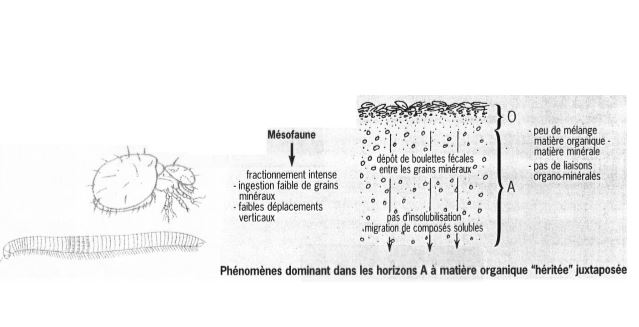

# Les interactions biotiques au sein de l'écosystème (2)

## II) Exemple de l'épisolum humifère : carrefour des interactions entre les êtres vivants et les constituants inertes du sol

**L’épisolum humifère** est la partie supérieure du sol où se rencontrent les matières minérales et organiques. Il est constitué des horizons humifères (O , H et/ou A) dont l’organisation est sous la dépendance essentielle de l’activité biologique (AFES, 1995).

La **forme d’humus** est la “traduction” macromorphologique et taxonomique de l’épisolum humifère. Elle est basée sur la séquence verticale particulière des horizons O , H et/ou A. 

Le terme d’**humus** *sensu stricto* est réservé à l’ensemble des matières organiques issues des processus d’humification. Il a donc un sens très précis de nature biochimique.

L'énergie solaire déploie dans l'épisolum tous ses effets, avec libération de l'énergie chimique contenue dans la MO et fixée préalablement par la photosynthèse. Selon le type de formation végétale, 50 à 90% de l'énergie contenue dans la production primaire entrent dans les réseaux trophiques du sol (chaînes de détritus). Les 50 à 10% restants nourrissent les réseaux trophiques hors sol (chaînes de broutage - prédation). Cette énergie permet la croissance des organismes, l'organisation de leurs relations mutuelles et la construction de nouvelles molécules biologiques.

La production de biomasse dans un écosystème se traduit à la mort des organismes ou des organes par le retour au sol des MO dites "fraîches".

Les MO fraîches sont consommées par les différents organismes décomposeurs (au sens large) du sol dont les vers de terre, les Anthropodes, les champignons et les bactéries.

Ces organismes ont des actions que l'on peut classer en trois grands types :

* **fragmentation** (animaux)
* **digestion** (transformations chimiques : enzymes des champignons et bactéries, sucs digestifs)
* **incorporation** de la MO à la matière minérale (animaux fouisseurs)

Les résultats des actions des organismes décomposeurs peuvent être étudiés sous 2 aspects :

1/ **transformation morphologiques des retombés** : individualisation des horizons O et A dont la succession définit **les formes d'humus**

2/ **devenir des constituants de la MO fraîches** : minéralisation de la cellulose, lignine, des sucres en ions et molécules simples + formation de molécules organiques complexes (humidification), plus ou moins liées aux argiles, formant l'**humus** *sensu stricto*.

### A) Transformation morphologiques des retombées : les classifications des formes d'humus

Comme en taxonomie des sols, l'unanimité n'existe pas pour les formes d'humus. Cependant, 2 critères de différenciation se retrouvent dans l'ensemble des classifications existantes :

* le **degré d'activité biologique** (minéralisation et humidification), révélé par la morphologie des horizons décrits sur le terrain
* le **degré d'aération** opposant les formes d'humus aérées aux formes hydromophes (engorgées en eau). Le niveau moyen et l'amplitude de la nappe déterminent des conditions oxiques ou anoxiques, temporaires ou permanentes, qui influencent la croissance et l'activité des organismes.

#### 1/ Classfication de Jabiol

Une démarche en 3 étapes :

* favoriser d'abord les caractères de l'horizon A
* s'intéresser ensuite aux caractères des horizons holorganiques O et H
* préciser enfin les particularités physico - chimiques ou fonctionnelles par l'adjonction de qualicatifs.

Chaque horizon est défini sur des **bases essentiellement morphologiques** alors que **le fonctionnement apparaît surtout au niveau des formes d'humus** dans leur ensemble.

#### 2/ Classification de Green

La démarche est différente de celle du Référentiel :

* la priorité est donnée aux critères liés au fonctionnement des horizons O et H
* l'horizon A est subsidiaire

L'approche des horizons est plutôt fonctionnelle et celle de la forme d'humus morphologique. On observe un décalage des mulls et des moders du Référentiel vers les moders et les mors au sens de Green. Ceci est dû à l'origine géographique différentes des 2 écoles : plus montagnarde et boréale chez Green, plus tempérée et collinéenne chez Jabiol.

### B) Devenir des constituants de la MO fraîche : Processus de minéralisation et d'humidification

Tous les épisolum humifères suivent le même mode de fonctionnement à 5 voies de transformation de la MO

* minéralisation primaire M1
* minéralisation secondaire M2
* humification par héritage H1
* humification par polycondensation H2
* humification par néosynthèse bactérienne H3

La minéralisation est le stade ultime de la biodégradation de l'humus en matière minérale ou gazeuse sous l'influence de micro - organismes du sol.

Lors de cette transformation, les sources de carbone se minéralisent jusqu'à la production de CO2 et l'azote se minéralise en passant par les stades NH4+, NO2- et NO3-

L'humification, au sens large, ensemble des processus de transformation de la MOF en humus sous l'influence des microorganismes du sol (par oxydation, condensation, polymérisation)

Les aspects qui changent de l'un à l'autre sont : 

* les poids relatifs de la minéralisation et de l'humification
* l'importance comparée de M1 et M2
* les intensités relatives de H1, H2, et H3
* la vitesse de transformations biochimiques et la stabilité des composés
* l'influence de la nature des litières
* les influences relatives des diverses catégories d'organismes

**La forme d'humus = intégrateur du fonctionnement biologique et des caractéristiques physico - chimiques de l'épisolum humifère**

Episolum humifère = carrefour des interactions entre activité biologique et caractéristiques physico - chimiques stationnelles