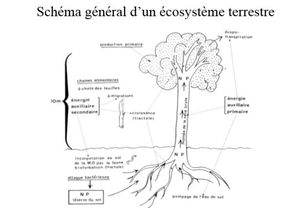

# Flux d'énergie dans l'écosystème

## I) L'énergie solaire

Le **flux radiatif solaire** constitue l'essentiel de la source énergétique dans la plupart des écosystèmes. La **photosynthèse**, processus de réduction chimique n'utilise q'une partie du spectre de longueurs d'onde, et l'énergie fixée se retrouve pour un temps stockée dans la biomasse sous formes de liaisons chimiques.

Autres sources d'énergie existantes : bactéries spécialisées dans la chimiosynthèse = extraction de l'énergie par oxydation de susbstances minérales telles que S ou H2S (hydrogène sulfuré).

Ex : cas des bactéries symbiotiques des communautés animales au voisinage de sources thermales dans les grands fonds océaniques. L'Homme utilise depuis peu d'années l'énergie nucléaire.

Les phénomènes d'absorption de l'IR se répercutent sous forme d'échauffements et ont les conséquences écologiques suivantes :

* **élévation de la température du milieu ambiant**, condition nécéssaire à l'existence d'une biomasse active
* **évaporation de l'eau liquide et mouvements de convexion** permettant à l'eau gazeuse d'atteindre les couches élevées de l'atmosphère
* **mise en mouvement des fluides** à cause de l'inégale répartition de ces élévations de température en fonction de la latitude, de l'altitude et de la saison.

L'apparition de mouvements de masses d'eau et d'air sont dus en majeure partie à l'inégale répartition du rayonnement solaire selon les latitudes et les saisons, **toutes les fluctuations climatiques en découlent**.

**Constante solaire** : énergie reçue par la Terre à la limite supérieure de l'atmosphère, toutes les longueurs d'ondes comprises et avant toutes absorptions et mesurée perpendiculairement auxx rayons solaire.

Rotation de la Terre : le rayonnement mesuré perpendiculaire à la radiation se répartit statistiquement sur une surface planétaire égale à 4 fois celle de la section droite du cylindre intercepté par la sphère terrestre.

**Unité de puissance** ou unités énergie - temps : exemple le watt, symbole W, contient le facteur temps dans sa définition

**Unité d'énergie potentielle** : exemple = la calorie, symbole cal est sans spécificité quant au facteur temps, il faut leur ajouter une unité de temps pour les transformer en unité de puissance. 

La **quantité totale d'énergie reçue en un lieu donné** pendant une journée **dépend de la durée du jour** mais aussi de **l'incidence des rayons** et de **l'absorption atmosphérique**.

Le flux solaire au niveau du sol est conditionné par :

* la hauteur du soleil sur la voûte terrestre
* les composantes, liées au rayonnement diffus, qui dépendent des caractéristiques de l'atmosphère (teneur de l'air en vapeur d'eau, poussières, nébulosité...)

**Dans l'atmosphère**, l'énergie radiative est :

* **réfléchie** dans une proportion qui varie selon la nature de l'objet réfléchissant (notion d'albédo);
* **diffusée** par les molécules d'air, les poussières et les aérosols;
* **absorbée** soit par l'air lui - même ou soit au niveau des surfaces des plantes;
* **rayonnée** par les surfaces ou les particules qui l'ont absorbée (rayonnement ayant son maximum sur une autre longueur d'onde que celle du rayonnement reçu est absorbé = IR thermique de 10 à 15µm)

**Dans l'eau** , l'énergie radiative est :

* **réfléchie** à la surface, seule pénètre une certaine proportion de la lumière incidente;
* **absorbée** à la fois par l'eau pure, les substances dissoutes et les particules en suspension inertes ou vivantes. L'extinction y est plus rapide que dans l'atmosphère. L'absorption des radiations par l'eau transforme l'énergie du rayonnement en chaleur, le milieu s'échauffe notamment en surface.

Les **êtres vivants autotrophes** sont capables de synthétiser eux mêmes leur matière organique à partir d'éléments minéraux et d'un apport énergétique. Dans la biosphère, les végétaux représentent la plus grande partie de ces êtres vivants. Grâce à leur chlorophylle, ils captent l'énergie solaire pour la convertir en énergie biochimique, c'est la **photosynthèse** dont l'équation générale peut s'écrire 

*n*CO2 + 2*n*H2X + énergie lumineuse -> *n*(CH2O) + *n*/2 X2 + nH2X

XH2 = donneur d'électron

X = l'oxygène, le souffre ou diverses matières organiques réductrices

Il faut voir, dans la **biomasse**, de l'énergie stockée jusqu'à sa libération par les mécanismes inverses de respiration et de fermentation.

On parle d'une **stase de l'énergie** = arrêt ou ralentissement du flux d'énergie traversant les structures vivantes et conduisant cette énergie de l'état de radiation à l'état de chaleur.

La conversion des biomasses en leur équivalent énergétique est obtenue par la mesure de la quantité de chaleur dégagée par combustion.

Efficience énergétique = rapport entre la quantité d'énergie stockée dans la biomasse végétale produite et la quantité d'énergie disponible du rayonnement solaire nécessaire pour la photosynthèse de cette biomasse.

La fraction du flux radiatif totale reçu à la surface du globe et utilisable est de 20%.

Pour tout végétal, l'activité photosynthétique s'intensifie avec l'augmentation de l'énergie lumineuse reçue jusqu'à un seuil d'intensité optimale au - delà duquel la photosynthèse diminue en raison d'une **photoinhibition** (destruction de certaines enzymes de la synthèse protéique) et d'une **photo - oxydation** (réaction oxydative non respiratoire). Les espèces végétales se classent le long d'un gradient d'exigence : **héliophiles** (nécéssitant de forts éclairement) à **sciaphiles** (ne se developpant qu'en lumière atténuées)

La lumière n'exerce pas seulement une influence par son intensité ou sa qualité mais aussi par sa **périodicité ou photopériode**. On distingue les **rythmes journaliers** :

* circadiens, périodicité de 24h, qui persitent même si on place les individus dans des conditions photopériodiques différentes;
* nycthéméraux qui sont liés à l'alternance des jours et des nuits et les **rythmes saisonniers ou rythmes annuels**.

## II) L'énergie auxiliaire

Quantités d'énergie indispensables au fonctionnement des ecosystèmes (création et maintien des conditions de vie) qui ont un transit purement physique et ne transitent donc pas par la matière organique.

Une partie importante de cette énergie auxiliaire est consacrée à la mise en mouvements des fluides (air et eau).

L'eau est le véhicule le plus important de cette énergie auxiliaire.

Le cycle de l'eau dépasse le cadre de la biomasse proprement dite, mais non celui de l'écosystème, qui ne fonctionne que traversé en permanence par ce cycle.

Ce cycle est par ailleurs lié à l'**alternance d'évaporation et de condensation** :

* la vapeur se condense sous l'effet du froid; 
* elle précipite par les pluies et la neige puis tombe sur terre, ruisselle, percole en direction des lacs et de la mer, 
* elle peut ensuite s'évaporer à nouveau à partir des surfaces d'eau libre, du sol ou des organismes.

2 exemples de transports de matière :

* le flux d'eau traversant la plante simultanément à la photosynthèse
* les remontées d'éléments nutritifs du fond des lacs ou des océans par les mouvements d'eau provoqués par l'énergie cynétique du vent ou de courants d'eau.

L'énergie auxiliaire est une **énergie de covariance** : pour que l'écosystème soit efficient, les répartitions des éléments destinés à interagir doivent coïncider dans l'espace et temps, ils doivent varier ensemble.

L'**énergie auxiliaire secondaire** est l'énergie de covariance assurée par les organismes eux - mêmes et toute l'énergie consacrée par les organismes à l'organisation de leur milieu ambiant, dans un but de développement et de survie.

L'**énergie auxiliaire secondaire** est extraite des aliments.

Chez les végétaux :

* Croissance vers la lumière chez les végétaux

Chez les animaux : 

* déplacements actifs des organismes (migration des éléments biogènes à l'échelle de l'écosystème)
* brassage du milieu (bioturbation dans le sol);
* édification de structures (structures biogéniques).

## III) Schéma général de l'écosystème

