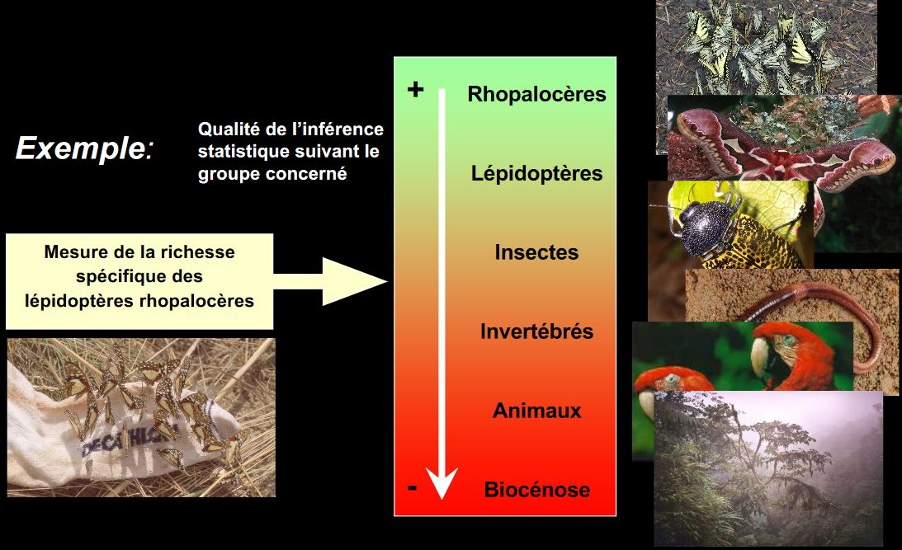
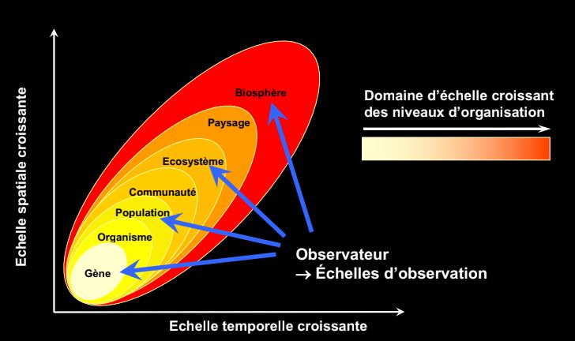
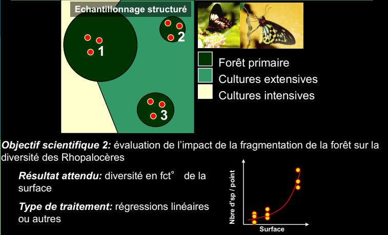

*Semestre 5*

# Systématique appliquée

**Flore** = liste des espèces

**Végétation** = quantitatif, proportion d'espèces

**Biais** = erreur systématique

## I) Bases fondamentales de l'échantillonage 

Un **échantillonage** est toujours construit pour répondre à une question, même si elle est formulée de manière non déclarative, doit -être rendue **apparente**, pour constuire l'outil permettant d'y répondre, le **plan d'échantillonage**.

Un **plan d'échantillonage** produit des **données** qui permettront de tester des hypothèses. Le plan doit - être adapté au type de question posée. En retour, la question doit  être *dimensionnée* pour qu'il soit possible d'y répondre.

Nombre d'espèce = **richesse**

Plus on grandit les espaces, plus la richesse augmente. Les ecosystèmes changent donc la liste des espèces s'accélère. L'orsuq'on arrive à la frontière régional on est dans la biogéographie. Le nombres d'espèces augmente mais plus faiblement.

On aura des marches d'escaliers en fonction de l'échelle croissante.

### A) Les généralités

Objectif de l'échantillonage est de permettre d'inférer à partir des propriétés d'un ensemble d'échantillons, celle de la *pop mère*

**Question méthodo**: comment déterminer les caractéristiques d'un plan d'échantillonnage  de façon à obtenir la maximum d'info pertinente en fonction du pb posé.

**Problème** : Choisir une méthode et une stratégie d'utilisation de cette méthode permettant d'obtenir une représentation satisfaisante de l'objet étudié.

**Domaine d'application**: échantillonage de groupes d'animaux à caractère bio-indicateur.

### B) Problématique générale

**Prise en considération de la complexité extrême des systèmes bio**
* Trop complexe pour être décrits dans leur ensemble
* Un échantillon de ces systèmes est souvent lui même très complexe
* Leur étude se limite à une image approximative, restreinte à un petit nombre de *caractères* ou *descripteurs* choisis en fonction d'une problématique précise

*ex des milliers d'espèces dans certeins ecosystèmes tropicaux, les insectes sont très variés*

### C) Définitions

**Echantillon**: Frangment d'un ensemble prelevé pour juger cet ensemble.

**Descripteur** : variable qualitative ou quantitative utilisée pour décrire un échantillon conformément aux préoccupations de l'étude 

**Echantillonage** : action de collecte des échantillons

**Plan d'échantillonage** : ensemble de processus décisionnels qui aboutissent au plan d'échantillonage et à son amélioration en fonction des résultats.

### D) L'inférence stat

**Le plan d'échantillonage doit permettre l'interférence statistique**

L'estimation des propriétés *vraies* de l'objet global 

> Importance du choix du descripteur

**richesse spécique** = nombre d'espèces présentes

On ne sait pas pour quel groupe l'échantillonage, le représentera le mieux.

La meilleure estimation va être trouvé si:

* On évite **le biais** = info introduite non intentionnellement/ sans lien informatif avec la question dans les données lors de l'échantillonage et qui se retrouve en fin d'analyse 

* On parvient à réduire l'intervalle d'incertitude

> Importance de la définition de la stratégie d'échantillonage

## E) Les processus décisionnel

## F)) Les échelles d'observation

**Niveau d'organisation** = Unité hierarchique formellement identifée et délimitée dans le temps et dans l'espace : échelle à laquelle des propriétés fonctionnelles émergent.

** Echelle d'observation** = domaine d'échelle choisi pour une étude donnée : échelle à laquelle on mesure

**Ecosystème** = niveau d'organisation mais échelle d'observation 

**Profil de sol** = échelle d'observation 

La réponse à une question peut vraiment dépendre de l'échelle à laquelle on la pose.

## G) Les descripteurs

> Classification des descripteurs:

* Les decripteurs quantitatifs
	* définis comme des quantités véritables
    unités de mesures numériques, permettant le calcul de rapports, moyennes, variance ect...
    * ex densité ou biomasse d'individu par taxon
    
* Les descripteurs qualitatifs
	* Catégories ou modalités définies sans assignation de mesure
    * pas d'ordonisation possible
    * pas de calcul possbles 
    * ex présence/ absence d'un taxon dans une communauté
    
* Les descripteurs semi-qualitatifs
	* Catégorie ou modalité par l'existence d'une relation d'ordre
    * Pas de calculs possibles
    * ex : classes de densité par taxon

## H) Les méthodes

> Très fortement contraintes par les objets d'étude :
* Par le comportement des espèces
* Par le milieu échantilloné
* Par la taille des espèces

> Différents types de méthodes d'échantillonnage : 
* Méthodes destructrices ( échantillonnage de sol, prélevement d'individus pour identification au laboratoire)
* Méthode non destructrices ( comptage, libération d'individus, observations visuelles)

## I) Les  contraintes naturelles

> Les contraintes naturelles

* sont lies aux caractéristiques propres des descripteurs:	
	* répartition spatiale et temporelle
    *distribution stat
    
* dépendent des échelles d'observation
	* à la structure de l'écosystème considéré
   	* à l'echelle d'observation choisie

## J) Les contraintes

> Les descripteurs ne sont généralement pas répartis de façon homogène dans l'espace

* problème d'autocorrélation spatiale et de l'**indépendance stat** des mesures
* forte contrainte sur une distance minimale entre mesures
* contrainte également sur l'emplacement des mesures
* cette contrainte est fonction de l'échelle d'observation

> Les descripteurs ne sont pas répartis de façon homogène dans le temps

* forte contrainte sur le moment des mesures
* choix de la date maus aussi de la fréquence des mesures
* cette contrainte est également fonction de l'echelle d'observation

> Les contraintes techniques

* Liées à la nature des descripteurs

	* méthode d'échantillonnage adaptée (macrofaune, édaphique, macrofaune dulçaquicole)

* Liéees aux contraintes du cadre d'étude et de la méthode choisie
	* pb de main d'oeuvre dispo
    * pb de temps dispo
    * pb de  logistique 
    

## K) Le plan d'échantillonnage

> Plan d'échantillonnage aléatoire simple

* Avantage : le seul qui permet d'éviter les biais
* Problème : comment définit-on *aléatoire*

> Plan d'échantillonnage structurés

 * On introduit délibérément des informations en fonction d'une connaissance préalable, d'hypothèses de travail, d'une problématique, ect..
 * On utilise alors un *prémodèle*;forme de description recherchée à priori en fonction de laquelle le plan d'échantillonnage est défini
 
 > La nature du prémodèle implique une idée préalable du traitement ultérieur des données
 
 
 
## L) Les objetcifs scientifiques et pratiques
 

 

 

## M) Les indices de diversité
 
 > Diversité biologique = ensemble de toute les formes de vie présentes sur notre planète, ainsi que des complexes écologiques auxquels elles appartiennent.
 
 * Du gène, aux espèces et aux écosystèmes
 * Groupes taxonomiques, groupes fonctionnels, groupe de réponse
 * Peut etre mesurée à différentes échelles
 * Peut être mesurée à l'aide d'une multitude d'indices
 
Ces indices sont des *propriétés* des communautés que l'on peut mesurer sur un échantillon donné
 Il rendent compte de différentes facettes de ce que l'on appelle la ***biodiversité***
 
**Diversité** = une mesure qui intègre d'une manière ou d'une autre à la fois le nombre de catégories présentes et la répartition de leurs représentants dans la pop.
 
> La rareté moyenne des catégories

On pourrait comparer sur un mode paramétrique les diversités si elles obéissent à des distributions similaires or:

> Il n'existe pas de distribution universelle des abondances. On fait donc appel à des indices non paramétriques.
