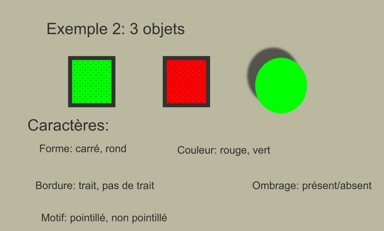
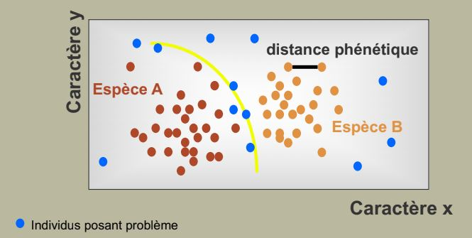
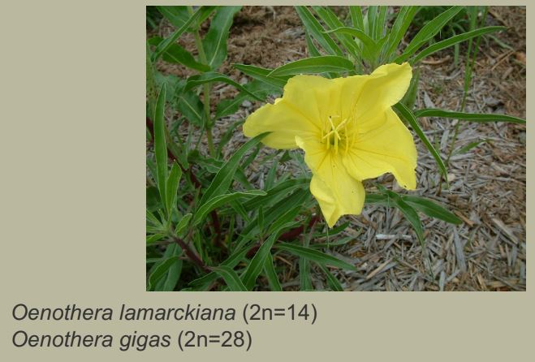
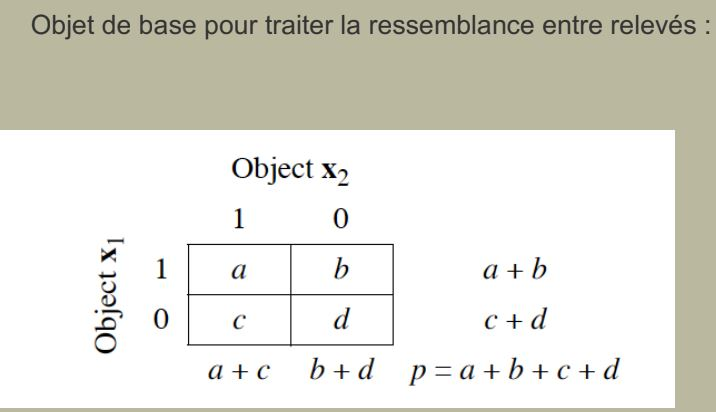

#

## I) La classification des êtres vivants

### A) Objectifs et classement des classifications

Quelques définitions:

**Systématique** = Discipline qui a pour objectif de classer les êtres vivants en fonction de la répartition de leurs caractères.

Peut répondre à des besoins et avoir des objectifs très variés : utilitaires, médicinal, toxiques...

**Classification** = Arrangement hiérarchique des regroupements produits par la systématique

#### Les systèmes descendants : Linné

* Vise à produire un système devant reproduire au mieux l'ordre et l'harmonie de la nature (les plans du créateur)

* Cherche de ce fait à priviligier la **symétrie**, d'où l'usage fréquent de caractères négatifs

* Pondère subjectivement les caractères avec, un privilège accordé aux caractères jugés essentiels (qui reflètent l'**essence** des organismes considérés)

#### Les systèmes ascendants ou agglomératifs

Vise à construire des systèmes dits *naturels* obéissant à des lois générales. Le regroupement des espèces s'effectue sur la base d'une démarche empirique se fondant sur l'étude minutieuse de tous les caractères disponibles.

Pas d'a priori sur les importances relatives des caractères.

#### Les systèmes généalogiques

* Construire un **système** montrant l'harmonie de la nature (méthodes divisives ou descendantes, jusqu'au XVII eme siècle)

* Construire  une **hiérarchie naturelle** par l'étude empirique de tous les caractères disponibles (méthode ascendante)

* Traduire une **généalogie**, l'histoire des espèces..

### B) Les caractères

**Caractères** = fonction qui permet d'assigner à chaque élément d'un ensemble d'objets à décrire un élément unique d'un nombre fini de descripteurs.

**Taxon polyhtétique** = taxon défini par une combinaison d'états de caractères, chacun de ces caractères pouvant éventuellement se rencontrer hors du taxon considéré, ou faire occasionnelement défaut chez un des membres du taxon considéré.

**Syndrome** = combinaison d'états de **n** caractères dont la probabilité de co-occurence dans un taxon donné est plus forte que n'importe quelle autre combinaison.

Importance d'un caractère : un caractère a d'autant plus de valeur si lorsque l'on observe un de ses états, la probabilité de noter silmultanément d'autres caractères est élevée.

Sources d'informations:

* les fossiles (parcellaire mais informatif)
* l'ontogénèse
* la comparaison avec un groupe externe

Caractères intrinsèques:

* morphologiques et anatomiques
* ontogénétique et tératologiques
* cytologiques (ultrastructure des organites...)
* biochimiques et métaboliques
* moléculaires (séquences des protéines, des acides nucléiques..)
* génétiques (nombre et formes des chromosomes, combinaisons alléliques..)

Caractères extrinsèques:

* biogéographiques
* ecologique
* éthologiques
* parasitisme

Les caractères sont les touches du clavier sur lesquels s'écrit la classification des êtres vivants. Les différentes méthodes reflètent le traitement que l'on fait de la ressemblance. Mais les espèces ne sont pas formées d'individus tous identiques entre eux : il reste une variation.

### C) Le concept d'espèce

#### Deux grandes positions

Deux grandes positions s'affrontent quand à l'interprétation de la variabilité à l'intérieur d'une espèce:

* Elle est négligable : **Essentialistes**
* Elle est fondamentale : **Nomalistes**

Pour les essentialistes:

Il y a une reconnaissance de discontinuités dans la nature. Chaque espèce est ainsi définie par un ensemble de caractères qui forment une **diagnose**, est basée sur un échantillon **type**, déposé dans une institution. La variabilité, lorsqu'elle esr reconnue, est considérée comme négligeable.

Pour les nominalistes:

L'espèce eest une *vue de l'esprit*. La variabilité est prépondérante dans la nature, seuls existent des individus et des populations. La nature est vue comme un continum dans lequel l'Homme essaie de mettre de l'ordre.

#### Plusieurs définitions possibles

**Définition phénétique** = L'espèce est l'ensemble des individus qui se ressemblent entre eux qu'ils ne ressemblent à aucun autre individu.

**Définition biologique** = L'espèce est une ensemble de populations interfécondes isolé sur le plan reproductif d'autres groupes similaires et qui occupe une niche particulière:

* approche populationnelle et génétique (l'espèce est un pool de gènes susceptibles de se mélanger à chaque génération)
* la discontinuité sexuelle implique un/des systèmes de reconnaissance
* la spéciation, ou apparition de nouvelles espèces, se traduira par l'apparition d'un nouvel isolement.

Une espèce présente donc un ensemble de caractères qui la rendent adaptée (compétitive vis-à-vis d'autres espèces). 

Il existe des **mécanismes d'isolement** permettant d'isoler une espèce d'un flux génique dans potentiellement nuisible. 

Il existe aussi des mécanismes montrant une certaine diversité génétique dans la population : c'est l'**allogamie**.

Il existe enfin des phénomènes entraînant l'apparition (l'isolement) de nouvelles espèces : **la spéciation**.

Définition biologique (Mayr 1963):

L'espèce est un ensemble de populations interfécondes isolé sur le plan reproductif d'autres groupes similaires et qui occupe une niche particulière:

#### Les mécanismes d'isolement chez les végétaux

Mécanismes prézygotiques (avant pollinisation):

* temporels
	* saisonniers
    * diurnes
* écologiques
* floraux
	* comportementaux
    * structuraux
* autogamie

### Les modalités de la spéciation

* Tectonique des plaques
* Fragmentation des paysages
* Modifications climatiques
* Apparition des nouvelles îles

Plante endémique : plante dont l'aire de répartition est limitée à une aire géographique

Plante cosmopolite : plante dont la répartition couvre un vaste domaine

Spéciation sympatrique

La polyploïdisation = Forme de variation du nombre de chromosomes dans laquelle le caryotype est composé d'assortiments complets de plusieurs jeux de chromosomes

Occurence :

* 90% des Ptéridophytes
* 50% des Angiospermes

* 40% dans la flore d'Afrique du Nord
* 90% dans la flore arctique

Le concept biologique est plus facilement opératoire en biologie animale qu'en biologie végétale : les tests d'infertilité donnent parfois des résultats ambigus: importance de l'isolement écologique

L'application stricte du CBE conduit à isoler un grand nombre de populations (un seul individu cléistogame, des clones de plantes stolonifères) comme espèce.

Les flux de gènes interspécifiques sont importants chez les végétaux.

Particularité du règne végétal; réflexion quant à l'usage d'un caractère morphologique pour déterminer une espèce biologique.

Fréquence des hybrides, difficulté parfois à définir un groupe de rang spécifique.

La classification:

* une théorie unificatrice
* des méthodes différentes et réfutables
* des outils récents permettant l'usage de caractère nouveaux 
* un objectif : rendre compréhensible la diversité du vivant
* une acquisition d'une dimension temporelle au concept d'espèce
* un obstacle majeur: la différence entre la vitesse d'acquisition des connaissances et les taux d'extinctions

## II) Le traitement de la ressemblance entre relevés

Une différence importante entre la classification d’objets
porteurs de caractères pour établir des arbres prenant en
compte leurs ressemblances et la classification d’objets de
type relevés décrits par les espèces est le traitement des
double zéros.

Avoir un caractère dans le même état (absence par
exemple) est une ressemblance dans le cas d’un arbre de
distance phénétique.

Le traitement de la ressemblance dépendra de ce que
l’on a a mesurer :

* Ressemblance globale : symétrie de l’information
* Présence d’espèces : asymétrie de l’information
