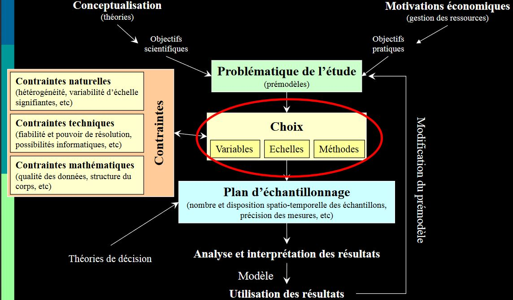
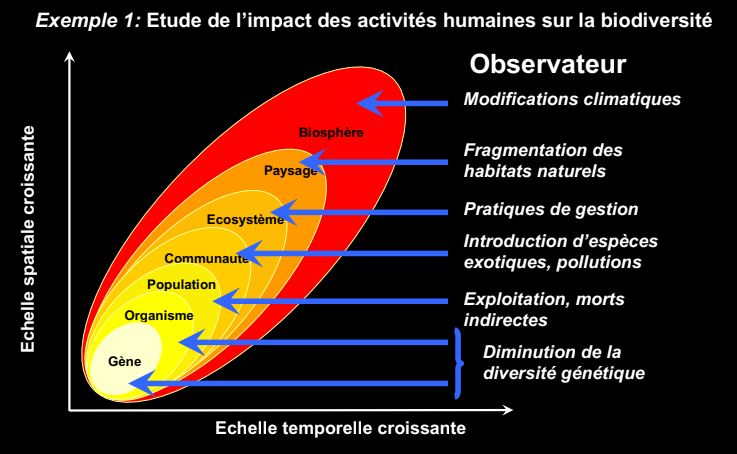
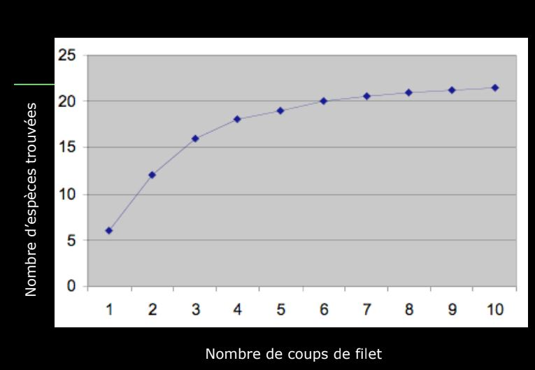

**Flore** = liste des espèces

**Végétation** = quantitatif, proportion d'espèces

**Biais** = erreur systématique

## Les bases fondamentales de l'échantillonage 

Un **échantillonage** est toujours construit pour répondre à une question, même si elle est formulée de manière non déclarative, doit -être rendue **apparente**, pour constuire l'outil permettant d'y répondre, le **plan d'échantillonage**.

Un **plan d'échantillonage** produit des **données** qui permettront de tester des hypothèses. Le plan doit - être adapté au type de question posée. En retour, la question doit  être *dimensionnée* pour qu'il soit possible d'y répondre.

Nombre d'espèce = **richesse**

Plus on grandit les espaces, plus la richesse augmente. Les ecosystèmes changent donc la liste des espèces s'accélère. L'orsque l'on arrive à la frontière régionale, on est dans la biogéographie. Le nombre d'espèces augmente mais plus faiblement.

On aura des marches d'escaliers en fonction de l'échelle croissante.

### I) Les généralités

L'objectif de l'échantillonage est de permettre d'inférer à partir des propriétés d'un ensemble d'échantillons, celle de la *pop mère*

**Question méthodo**: comment déterminer les caractéristiques d'un plan d'échantillonnage  de façon à obtenir le maximum d'info pertinentes en fonction du pb posé.

**Problème** : Choisir une méthode et une stratégie d'utilisation de cette méthode permettant d'obtenir une représentation satisfaisante de l'objet étudié.

**Domaine d'application**: échantillonage de groupes d'animaux à caractère bio-indicateur.

### II) Problématique générale

> Prise en considération de la complexité extrême des systèmes bio

* Trop complexe pour être décrits dans leur ensemble
* Un échantillon de ces systèmes est souvent lui même très complexe
* Leur étude se limite à une image approximative, restreinte à un petit nombre de *caractères* ou *descripteurs* choisis en fonction d'une problématique précise

*ex des milliers d'espèces dans certains ecosystèmes tropicaux, les insectes sont très variés*

### III) Définitions

**Echantillon**: Frangment d'un ensemble prelevé pour juger cet ensemble.

**Descripteur** : variable qualitative ou quantitative utilisée pour décrire un échantillon conformément aux préoccupations de l'étude 

**Echantillonage** : action de collecte des échantillons

**Plan d'échantillonage** : ensemble de processus décisionnels qui aboutissent au plan d'échantillonage et à son amélioration en fonction des résultats.

### IV) L'interférence statistique

>Le plan d'échantillonage doit permettre l'interférence statistique

L'estimation des propriétés *vraies* de l'objet global 

> Importance du choix du descripteur

**richesse spécique** = nombre d'espèces présentes

On ne sait pas pour quel groupe l'échantillonage, le représentera le mieux.

La meilleure estimation va être trouvé si:

* On évite **le biais** = info introduite non intentionnellement/ sans lien informatif avec la question dans les données lors de l'échantillonage et qui se retrouve en fin d'analyse 

* On parvient à réduire l'intervalle d'incertitude

> Importance de la définition de la stratégie d'échantillonage

### V) Les processus décisionnel

### VI) Les échelles d'observation

**Niveau d'organisation** = Unité hierarchique formellement identifée et délimitée dans le temps et dans l'espace : échelle à laquelle des propriétés fonctionnelles émergent.

**Echelle d'observation** = domaine d'échelle choisi pour une étude donnée : échelle à laquelle on mesure

**Ecosystème** = niveau d'organisation mais l'échelle d'observation est difficile

**Profil de sol** = échelle d'observation 

La réponse à une question peut vraiment dépendre de l'échelle à laquelle on la pose.

### VII) Les descripteurs

> Classification des descripteurs:

* Les decripteurs quantitatifs
	* définis comme des quantités véritables
    unités de mesures numériques, permettant le calcul de rapports, moyennes, variance ect...
 
*ex densité ou biomasse d'individu par taxon*
    
* Les descripteurs qualitatifs
	* Catégories ou modalités définies sans assignation de mesure
    * pas d'ordre possible
    * pas de calcul possible 
    
*ex présence/ absence d'un taxon dans une communauté*
    
* Les descripteurs semi-qualitatifs
	* Catégorie ou modalité par l'existence d'une relation d'ordre
    * Pas de calculs possibles
    
*ex  classes de densité par taxon*

### VIII) Les méthodes

> Très fortement contraintes par les objets d'étude :

* Par le comportement des espèces
* Par le milieu échantilloné
* Par la taille des espèces

> Différents types de méthodes d'échantillonnage : 

* Méthodes destructrices ( échantillonnage de sol, prélevement d'individus pour identification au laboratoire)
* Méthode non destructrices ( comptage, libération d'individus, observations visuelles)

### IX) Les  contraintes naturelles

> Les contraintes naturelles

* sont liés aux caractéristiques propres des descripteurs:	
	* répartition spatiale et temporelle
    * distribution stat
    
* dépendent des échelles d'observation
	* à la structure de l'écosystème considéré
   	* à l'echelle d'observation choisie

### X) Les contraintes

> Les descripteurs ne sont généralement pas répartis de façon homogène dans l'espace

* problème d'autocorrélation spatiale et de l'**indépendance stat** des mesures
* forte contrainte sur une distance minimale entre mesures
* contrainte également sur l'emplacement des mesures
* cette contrainte est fonction de l'échelle d'observation

> Les descripteurs ne sont pas répartis de façon homogène dans le temps

* forte contrainte sur le moment des mesures
* choix de la date maus aussi de la fréquence des mesures
* cette contrainte est également fonction de l'echelle d'observation

> Les contraintes techniques

* Liées à la nature des descripteurs

	* méthode d'échantillonnage adaptée (macrofaune, édaphique, macrofaune dulçaquicole)

* Liéees aux contraintes du cadre d'étude et de la méthode choisie
	* pb de main d'oeuvre dispo
    * pb de temps dispo
    * pb de  logistique 
    

### XI) Le plan d'échantillonnage

> Plan d'échantillonnage aléatoire simple

* Avantage : le seul qui permet d'éviter les biais
* Problème : comment définit-on *aléatoire*

> Plan d'échantillonnage structurés

 * On introduit délibérément des informations en fonction d'une connaissance préalable, d'hypothèses de travail, d'une problématique, ect..
 * On utilise alors un *prémodèle*, forme de description recherchée à priori en fonction de laquelle le plan d'échantillonnage est défini
 
> La nature du prémodèle implique une idée préalable du traitement ultérieur des données
 
 
 
### XII) Les objetcifs scientifiques et pratiques
 

 

 

### XIII) Les indices de diversité
 
**Diversité biologique** = ensemble de toutes les formes de vie présentes sur notre planète, ainsi que des complexes écologiques auxquels elles appartiennent.
 
 * Du gène, aux espèces et aux écosystèmes
 * Groupes taxonomiques, groupes fonctionnels, groupe de réponse
 * Peut etre mesurée à différentes échelles
 * Peut être mesurée à l'aide d'une multitude d'indices
 
Ces indices sont des *propriétés* des communautés que l'on peut mesurer sur un échantillon donné
 Il rendent compte de différentes facettes de ce que l'on appelle la ***biodiversité***
 
**Diversité** = une mesure qui intègre d'une manière ou d'une autre à la fois le nombre de catégories présentes et la répartition de leurs représentants dans la pop.
 
> La rareté moyenne des catégories

On pourrait comparer sur un mode paramétrique les diversités si elles obéissent à des distributions similaires or :

> Il n'existe pas de distribution universelle des abondances. On fait donc appel à des indices non paramétriques.

Les indices non paramétriques les plus employés sont:

* richesse spécifique = nombre d'espèce (S)
	* peut -être calculée comme le total des espèces trouvées dans une station donnée
    * Ou comme le nombre moyen d'espèces par échantillon
    
* indices de Shannon - Weaver = indice synthétique de mesure de la diversité spécifique

(voir formule)

* équitabilité (evenness) = meesure de l'équirépartition des espèces au sein des effectifs

(voir tableau)

(voir diapo toujours plus d'indices)

## XIV) Les groupes indicateurs

Les groupes indicateurs doit  être:

* groupe taxonomique ou écologique bien identifié

* présence d'espèces sensibles à certaines perturbations

* répartition géographique importante

* connaissance taxonomique satisfaisante

* échantillonnage standardisé

> Un gourpe ou taxon indicateur indique par sa présence une propriété de l'environnement. Cela invite à réfléchir au déterminisme de la présence ou absence d'une espèce dans un environnement : **la niche écologique**

Premier à utiliser ce terme **Grinnell** 
*Chaque espèce ayant ses propres limites physiologiques, morphologiques et éthologiques, ce qui l'a rend capable d'occuper des espaces particuliers offerts...*

* La niche est une propriété de l'environnement, pas de l'espèce
* Le rôle central de l'exclusion compétitive est reconnu

> Une espèce sera donc indicatrice d'une niche qu'elle est seul à occuper à l'équilibre

**Elton** insiste sur le **rôle fonctionel de l'espèce 

(voir dessin)

**Odum** "*L'habitat d'une espèce est son adresse, la niche est sa profession. Il ne s'agit plus d'un domaine de tolérance, ni d'une place dans un réseau trophique, mais d'un rôle au sein d'un réseau d'intéractions*."

> Intéraction directes mais aussi indirectes par modification de l'environnement physique impactant 

Définition de Hutchinson

Généralisation de la notion d'habitat à l'"espace des facteurs".
La niche, sensu Hutchinson, est le domaine de tolérance vis à vis des pricipaux facteurs.

## Notion de niche écologique

On peut généraliser ...

(voir courbe)

Définition de Hutchinson : utile en termes de bioindication

Définition d'Elton: opératoire

Pour qu'un organisme puisse être considéré comme indicateur, il faut 

* définir ce qu'il est censé indiquer
* contraindre par l'observation les champs d'indication
* choisir

*Exemple : Les lichens et le bioindication de la pollution atmosphérique*
*L'utilisation des lichens comme mesure de la pollution atmosphérique est (très )ancienne:*

* *Erasme Darwin (1790)*
* *Travaux sur les lichens du jardin du Luxembourg en 1866*
* *Les pricipales applications se sont portées, dans les années 50-90, sur le suivi des pollutions acides (SO2), largement réduites depuis.*

Caracas : comparaison sur la base de la richesse spécifique

1970: "Golden Age": les lichens sont utilisés en tant que bioindicateurs de la pollution en SO2. Calibration de la résistance pour chaque espèce, puis relevés qualitatif.

Liste d'espèces construite sur la base des (quelques) données fournies. Par les capteurs de SO2 existant alors principalement en zone industrielle ou urbaine; validée par des transplantation : on plante des espèces estimées sensible...

>La bioindication de la pollution atmosphérique est aussi sensible à lla cinétique et au sens du changement

(voir diapo)

Bilan Bioindiaction

Choix des groupes : doit-être documenté

Choix des écehelles : doit -être dimensionné au domaine des espèces

Pas de bioindicateur universel : Prise en compte des groupes

Problème de la réactivité temporelle : doit-être également mesuré

Garder à l'esprit de la dimension de la niche que l'on considère

