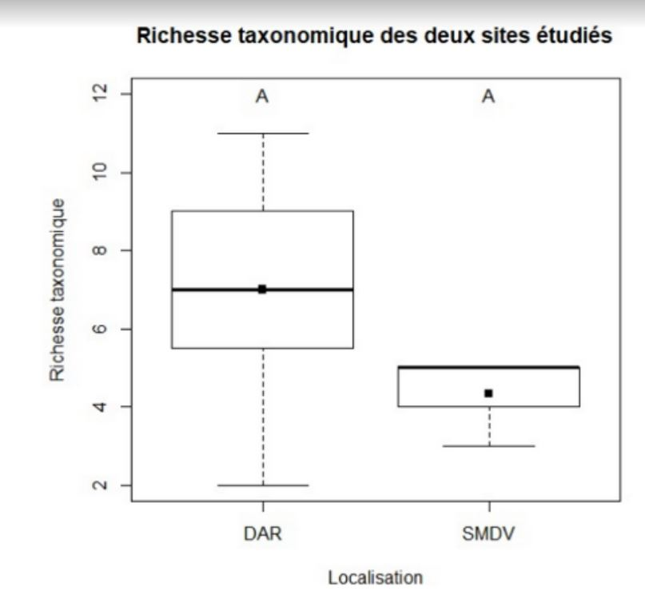
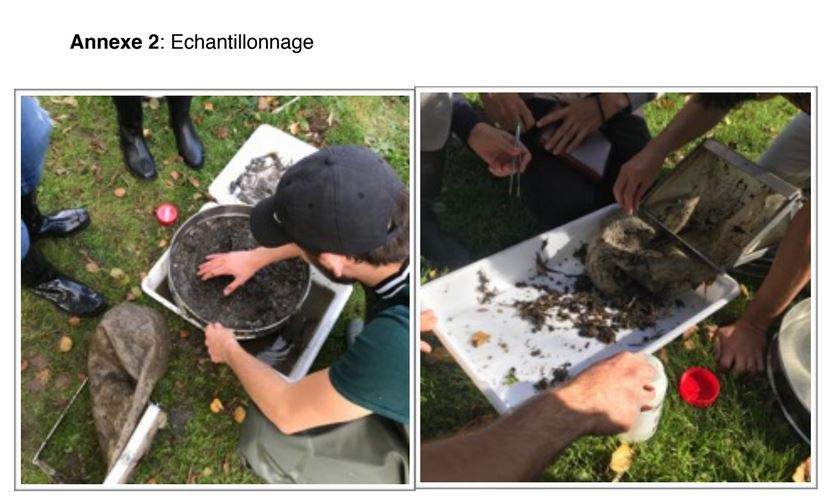
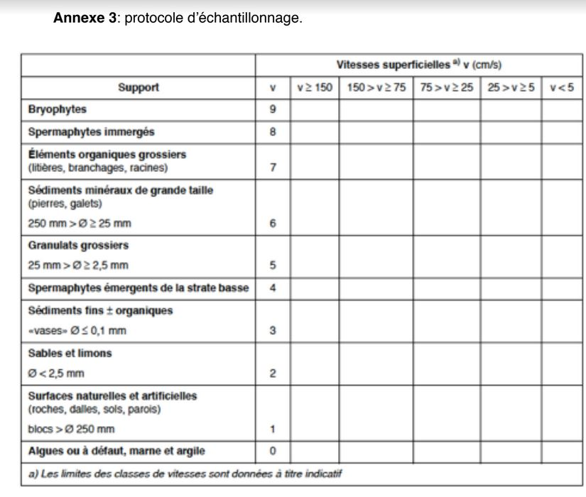
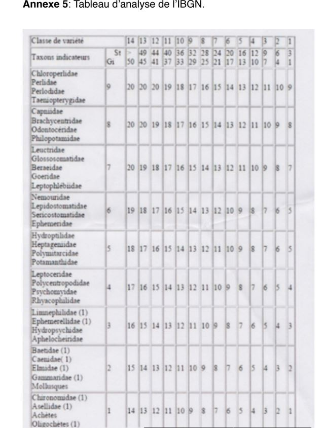

# Introduction

L’eau a toujours été une ressource essentielle pour le développement de la vie. La
majorité des grandes villes sont installées au bord de cours d’eau, qui ont joué un rôle
majeur dans le développement des plus grandes civilisations. Ils permettent un accès
constant en eau potable, si précieuse et nécessaire dans de nombreux aspects de la vie
quotidienne (alimentation, hygiène, production d’énergie, voie de communication et de
transport).
Avec le réchauffement climatique annoncé et la forte augmentation démographique de la
population humaine on constate de très fortes tensions pour l’accès à cette ressource. Le
manque ou l’absence d’eau potable est la première cause de mortalité dans le monde. La
préservation de celle ci et son assainissement apparaissent donc comme un problème
majeur pour l’humanité.
La gestion de l’eau nécessite donc une prise en compte de la pollution souvent provoquée
par les activités humaines à proximité. La pollution peut avoir des origines multiples:
ruissellement des eaux de pluies sur les trottoirs jusqu'au cours d’eau, activités
industrielles alentours qui peuvent rejeter des matières chimiques dans l’eau, engrais et
substances pesticides répandus dans les champs et transportés par les eaux de pluie, une
forte activité automobile, déversements sauvages. Elle peut provoquer une modification
des propriétés du milieu (température, PH, teneur en oxygène, concentration en métaux
lourds, ... ) . Cela peut avoir un impact très négatif sur la biodiversité en raison de la
disparition partielle ou totale des espèces animales et végétales sensibles à la
modification de ces facteurs (espèces bioindicatrices qui permettent de se faire une idée
de l’état du cours d’eau selon des critères spécifiques). D’autant plus que ces espèces
parfois fragiles ont un rôle primordial dans l’équilibre de ces écosystèmes (David Dudgeon
et al. 17 octobre 2015) et les services qu’ils nous procurent (services de régulation et
services d’approvisionnement mais aussi services culturels)
Le Robec est une rivière de 9 km, traversant les villes de Rouen et Darnétal (76) et ayant
comme bassin collecteur la Seine. Dans le passé cette rivière a eu une grande importance
pour la ville de Rouen et ses alentours assurant une partie de l’alimentation de la ville en
eau potable puis un développement économique. En effet, la force hydraulique faisait
tourner des moulins à aube servant à moudre le grains plus tard remplacée par
l’installation d’usines textiles et d’activités de teinturerie le long des ses berges. Bien que
cette dernière activité très pollueuse ait pris fin, le Robec traverse la ville de Darnétal. Elle
est une zone à forte densité de population qui peut toujours exercer un impact négatif sur
la qualité de l’eau de la rivière et sur les espèces y vivants. C’est sur cette base que
s’applique le protocole IBGN (Indice Biologique Global Normalisé) de la norme ISO
T90-350 de mars 2004 dans le Robec.

Cette étude pour la ville de Darnétal, vise à déterminer s’il y a un impact (pollution) de la
ville de Darnétal sur la qualité de l’eau du Robec.
Elle a pour but principal de répondre à l’hypothèse que la ville de Darnétal a un impact
négatif sur la qualité de l’eau du Robec.
De plus lors de nos prélèvements nous avons été frappé par la très forte prédominance de
l’habitat “Spermaphytes immergés” sur la deuxième station de prélèvement en aval de
Darnétal. Cette prédominance était absente de la première station en amont de la ville de
Darnétal qui présentait une mosaïque d’habitat dont les surfaces semblaient plus
homogènes. Il nous a semblé approprié de nous intéresser plus en détails à cet habitat et

de formuler l’hypothèse suivante, la ville de Darnétal a un impact négatif sur la richesse
taxonomique de la macrofaune benthique vivant sur l’habitat “Spermaphytes immergés”.

# Matériel et méthodes

L’étude a été réalisé en trois étapes: la première étant de récolter les échantillons selon un
protocole bien spécifique qui sera détaillé plus bas. La seconde et dernière étape consiste
à une détermination des espèces des échantillons prélevés. Et enfin une étude statistique
des résultats observés.
Site: L’étude a été réalisé sur le Robec sur deux sites différents. Le premier,en amont à St
Martin du Vivier et le second rue de la pannevert à Darnétal.

## Matériel:

Décamètre pour délimiter la surface d’étude, la profondeur de l’eau et la largeur moyenne
estimée du lit mouillé.
Chronomètre pour mesurer la vitesse d’écoulement superficielle.
Échantillonneur de type “Surber” (cf. Annexe 1) pour la réalisation de l'échantillonnage.
Tamis, bac et pinces pour faciliter le prélèvement de la macrofaune benthique (cf. Annexe
2)
Pilulier (avec de quoi annoter le pot) contenant formol (40%) pour y déposer et conserver
les échantillons.
Clé de détermination de la macrofaune benthique et loupe binoculaire pour la
détermination des taxons.

## Protocole pour chaque station (St Martin du Vivier et Darnétal):

On sélectionne une portion de cour d’eau de 10m de long comportant le plus d’habitats
(milieu naturel où vie une espèce animale ou végétale) différents possibles. On mesure à
l’aide du chronomètre la vitesse d’écoulement superficielle. Dans notre délimitation on
détermine 8 habitats dans l’ordre d’une liste définie parcourue de haut en bas (cf. Annexe
3). Dans le cas d’une surface d’étude ne comportant pas 8 habitats différents on reprélève
les habitats les plus représentés à une place différente. On détermine la proportion
estimée de chaque habitat dans la zone d’étude définie précédemment. Chaque pilulier
correspondra à un habitat et sera annoté des informations correspondante; à savoir le lieu,
le groupe, la date et le numéro d’habitat.
Les prélèvements sont réalisés avec un échantillonneur de type “Surber” en veillant à
perturber le moins possibles les différents habitats. C’est à dire d’aval en amont afin que
les éléments transportés par le courant ne se déposent pas sur les zones suivantes. On
détermine avant l'échantillonnage de chaque habitat la profondeur de l’eau. On récupère
ensuite l'échantillonnage dans des bacs, après les avoir tamisés. A l’aide de pince on
procède au prélèvement de la macrofaune benthique présente dans notre échantillon et
on les dépose dans le pilulier correspondant.
On recommence ces étapes pour les 8 habitats prédéfinis et ensuite le protocole entier
pour la station suivante.
Dans un second temps les individus échantillonnés sont identifiés à l’aide de clés de
déterminations et d’une loupe binoculaire. Certains appartiennent aux taxons indicateurs
(cf. Annexe 4). Suite à cette détermination on peut calculer l’indice biologique global
normalisé (IBGN) grâce à un tableau d’analyse (cf. Annexe 5).

# Résultats-Discussion

On ne tient pas compte des données récoltées par le groupe 2A car les prélèvements
effectués sur le site de Saint-Martin-du-Vivier ont été fait sur une portion déjà étudiée la
veille ce qui a pour conséquence l'absence de certains taxons bio-indicateurs présents en
petit nombres et prélevé par le groupe précédent.

DAR= Station de Darnétal (effectif = 3)
SMDV= Station de Saint-Martin-Du-Vivier (effectif = 3)
code couleur:
orange= valeur de l’IBGN entre 8-5
jaune= valeur de l’IBGN entre 12-9
Le carré noir représente la moyenne de chaque série de données.
Le code lettre distingue les échantillons significativement différents.

Test de Wilcox, pvalue=0,07652
L’indice IBGN de Darnétal n’est pas significativement différent (p-value>0,05) de celui de
Saint-Martin-du-Vivier. Toutefois on peut dire qu’on observe une tendance. La note IBGN
semble être globalement plus élevée sur le site de Saint-Martin-Du-Vivier qu’à Darnétal.
Cela laisse penser que l’eau au niveau de la station de prélèvement de Darnétal semble
plus polluée qu’à Saint-Martin-Du-Vivier et que la ville de Darnétal aurait un impact négatif
sur la qualité de l’eau du Robec. Afin de vérifier cette tendance, il est nécessaire de
réaliser un plus grand nombre de prélèvements pour augmenter la précision de l’étude. Il
serait aussi intéressant de réaliser des prélèvement à différentes périodes de l’année car
certain organismes étant des insectes au stade larvaire leur présences dépend de la
saison: le printemps et l’automne.
Il semble aussi important d’ajouter que malheureusement le protocole IBGN ne permet
pas de tenir compte de la proportion de chaque habitat dans la mosaïque d’habitats sur
les stations de prélèvements, or la présence de certains taxons ou leurs nombres peut
varier en fonction des la disponibilité de certains habitats.

DAR= Station de Darnétal (effectif = 7)

SMDV= Station de Saint-Martin-Du-Vivier (effectif = 3)
Le carré représente la moyenne de chaque série de données.
Le code lettre distingue les échantillons significativement différents.
Test de Wilcox, pvalue= 0,1662
Le test de Wilcox montre que les richesses spécifiques de la macrofaune benthique vivant
dans l’habitat “spermaphytes immergé” ne sont pas significativement différentes. On en
déduit donc que la ville de Darnétal n’a pas d’impact sur la richesse taxonomique de la
macrofaune benthique se développant sur les “Spermaphytes immergés”. Cependant la
proportion de cet habitat est bien différente entre les deux stations (5% pour SMDV contre
75% à Darnétal). La surface étant plus importante à Darnétal, la cohabitation entre les
taxons peuplant cet habitat en est peut être facilitée.
Enfin il semble important de signaler que les identifications et les prélèvements ont été
effectuées par des étudiants en licence de biologie encadrés par un professeur et non par
des spécialistes.

# Conclusion

La ville de Darnétal n’a pas d’impacts significatifs sur la biodiversité taxonomique de la
macrofaune benthique résidant dans les spermaphytes immergés.
On observe une tendance avec une note IBGN plus faible sur la station de prélèvement de
Darnétal par rapport à celle en amont à Saint-Martin-du-Vivier. Toutefois d’autres études
sont nécessaires pour espérer obtenir des résultats significatifs et pouvoir affirmer que la
ville de Darnétal a un impact négatif sur la qualité de l’eau du Robec.
Il est possible d’envisager de reproduire le protocole en augmentant le nombre des
prélèvements pour obtenir des résultats plus représentatifs et améliorer la précision du
traitement statistique. De plus il semble opportun de réaliser aussi des prélèvements au
printemps pour observer et tenir compte des espèces présentes à cette saison.
Des analyses chimiques seraient un plus afin d’obtenir des résultats plus précis sur
l’impact de la ville de Darnétal sur la qualité de l’eau du Robec. Cela permettrait de cibler
plus précisément les causes et de pouvoir proposer des solutions pour réduire au mieux
l’impact de la ville sur la rivière car même si on y pense souvent moins, les écosystèmes
d’eau douce sont tout aussi important à protéger que leurs homologues continentaux.

# Bibliographie

Freshwater biodiversity: importance, threats, status and conservation challenges. David
Dudgeon, Angela H. Arthington, Mark O. Gessner, Zen-Ichiro Kawabata, Duncan J.
Knowler, Christian Lévêque, Robert J. Naiman, Anne-Hélène Prieur-Richard, Doris Soto,
Melanie L. J. Stiassnyand Caroline A. Sullivan, publié le 17 octobre 2005 dans Biological
Reviews, numéro 81, pages 163-182.

Norme T90-350. Mars 2004

[http://www.un.org/fr/sections/issues-depth/water/index.html](article 1)

[http://rouen1900.unblog.fr/2015/03/16/rue-eaux-robec/](article 2)

