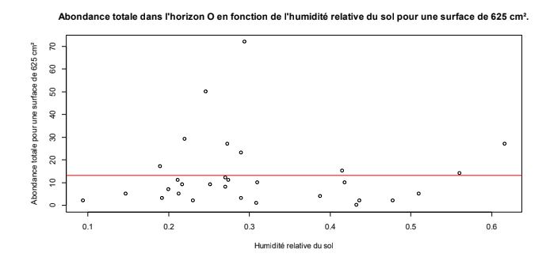

# Macro faune édaphique des coteaux du Bois du Cotillet

## Introduction

La Seine Maritime est l’un des départements les moins boisés de France (15% de surface boisée).
Les surfaces boisées jouent un rôle écologique important et fournissent de nombreux services
( services de régulation et de production entre autres)

De plus l’écosystème forestier abrite une forte diversité animale avec une macrofaune édaphique
(faune dont la taille est supérieure à 2 mm et vivant dans et sur le sol) spécifique.
Cette macrofaune occupe une place importante dans le cycle du carbone en permettant la
dégradation de la matière organique tombée en matière minérale. Elle a donc une influence sur les
propriétés physico-chimique du sol.

Le sol est une structure composée par la superposition de strates appelés horizons formés par
l’accumulation successives de matière au cours du temps. On distingue les horizons organique à
la surface qui comprennent à eux seul 95% de la macrofaune du sol et les horizons minéraux plus
profonds. L’horizon situé à la surface du sol, en contact avec l’atmosphère est la litière (OL). Il est
constitué de débris végétaux non décomposés. Plus en profondeur, l’horizon OF, constitué de
débris de végétaux partiellement décomposés (et dont l’origine est encore identifiable), puis
l’horizon OH, constitué de débris décomposé et enfin l’horizon A, une couche organo-minérale.
La profondeur de ces horizons, tout comme d’autres facteurs environnementaux peuvent varier le
long d’un gradient de pente. On remarque par exemple que la matière organique tombée au sol
sur un coteau s’accumule en bas de pente en raison de la gravité. Puisqu’un gradient
topographique a un impact sur les caractéristiques physico chimique comme le pH (Chun-Chih
Tsui, Zueng-Sang Chen, Chang-Fu Hsieh, Novembre 2004) du sol on peut se demander s’il a un
impact sur la communauté d’organismes y résidents. Dans le but d’étudier l’influence d’un gradient
topographique sur la macrofaune édaphique nous avons formulé 3 hypothèses. La première est
que le pH est plus élevé en bas de pente .

Le bas de pente est une zone peu perturbée de plus c’est la portion où s’accumule la matière
organique tombée dans la pente. Sachant que les isopodes se nourrissent pour la plupart en
décomposant la litière (Stephan Hättenschwiler, Susanne Bühler and Christian Körner, mai 1999)
nous avons formulé cette seconde hypothèse: la diversité spécifique des isopodes est maximale
en bas de pente. Lors de nos prélèvements nous avons été interpellé par le faible nombre
d’individus échantillonnés, ce que nous pensons en partie pourvoir expliquer par les faibles
précipitations inhabituelles à cette époque de l’année. Il nous semble donc intéressant de formuler
l’hypothèse que l’augmentation de l’humidité impacte positivement l’abondance totale de la
macrofaune édaphique dans les horizons de sols échantillonnés.

## Matériel et Méthode

Cette étude a été menée par des étudiants de 3eme année de licence de biologie et encadrée par
un doctorant en biologie.

Elle se déroule dans le Bois du Cotillet (49°27'34.7"N;1°04'36.1"E) sur une pente qui est exposée
au Sud.

Il y a eu quatre réplications de l’échantillonnage; une fois le 6/11/2018, le 7/11/2018 et deux fois le
9/11/2018. Durant chaque réplication, il y avait trois transects avec trois points de prélèvements
(haut, milieu et bas de pente). Les transects d’une même réplication ont été espacés de plusieurs
mètres pour éviter l’autocorrélation spatiale.

Chaque surface de prélèvement a été délimité avec un carré de 25x25 cm.
Tout d’abord un prélèvements de la litière a été effectué, puis un prélèvements des horizons allant
jusqu’à une profondeur de 25 cm (on appellera cette partie horizon sol pour faciliter la
compréhension). Les deux prélèvements ont été déposé dans deux bacs différents afin de
procéder au prélèvements de la macrofaune du sol (faune dont la taille est inférieure à 2mm)
présente dans ces deux échantillons. La macrofaune du sol a été déposée dans un pilulier
contenant de l’éthanol ( 2 pilulier par point de prélèvement 1 pour chaque horizon)
Le prélèvement de l’horizon sol nécessite une bêche pour atteindre une profondeur de 25 cm (ou
bien atteindre l’horizon minéral), il faut éviter au maximum de pelleter à l’intérieur de la zone de
prélèvement pour ne pas abîmer la macrofaune présente.
Une fois toute la macrofaune échantillonnée 40±0.1 g de l’horizon sol sont récupérés pour chaque
surface de prélèvements et placés dans un sachet plastique pour servir aux mesures de pH et
d'humidité.

Les étapes suivantes ont été réalisées de retour au laboratoire.
Pour évaluer l'humidité du sol, un échantillon d’environ 20±0.1 g a été prélevés dans chaque sac,
pesé précisément puis placés au four pendant 24 heures (105°C) afin de le déshydrater.
Une fois sec, l’échantillon a été pesé à nouveau pour permettre le calcul d’humidité relative.
L’identification de chaque individu prélevé a été réalisé à l’aide d’une loupe binoculaire et de clés
de détermination.

Un traitement statistique a été effectué sur les valeurs avec l’utilisation du logiciel R enrichi avec
les library suivantes: vegan, reshape2, labdsv, pgirmess et utilisation des tests de ANOVA,
Shapiro, Bartlett , Kruskal-Wallis et kruskalmc.

## Résultats et discussion

Légende des position topographiques :

* H = haut de la pente
* M = milieu de la pente
* B = bas de la pente

Effectifs :

* H = 9 répétitions
* M = 10 répétitions
* B = 10 répétitions

Les carrés rouges correspondent à la valeur moyenne du pH pour chaque localisation.

Les lettres A et C traduisent la significativité des résultats.
Les données ont été soumises à un test Kruskalmc permettant de déterminer la significativité des
résultats au seuil =0.05 en fonction des zones. ⍺

D’après le test statistique, le pH est significativement plus élevé en bas du transect par rapport au
sommet et au milieu. En revanche, il n’y a pas de différence significative entre le haut et le milieu.
Les valeurs proches de 0 ont été relevées par le même groupe de TP et qu’elles diffèrent
grandement des résultats des autres groupes. On peut donc supposer qu’elles sont biaisées, c’est
pourquoi nous les avons éliminé de l’étude.

Légende des position topographiques :

* H = haut de la pente
* M = milieu de la pente
* B = bas de la pente

Effectifs :

* H = 24 répétitions
* M = 23 répétitions
* B = 23 répétitions

Les carrés rouges correspondent à la valeur moyenne de la richesse spécifique pour chaque
localisation.

Les lettres A et C traduisent la significativité des résultats.
Après avoir vérifié la normalité des données à l’aide d’un test de Shapiro, l’homoscédasticité des
données a été analysé à l’aide du test de Bartlett. Cette dernière n’est pas démontrée car la valeur
de p-value retourné par le test est supérieure à 0.05. Les données ont donc ensuite été soumises
à un test Kruskalmc permettant de déterminer la significativité des résultats au seuil =0.05 en ⍺
fonction des zones.

D’après le tests statistique, la richesse spécifique des isopodes est significativement plus élevée
en bas par rapport au haut et au milieu. En revanche, il n’y a pas de différence significative entre le
haut et le milieu.

Équation linéaire du modèle aX+b :

* a = 52,98
* b = -5,63
* R2 = 0,1772
* p-value < 0.05
* 28 points

La valeurs du R2 est faible ce qui traduit une faible corrélation entre l’humidité relative du sol et
l’abondance totale dans l’horizon A. Cependant la relation est validé au seuil =0.05. ⍺

D’après le test statistique, la macro faune édaphique apprécie davantage les sols où l’humidité
relative est plus élevée.

Équation linéaire du modèle aX+b :

* a = -0.3
* b = 13.26
* R2 = 5,73e-6
* p-value > 0.05
* 31 points

La valeurs du R2 est extrêmement faible ce qui traduit une faible corrélation entre l’humidité
relative du sol et l’abondance totale dans l’horizon A. De plus la p-value est est > 0.05 donc
aucune relation n’est significativement prouvée entre l’humidité relative du sol et l’abondance totale
de l’horizon O .

Cependant il est important rappeler que lors des prélèvements les sols étaient particulièrement
secs et ce depuis une période assez longue ce qui a probablement eut un impact important sur la
vie de la macro faune édaphique. En effet, elle nécessite majoritairement un sol humide
(E.J.Collison, T.Riutta, E.M.Slade, Février 2013) . Cela a donc pu biaiser de façon significative les
résultats de richesse spécifique et d’abondance par rapport à des conditions plus habituelles. Une
partie de la macrofaune s’étant enfouie plus profondément dans le sol. Pour estimer cet impact il
faudrait reproduire les prélèvements à une même période mais par temps plus humide pour
pouvoir ensuite comparer.

De plus il faut souligner que les zones de prélèvements ont été choisies car considérées comme
représentative du milieu échantillonné et non sélectionnées par tirage au sort. Compte tenu du fait
que la distribution de la macrofaune peut varier en raison de certain facteurs (proximité d’un arbre,
replat dans la pente, ...) pour une meilleure représentativité on pourrait reproduire cette
expérience en augmentant les répétitions et ainsi pouvoir sélectionner les zones à échantillonner
par tirage au sort.

## Conclusion

Il y a de fortes variations de pH le long du gradient topographique: le bas de la pente est
significativement plus basique que le haut et le milieu ce qui illustre parfaitement la variabilité des
propriétés physico-chimiques du sol le long de ce gradient.

L’humidité relative ne semble impacter qu’en partie l’abondance spécifique de la macrofaune
édaphique, ce qui tend à penser que la distribution de la macrofaune édaphique est influencée par
plusieurs facteurs différents.
La distribution inégale des isopodes le long du gradient topographique est probablement
influencée par un ou plusieurs facteurs environnementaux.

Bien que l’on puisse penser observer une corrélation entre le ph et l’abondance spécifique des
isopodes en l’absence de documentation à ce sujet il est prématuré de conclure que les 2
observations sont liées. Cela peut faire l’objet d’une étude prochaine sur le même modèle que
celle réalisée pour l’humidité relative des sols mais en se limitant seulement aux isopodes cette
fois.

## Bibliographie

* E.J Collison, T Riutta, E.M Slade, février 2003,“Macrofauna assemblage composition and soil moisture interact to affect soil ecosystem functions”, Acta Oecologica, volume 47,pages 30-36.

* Chun-Chih Tsui, Zueng-Sang Chen,Chang-Fu Hsieh, Novembre 2004,“Relationshipsbetween soil properties and slope position in a lowland rain forest of southern Taiwan”,Geoderma, volume 123, issues 1-2, pages 131-142.

* Stephan Hättenschwiler, Susanne Bühler and Christian Körner, mai 1999,”Quality,Decomposition and Isopod Consumption of Tree Litter Produced under Elevated CO2”,Oikos, Volume 85, No. 2, pp. 271-281.

