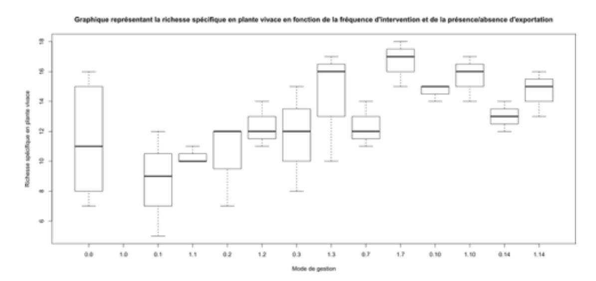
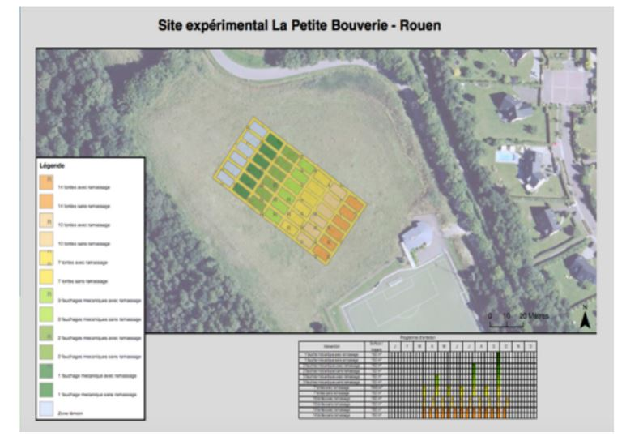
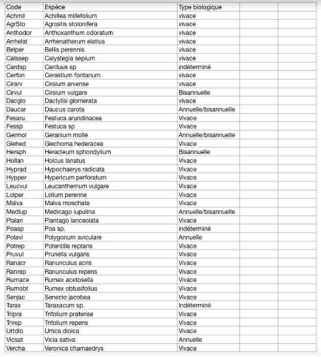

# CR Petite Bouverie

## Introduction

Les espaces verts désignent en urbanisme tout espace d’agrément végétalisé. Ils sont d’une grande importance pour la qualité de vie des riverains. En effet, ils rendent denombreux services: services de régulation (régulation du climat, qualité de l’air, de l’eau),services culturels (bénéficient un bien non matériel obtenu par les hommes qui correspondà un enrichissement spirituel au développement cognitif, expérience esthétique et inspiration créatrice) et peuvent préserver certains écosystèmes.

Cependant la gestion de ces espaces nécessite pour les collectivités locales de concilierles attentes des citoyens, des impératifs budgétaires mais aussi des considérations écologiques. Les communes cherchent à réduire leurs budgets et leur impact environnemental dans laquelle la gestion des espaces verts occupent une place
importante. Dans le but de réduire leur coûts de fonctionnement, elles sont de plus en plus nombreuses à se tourner vers la gestion différenciée des espaces verts. Cette dernière, qui consiste à réduire sur certaines parcelles les interventions d’engins de coupe motorisés, permet ainsi une économie de main d’oeuvre ainsi que de carburant et donc une baisse des émissions de carbone fossile.

Certain citoyens, en raison de leurs attentes, peuvent aussi influencer la gestion des espaces verts sur la verdure, leur uniformisation ou encore l’exigence d’une pelouse rase, traduisant un entretien régulier et symbole de richesse (plutôt que des herbes hautes d’aspect considéré négligé).

Ces pratiques peuvent impacter la biodiversité des parcelles, notamment celle des plantes vivaces. Cette étude, en collaboration avec la métropole de Rouen, est basée sur l’hypothèse que la gestion des espaces verts sur le site de la Petite Bouverie a un impact sur la végétation. Nous avons choisi comme hypothèse qu’il existe un impact du nombre d’intervention sur la richesse spécifique (nombre d’espèces dans un système) des plantes vivaces, groupe de végétaux étant susceptibles de vivre deux ans au minimum.

## Matériel et méthodes

Matériel:
Site: l’étude a été réalisé sur une parcelle matérialisée dans une prairie (Espace de la
Petite-Bouverie, 20 allée Pierre de Coubertin à Rouen) le 26 septembre 2018. Auparavant
cet espace était fauché une fois par an, depuis trois ans. Elle sert de lieu
d’expérimentation. Cette parcelle est divisée en 42 sous-parcelles de 10mX5m chacune et
est organisée en 7 groupes avec des fréquences de coupe différentes. L’une d’elle n’est
jamais fauchée ni tondue, les autres sont respectivement fauchées 1, 2, 3 fois par an ou
tondue 7, 10, 14 fois par an. Ces 6 derniers groupes sont divisés en 2 sous groupes: l’un
avec exportation du produit de la fauche/tonte et l’autre sans exportation (cf. Annexe1).
Clé de détermination simplifiée: permettant l’identification des espèces végétales
présentes sur la parcelle.
Décamètre pour mesurer les distances.
Cadre de 1mX1m pour délimiter les zones d’étude.
Logiciel R pour l’étude statistique des données récoltées.

Méthode:
Un inventaire floristique a été réalisé avant la mise en place de la gestion différenciée.
Un relevé est réalisé chaque automne et printemps depuis 3 ans.
Les inventaires suivent une méthode inspirée du protocole Florilège-prairies urbaines initié
en 2015 par le Département de la Seine-Saint-Denis, Natureparif, le Conservatoire
botanique national du Bassin parisien, Plante & Cité et l’équipe Vigie-Nature du Muséum
national d’Histoire naturelle.
A l’aide du décamètre, on se place au centre de la sous-parcelle et on place à l’aide du
cadre une première zone de relevé. Autour de celle-ci, on place de part et d’autre dans le
sens de la longueur deux autres zones d’études.
Dans chacune de ces zones on relève la présence/absence d’espèces végétales grâce à
la clé de détermination.

Les relevés sont réalisés par groupes de 4/5 personnes inventoriant chacun 3 sous-
parcelles.

On détermine ensuite les plantes vivaces parmi toutes les plantes observées (cf Annexe
2).
Les données récoltées sont traitées à l’aide du logiciel R (test Kruskal-Wallis. )

## Résultats

0 : sans exportation
1 : avec exportation

D’après le test de kruskal - Wallis, l’augmentation de la fréquence de tonte a un effet négatif sur la richesse spécifique (test de kruskal, p.value = 0.01447)

D’après le test de kruskal - Wallis, l’exportation a un effet négatif sur la richesse spécifique (test de kruskal, p-value = 0.02274)

## Discussion-conclusion

D’après nos résultats, le nombre d’interventions : fréquence et type de tontes, tout comme l’exportation a un impact significatif sur la richesse spécifique des plantes vivaces sur les différentes parcelles et confirme ainsi notre hypothèse. La tonte provoque une perte de biomasse pour les végétaux, ce terme est qualifié de perturbation, et a un effet négatif sur les plantes vivaces qui sont souvent stress résistantes. Des coupes régulières permettent par exemple de réguler efficacement la présence de Circium arvense au sein d’une prairie (K. Georges Beck et James.R Sebastian, 20 janvier 2017)

Toutefois, on peut se demander s’il n’existe pas un meilleur indicateur pour étudier l’impact de ces différents modes de gestion sur les populations de plantes vivaces. En effet, on constate que même si la richesse spécifique des plantes vivaces est impactée elle ne permet pas de rendre compte précisément des impacts des différents modes de gestion sur la biodiversité végétale et des préférences pour les différentes espèces de milieux de développement différents.

Il nous faut cependant souligner que notre étude peut avoir été perturbé par des biais Bien que encadrée par des professeurs l'identification des plantes n’a pas été réalisé par des experts en botanique, mais par des étudiants, dans des parcelles parfois tondues très court, et sur des végétaux présentant un appareil végétatif en partie sectionné.
De plus, les parcelles n’ont pas été inventorié à la même vitesse, et il n’est pas certain que tous les groupes présentaient les même capacités d’identifications de végétaux. Afin d’améliorer la précision de nos tests statistiques, il pourrait être souhaité d’augmenter le nombre de répétitions pour chaque traitement qui permettrait de consolider les résultats que nous observons bien que la significativité des résultats soit déjà obtenue. Il serait aussi judicieux d’étudier cette hypothèse au fil des années pour appréhender l’effet de traitements sur une période et non seulement de manière ponctuelle. Cela pouvant permettre de mettre en avant une dynamique liée à l’enrichissement progressif du sol pour les zones sans export et à une sélection progressive par épuisement des individus liée à chacune des fréquences d’interventions.

Les résultats de cette étude semblent être en accord avec la promotion auprès des collectivités locales et du public de la mise en place d’une gestion différenciée des espaces verts pour permettre une augmentation de la biodiversité au sein de ceux-ci, et notamment une augmentation de la richesse spécifique des plantes vivaces.
Toutefois d’autres études peuvent être nécessaires pour mieux appréhender d’autres aspects de la biodiversité comme la biodiversité animale de ces espaces.

Références

http://abiris.snv.jussieu.fr/

http://www.r-project.org/

Combining mowing and fall-Applied Herbicides to control Canada Thistle (cirsium
arvense). K. George Beck and James R. Sebastian. Volume 14, Issues 2. June 2000 pp 351-356. Published online: 20 January 2017

Guide Delachaux des fleurs de France et d'Europe

David Streeter Christina Hart-Davies Audrey Hardcastle Felicity Cole Lizzie Harper Paru le 26 mai 2011

Annexe 1: Site expérimental La Petite Bouverie- Rouen

Annexe 2: Liste des espèces observées et type biologique associée.

