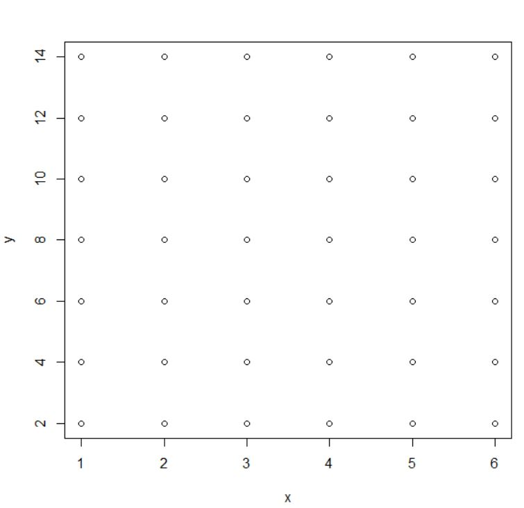
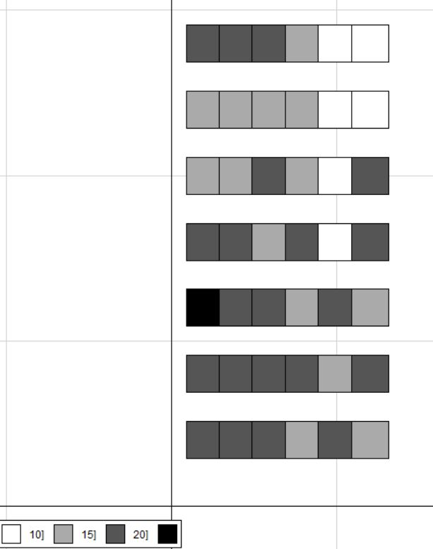
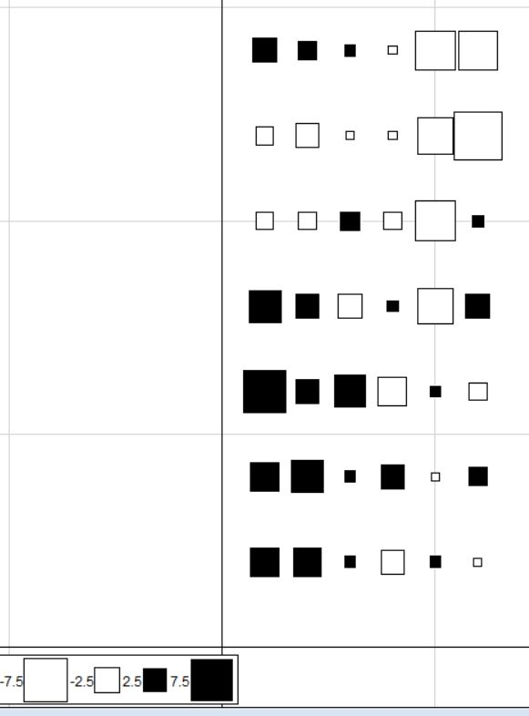

```R
read.table("data18.txt") -> data
dim(data)
head(data)

t(data) -> data

dim(data)

colSums(data)

data[,-which(colSums(data)==0)] -> data1

dim(data1)

data1 -> data

apply(data, 2, mean)

rep(1:42, each = 5) -> fac42

list(fac42) -> fac42

aggregate(data, fac42, sum) -> dat42

dat42[,-1] -> dat421

dat421 -> dat42

rm(dat421)


head(dat421)

order(colSums(dat42))

dat42[,order(-colSums(dat42))]

head(dat42)
rowSums(dat42>0) -> richesse

rowSums(ifelse(dat42>0, 1, 0)) -> richesse2

richesse2==richesse

install.packages("ade4")


library(ade4)

rep(1:6, 7) -> x
rep(c(14,12,10,8,6,4,2),each=6) -> y

cbind(x,y) -> xy

xy

plot(xy)
```

```R
s.value(xy,richesse, method ="greylevel")
```

```R
s.value(xy, richesse-15.28)
```

```R
mdu <- 1

s.value(xy, dat42[,mdu], sub=colnames(dat42)[mud], csub=3)

read.table("facteurs2018.txt") -> fac18
```