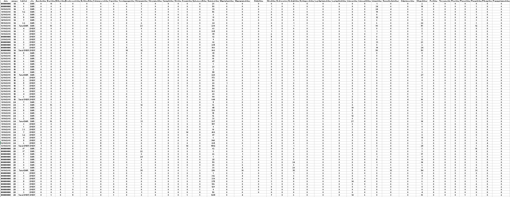

# Terrain IBGN

Normso = protocole standard

## Protocole IBGN

***Est ce que la ville a un impact sur la rivière ?***

* Organismes faune et flore
* Mesures chimiques -> coûte cher

Nous allons voir la macrofaune benthique

* Richesse d'espèce
* Nombre d'individus par espèce
* Nombre d'individus
* Abondance globale

Influence:

* Vitesse de cours d'eau
* Concentration en Oxygène
* Quantité d'eau (ici hauteur d'eau)

Résultats d'échantillonnage:

