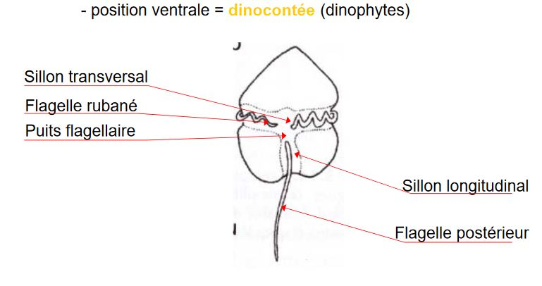
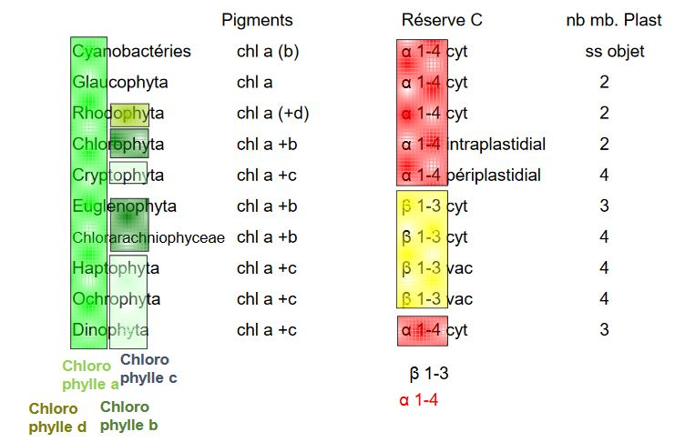

# Bases de la classification

C'est un groupe artificiel d’organismes **unicellulaires** ou **thallophytes**

Le caractère commun à toutes les algues = présence d’un plaste

Classification encore largement fondée sur les caractères

* biochimiques
* plastidiaux tq nature et localisation des pigments (chloro,carotènes ...),disposition des thylacoïdes (isolés, empilés)
* type de mitose, mais apports importants par la phylogénie moléculaire nucléaire et plastidiale

## A) Les pigments 

* couleur = premier critère de classification utilisé
* rôle essentiel dans captage de l'**énergie lumineuse**
* existe un certain nombre de pigments autre que la chlorophylle = **pigments surnuméraires**

### 1) Chlorophylle a

La chlorophyle a donne la couleur verte aux chloroplastes, **commune à toutes les algues et aux embryophytes**

### 2) Chlorophyle b

La chlorophylle b est présente chez les **algues vertes** et **embryophytes** chez **Euglenophyceae** et **Chlorarachniophyceae** et également chez quelques cyanobactéries (forme proche)

La différence entre le chlorophylle a et b est que le groupement aldéhyde remplace le radical méthyle

### 3) Chlorophylle c

Elle est présente chez les 

* Cryptophyta
* Haptophyta
* Ochrophyta
* Dinophyta

Absente chez les Algues rouges au sens stricte

La chlorophylle c a une absence de chaine phytol, impossibilité de s'incérer dans la membrane des thylacoïdes

### 4) Chlorophylle d

La chlorophylle d est présente chez les

* Rhodophyceae (peu)
* Certaines cyanobactéries

Absence chez les Algues brunes et vertes

### 5) Phycobiliprotéines

* Pigments hydrosolubles
* 2 parties :  une protéique des chromophores  = bilines = phycobilines (origine cyanobactérienne captent les photons de longueur d'onde différentes de ceux captés par chlorophylles, puis transmission à la chlorophylle)
* Trois groupes principaux de phycobiliprotéines :
	* PhycoErythrines : rouges
	* PhycoCyanines : bleues
	* AlloPhycoCyanines : bleu turquoise 
	
Ce sont des chromophores

### 6) Caroténoïdes

Grand nombre de pigments

* Fucoxanthine : présente chez les Ochrophytes (phéophycées en particulier)
* Siphonaxanthine : chez les algues vertes

Composition en caroténoïdes n'a pas de valeur phylogénétique pour le groupe

Au sein d'un groupe, des caroténoïdes peuvent être présents chez tous les représentants et d'autres chez une partie du taxon

## B) Les formes de mise en réserve

Réserves carbonées : **glucanes** (Polymères de D-glucose = D-glucanes)

Monomères liés en α 1-4 -> **amidons**

Il existe deux formes d'amidons :

* amylose : non ramifié strcture hélicoïdale
* amylopectine : ramifé en α 1-6 toutes les 12 unités

Amidon (amylose + amylopectine) sont présents chez les **chlorobiontes**, en **position intraplastidiale**

Amidon intermédiaire (entre amylopectine et glycogène), présent chez :

* Cyanobactéries
* Glaucophytes
* Algues rouges, 
* Cryptophytes
* Dinophytes

Sous forme de grains dans le cytoplasme exception chez les cryptophytes où les grains sont périplastidaux

Monomères liés en β 1-3 -> **laminarines**, ramifiés en β 1-6

Présentes chez les Haptophytes et les Ochrophytes sous forme soluble et vacuolaire

## C) Le nombre de membranes plastidiales

Deux :    

* Glaucophyta
* Rhodophyta
* Chlorobiota

Quatre :  

* Cryptophyta
* Chlorarachniophyceae
* Haptophyta
* Ochrophyta

Trois :

* Euglenophyceae
* Dinophyta

## D) L'appareil flagellaire

**Procaryotes**

* Flagelle rigide
* Structure simple
* Rotation grâce à un système "rotor + stator"

**Eucaryotes**

Composé de microtubules non homologues ds flagelles bactériens, homologues des cils des ciliés

Mouvement est ondulatoire

Partie principale = **Axonème** recouvert par la membrane plasmique

**Disposition des flagelles**

* position apicale
	* flagelles égaux = **isocontée**
    * flagelles inégaux = **anisocontée**
* position latérale = **hétérocontée**
* position d'une couronne de flagelles = **stéphanocontée**

Présence d'appendices filiformes = **mastigonèmes**

* position ventrale = **dinocontée** (dinophytes)

Jamais de flagelle chez :

* cyanobactérie
* algues rouges

## E) Bilan

