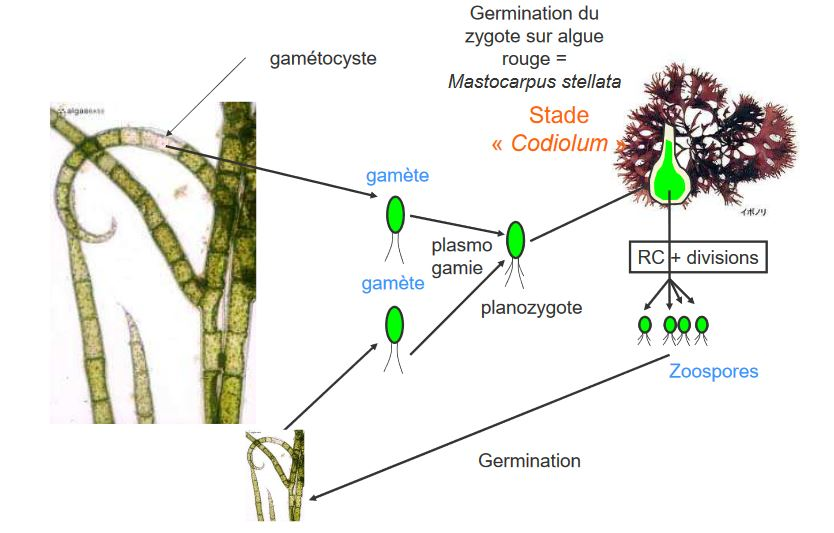
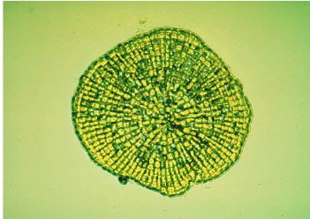
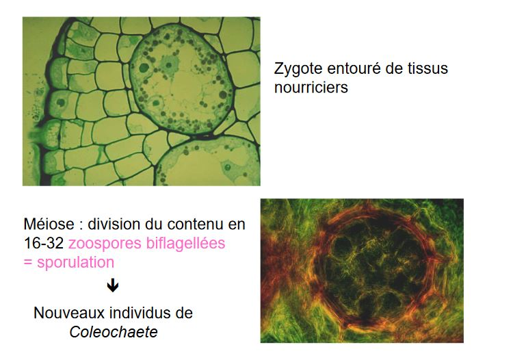
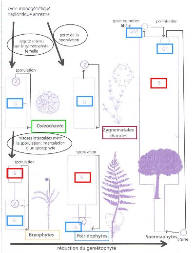

# La reproduction

Importance de l'évolution du cycle de reproduction des **chlorobiontes** : aboutit à celui des **embryophytes**

Différents cycles rencontrés chez les algues

* Monogénétique haplophasique : une génération haploïde 
* Monogénétique diplophasique : une génération diploïde 
* Digénétique haplo-diplophasique 
* Trigénétique haplo-diplophasique (deux ou trois générations, haploïde ou diploïde)

## A) *Chlamydomonas*, Chlorophyceae

Cycle monogénétique haploide : majorité des chlorophycées

Reproduction sexuée : si conditions deviennent défavorable

## B) *Acrosiphonia spinescens*

Algue filamenteuse, articles allongés, Plurinuclées

Thalle = gamétophyte

Article court = gamétocyste

Le zygote s'accroît **sans se diviser**

2 interprétations :

1) La phase "Codiolum" considérée par certains comme une phase sporophytique, **cycle digénétique** sans toutefois comporter de phase diploïde

2) L'absence de mitose au stade "Codiolum" fait interpréter le cycle comme **monogénétique haplophasique**

## C) *Ulva lactuca*, Chlorophyte

Digénétique isomorphe

Planogame plus ou moins isogame

## D) *Spirogyra*, Charophytes

## E) *Chara*, Chlorophyte appartiennent aux Charophycées

Bilan :

* Gamète flagellé
* Fécondation dans le nucule
* Hypnozygote (gyrogonite pour les paléontologues) libéré dans le milieu (dormance)
* Réduction chromatique dans l'hypnozygote
* Germination
* Absence de sporulation

**Cycle haplophasique**

## F) Coleochaete, chlorophyte appartiennent aux charophycées

"Algues vertes"

* formes filamenteuses
* formes en disques ramifiés

Developpement sur un tronc d'arbre, tige de joncs, sur rochers

Existence d'appendices rigides (poil incolore)

Extémité de certains filaments :

* developpement de spermatocyste
	* libération d'un petit spermatozoïde
* developppement d'oogone terminé par **pseudotrichogyne**
	* ouverture : permet la passage du spermatozoïde

**Fécondation de l'oosphère**

* Zygote reste sur le gamétophyte femelle
* Augmente de volume 
* Mise en place d'un revêtement de filaments
* Lien trophique entre zygote et filaments

Dormance -> **Hypnozygote**

C'est un cycle **Monogénétique haplophasique**

Particularité : Un recouvrement provenant du gamétophyte recouvre le zygote et crée des liens trophiques avec lui

**CYCLE TRES IMPORTANT AU PLAN EVOLUTIF**

Si des mitoses végétatives s'intercalent entre la formation du zygote et la méïose : **obtention d'un sporophyte parasite du gamétophyte**

