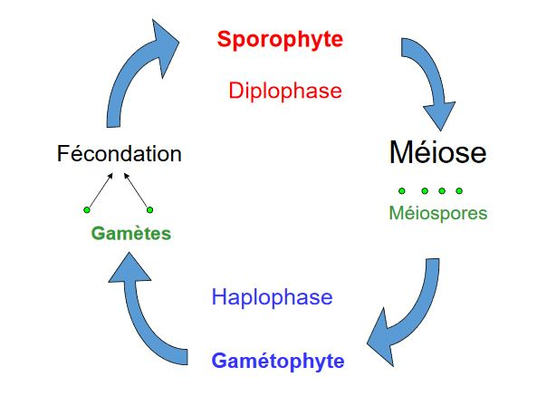
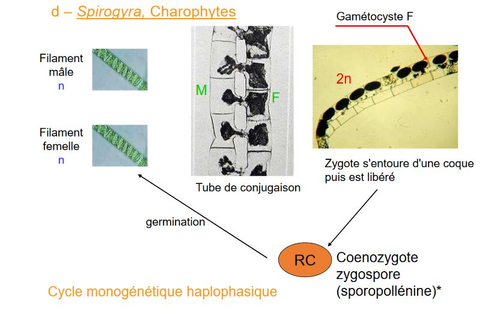
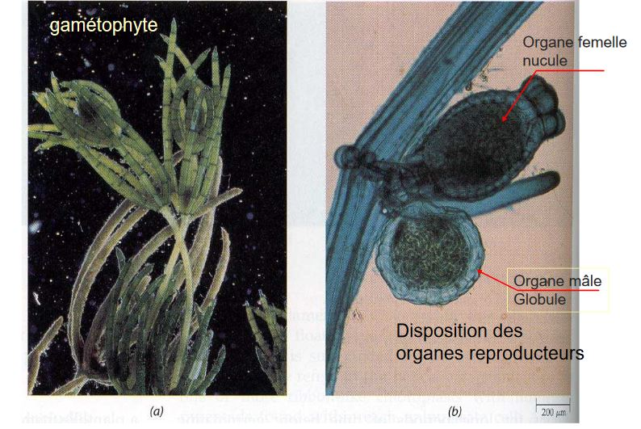
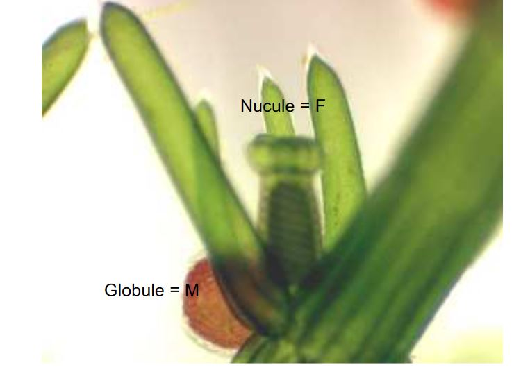

# La reproduction

Importance de l'évolution du cycle de reproduction des **chlorobiontes** : aboutit à celui des **embryophytes**

Différents cycles rencontrés chez les algues

* Monogénétique haplophasique : une génération haploïde 
* Monogénétique diplophasique : une génération diploïde 
* Digénétique haplo-diplophasique 
* Trigénétique haplo-diplophasique (deux ou trois générations, haploïde ou diploïde)

## A) *Chlamydomonas*, Chlorophyceae

Cycle monogénétique haploide : majorité des chlorophycées

Reproduction sexuée : si conditions deviennent défavorable

## B) *Acrosiphonia spinescens*

Algue filamenteuse, articles allongés, Plurinuclées

Thalle = gamétophyte

Article court = gamétocyste

Le zygote s'accroît **sans se diviser**

2 interprétations :

1) La phase "Codiolum" considérée par certains comme une phase sporophytique, **cycle digénétique** sans toutefois comporter de phase diploïde

2) L'absence de mitose au stade "Codiolum" fait interpréter le cycle comme **monogénétique haplophasique**

## C) *Ulva lactuca*, Chlorophyte

Digénétique isomorphe

Planogame plus ou moins isogame

## D) *Spirogyra*, Charophytes

## E) *Chara*, Chlorophyte appartiennent aux Charophycées

Bilan :

* Gamète flagellé
* Fécondation dans le nucule
* Hypnozygote (gyrogonite pour les paléontologues) libéré dans le milieu (dormance)
* Réduction chromatique dans l'hypnozygote
* Germination
* Absence de sporulation

**Cycle haplophasique**

