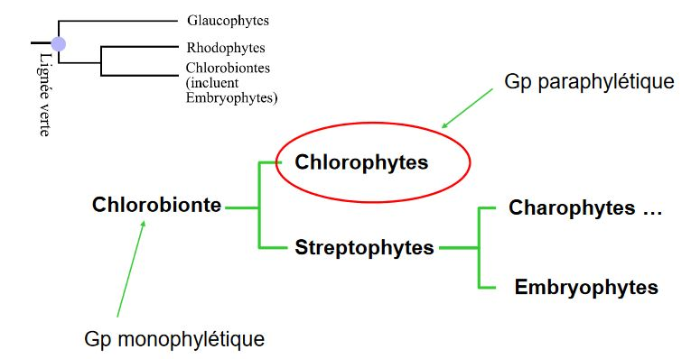

# Les Algues

# I) Présentation des grands groupes

## A) Les cyanobactéries, ex algues bleues

Les Eubactéries -> organismes procaryotes

Présence de :

* paroi muréique
* chlorophylle a
* phycobilisomes : à la surface des thylacoïdes
* appareil végétatif : coccoïde ou filamenteux
* toujours dépourvues de flagelles
* réserves sous forme 
	* amidon cyanophycéen (C)
    * cyanophycine (N)
* multiplication : division cellulaire

Habitat : varié (marin -> dulçaquicole, sols, murs, .. aérien)

Les plus connues :

*Arthrospira* : vertus médicinales dues à la fabrication de **spiruline** = consommées en raison de leur richesse en protéines et vitamines (commerce, cures)

Cyano coccoïdes = producteurs primaires

*Anabaena* = fixe N (rizières) 40Kg d'N / ha / an

*Anabaena azolae* = symbiose avec l'*azolla* fougère à 4 feuilles 120 à 310 kg/an/ha

A l'origine du O2

## B)Les Glaucophytes

* algues unicellulaires
* nues ou avec une paroi cellulosique
* deux flagelles inégaux 
* dulçaquicoles (benthiques ou planctoniques)
* plastes à 2 membranes
* hébergent des "cyanelles" (= plastes), thylacoides isolés disposés comme ceux des cyanobactéries
* chlorophylle a et phycocyanine = pigment bleu
* amidon extraplastidial
* division cellulaire

## C) Rhodophytes = algues rouges

* Groupe homogène : (gp monophylétique) plastes à phycobilisomes **2 membranes**, amidon = grains **cytoplasmiques**, 0 cellules flagellées
* Existence d’une synapse
* taille moyenne, rarement unicellulaire
* Thylacoides isolés, souvent à la périphérie du plaste
* Quelques parasites (Polysiphonia), certaines hétérotrophes
* oogamie, trichogyne et sporulation cycle trigénétique

Habitat :  marin essentiellement, qq genres d'eau douce, benthiques

Quelques particularités : *Cyanidium caldarium* optimum de croissance à pH = 2 et T° 57°C

Utilisation : 

* épaississants et gélifiants (agars) pour les aliments
* cosmétiques
* adhésifs 
* consommation directe
* amendement...

## D) Chlorophyte = algues vertes

Appartiennent à un groupe comprenant les **embryophytes** -> groupe **paraphylétique**

* Chlorophylles a et b
* 1 plaste à **2 membranes**
* Thylacoïdes emilés par 2 à 6 -> pouvant former des granas
* amidon **intraplastidial**
* groupe basé sur
	* caractères ultrastrcturaux des flagelles
    * de la mitose

Formes : majoritairement microscopiques

Habitat : majorité dulçaquicoles mais présentes dans tous les milieux : marin, saumâtre, terrestre, subaérien

Adaptées aux milieux extrêmes : volcans, déserts, neige...

Ils sont parfois pathogènes

## E) Cryptophyta

* Unicellulaire
* Deux flagelles eucaryotiques portent des mastigonèmes
* Grains d’amidon périplastidiaux
* Plastes rouges ou bleus, 4 membranes
* groupe monophylétique

## F) Euglenophyceae = euglènes

* Algues unicellulaires
* flagellées
* Réserves sous forme de paramylon (polymère du glucose, non soluble) **extraplastidial**
* Plastes, lorsqu’ils sont présents, à **3 membranes**
* Chlorophylle a et b
* Dulçaquicoles, marines, saumâtres,intestin de batracien ...
* Formation de film vert dans les estuaires 
* provoquent des blooms toxiques

## G) Les Chlorarachniophyceae

* Organismes unicellulaires 
	* coccoïdes 
	* et/ou amiboïdes (mobiles) 
* Chlorophylle a et b
* Plastes à **4 membrane**

## H) Les Haptophyta

* Unicellulaires monadoïdes, pouvant passer par un stade non flagellé
* Quelques formes palmelloïdes
* Plastes à **4 membranes**
* Un flagelle particulier = l’**haptonème**

