# Théorie de l'endosymbiose

Schimper (1983) : envisage l'origine endosymbiotique des plastes

Mereschkowsky (1905) : suggère que les cyanobactéries puissent être à l'origine des plastes

## A) L'endosymbiose primaire

Avancées capitales grâce à la microscopie électronique qui permet de voir que  les  plastes  ressemblent  à  des  cyanobactéries  avec  notamment  un système membranaire interne = les thylacoïdes

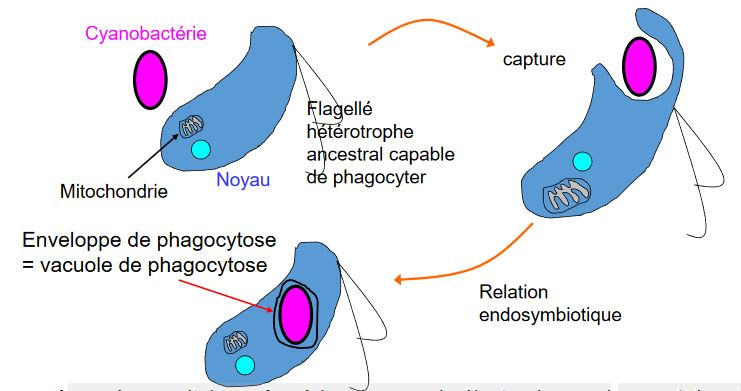

Cette théorie de phagocytose par un **hétérotrophe ancestral d'une cyanobactérie** puis établissement d'une symbiose s'appuie sur les arguments suivants :

1) Les Thylacoïdes, il sont connus seulement :

* chez les plastes
* les cyanobactéries

2) Nombre de membranes chez le plaste = 2 (chez embryophytes, algues vertes et rouges, glaucophytes)

A partir de ces observations, supposition que :

* Membrane interne correspond à la membrane plasmique de la cyanobactérie
* Membrane externe correspond à la membrane de phagocytose

Cohérence avec la théorie de l'endosymbiose primaire

**Toutefois**, grandes difficultés pour montrer la liaison entre enveloppe plastidiale et système membranaire endosymbiotique

Chez beaucoup d'algues, il n'est pas si évident que l'enveloppe externe soit la vacuole de phagocytose, le symbiote (cyano) pouvant être hébergé dans le cytoplasme.

*Quelle est la nature de la membrane externe ?*

3) Mise en évidence de peptidoglycanes dans l'enveloppe plastidiale des Glaucophyta

Les cyano présentent une paroi composée de peptidoglycanes

*Qu'est devenue cette paroi présente chez la cyano ancestrale ?*

**Théorie** : La paroi de la cyanobactérie disparaîtrait suite à une meilleure protection contre les chocs osmotiques. En échange : plaste fournit des hydrates de Carbone, acides gras, acides aminées 

Outils ayant apporté des arguments en faveur de la théorie :

* MET : microscope Electronique à Transmission
* Progrès en biochimie : permet de mettre en évidence notamment des **peptidoglycanes** entre les deux membranes chez les Glaucophytes, disparition chez d'autres groupes.

Constitution théorique des feuillets **après capture d'une cyanobactérie** (Gram-)

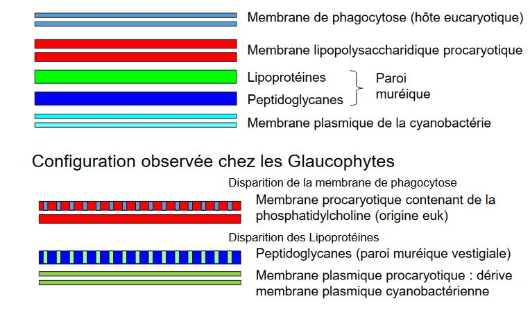

Endosymbiose primaire = explication pour les plastes à deux membranes

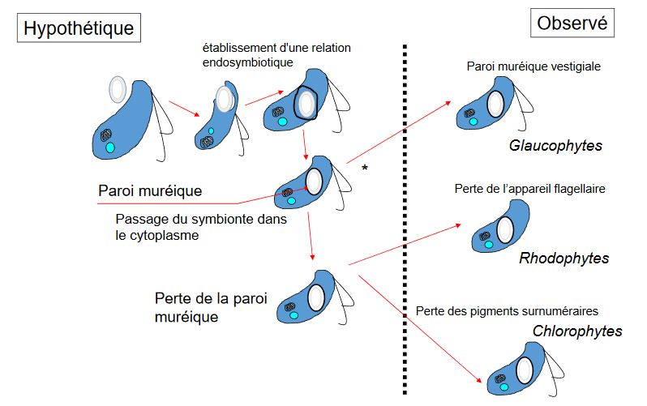

Bilan

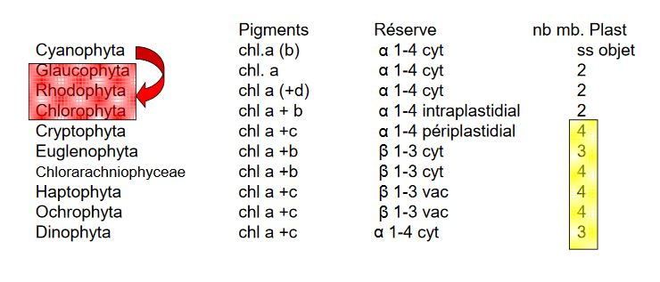

*Les groupes présentant des plastes à plus de 2 membranes ?*

La théorie de l'endosymbiose est - elle vérifée ?

Pour les plastes à 4 membranes

* Cryptophyta
* Chlorarachniophycea
* Haptophyta
* Ochrophyta

## B) Endosymbiose secondaire

L'endosymbiose secondaire expliquerait les plastes à 4 membranes

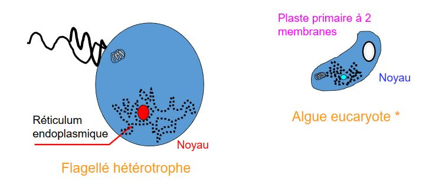

Chez Cryptophyta, Haptophyta, Ochrophyta, la membrane la plus externe du plaste constituée de Réticulum Endoplasmique (Ribosomes)

Chez Chlorarachniophycea, la membrane externe du plaste lisse (origine golgienne ou réticulum lisse ??)

* Membrane externe = origine endocellulaire
* Membrane suivante = celle de l'algue eucaryotique
* Membrane internes (2) = celles du plaste de l'algue eucaryotique symbiotique

Flagellé ancestral capture une **algue eucaryotique** possédant un plaste d'origine **endosymbiotique primaire**

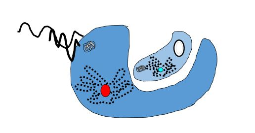

Etablissement d'une relation endosymbiotique

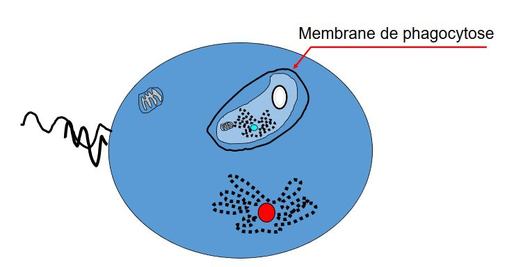

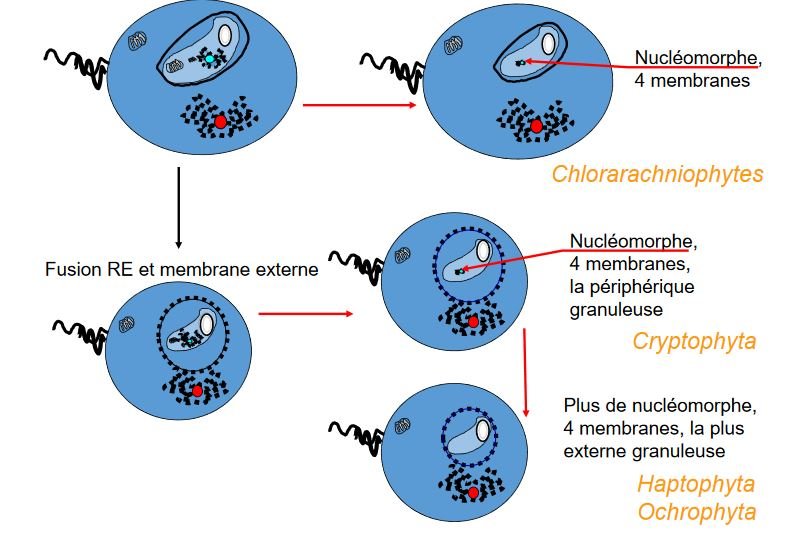

Bilan

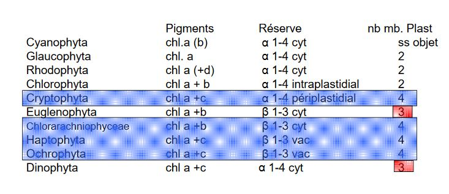

*Les groupes présentant des plastes à 3 membranes ?*

Théorie de l'emdosymbiose est -elle vérifiée ?

Pour les plastes à 3 membranes

* Euglenophycea
* Dinophyta

Membrane externe lisse (origine ≠ Reticulum endoplasmique)

## C) Endosymbiose tertiaire

L'endosymbiose pour les plastes à 3 membranes

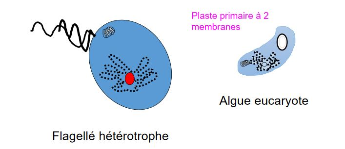

**Myzocytose** (1984) découverte chez les euglènes = ingestion de l'intérieur des cellules sans consommation de la membrane plasmique

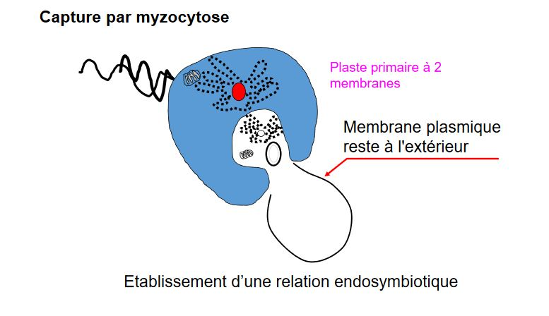

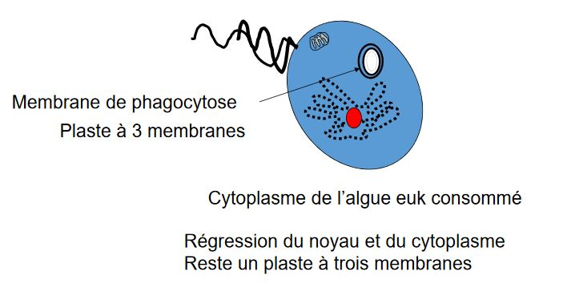

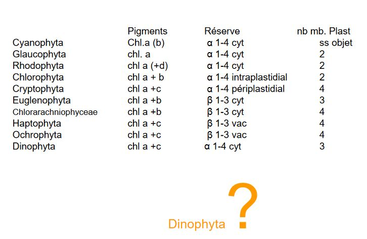

Phylogénie des plastes endosymbiotiques primaires

* plastes des glaucophytes plus proches de ceux des cyanobactéries
* chlorobiontes et rhodophytes = groupes frères

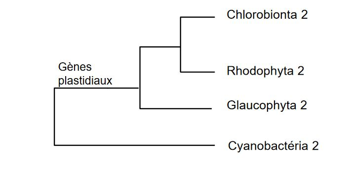

Phylogénie des plastes (séquençage des gènes plastidiaux)

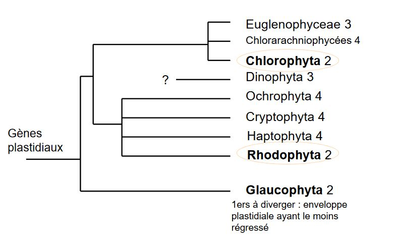

Plastes des :

* cryptophytes
* haptophytes
* ochrophytes
* dinophytes ??

Apparentés avec ceux des **rhodophytes**

Plastes des :

* euglénophycées
* chlorarachniophycées

Apparentés avec ceux des **chlorobiontes**

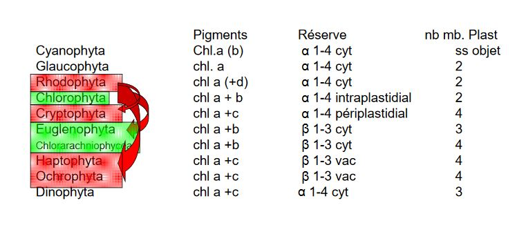

Grande réussite des endosymbioses primaires et secondaires

Groupe complexe remettant en question la notion de règne

Groupe paraphylétique
