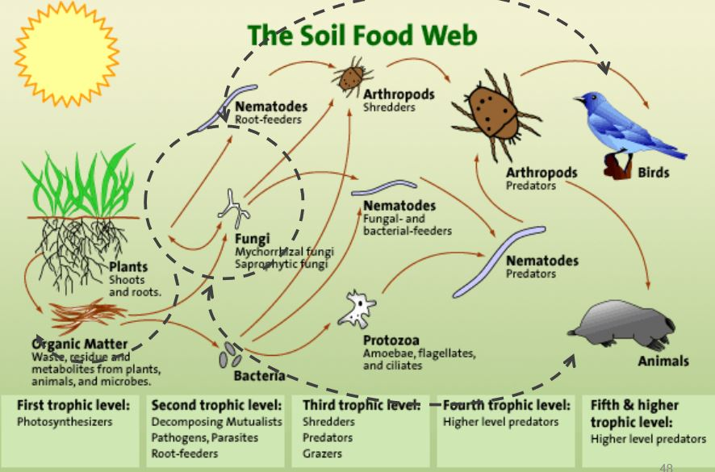
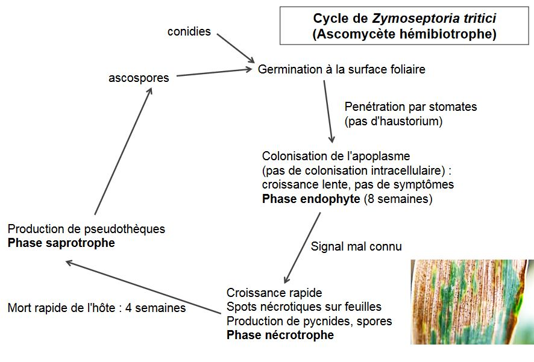
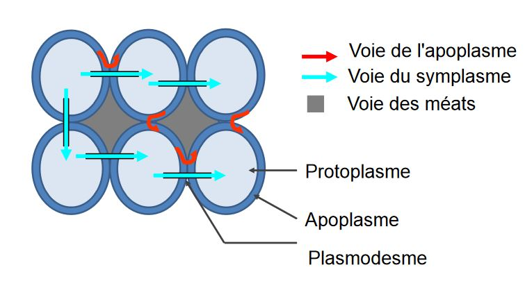
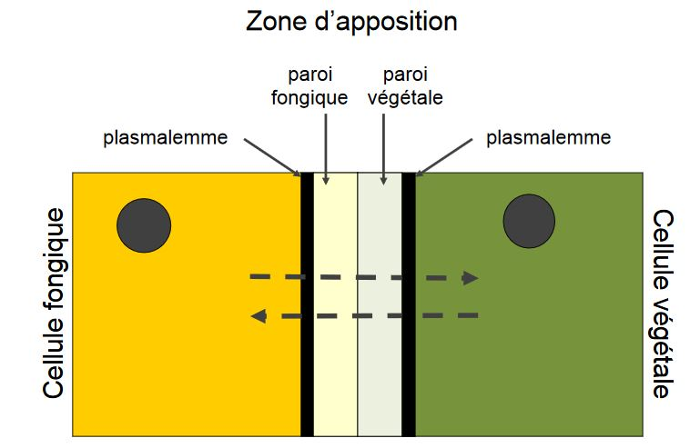

# Les Champignons

## I) Rappels de systématique et biologie fongique

Les champignons font partis du groupe de *thallophytes* . C'est un règne des Fungi et font parti d'un **groupe polyphylétique**.  

Il existe environ 100 000 espèces décrites et 1,5 à 5 Millions d’espèces estimées (grâce aux intéractions entre champignons et plante, il y a 31 taxons fongique par espèce de plante). C'est un groupe **ubiquiste** (qui est partout à la fois)  

L'appareil végétatif possède un mycélium, voire des levures 

Les tailles sont extrêmement variables : 10 µm (Saccharomyces cerevisiae) à 600 hect (Armillaria ostoyae)

Les champignons ont des cycles biologiques très divers. Ils sont toujours hétérotrophes vis-à-vis du carbone. 
La nutrition fongique est dépendante des ressources carbonées d'autres organismes. Ils ont des voies d'assimilation et des modes de vies variés:

* **saprophytisme** (se nourrit de végétaux morts)

* **parasitisme**

* **mutualisme obligatoire ou non-obligatoire**

Ils sont acteurs du fonctionnement des écosystèmes :  

* décomposeurs de matière organique 
* fixateurs de N, P, structure du substrat (acteurs de la minéralisation du sol) 

*Exemples d'abondances:*

* *en sol fertile agricole : 5 tonnes/ha (prof. 20 cm)*  
* *en sol forestier : ca. 100 kg/ha (prof. 25 cm)*  

Importance du point de vue anthropique :  

* infections (animaux, plantes, homme) 

* moisissures sur tous substrats 

* utilisations en procédés alimentaires 

* utilisations pharmaceutiques  

* relations symbiotiques des cultures (mycorhizes)  

Caractéristiques cytologiques : 

* Pas de plaste 

* Noyaux petits (transfert possible au travers de pores) 

* Vacuoles 

* Paroi cellulaire, contenant chitine et ergostérol  

* Réserves de glycogène 

La membrane est constitué de phospholipides et de ergostérol (longue chaine lipidique) qui vont servir à mettre en place de nouvelles cellules fonctionnelles. La paroi est rigide contenant de la **chitine**

un filament  = une **hyphe** 

un ensemble d'hyphes = **mycélium** 

Un mycélium est constitué d'une croissance végétative terminale indéfinie, matrice de fructifications, propagules (structure de dissémination et de reproduction), organes d'interaction 

Chez certains, leur forme sera non-filamenteuse (forme dominante des levures, certains Chytridiomycètes) 

Pendant la période de croissance, il y aura le flux d’organelles (zone apicale riche en vésicules (Golgi)  + mitochondries). Il y aura aussi une ramification contrôlée par des hydrolases et des vagues de croissance. 

*Chez septa matures, il y aura une rigidification des parois et la fermeture des pores* 

Les champignons seront longtemps considérés comme un groupe homogène : 

* hétérotrophes vis-à-vis du carbone = convergences physiologiques 

* la paroi contraignant le développement végétatif = convergences  morphologiques  

Les champignons qui ont été etudiés par botanistes et zoologistes sont à proximité des métazoaire (animaux): 
 
* hétérochontes : cellule flagellée, flagelle en position postérieure 

* paroi chitineuse 

* mise en réserve des glucides : glycogène 

Leur position taxonomique n'est pas évidente morphologiquement et physiologiquement.

## II) Saprotrophes et relations aux végétaux 

Les saprotrophes possèdent une vie libre. Ils se nourrissent en assimilant les parois mais sont incapables d'assimiler les macromolécules car ils ont une digestion extra-cellulaire 

1. production d’enzymes de dégradation spécifiques au substrat ; exocytose à l’extrémité apicale des hyphes 

2. dégradation du substrat en mono- ou oligo-polymères 

3. assimilation des produits de dégradation par diffusion 

En forêt, ils dégradent de la matière organique, ce sont des ingénieurs du cycle biogéochimique. En milieux anthropiques, ils peuvent dégrader tous types de substrats *mérule va dégrader des voies en milieu anthropiques car il se sont adapter à l'Homme*

En industrie, ils vont digérer des pulpes de papier, la production de biomolécules et biocarburants mais encore des fermentations alimentaires.

Les Saprotrophes sont très abondant en forêt (10 000 m de mycélieum /g de litière sèche) mais ils sont microscopiques. 

Leur enzymes fongiques sont impliquées dans la dégradation de la lignine et la cellulose. Ils ont une meilleure efficacité de dégradation des structures complexes que les bactéries.

## III) Parasites de végétaux

**Parasitisme** = association d'au moins deux organismes, dont l'un,**le parasite**, réalise son cycle biologique aux dépends du développement de l'autre, **l'hôte**.

Parmis les champignons, il existe des parasites communs d'animaux

* sur des vertébrés 
	* aspergilloses
    * teignes 
    * maladies du muguet

* sur des invertébrés
	* muscardine du ver à soie	
    * pyrénomycète

95 % des parasites pour les végétaux sont des champignons

Il existe deux grands cycles biologiques des champignons phytopathogènes:

Selon les espèces fongiques, il y a différents degrés de spécificité:

* **Spécialistes**, spécifiques à un hôte
* **Généralistes**, capables de parasiter une gamme de plantes-hôtes

Il existe différents modes d'infection des tissus végétaux:

* **Ectoparasites** = suçoirs traversant les cellules épidermiques (mise en place d'un **haustania**)
* **Endoparasites** = pénétration par orifices naturels (blessures, stomates); des méats et colonisation des tissus

Les mécanismes biochimiques sont contrastés selon le mode de vie:

* **Biothrophes** = enzymes spécifiques d'évitement de la reconnaissance par l'hôte, puis colonisation des tissus 
* **Nécrotrophes** = gamme d'enzymes capables de:
	* lyser les cellules de différents hôtes (catalase, laccase, popyphenol oxidase)
    * éviter les réactions de défense 

Les mécanismes de défense et le système immunitaire de la plante-hôte sont analogues à ceux des animaux. La plante possède des barrière naturelles de tissus adaptés et des toxines constitutives. Elle a aussi une défense et une activation de protéines élicitrices. Il y aura une cascade de réaction de défense après la reconnaissance du pathogène. 

En effet, elle va sécréter des macromolécules toxiques difficilement dégradables et activer des enzymes antifongiques (chitinases). Elle possède aussi **une réaction hypersensible** où on aura une nécrose précoce des tissus empêchant la progression du pathogène.

On parle ici de *course aux armes* entre l'hôte et le pathogène.

Le pathogène va se developper sur une plante-hôte en

* épuisant les reserves de l'hôte, **processus physiologique**
* sécrétant des enzymes et toxines dégradant les cellules-hôtes **processus biochimiques**

C'est une stratégie proche des saprophytes.

En situation de déséquilibre de l'intéraction, il y aura possibilité de dégâts très importants.

## IV) Symbioses plantes-champignons 

* **Mutualisme** : association entre au moins deux espèces qui en tirent un bénéfice réciproque

* **Symbiose** : mutualisme avec lien physique, durable (une vie) 

* Plante "hôte" ; mais chaque espèce est un partenaire = **symbiote**  

### A) Les symbioses mycorhiziennes

#### Mycorhizes

Il existe des contraintes liées à la colonisation des milieux terrestres:

* ségrégation des ressources (eaux, sels, minéraux)
* ressources hydriques, peu persistantes dans la majorité des sols

Il y  a un besoin de différenciation de l'appareil racinaire et de l'exploration du grand volume de sol

* mais poils absobants fragiles, leur durée de vie assez courte

*Rhynia sp*: apparaît au Dévonien (Paléozoïque, 410-360 M années)

Ils sont parmi les premiers trachéophytes à coloniser les milieux terrestres.

Les premières associations plantes - champignons obsrvées datent de l'époque de la colonisation des terres (ca.400 Ma)

Le mot **mycorhize** vient de *mykos* qui signifie champignon et de *riza* qui signifie racine

Ces un terme proposé en 1885 par Frank; reconnaissance tardive et limitée de l'association et de son rôle

C'est une association omniprésente : 92% des familles terrestres sont mycorhiziennes. C'est un modèle de **coévolution**.

Les champignons interviennent:

* dans la dégradation de la matière organique
* dans la solubilisation de certains minéraux (Ni, Pi)

On a une augmentation des sels minéraux en solution dans le sol.

Les champignons peuvent absorber les ions solubilisés, il y a un transfert entre eux et la plante partenaire.

Les hyphes mycéliens sont de faible diamètre et on une croissance indéfinie, l'exploration du volume de sol sera augmenté.

Voies d'échanges entre les cellules dans un tissu végétal

Les apoplasmes mixtes permettent le transfert entre les cellules fongiques et les cellules végétale

#### Ectomycorhizes

Les ectomycorhizes ne sont pas les plus fréquentes mais ce sont les plus visibles.

Elles s'associent rarement avec des herbacées, mais surtout avec les arbres notamment ceux aux essences économiquement importantes (Fagacées, Betulacées, Salicacées, Pinacées...)

Elles s'associent avec des partenaires fongiques dont surtout les Dicaryomycète

Le statut ectomycrohizien a une évolution multiple : **co-évolution** suivant la diversification des plantes et champignons

Une **symbiose est obligatoire** pour le partenaire fongique

La spécificité est variable selon les partenaires:

* spécialistes: *Lactarius deliciosus - Pinus spp* et *Botelus grevillei - Larix spp*
* généralistes: >200 espèces fongiques et presque tous les arbres ectomycorhiziens

L'environnement terrestre est multiple : forêts tempérées, boréales, de Diptérocarpacées, zon de succession primaire...

1) Contact racine - hyphe, signaux d'évitement de réaction de défense
2) Initiation du manteau et pénétration de coins entre cellules épidermiques
3) Développement du manteau
4) Formation du réseau de Hartig

Bénéfices de l’ectomycorhize pour le développement de la plante : 

* Augmentation de la production de biomasse végétale 
* Réseau extra-racinaire mycélien augmentant le volume exploratoire ; modification de l'architecture racinaire  
* Nutrition : dégradation de matière organique et solubilisation de N, P par partenaire fongique 
* Participation à l’assimilation d’eau et absorption sélective des ions du sol ; protection contre dessiccation 

L'avantage secondaire de la mycorhization est la  protection sanitaire 

Les mécanismes impliqués dans la protection sanitaires des plantes sont:

* Compétition avec la mircoflore pathogène; protection mécanique par manteau fongique
* Amélioration du statut physiologique de la plante
* Emission de substances antibiotiques par les champignons
* Modification des exsudats racinaires
* Elicitation par transfert de signaux chimiques entre plantes *via* le réseau mycorhizien

Le partenaire fongiques aura des bénéfices de l'ectomycorhize, le flux de substances nutritives vont de la plante vers le champignon

Mise en évidence des échanges:

1) On fournit au partenaire donneur un élément marqué
* CO2* pour la plante
* P* ou N* pour le mycélium

2) Différentes substances se retrouvent marquées : dans le donneur, puis dans le receveur

Mise en évience de flux de composés **depuis la plante**:

* vitamines et hormones non synthétisable par le champignon
* surtout des composés C: passant la zone d'apposition sous forme de sucres simples, puis stockés dans les champignons sous forme de glycogène et de mannitol. 20 à 40% de la poduction photosythétique de la plante est transmise au partenaire fongique.

L'association est obligatoire pour  les champignons ectomycorhiziens, le statut de symbiote est obligatoire pour la fructification.

**Applications**: sélection de souches fongiques mycorhiziennes pour mycorhization contrôlée en pépinières (*Laccaria, Lactarius, Suillus*/ Pinacées) ou trufficulture (*Tuber/Quercus,Corylus*) 

Bénéfices : 

* augmentation de production de biomasse végétale
* baisse d'interventions mécaniques
* baisse intrants (phyto, engrais)
* production de carpophores

Limites :

* investissements à long terme
* maintien de l'association à la transplantation non maïtrisé (pas encore une domestication)
* risques d'introduction de souches invasives ?

Les association endomycorhiziennes touchent 80% des végétaux

Anatomie différente des ectomycorhizes:

* pas de manteau fongique externe à la racine
* pas de fructification épigée
* pénétration des parois cellulaires végétales : propagation du mycélium entre cellules racinaires puis entre paroi et memebrane plasmique
* partenaire fongique : jusqu'à 10% du poids de la racine

#### Les Endomycorhizes Vésiculo-Arbusculaires (VAM)

Leurs partenaires végétaux sont de nombreuses espèces cultivées (Fabacées, Rosacées, Poacées, Solanacées, Liliacées)

Leurs partanire fongiques sont les Gloméromycètes dont les principaux genres sont *Acaulospora, Gigaspora, Glomus, Sclerocystis*

Les mycorhizes ancerstrales sont présentes même chez les ptéridophytes : apparues avec les plantes terrestres au Dévonien ?

Il n'y a pas de spécificité entre la plante et le champignon remarquable, certaines associations sont peu efficaces.

Champignons ubiquistes : spores détéctées dans tous les sols, germant dans la rhizosphère des hôtes

Fossiles de champignons associés aux rhizomes d'*Aglaophyton major*(400 MA) : semblables aux mycorhizes vésiculo-arbusculaires actuelles 

1) Germination des spores, stimulée par les exsudats racinaires
2) Haustoria entre cellules du cortex, production d'enzymes cellulolytiques par le champignon pour traverser la paroi (mécanisme semblable aux parasites)
3) Pénétration dans les cellules végétales; formation de palotons ou d'arbuscules, vésicules éventuelles repoussant et invaginant la membrane plasmique (extension du champignon limitée par la cellule-hôte)

Mise en place de la mycorhize du point de vue de la cellule-hôte:

* production d'une membrane d'isolement pectocellulosique de réaction
* observation (pafrois) de phagocytose du champignon par la cellule-hôte
* échanges dans la cellule-hôte par un apoplasme mixte similaire à celui des ectomycorhizes
* pas de pénétration du cylindre central

Echanges nutritionnels dans la symbiose VAM:

* C: de la plante vers le champignon
* P: du champignon vers la plante, sous forme de polyP, à travers les hyphes intracinaires (hydrolyse par ATPase dans les cellules végétales)
* N: du champignon vers la plante, sous forme d'arginine (passage dans cellules végétales par transporteurs d'ammonium, décomposition en urée)

Rôles du réseau mycélien extra-racinaire:

* Augmentation du volume de sol prospecté: facilitation en nutriments P, N et stabilisation des aggrégats du dol (glomaline + réseau d'hyphes)
* Protection contre excès d'éléments toxiques: teneur en Mn inférieur chez champignons mycorhizés/témoins; développement de Poacées mycorhizées sur sols pollués en métaux lourds (Zn, Ni)

Les bénéfices des endomycorhizes pour la plante sont:

* facilitation de la nutrition
* augmentation du developpement

Tous les champignons d'endomycorhizes ne sont pas également performants avec toutes les plantes à endomycorhizes.

Toutes les plantes ne sont pas autant dépendantes de la mycorhization.

Les mécanismes impliqués dans la protection contre les pathogènes sont:

* Compétition spatiale pour le site d'infection
* Compétition trophique pour les ressources carbonées de l'hôte
* Modification de la communauté racinaire de la rhizosphère
* Modification de la morphologie du système racinaire, stimulation production de lignine
* Modification de la physiologie : production composés phénolés, induction d'enzymes hydrolytiques de résistance

Cela permet l'inoculation de VAM en lutte biologique

#### Endomycorhizes

**Endomycorhizes d'Ochidacées**: partenaires fongiques toujours Basidiomycètes (*Corticium, Clitocybe, Mycena, Armillaria*)

La plante est totalement dépendante du champignon en stade jeune : embryon sans réserve, association nécessaire pour la germination et le developpement de la plantule.

L'association est mutualiste lors des stades suivant de la plante: 

* la pénétration des cellules par mycélium
* le developpement de pelotons d'hyphes non ramifiés

On a une hypertrophie des cellules végétales.

**Endomycorhizes éricoïdes**:

* Patenaires végétaux sont des Ericacées
* Partenaires fongiques sont surtout des Ascomycètes (Helotiales), des Basidiomycètes (Sebacinales)

Les champignons ont des similitudes anatomiques avec d'autres mycorhizes : 

* pelotons 
* manteau mycélien chez ectendomycorhizes
* pénétration entre et dans les cellules

L'association est nécéssaire en milieux acides ou pauvres en N

Associations mycorhiziennes : phénomène constitutif de l’évolution des végétaux terrestres  (constituant important de l’alimentation minérale des végétaux cultivés et sauvages) 

Pourtant, les pratiques culturales actuelles sont peu favorables à l'installation des associations mycorhiziennes: 

* labours profonds
* engrais chimiques
* produits phytosanitaire et fongicides
* selection de variétés performantes mais exigeantes en nutriments

Mais il existe quelques exceptions

* mycorhization contrôlée en pépinières arboricoles
* inoculation de spores de VAM en grandes cultures

La symbiose et d'autres intaractions sont des stratégies compatibles:

* Compétition plante/plante influencée par le(s) symbiote(s) fongique(s)
* Compétition champignon/champignon influencée par le(s) symbiote(s) végétal(aux)
* Symbiose maintenue par communication hôte-champignons
* Chaque partenaire de la symbiose (plante, champignon) est associé à plusieurs individus, souvent de plusieurs espèces

Les **plantes mycohétérotrophes** sont totalement dépendantes du/des partenaire(s) fongique(s) pendant tout leur cycle de developpement :

* ressources N, P du sol
* ET ressources N, C organiques

L'utilisation des ressources est disponible dans le réseau mycorhizien

### B) Les champignons endophytes

Les interactions sont fréquentes et sous évaluée dans tous les organes végétaux

*Epichloe tiphina* (Ascomycète) produit des alcaloïdes proches de l'acide lysergique

Les poacées qui sont *infectées* toxiques et peu digeste ont une protection contre les herbivores, les pathogènes et le stress hydrique.

Le statut d'interaction est peu clair, commensalisme/ mutualisme/ parasitisme en phase de dormance ?

Il y a un effet indirect sur les interactions biotiques de l'hôte

*Alternaria* endophytes de *Centaurea stoebe* (indigène en Europe) : augmentation de la biomasse et de la compétitivité de l'hôte en contexte invasif

### C) Evolution des modes de vies fongiques

Le continuum de stratégies fongiques est un mode de vie parfois mal défini.

* Parasites nécrotrophes/ saprotrophes ?
* Parasites/ endophytes/ mutualistes
* Saprophytes/ mycorhziens ?
* Saprophytes/ lichens ?
* Coévolution par proximité physique de l'interaction : forte pression de séléction vers le mutualisme
* Emergence/ perte répétée des symbioses dans certaines lignées
* Caractères conservés entre stratégies : 
	* mécanismes d'infection
    * enzymes de dégradation de la matière organique
    * morphologie

## V) Continuum des interactions plantes-champignons