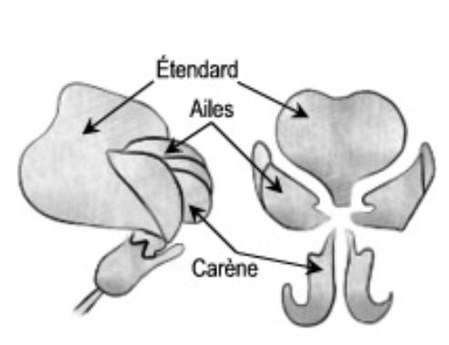
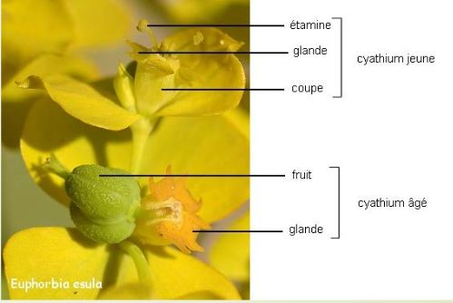
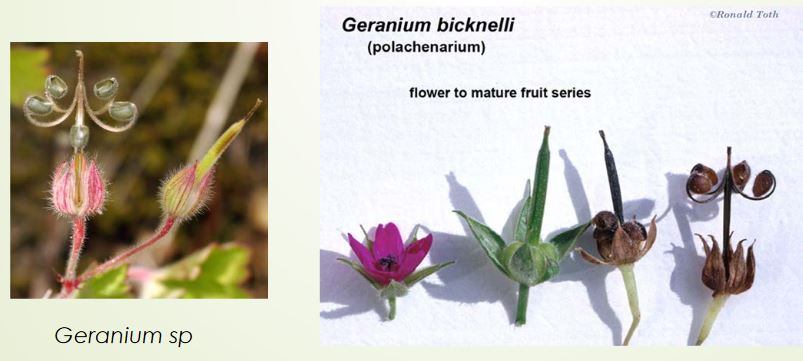
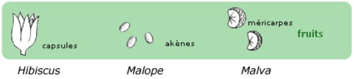
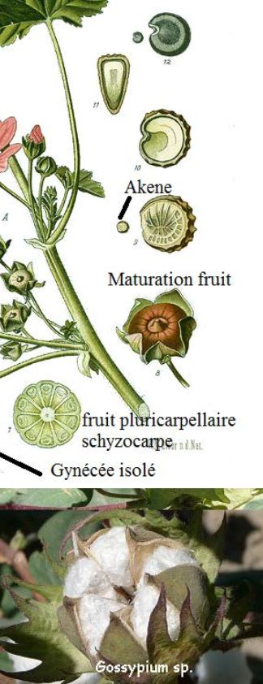
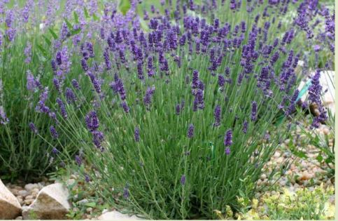

*Semestre 5*	

# Systématique végétale

# Les Angiospermes

## La Taxonomie

Embranchements (phyte) > Classes (opsides) > Ordres (ales) > Familles (acées) > Genre ( 1ere lettre en majuscule, nom en latin) > Espèces ( 1ere lettre en minuscule, nom en latin)

*ex Bellis perennis L.*
*Helichrysumn italicum*

## LILIACEES

### I) Généralité liliacées

Elles sont de l'ordre des **liliales** comptant 3000 espèces (*tulipes, muguet, l'ail, jacynthe de bois...*). Elles sont **monocotylédones** (*nervures //, 3 verticilles floraux*). Ce sont des plantes **vivaces**(*durer plusieurs années*). Elles sont souvent précoces.

Les tulipes venaient de Cocase et ont été importés en Hollande, elle est à l'origine de la **tulipomanie** -> conservation des tulipes pour arriver à une très grande variété. Elles avaient de bcp de valeur au XVII e siècle (un bulbe pour 87000 euros)

### II) Appareil végétatif

L'appareil végétatif est extrêmement variable (diversité des tiges) et souvent enterré comme les **bulbes** (tulipe oignon, ail) ou les **rhizomes** (muguet).
Les tiges en forme de feuilles s'appellent des cladodes pour le *Ruscus aculeatus*
 
 
 
Les inflorescences (position des fleurs) très différentes pouvant appartenir à plusieurs types:
* **épi** (fleurs sur l'axe)
* **grappe** (pénoncule qui porte les fleurs)
* **ombelle**(axe qui se divise en rayon *ex ail*)
* **fleur solitaire**

Chez les liliacées, les fleurs sont hermaphrodites (**étamines** *organe mâle* + **pistil** *organe femelle*) actimorphes et possèdent des tépales (sépales + pétales)

> 3T + 3T + (3+3) E + (3C)

Le fruit est un ovaire c'est une capsule ou une baie.
Les fleurs sont très voyantes, la pollinisation est entomophile (favorisé par les insectes)

**Ovaire supère**: ovaire entouré de pièce floral

**Ovaire infère**: ovaire sous les pièces florales

## III) Autre familles proches

**Amaryllidacées**: liliacées à ovaires infères (*ex jonquilles, narcisses*)

**Iridacées**: amaryllidacées avec perte d'une verticille d'étamines 

## POACEES

### I) Généralités

Ce sont des **monocotylédones**, plus de 12000 espèce, 5e la plus diversifiée (les 1er sont les orchidacées 26000 espèces, 2e les astéracées 23000 espèces, 3e les fabacées 19000 espèces, 4e rubiacées 13000 espèces).

C'est la famille avec la plus grande biomasse produite sur la planète, donc on a une importance écologique, en effet ce sont des espèces **ubiquiste** (tous les milieux) et une importance économique (agriculture).
C'est une famille très évoluée avec spécialisation de tous les organes.

En Afrique du Sud, nous avons la plus grande diversité de Poacées.
Elles sont apparues au Crétacé en Afrique ou Amérique du Sud.
C'est difficile des les différencier entre elles.

### II) Appareil végétatif

Ce sont pratiquement toujours des plantes herbacées (sauf le bambou) annuelles ou vivaces. La tige est creuse et cylindrique, **chaume**. Les feuilles ont une **gaine** fendue avec un **ligule** (partie à la base de la feuille qui indique la famille).

### III) Appareil reproducteur

L'**epillet** est une inflorescence élémentaire des poacées, 1 épillet = 2 fleurs mâle et femelle

 

 Un épillet peut être sessile: **épi**

Un **épillet pédicellé**: grappe, cyme, panicule
 
Adaptation à l'anémogamie
* stigmates plumeux
* anthères oscillantes
* pièces périanthe peu visible

Fleurs chez les espèces primitives :
> (3+3)T + (3+3)E + (3C)

> 0S + OP + 1-3 + 1C

Le fruit est un **caryopse** est soudée à l'akène + Albumen

## CYPERACEES

Ils sont voisins des poacées. Se dvp dans les zones humides. On a une convergence avec les poacées mais pas de filiation directe.
C'est une plante **graminoïde**, les feuilles sont à **insertion tristiques** (3 directions différentes), la tige est à **section triangulaire**, ne possède **pas de noeud**. Les feuilles sont à **gaines non fendues** et ne possède **pas de ligules** (mais parfois **antiligules**). Les feuilles sont en "V"

Inflorescence: grappe contractée d'épillets : épi

Les fleurs sont réduites.
Le **périanthe** est réduit à des soies ou écailles.
La pollinisation **anémophile** (pollen entraîné par le vent).
Le fruit est **l'akène** (fruit sec indéhiscent à graine unique dont le **péricarpe** n'est pas soudé à la graine *ex pissenlit*).

Chez le **carex**, l'évolution de l'épillet est en fleurs unisexuées.
Le périanthe est une **utricule**. Il y a beaucoup d'inflorescences variables.
Il est **monostachiée**.

**Hétérostachiée** : plusieurs épis que mâle ou que femelle

**Homostachiée** : plusieurs épis mâle et femelle

## JONCACEES

Une famille de 7 genres et 400 espèces. 

L'appareil végétatif est herbacées, on a des rhizomes, les feuilles sont basales, alternes à limbe graminiforme ou cylindrique.

La fleur a des tépales, l'inflorescence est souvent en cymes ou en glomérules, les fleurs hermaphrodites et actinomorphes en générale verte ou brune

> 3+ 3T + 3 + 3 E + (3C)

## PAPAVERAEES

### I)Généralités

Ce sont des plantes **dicotylédones**, elle est universellement reconnue par les taxonomistes. C'est une famille **cosmopolite** (qu'on peut retrouver partout), répendue sur les climats tempérés et subtropicaux.

La plupart des plantes sont herbacées, quelques unes sont des arbustres ou des arbrisseaux.

La fleur a un ovaire supère et les pétales sont froissées avec floraison
On recupère le latex pour faire de la résine et de l'opium.

Les fleurs sont **alternes**, au moins à la base, ou parfois verticillées. Elles sont **pétiolées**. Les feuilles sont généralement lobées, composé de plusieurs follioles non entièrement séparées ou très divisées.

Elles ne possèdent pas de stipule.

### II) Appareil végétatif et reproducteur

L'inflorescence est terminale est une **cyme** ou une **grappe**. Elle sont **inodores** et **actimorphes**. Elles présentent un **calice à deux sépales** et de **nombreuses étamines** (de 16 à 60). Elles sont **entogames** et quelques une sont **anémogames**.

Le fruit sec est généralement une capsule qui s'ouvre à maturité pour liberer les graines des pores.

## RENONCULACEES

### I) Généralités

L'étymologie *rana* signifie grenouille car ce sont des plantes qui sont souvent dans les **milieux humides et même des milieux aquatiques**.

Elle sont dans l'ordre des ranunculles et c'est un groupe **monophyletique** (groupe frère de tous les autres **eudicotylédones basales**). C'est une *famille par enchaînement* (à l'intérieur de cette famille on va voir les espèces à structure très primitives ou d'autres espèces à caractères très évolués.
Elles vivent dans les régions tempérées ou froides et sont **souvent vivaces** (bulbe ou rizhome) et **souvent précoce**.

### II) Appareil végétatif

Ce sont pratiquement que des herbacées (sauf clématites). Le limbe est souvent très découpé et les feuilles s'insèrent sur une gaine élargie. Les espèces étant en milieu aquatique sont en adaptation avec les feuilles

### III) Appareil reproducteur

C'est une famille par enchainement. Les fleures les plus primitives peuvent être des anémones. Elles ont un receptacle bombé et vont s'inserer en spirale. On a aussi souvent un grand nombre de pièce floral.

Elle va changer ces caractères avec la **cyclisation** (une partie de la feuille devient un cycle). On va stabiliser le nombre de pièce floral, un nombre de sépale qui se stabilisera autour de 5.
Les anémones varient entre 5 et 10 pétales.

Ensuite il y aura soit la **sépalisation**, bractées qui vont former un calice ou la **pétalisation**, les étamines vont se tranformer en pétales appelés **nectaires** qui produise le nectar pour attirer les pollinisateurs.
Les étamines sont très nombreuses.

On a des sites avec 5 pièces **pentamérisation**, elle a du mal à se faire sur les étamines et les carpelles.

Il y a une **zygomorphisation**, symétrie qui est souvent un critère d'évolution. 

> (3-n)S + (0-n)P + 5- infini)E + (1-infini)C

Les fruits sont 
* **akènes** et ne possèdent qu'une seule graine (comme la clématite).
* **follicules** qui sont **déhiscent** et va donner plusieures graines
* baies 

## FABACEES

### I) Généralités

*fabale* veut dire fève. Avant on les appelait les légumineuses ou papillonacées lié au fleurs qui évoquaient un papillon

C'est un groupe de 13000 espèces qu'on retrouve sous forme herbacées en milieu tempérée

Elles sont surtout de formes arbusives en pays chaud.

Elles ont une **importance économique** (alimentaire mais aussi bois et rôle ornementale). C'est la deuxième famille derrière les poacées qui a cette importance. Elles sont riche en protéïnes et contiennent des matières grasses interressantes.

### II) Appareil végétatif

Les racines sont en symbiose avec des bactéries qui vont enrichir le sol en azote.

Les feuilles sont :
* primitives : composés **imparipennées**(un nombre impair de folioles) et **stipulées**
* évolués : simple ou composée pennée

### 3) Appareil reproducteur

L'inflorescence est en grappe et les fleurs sont **zygomorphe**, **dialypétales**, avec 5 pétales

> (5)Sépales + 5Pétales + (9)+1Etamines +(1)Carpelle

Le fruit est une gousse avec des graines arquées
Les gousses de cacahuète se retrouve sous terre.

## BETULACEES

Ce sont des plantes dicotylédones qui sont des arbres (comme le bouleau) ou des arbustres qui vivent dans les endroits froids et humides.

Les fleurs de cette famille sont caractéristiques. Ce sont des  **chatons** unisexués. L'inflorescence est donc souple, généralement pendante.

Le bouleau a un bouleau qui est un épi de cyme.

## FAGACEES

Ce sont des plantes **dicotylédones**, généralement des **arbres** (chêne, hêtre, chataigner..)

Ces plantes ont un feuillage **caduc ou persistant**. Les feuilles à **nervation pennée sont généralement simples alternes**.

Les racines sont en symbiose avec des champignons, **ectomycorhizes**.

Leur inflorescence est variée (épi, chaton...). Généralement les fleurs sont en cymes bipares complètes ou réduites.

> (3+3)S + (36-40)E + (3+3)C

Les fruits sont des **nucules** (fruit sec de type akène) enveloppées dans des **cupules ligneuses** à quatre ou sans valves.

## ROSACEES

### I) Généralités

La famille est **cosmopolite** (régions tempérées de l'hemisphère nord)
Il y a une grande diversité des formes, c'est une famille par enchaînement et à une grande importance économique alimentaire (mûre, framboise, fraise, cerises..) et au niveau ornementale.

### Appareil végétatif

Elles ont parfois des 
* stolons  
* aiguillons crochus et piquants 
* rameaux tranformés en épine

Les feuilles sont **alternes, souvent stipulées, simples ou composées**, avec des **folioles dentées parfois grandes ou petites**.

### 3) Appareil reproducteur 

L'inflorescence est une grappe

Les fleurs sont ** actimorphe, hermaphrodite, entomophile**, l'ovaire est infère ou supère. La fleur a un receptacle floral en 2 parties

Le receptacle est **gymophore**, il porte carpelles

Les fruits sont très variés (dont akènes, drupes)

> 5S + 5P + nx5 E + nx5 C

La **callicule** est une sépale surnuméraire (en surnombre).

## EUPHORIBIACEES

Genre Euphoribia, Merculiale mais aussi Hevea (caoutchouc)

F. cosmopolite, mieux représentée en régions tropicales 
g. Euphorbia: aire la plus large plus de 10 000 
sp. 

On les trouve dans les milieux dersertiques jusqu'au milieux tempérés

### I) Appareil végétatif

L'appareil végétatif est très variable

* arbre (caoutchouc), arbuste, caciformes (convergence)
* herbes vivaces (Mercurialees), voire des herbes flottantes

Tout comme les feuilles qui peuvent être simple, entières, alternes, composées, palmées...

### II) Appareil reproducteur

Appareil reproducteur : **très variable** 
On a généralement une **cyme unipare**, **multipare**, **grappe de cymes** 
La fleur est toujours **unisexuée** mais les fleurs **mâles et femelles souvent sur le même pied et dans la même inflorescence**(à l'exception des Mercuriales) 
Importante évolution des fleurs et inflorescences selon deux voies 
complémentaires:

1. Réduction des pièces florales :  
	* Pétales disparaissent (fleurs apétales) 
	* Étamines moins nombreuses (avortement et concrescence) 
	* Sépales disparaissent 

2. Condensation des influorescences 

L'évolution touche surtout les fleurs mâles.

> 0-3-5-n S + 0 P + 1-n E ou 3 C
 
Exemple d'inflorescence : cyathe des Euphorbia (élément de base) composé de :  
* Fleurs mâles composées elles même d'1 étamine sans 
calice 

* Fleur femelle (1 seule entourée par les fl. mâles) réduite au gynécée 

* À la base des fleurs mâles bractées se soudent et forment un involucre = péricyathe ou cyathium pourvu de glandes nectarifères 

Il est possible d'avoir des cymes ou des **cyathe** (inflorescence partielle en forme de coupelle)

Elles possèdent des **glandes nectarifère**

Le fruit est constitué de 3 **carpelles fermés**, la capsule est dite **tricoque** = très constant 
Les graines riches en huile (Ricin) 

## VIOLACEES

On y retrouve les violettes et les pensées. Souvent des ** plantes herbacées**, les feuilles sont **alternes parfois opposées**

Les plantes proviennent essentiellement de **milieu tempéré** (sauf g.Rinorea en sous bois tropical humide) 

### I) Appareil végétatif

L'appareil végétatif est **très variable**. 
Les plantes herbacées, sont souvent **rhizomateuses** rarement annuelles.

Il existe seulement quelques arbustes (g. Rinorae).

Les feuilles sont **alternes ou basales**, parfois opposées (Rinorae).

### II) Appareil reproducteur

Les fleurs sont en **grappe ou panicule ou ce sont des fleurs solitaires**. 
La corolle est  **zygomorphe**, avec un **pétale ventral éperonné** 
Elle possède **2 étamines** qui ont un **appendice nectarifère** dans l'**éperon**.

> (5S) + 5P + 5E + (3C)

Il existe parfois 5 carpelles, sur des fleurs primitives : il y a eu une évolution.

## BRASSICACEES

### I) Appareil végétatif

L'appareil végétatif est **très variable** 
Il existe des arbustes mais ce sont **majoritairement des herbes** (annuelles, bisannuelles ou vivaces) 
Les feuilles sont **alternes, simples, découpées ou pennées** 
Les plantes sont souvent **à forte odeur**, les feuilles riches en **essences sulfurées** 
C'est une famille fournissant des légumes et des condiments   

### II) Appareil reproducteur

Fleurs regroupées en **grappe**, la fleur est très caractéristique (**4 pétales en croix**). Elle possède **6 étamines** (4 grandes et 2 plus petites externes)

Le nectaire est **intrastaminal** (à l'intérieur des étamines)
 
Le gynécée possède **2 carpelles ouverts**, soudés par leurs bords, divisés 
secondairement en 2 loges (fausse cloison). Les ovules sont répartis de 
chaque côté. 

> 4S + 4P + 6E + 2C en fait : (2+2)S + (2+2)P + 2+(2+2)E + 2C 

Le fruit est un **silique** (fruit déhiscent par deux valves ou silicule). 
Le fruit est aplati parallèlement ou perpendiculairement à la cloison.  
Les variations sont très rares chez les Brassicassées.  
Au niveau du fruit, il y a **réduction à deux loges dont l'une devient stérile** (*ex Crambe-> obtient un akène*); ou devient une **silicule ailée indéhiscente** appelé **samare**. 
 

## GERAMINACEES

Les plantes sont de milieu tempérée et de montagne tropical 

### I) Appareil végétatif

Les plantes sont **herbacées annuelles ou vivaces**, il existe quelques petits arbustes 
Les feuilles sont **découpées à composées, pennées** (erodium) ou **palmées** (geranium)..
C'est une plante **glandulifère**

### Appareil reproducteur

L'inflorescence est généralement en **cyme ombelliforme**. Les fleurs sont **pentamères actimorphes**. Elles ont deux verticilles d'étamines, l'externe est parfois absent, **les glandes nectarifères sont extrastaminales**. L'ovaire pluriloculaire a un long style et 5 stigmates.

> 5S + 5P + (5+5)E + 5C

Fruit: **schizocarpe** à long bec, fruit sec ou rarement charnu dérivé d'un pistil aux carpelles à l'origine soudés qui se divise en segments (méricarpes).
A la maturité elle a des **méricarpes** (akènes, drupes, voire pseudo-samares)

## MALVACEES

Les fleurs sont essentiellement de milieu intertropical, quelques unes sont en milieu tempéré.(Mauves, hibiscus)
 

 
 
 
 ### I) Appareil végétatif

Ces plantes sont des arbustes ou herbacées. Les feuilles sont **isolés, simples, alternes, palmati-découpées ou composées**.
Les pétales tournent un peu avant de s'ouvrir

### II) Appareil reproducteur

Les sépales sont plus ou moins **soudés à la base**. La présence d'un calicule est le dérivé de la **condensation des bractées**.

Les **étamines** sont soudées en tube, avec une loge par anthère (division étamine en 2).

Les étamines ont subi une évolution. Initialement, la subdivision de 5 étamines donnant des groupes d'étamines puis on a une soudure par les filets, puis la division des étamines en 2.

Les **carpelles sont fermés, soudés en 1 ovaire, placentation axile**. Les styles sont unis en colonne centrale, coulisse dans le tube des deux étamines. 

Evolution des carpelles :  
Initialement : 5 carpelles pluriovulés (coton, rose de chine) 
Puis : subdivisions des carpelles donnant 5 phalanges de carpelles 
Puis : phalanges groupés en faisceaux  
Puis : carpelles disposés en part de gâteau, formant une couronne 

> 5S + 5P + (nE) + (5->nC)

Fruit : Un ovule par carpelle -> akène 
Pour les espèces des pays chauds -> capsule  

## CARYOPHYLLACEES

Elles sont présentes dans les milieux froids, tempérés et en région méditerranéenne.

Appareil végétatif :
* **Herbes** vivaces ou annuelles 
* **Feuilles** réduites au pétiole (dilaté et aplati) : nervures parallèles opposées, insérées sur des nœuds renflés et fragiles pas de stipule 

Appareil reproducteur : 
* **Inflorescence** : cyme bipare typique 
* Fleur **pentamère pentacyclique** 
* **Calice** : libre (- évoluées) -> soudé (+ évoluées) 
* **Corolle** : P simple à bifide (impression de 10P) 
* 2 verticilles d'étamine 
* **Carpelles** : 5 à 2 (même nb de stigmates), uniloculaire 
(généralt) 

> 5S + 5P + (5+5)E + 5->2C

* **Fruit** : Capsule, ouverture par dent ou valves 

## POLYGONACEES

Plantes dicotylédones. Ces plantes sont herbacéesqui ont une préférence marquée pour les zonestempérées et froides de l'hémisphère nord.

Elles sont annuelles ou plus souvent vivaces. Les racines sont fibreuses. Elles forment chez les espèces vivaces des racines adventives secondaires latérales qui se ramifient et finissent par devenir à leur tour des racines principales. 

Les feuilles simples sont généralement alternes. Le limbe entier diversement découpé est à nervation pénnée ou plus spécifiquement à nervation palmée.
Les feuilles peuvent être réduites à des écailles, des cladoles les supléant dans leur fonction.

La membrane tubuleuse entourant la tige au niveau des noeudq renflés est  une ochréa caractéristique de la famille.

Les fleurs sont actimorphes et biséxuées, soit sont solitaire, soit regroupées en faux verticilles disposés en grappes ou en panicules. L'ovaire est supère

Les fruits sont des akènes trigones , souvent protégés par une envelloppe membraneuse et constituant alors une samare.

## BORAGINACEES
Genres : Symphytum (consoude), Myosotis, Echium (vipérine), Borago (Bourrache) ... 
Environ 2000 espèces
Espèces, en régions tropicales et tempérées 

Appareil végétatif :
* **Herbes** le plus souvent, arbre (Cordia) 
* **Plantes** très souvent velues, rugueuse 
* **Feuilles** alternes, simples, 0 stipule 

Appareil reproducteur :
* **Inflorescence** : cyme scorpioïde, parfois hélicoïde 
* **Fleurs** souvent régulière (sf Echium : zygomorphe), souvent bleue
* écailles parfois au niveau des pétales pour limiter l'évaporation du nectar  
* **Etamines** soudées aux pétales 
* 2 **carpelles** (souvent avec 4 loges) sur disque nectarifère, uniovulé 

> (5S) + [(5P) + 5E] + (2->4C) 
 
**Fruit** : Le plus souvent akènes ou tétrakène 

## RUBIACEES

Famille de plantes à fleur, qui comprend plus de 10 000 espèces réparties en 600 genres. Ce sont des arbres, des buissons, des lianes ou des plantes herbacées. Elles sont largement répendue dans les régions froides, tempérées, sub-tropicales ou tropicales.

Elles sont, pour la plupart des plantes ligneuses (arbres ou arbustes)

Elles ont généralement des feuilles opposées, décussées, simples, entières. La base du limbe est parfois tranformée en domaties myrmécophiles (symbiose avec les fourmis). Les stipules sont souvent grands et foliacés, parfois glanduleux. Les racines et les tiges souterraines sont assez souvent rougeâtres.

Les fleurs sont discrètes sont parfois solitaires mais le plus souvent groupées en inflorescence très variable. En générale hermaphrodites, elles sont actimorphes avec des calices à lobes parfois réduit.

Le fruit est très variable, c'est une capsule, baie, akène ou drupe. Les graines angulaires sont arrondies, aplaties et/ou ailés.

## LAMIACEES

Genres : Lamium, Salvia (sauge), Stachys (épiaire), Thymus (thym), Teucrium (germandrées), Menthe ... 

Appareil végétatif :
* **Herbes ou arbustes**, aromatiques, poils/glandes 
* **Tige** quadrangulaire, renflée aux nœuds 
* **Feuilles** opposées décussées, svt simples, adaptées parfois à la sécheresse 
* **plantes aromatiques**

Elles ont 4 carpelles, **tétrakène**

*crochets = soudés*

Appareil reproducteur : 
* **Inflorescence** : cymes svt condensées en verticilles (diff), parfois solitaire 
* **Calice** gamosépale régulier, parfois bilabié 
* **Corolle** tubuleuse, très souvent bilabiée (3 lobes inférieurs, 2 lobes sup) 
* **Disques** nectarifères à la base de l'ovaire 
* **Androcée** : didyname = 2 G et 2 petites - parfois 5 ou 2 (sauges, romarin), liées à la corolle 
* **Gynécée** : 2C divisés par fausse cloison -> 4 loges uniovulées 

> (5S) + [(5P) + (2+2)E] + (4C)

* **Fruit** : Tétrakène, parfois drupe. 

* **Fleur** d'intérêt pour les extraits des huiles essentielles lavande

* Quelques légumes : crosnes du japon

## SCROPHULARIACEES

Genres : Verbascum (molène), Scrophularia (scrophulaire) 

Appareil végétatif : 
* **Herbes** ou arbustes 
* **Feuilles** simples opposées ou alternes  

Appareil reproducteur : 
* **Inflorescence** : terminale 
* **Gamopétale**, zygomorphe ou presque actinomorphe (molène) 
* 5 étamines soudées sur la corolle avec parfois 1 étamine transformée en 
staminode 

> (5S) + [(5P) + 4-5E] + 2C

* **Fruit** : capsule 

Anciennement : la famille était plus large avec des morphologies florales très variées 
Données moléculaires ont démontré que le groupe était paraphylétique: les Orobanches. 
Ils sont placées dans la Famille des Orobanchacées et d'autres dans les Plantaginacées 

## PLANTAGINACEES

Genres : Plantago (plantain), Veronica (véronique), Digitalis (digitale), Linaria (linaire) 
* Entre 2000 et 2100 espèces 
* **Cosmopolite**, surtout milieux tempérés 

Appareil végétatif : 
* **Herbes** 
* **Feuilles** opposées ou alternes, parfois verticillées 
* Parfois nervures parallèles : plantain   
* **Famille** bcq plus large que précédemment avec des sp actinomorphes(plantain) et des espèces zygomorphes : digitale, linaire ... 

Appareil reproducteur : 
* **Inflorescences** : variées 
* **Gamopétale**, zygo à actinomorphe 

> 4-5S + (4-)5P + (2-)4E + 2C 

**Fruit** : Capsule 

* **Famille** bcq plus large que précédemment avec des espèces actinomorphes (plantain) et des espèces 
* **zygomorphes** : digitale, linaire ... 

## SOLANACEES

Genres : Solanum ¾ des espèces (Morelle), Datura, Nicotiana (tabac), Aropa
(belladone), Petunia... 
* Régions tempérées et chaudes (bcq amérique du sud) 
* Env. 2500 espèces 
* Famille très importante pour alimentation (Pd Terre, Tomates, Aubergines, tabac) 

Appareil végétatif :
* **Plantes herbacées** le plus souvent, quelques sous arbrisseaux, parfois grimpantes 
* **Feuilles alternes**, isolées, simples pouvant devenir composées-pennées 
* Aspect assez variable 

Appareil reproducteur :
* **Inflorescence** : cyme bipare, devenant unipare (le reste de l'inflorescence réduit à la bractée : 2 bractée par fleur) 
* **Calice** persistant après fécondation, pouvant entouré le fruit à terme 
* **Corolle**, formant un tube ± long 
* **Etamines** insérées sur la corolle 
* **Ovaire** à 2 carpelles, légèrement asymétriques, biloculaire, 
nbx ovules 
* **Fruit** : Capsule, baie, ...  

> (5S) + [(5P) + 5E] + (2C) 

## APIACEES

Genres : Anthriscus (cerfeuil), Apium, Bupleurum, Daucus (carotte), Eryngium, Angelicum, Heracleum (berce) 
* 2000 à 3000 espèces 
* **Cosmopolite**, essentiellement régions tempérées 

Appareil végétatif :
* **Plantes herbacées** (parfois arbustes mais rare) 
* **Canaux sécréteurs** résinifères = monoterpènes, odeur caractéristique de la famille  
* **Feuilles alternes**, le plus svt composées, pétiole et stipule dilatés engainant 

Appareil reproducteur :
* **Inflorescence** : ombelle, ou ombelle d'ombellules, involucre de bractées parfois caduques : capitule chez Eryngium
* Dialypétale, pentamère, actinomorphe 
* Présence d'un disque nectarifère, E insérée en dessous = **stylopode**
* **Ovaire** infère

> 5S + 5P + 5E + 2C 

    

## ASTERACEES (examen sûr)

Genres : Senecio (séneçon), Bellis (pâquerette), Cirsium (Chardon), Leucanthemum (marguerite)... Lactuca (laitue) 
* Entre 15 000 et 25 000 espèces, 1500 espèces de senecio  
* Cosmopolites 

Appareil végétatif :
* **Plantes herbacées**, parfois arbustes voire arbre (Vernonia), annuelles, vivaces ... 
* **Présence de latex** blanc parfois  
* **Feuille** alternes, opposées ou en rosettes basales 

Appareil reproducteur :
* **Inflorescence** : capitule = réceptacle floral élargi, convexe ouconcave, entouré de bractées, capitules pouvant former ≠ inflorescences 
* 3 types de capitule : tubuliflore, liguliflore, radiées 

Appareil reproducteur :
* **Fleur ligulée** = zygomorphe 
* **Fleur tubulée** = actinomorphe 
* **Anthères soudées**, filets libres soudés au pétales 
* **Ovaire infère** 
* **Fruit**: akène, présence de pappus restes du calice), dispersion entomophile  

Une des familles les plus perfectionnée, montrant une évolution : 
* **Primitifs** : réceptacle bombé, bractées en forme d'écailles, fleur 
élémentaires toutes semblables 
* **Evolués** : réceptacle plat à concave, bractées deviennent des paillettes voire disparaissent, les fleurs on leur  centre différent de la périphérie => rôle attractif 

La plus évoluée : capitules de capitules : edelweiss 

Plusieurs espèces alimentaires:
* salsifis
* artichaux
* tournesol

