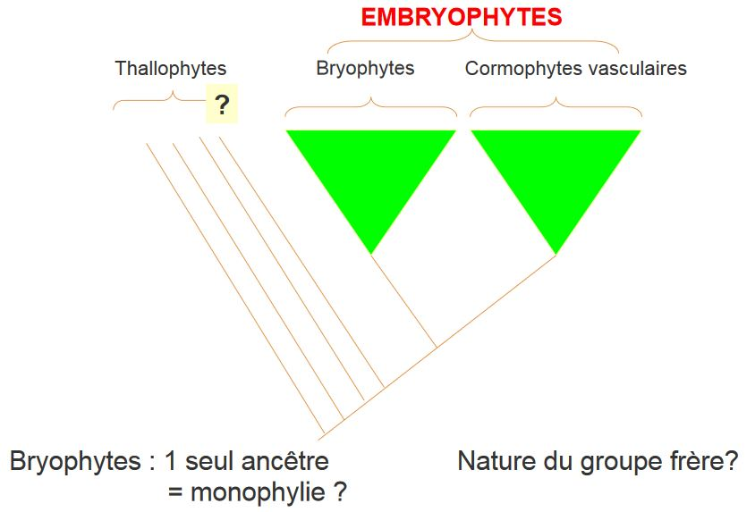

# Les Bryophytes

On les retrouve sur tous les types d'habitats, dans toutes les régions du globe à l'exception des océans. On peut avoir des bryophytes aquatiques d'eau douce. Comme le *Fertinalis sp*. 

## I) Généralités

D'après la classification évolutionniste : 

* Cormophytes "primitifs"

    * cycle digénétique hétéromorphe à **haplophase** dominante
    * cormus peu différencié lorsqu'il existe
    * épiderme souvent dépourvu de stomate
    * sporanges/ gamétanges,
    * oogamie (gamète mâle vient féconder le gamète femelle)
    
Ce sont les **Bryophytes**.

* Cormophytes *plus évolués*

    * cycle digénétique hétéromorphe à **diplophase** dominante
    * éléments conducteurs différenciés
    
Ce sont des **Cormophytes vasculaires**.

Oogamie : **Ptéridophytes**

Siphonogamie : **Spermaphytes**

Les Bryophytes est un groupe ancien : -370 Ma pour *Pallavicinites devonicus* (fossile)

La reproduction végétative est très facile et fréquente

* Fragmentation du gamétophyte

Toute partie du gamétophyte est capable d'engendrer un nouvel individu complet

Mais il y a aussi une reproduction végétative par:

* Aposporie possible
* Apogamie possible(formation d'un zygote à partir du cellule végétative)

On a déjà un regroupement de tissus qui ont déjà commencé leur maturation sexuelles et qui redonne un individu complet sans fécondation. C'est un facteur déclencheur qui reste inconnu.

La reproduction va être dépendante du milieu, il faut un milieu humide pour les gamètes mâle puissent se déplacer.

La fécondation est possible seulement si il y a une toute petite distance entre les deux gamètes. La distance maximale est de 10cm. La présence d'insecte sera un facteur dans la reproduction par le transport des gamétophytes mâle. Elle va être faite par des mouches attiré par l'odeur et va déposer la spore qui est sur son thorax récolté chez un autre Bryophyte.

La fécondation est facilité par la sécrétion de substances attractives, l'acide malique. C'est le **chimiotactisme**.

L'appareil végétatif est de petite taile sans tissu lignifié ni de tissus conducteurs évolués. La taille maximale est un 15 cm. Il n'y a pas de racines mais des **rhyzoïdes** qui on juste un rôle d'encrage. L'eau va être diffusé dans l'ensemble de l'appareil végétatif.

Les traits écologiques

* statégie de reproduction **r**, individu qui produisent énormément de déscendants
* résistance aux stress, contraintes physiques
* plantes pionnières (blocage succession), substance allélopathiques

Approche cladistique : hypothèse

## II) Présentation du groupe

10 000 genres et 25 000 espèces

Bryophytes sl : 3 embranchements classiquement présentées

* **Hépaticophyta** = Hépaticophyta
* **Anthocérotes** = Anthocérophyta
* **Bryophyta ss** = mousses

### A) Embt Hépatophyta = Marchantiophyta

Il existe 6 ordres, 250 genres 6 000 espèces

Existence d'**inclusions terpéniques** = oléocorps (goutelettes de composés phénolique)

Les oléocorps assuent des rôles de réserve, on va distingué deux grandes catégories:

* oléocorps dans des cellules spécialisées non chlorophylliennes
    * **Marchantiopsides**
        * Marchantiales
        * Monocléales
        * Sphaerocarpales

* oléocorps dans des cellules chlorophylliennens
	* **Jungermanniospsides**
        * Metzgériales
        * Calobryales
        * Jungermanniales
        
Deux morpho-types : 

* hépatiques à thalles
* hépatiques à feuille

#### Hépatiques à thalle = **Marchantiales** 

Le plus connu est le *Marchantia polymorpha* ou Hépatique des fontaines

Le gamétophyte:

* dichotomie vraie
* début du developpement par une cellule apicale lenticulaire
* thalle complexe, polarisé avec :
    * un parenchyme assimilateur en face dorsale = sup
    * un parenchyme de réserve en face ventrale = inf, oléocorps, mucilages

* présence de pores = "stomates" sur la face dorsale du thalle
* fragmentation et corbeilles à propagules = moyens de dissémination efficaces, reproduction végétative
* différenciation de gamétangiopores complexes
    * Archégoniophores
    * Anthéridiophores
    

Le sporophyte ou sporogone:

* porté par les archégoniophores
* issu de la fécondation de l'**oosphère** par un **anthérozoïde**
* protégé pendant la plus grande partie de son developpement, il ne fait saillie hors des bractées involucrales que très peu de temps avant la libération des méiospores
* produit un mélange de méiospores et d'élatères
* déhiscence : 4 orthostiques longitudinales

#### Hépathique à thalle Sphaerocarpales

* Plante dioïque
* gamétophyte en forme de lame thalloïde 
    * pluristromatique
    * monostromatique
    
* parenchyme de réserve, présence d'oléocorps
* gamétanges femelles et mâles protégés par des involucres en forme de bouteilles

* sporophytes : developpent à l'intérieur des involucres
* deux types cellulaires produits par le tissu sporogène :
    * spores
    * cellules stériles = élatères
    
#### Hépathique à thalle : Metzgeriales

Le gamétophyte

* Gamétophyte thalloïde mais beacoup plus simple que les Marchantiales
* Début du developpement par une cellule apicale lenticulaire
* Aucun tissu de réserve différencié : oléocorps dans C chlorophylliennes
* Différencie des "bractées" foliacées pour protéger les archégones et parfois les anthérides
* Archéogones en position non terminale : anacrogynie 

Le sporophyte:

* porté par une soie hyaline
* protégé pendant la plus grande partie de son developpement dans le thalle et par la ou les "bractées".
* libère un mélange de méiospores et d'élatères par déchirure de 4 orthostiques (rôle humidité)
* sporopollenine

#### Hépatiques à feuilles : Calobryales

* Gamétophyte feuillé à **apicale tétraédrique**
* les trois faces donnent naissance à trois organes foliacés, monostromatiques = les feuilles, à disposition **tristique**
* **Anthéridies** et **archégones** : portés par des gamétophores différents (même individu)
* Sporophyte, sur pieds femelles
* Déhiscence longitudinale (selon 4 ou 6 **orthostiques**) = **élatères** + spores

#### Hépatiques à feuilles : Jungermaniales

Gamétophyte:

* Très variable dès le début de son édification
* Différenciation d'une cellule apicale tétraédrique
* Ramification jamais terminale

Lorsque le rameau se couche, il y a production de formations différentes par les faces de l'apicale en fonction de leur position topographique:

* Gamétanges en position terminale du gamétophore
* Archégones protégés par une enveloppe plus ou moins complexe = **le marsupium**

Soporphytes:

* Porté par une **soie hyaline**
* Protégé pendant la plus grande partie de developpement par la/les "bractées"
* Libère un mélange d'élatères et de méiospores, par déchirure de 4 orthostiques
* Sporopollenine

#### Bilan sur les Hépatiques :

C'est un groupe relativement homogène en ce qui concerne le sporophyte:

* porté par une soie 
* libération d'un mélange de spores et d'élatères par déchirure longitudinale

C'est un groupe extrêmement variable au niveau du **gamétophyte**:

* thalles complexes, 
* thalles simples
* axes distiques
* axes tristiques...

**MARCHANTIOPHYTA (Phylum)**

* JUNGERMANNIOPSIDA (Cl) 

	* Jungermanniidae (Ss Cl) 
	* Jungermanniales (O) 
	* Lepicoleales (O) 
	* Pleuroziales (O) 
	* Porellales (O) 
	* Radulales (O) 

* Metzgeriidae (Ss Cl) 

	* Blasiales (O)
	* Fossombroniales (O) 
	* Haplomitriales (O) 
	* Metzgeriales (O) 
	* Treubiales (O) 

**MARCHANTIOPSIDA (Cl)** 

* Marchantiidae (Ss Cl) 

	* Marchantiales (O) 
	* Monocleales (O) 
	* Ricciales (O) 

* Sphaerocarpidae (Ss Cl) 

	* Sphaerocarpales (O) 

### B) Anthocérotes

Caractéristiques : 

* Appareil végétatif : talle

C'est le seul cormophyte qui ne synthétise pas de flavonoides

* Grand chloroplaste à pyrénoide (zone non pigmentée, présence d'amidon possible)
* Présence de stomates sur gamétophyte et sporophyte
* Croissance du sporophyte entretenue par une strcture basale
* Croissance du sporophyte indéfinie
* Sporophyte vert : assise photosynthétique
* Présence d'une cuticule
* Libération de spores et d'élatères par déhiscence variable

### C) Mousses

#### Sphagnales (o)

Caractéristiques :

* Protonéma discoïdal monostromatique
* Apicale tétraédrique
* Gamétophytes à feuilles tristiques
* Densément ramifiées
* Deux types cellulaires au niveau des feuilles

Sporophyte:

* Capsule sans élatères
* Columelle
* Déhiscence circulaire
* Pseudopode (n) surélevant le sporophyte
* Pas de péristome

C'est un groupe très homogène, il est caractériqé par sa capacité à se developper dans des milieux extrêmement acides et humides (**tourbières**) et une grande importance dans le stockage du carbone (**décomposition lente**).

#### Andrédales(o)

Habitat spécialisé:

* saxicoles
* souvent altitude

La dormance est possible

* Feuilles tristiques
* Gamétophyte petit
* Sporophyte s'ouvrant 4 fentes
* Columelle

#### Bryales (o)

Caractéristiques du Gématophyte:

* stade protonémique filamenteux
* developpement sur protonema de "bourgeons" (apicale tétraédrique, donnent naissance à des "tiges feuillées", gamétophore)
* gamétophore très variable anatomiquement
* porte corbeille à anthéridies ou archégones, paraphyses
* dans les tiges d'un grand nombre de Bryales, présence: 
	* Hydroïque
	* Leptoïde

Sporophyte:

* soie
* capsule (apophyse, columelle, péristome, opercule, tissu sporifère, coiffe)
* stomates
* libération de spores

#### Bilan Bryophyta 

* Assez grande homogénéité du gamétophyte -> tristique
* Sporophyte plus variable: point commum = la columelle
* Certains présentent des systèmes de libérations des spores sophistiqués (Péristomes)
* Grande réussite du groupe

#### Les Takakiopsides

* un seul genre, 2 espèces
* connue depuis peu : 1958 pour le gamétophyte F, 1989 pour le gamétophyte M
* répartition disjointe : Japon, Canada
* tige à symétrie radiale, édifiée le plus souvent par une cellule tétraédrique
* aucun rhizoïde
* anthéridies courtement pédicellées, archégones en position latérale
* séquençage récent des 18S et 26 S rRNA : place les Takakia en groupe frère des Bryophytes

#### Les Bryophytes

Possèdent comme points communs:

* cycle de reproduction
* fécondation
* sporopollenine
* présence d'une protection des premiers stades du sporophyte (et d'un embryon multecellulaire)

## III) La recherche du groupe frère

Les Charophytes présentent des points communs avec les Bryophytes et les cormophytes vasculaires

* anthérozoïde asymétrique bicilié
* structure multiassisiale
* phragmoplastes similaires
* Oogamie
* certaines characées synthétisent de la sporopollénine
* cycle de developpement : haplophasique 
* présence de plasmodesmes

Des mousses aux trachéophytes, apparition de:

* sporophytes dominants 
* véritable xylème et phloème 
* sporophyte ramifié à nombreux sporanges
* lignine 

Cela implique que les bryophytes sont un groupe paraphylétique basé sur le partage d'une symplésiomorphie : gamétophyte dominant

Acquisition des caractères marquant la transition vers les eu-trachéophytes:

* trachéides et tubes criblés différenciés 
* transition pseudolignines-lignines 
* acquisition et différencation (complexe!) de la racine vraie 
* dominance du sporophyte 
* protection de plus en plus complexe du jeune sporophyte  par des tissus d’origine gamétophytique puis uniquement sporophytique. 

