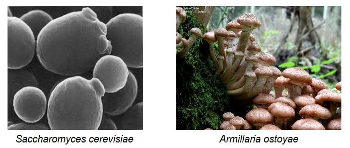

# Ecologie terrestre, interactions avec les végétaux

## I) Rappels de systématique et biologie fongique

Les champignons font parti du groupe de *thallophytes* . C'est un règne des Fungi et font parti d'un **groupe polyphylétique**.  

Il existe environ 100 000 espèces décrites et 1,5 à 5 Millions d’espèces estimées (grâce aux intéractions entre champignons et plante, il y a 31 taxons fongique par espèce de plante). C'est un groupe **ubiquiste** (qui est partout à la fois)  

L'appareil végétatif possède un mycélium, voire levures 

Les tailles sont extrêmement variables : 10 µm (Saccharomyces cerevisiae) à 600 hect (Armillaria ostoyae)

Les champignons ont des cycles biologiques très divers. Ils sont toujours hétérotrophes vis-à-vis du carbone. 
La nutrition fongique est dépendante des ressources carbonées d'autres organismes. Ils ont des voies d'assimilation et des modes de vies variés:

* **saprophytisme** (se nourrit de végétaux morts)

* **parasitisme**

* **mutualisme obligatoire ou non-obligatoire**

Ils sont acteurs du fonctionnement des écosystèmes :  

* décomposeurs de matière organique 
* fixateurs de N, P, structure du substrat (acteurs de la minéralisation du sol) 

*Exemples d'abondances:*

* *en sol fertile agricole : 5 tonnes/ha (prof. 20 cm)*  
* *en sol forestier : ca. 100 kg/ha (prof. 25 cm)*  

Importance du point de vue anthropique :  
* infections (animaux, plantes, homme) 

* moisissures sur tous substrats 

* utilisations en procédés alimentaires 

* utilisations pharmaceutiques  

* relations symbiotiques des cultures (mycorhizes)  

Caractéristiques cytologiques : 

* Pas de plaste 

* Noyaux petits (transfert possible au travers de pores) 

* Vacuoles 

* Paroi cellulaire, contenant chitine et ergostérol  

* Réserves de glycogène 

La membrane est constitué de phospholipides et de ergostérol (longue chaine lipidique) qui vont servir à mettre en place de nouvelles cellules fonctionnelles. La paroi est rigide contenant de la **chitine**

un filament  = une **hyphe** 

un ensemble d'hyphes = **mycélium** 

Un mycélium est constitué d'une croissance végétative terminale indéfinie, matrice de fructifications, propagules (structure de dissémination et de reproduction), organes d'interaction 

Chez certains, leur forme sera non-filamenteuse (forme dominante des levures, certains Chytridiomycètes) 

Pendant la période de croissance, il y aura le flux d’organelles (zone apicale riche en vésicules (Golgi)  + mitochondries). Il y aura aussi une ramification contrôlée par des hydrolases et des vagues de croissance. 

*Chez septa matures, il y aura une rigidification des parois et la fermeture des pores* 

Les champignons seront longtemps considérés comme un groupe homogène : 

* hétérotrophes vis-à-vis du carbone = convergences physiologiques 
* la paroi contraignant le développement végétatif = convergences  morphologiques  

Les champignons qui ont été etudiés par botanistes et zoologistes sont à proximité des métazoaire (animaux): 
 
* hétérochontes : cellule flagellée, flagelle en position postérieure 

* paroi chitineuse 

* mise en réserve des glucides : glycogène 

Leur position taxonomique n'est pas évidente morphologiquement et physiologiquement.

## II) Saprotrophes et relations aux végétaux 

Les saprotrophes possèdent une vie libre. Ils se nourrissent en assimilant les parois mais sont incapables d'assimiler les macromolécules car ils ont une digestion extra-cellulaire 

1. production d’enzymes de dégradation spécifiques au substrat ; exocytose à l’extrémité apicale des hyphes 
2. dégradation du substrat en mono- ou oligo-polymères 
3. assimilation des produits de dégradation par diffusion 

En forêts, ils dégradent de la matière organique, ce sont des ingénieurs du cycle biogéochimique. En milieux anthropiques, ils peuvent dégrader tous types de substrats *mérule va dégrader des voies en milieu anthropiques car il se sont adapter à l'Homme*

En industries, ils vont digérer des pulpes de papier, la production de biomolécules et biocarburants mais encore des fermentations alimentaires.

Les Saprotrophes sont très abondant en forêt (10 000 m de mycélieum /g de litière sèche) mais ils sont microscopiques. 

Leur enzymes fongiques sont impliquées dans la dégradation de la lignine et la cellulose. Ils ont une meilleure efficacité de dégradation des structures complexes que les bactéries.

## III) Parasites de végétaux

**Parasitisme** = association d'au moins deux organismes, dont l'un,**le parasite**, réalise son cycle biologique aux dépends du développement de l'autre, **l'hôte**.

Parmis les champignons, il existe des parasites communs d'animaux

* sur des vertébrés 
	* aspergilloses
    * teignes 
    * maladies du muguet

* sur des invertébrés
	* muscardine du ver à soie	
    * pyrénomycète

95 % des parasites pour les végétaux sont des champignons

Il existe deux grands cycles biologiques des champignons phytopathogènes:

Selon les espèces fongiques, il y a différents degrés de spécificité:

* **Spécialistes**, spécifiques à un hôte
* **Généralistes**, capables de parasiter une gamme de plantes-hôtes

Il existe différents modes d'infection des tissus végétaux:

* **Ectoparasites** = suçoirs traversant les cellules épidermiques (mise en place d'un **haustania**)
* **Endoparasites** = pénétration par orifices naturels (blessures, stomates); des méats et colonisation des tissus

Les mécanismes biochimiques sont contrastés selon le mode de vie:

* **Biothrophes** = enzymes spécifiques d'évitement de la reconnaissance par l'hôte, puis colonisation des tissus 
* **Nécrotrophes** = gamme d'enzymes capables de:
	* lyser les cellules de différents hôtes (catalase, laccase, popyphenol oxidase)
    * éviter les réactions de défense 

Les mécanismes de défense et le système immunitaire de la plante-hôte sont analogues à ceux des animaux. La plante possède des barrière naturelles de tissus adaptés et des toxines constitutives. Elle a aussi une défense et une activation de protéines élicitrices. Il y aura une cascade de réaction de défense après la reconnaissance du pathogène. 

En effet, elle va sécréter des macromolécules toxiques difficilement dégradables et activer des enzymes antifongiques (chitinases). Elle possède aussi **une réaction hypersensible** où on aura une nécrose précoce des tissus empêchant la progression du pathogène.

On parle ici de *course aux armes* entre l'hôte et le pathogène.

Le pathogène va se developper sur une plante-hôte en

* épuisant les reserves de l'hôte, **processus physiologique**
* sécrétant des enzymes et toxines dégradant les cellules-hôtes **processus biochimiques**

C'est une stratégie proche des saprophytes.

En situation de déséquilibre de l'intéraction, il y aura possibilité de dégâts très importants.

## IV) Symbioses plantes-champignons 

## V) Continuum des interactions plantes-champignons