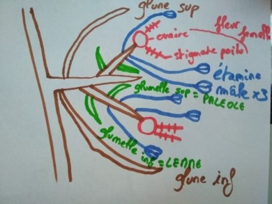

*Semestre 5*	

# Systématique végétale

# Les Angiospermes

## La Taxonomie

Embranchements (phyte) > Classes (opsides) > Ordres (ales) > Familles (acées) > Genre ( 1ere lettre en majuscule, nom en latin) > Espèces ( 1ere lettre en minuscule, nom en latin)

*ex Bellis perennis L.*
*Helichrysumn italicum*

## LILIACEES

### I) Généralité liliacées

Elles sont de l'ordre des **liliales** comptant 3000 espèces (*tulipes, muguet, l'ail, jacynthe de bois...*). Elles sont **monocotylédones** (*nervures //, 3 verticilles floraux*). Ce sont des plantes **vivaces**(*durer plusieurs années*). Elles sont souvent précoces.

Les tulipes venaient de Cocase et ont été importés en Hollande, elle est à l'origine de la **tulipomanie** -> conservation des tulipes pour arriver à une très grande variété. Elles avaient de bcp de valeur au XVII e siècle (un bulbe pour 87000 euros)

### II) Appareil végétatif

L'appareil végétatif est extrêmement variable (diversité des tiges) et souvent enterré comme les **bulbes** (tulipe oignon, ail) ou les **rhizomes** (muguet).
Les tiges en forme de feuilles s'appellent des cladodes pour le *Ruscus aculeatus*
 
Les inflorescences (position des fleurs) très différentes pouvant appartenir à plusieurs types:
* **épi** (fleurs sur l'axe)
* **grappe** (pénoncule qui porte les fleurs)
* **ombelle**(axe qui se divise en rayon *ex ail*)
* **fleur solitaire**

Ches les liliacées, les fleurs sont hermaphrodites (**étamines** *organe mâle* + **pistil** *organe femelle*) actimorphes et possèdent des tépales (sépales + pétales)

> 3T + 3T + (3+3) E + (3C)

Le fruit est un ovaire c'est une capsule ou une baie.
Les fleurs sont très voyantes, la pollinisation est entomophile (favorisé par les insectes)

**Ovaire supère**: ovaire entouré de pièce floral

**Ovaire infère**: ovaire sous les pièces florales

## III) Autre familles proches

**Amaryllidacées**: liliacées à ovaires infères (*ex jonquilles, narcisses*)

**Iridacées**: amaryllidacées avec perte d'une verticille d'étamines 

## POACEES

### I) Généralités

Ce sont des **monocotylédones**, plus de 12000 espèce, 5e la plus diversifiée (les 1er sont les orchidacées 26000 espèces, 2e les astéracées 23000 espèces, 3e les fabacées 19000 espèces, 4e rubiacées 13000 espèces).

C'est la famille avec la plus grande biomasse produite sur la planète, donc on a une importance écologique, en effet ce sont des espèces **ubiquiste** (tous les milieux) et une importance économique (agriculture).
C'est une famille très évoluée avec spécialisation de tous les organes.

En Afrique du Sud, nous avons la plus grande diversité de Poacées.
Elles sont apparues au Crétacé en Afrique ou Amérique du Sud.
C'est difficile des les différencier entre elles.

### II) Appareil végétatif

Ce sont pratiquement toujours des plantes herbacées (sauf le bambou) annuelles ou vivaces. La tige est creuse et cylindrique, **chaume**. Les feuilles ont une **gaine** fendue avec un **ligule** (partie à la base de la feuille qui indique la famille).

### III) Appareil reproducteur

L'**epillet** est une inflorescence élémentaire des poacées, 1 épillet = 2 fleurs mâle et femelle

 

 Un épillet peut être sessile: **épi**

Un **épillet pédicellé**: grappe, cyme, panicule
 
Adaptation à l'anémogamie
* stigmates plumeux
* anthères oscillantes
* pièces périanthe peu visible

Fleurs chez les espèces primitives :
> (3+3)T + (3+3)E + (3C)

> 0S + OP + 1-3 + 1C

Le fruit est un **caryopse** est soudée à l'akène + Albumen

# CYPERACEES

Ils sont voisins des poacées. Se dvp dans les zones humides. On a une convergence avec les poacées mais pas de filiation directe.
C'est une plante **graminoïde**, les feuilles sont à **insertion tristiques** (3 directions différentes), la tige est à **section triangulaire**, ne possède **pas de noeud**. Les feuilles sont à **gaines non fendues** et ne possède **pas de ligules** (mais parfois **antiligules**). Les feuilles sont en "V"

Inflorescence: grappe contractée d'épillets : épi

Les fleurs sont réduites.
Le **périanthe** est réduit à des soies ou écailles.
La pollinisation **anémophile** (pollen entraîné par le vent).
Le fruit est **l'akène** (fruit sec indéhiscent à graine unique dont le **péricarpe** n'est pas soudé à la graine *ex pissenlit*).

Chez le **carex**, l'évolution de l'épillet est en fleurs unisexuées.
Le périanthe est une **utricule**. Il y a beaucoup d'inflorescences variables.
Il est **monostachiée**.

**Hétérostachiée** : plusieurs épis que mâle ou que femelle

**Homostachiée** : plusieurs épis mâle et femelle

## JUNCACEES

Une famille de 7 genres et 400 espèces. 

L'appareil végétatif est herbacées, on a des rhizomes, les feuilles sont basales, alternes à limbe graminiforme ou cylindrique.

La fleur a des tépales, l'inflorescence est souvent en cymes ou en glomérules, les fleurs hermaphrodites et actinomorphes en générale verte ou brune

> 3+ 3T + 3 + 3 E + (3C)

