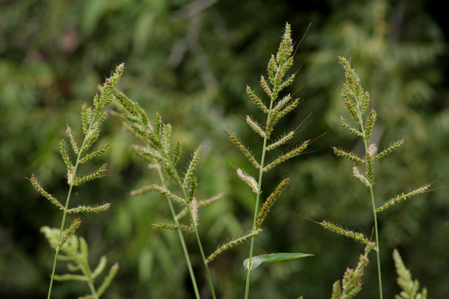
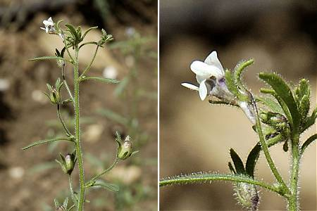

### LAMIACEAE, *Lamium purpureum*, **Lamier pourpre**

### ASTERACEAE, *Centaurea jacea*, **Centaurée jacée**

### FABACEAE, *Melilotus alba*, **Mélilot blanc**

### LAMIACEAE, *Prunella vulgaris*, **Brunelle commune**

### PAPAVERACEAE, *Chelidonium majus*, **Grande Chélidoine**

### APIACEAE, *Daucus carota*, **Carotte sauvage**

### RANUNCULACEAE, *Ranunculus Acris*, **Bouton d'or**

### POLYGONACEAE, *Polygonum aviculare*, **Renouée des oiseaux**

### ASTERACEAE, *Chrysanthemum leucanthemum*, **Marguerite commune**

### FABACEAE, *Trifolium pratense*, **Trèfle des prés**

### PLANTAGINACEAE, *Plantago coronopus*, **Plantain corne de cerf**

### CORNACEAE, *Cornus sanguinea*, **Cornouiller sanguin**

### BRASSICACEAE, *Sinapis arvensis*, **Moutarde des champs**

### HYPERICACEAE, *Hypericum androsaemum*, **Millepertuis androsème**

### BRASSICACEAE, *Capsella bursa-pastoris*, **Capselle bourse-à-pasteur**

### ASTERACEAE, *Achillea millefolium*, **Achillée millefeuille**

### POACEAE, *Echinochloa crus-galli*, **Panic des marais**

### FABACEAE, *lotus corniculatus*, **Lotier corniculé**

### SCROPHULARIACEAE, *Chaenorhinum minus*, **Petite linaire**

