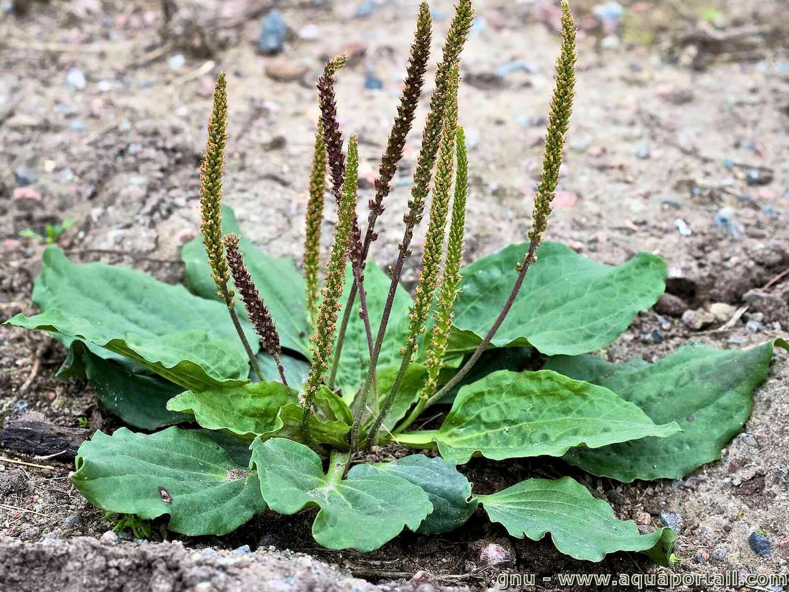

### LAMIACEAE, *Lamium purpureum*, **Lamier pourpre**

### ASTERACEAE, *Centaurea jacea*, **Centaurée jacée**

### FABACEAE, *Melilotus alba*, **Mélilot blanc**

### LAMIACEAE, *Prunella vulgaris*, **Brunelle commune**

### PAPAVERACEAE, *Chelidonium majus*, **Grande Chélidoine**

### APIACEAE, *Daucus carota*, **Carotte sauvage**

### RANUNCULACEAE, *Ranunculus Acris*, **Bouton d'or**

### POLYGONACEAE, *Polygonum aviculare*, **Renouée des oiseaux**

### ASTERACEAE, *Chrysanthemum leucanthemum*, **Marguerite commune**

### FABACEAE, *Trifolium pratense*, **Trèfle des prés**

### PLANTAGINACEAE, *Plantago coronopus*, **Plantain corne de cerf**

### CORNACEAE, *Cornus sanguinea*, **Cornouiller sanguin**

### BRASSICACEAE, *Sinapis arvensis*, **Moutarde des champs**

### HYPERICACEAE, *Hypericum androsaemum*, **Millepertuis androsème**

### BRASSICACEAE, *Capsella bursa-pastoris*, **Capselle bourse-à-pasteur**

### ASTERACEAE, *Achillea millefolium*, **Achillée millefeuille**

### POACEAE, *Echinochloa crus-galli*, **Panic des marais**

### FABACEAE, *lotus corniculatus*, **Lotier corniculé**

### SCROPHULARIACEAE, *Chaenorhinum minus*, **Petite linaire**

### POLYGONACEAE, *Polygonum lapathifolium*, **Renouée à feuilles d'oseille**

### ASTERACEAE, *Eupatorium cannabinum*, **Eupatoire à feuilles de chanvre**

### POACEAE, *Poa nemoralis*, **Pâturin des bois**

### LAMIACEAE, *Lamium album*, **Lamier blanc**

### SOLANACEAE, *Solanum nigrum*, **Morelle noire**

### ASTERACEAE, *Cirsium arvense*, **Cirse des champs**

### ASTERACEAE, *Galinsoga sp*, **Galinsoga**

### POACEAE, *Dactylis glomerata*, **Dactyle pelotonné**

### CARYOPHILACEAE, *Silene mutans*, **Silène penché**

### ERICACEAE, *Calluna vulgaris*, **Bruyère commune**

### JONCACEAE, *Juncus effusus*, **Jonc épars**

### CHENOPODIACEAE, *Atriplex hastata*, **Arroche hastée**

### ASTERACEAE, *Matricaria chamomilla*, **Camomille sauvage**

### SOLANACEAE, *Datura stramonium*, **Pomme épineuse**

### CYPERACEAE, *Carex sylvatica*, **Laîche des bois**

### POACEAE *Poa annua*, **Pâturin annuel**

### ASTERACEAE *Pulicaria dysenterica*, **Pulicaire dysentérique**

### EUPHORBIACEAE, *Euphorbia helioscopia*, **Euphorbe réveille-matin**

### CRASSULACEAE, *Sedum acre*, **Orpin âcre**

### BALSAMINACEAE, *Impatiens sp*, **Balsamine**

### FABACEAE, *Lathyrus latifolius*, **Pois vivace**

### BORAGINACEAE, *Borago officinalis*, **Bourrache officinale**

### RANUNCULACEAE, *Clematis vitalba*, **Clématite des haies**

### CONVOLVULACEAE, *Calystegia sepium*, **Liseron des haies**

### FABACEAE, *Medicago lupulina*, **Luzerne lupuline**

### MALVACEAE, *Malva alcea*, **Mauve alcée**

### POACEAE, *lolium perenne*, **Ray-grass anglais**

### ASTERACEAE, *Solidago virgaurea*, **Solidage verge d'or**

### CARYOPHYLLACEAE, *Silene nutans*, **Silène penché**  

### FUMARIACEAE, *Fumaria bastardii*, **Fumeterre**

### GERANICEAE, *Geranium rotindifolium*, **Géranium à feuilles rondes**

### PRIMULACEAE, *Anagallis arvensis*, **Mouron rouge**

### PLANTAGINACEAE, *Plantago major*, **Grand plantain**

 
### BALASAMINACEAE, *Impatiens balfouri*, **Balsamine de Balfour**

### BORAGINACEAE, *Myosotis arvensis*, **Myosotis des champs**

### POACEAE, *Avena strigosa*, **Avoine rude**

### GORANIACEAE, *Geranium robertianum*, **Géranium Herbe à Robert**

### BRASSICACEAE, *Alyssium sp*, **Alysse** 

### LAMIACEAE, *Lamium amplexicaule*, **Lamier amplexicaule**

### POACEAE, *Cynodon dactylon*, **Chiendent pied-de-poule**

