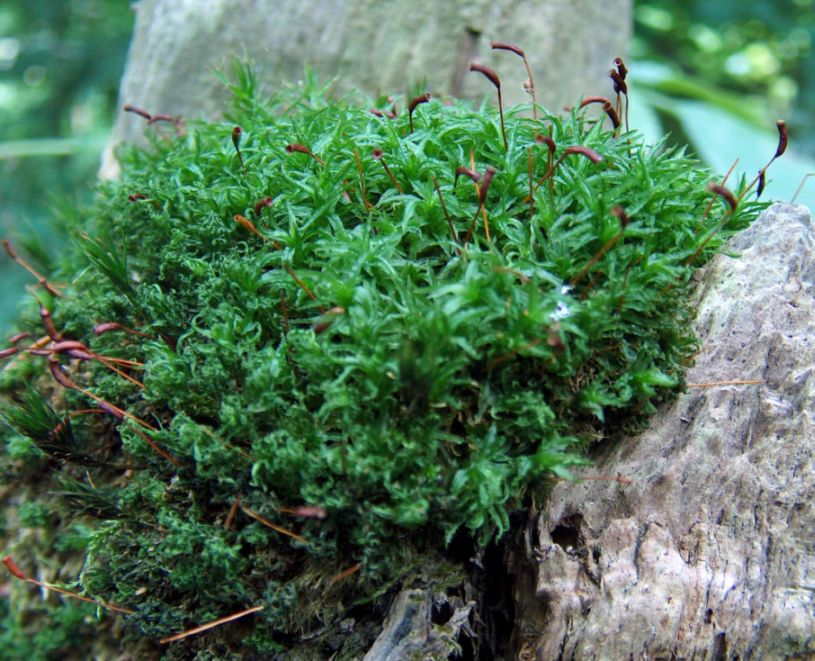
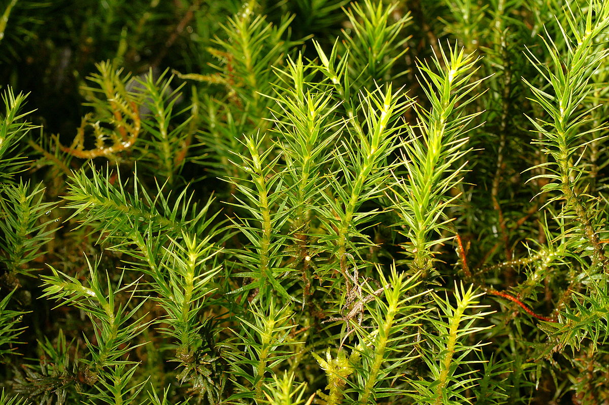
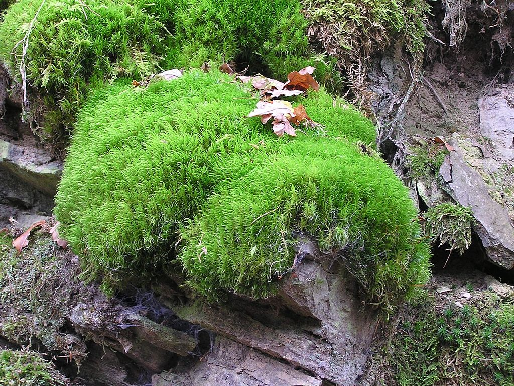
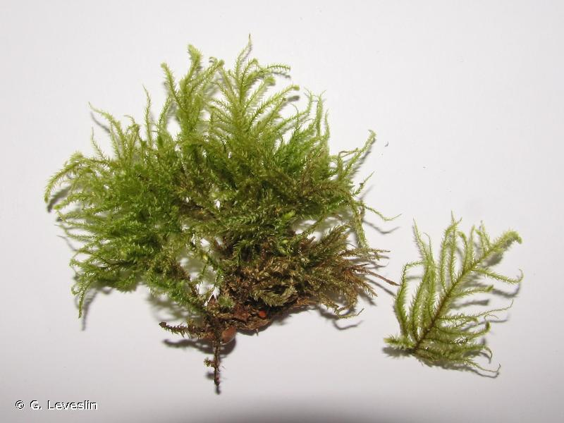
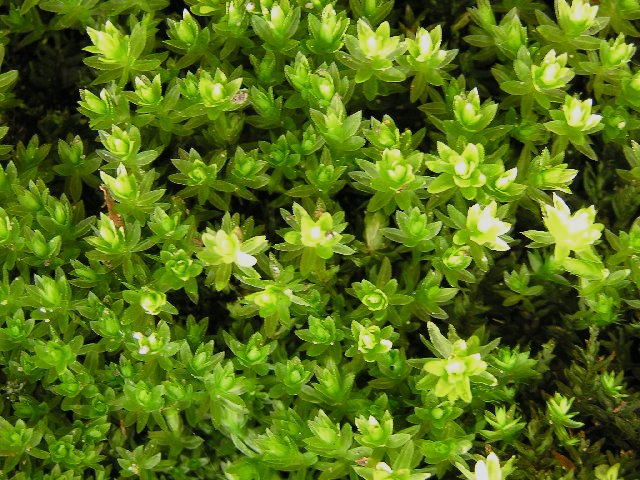
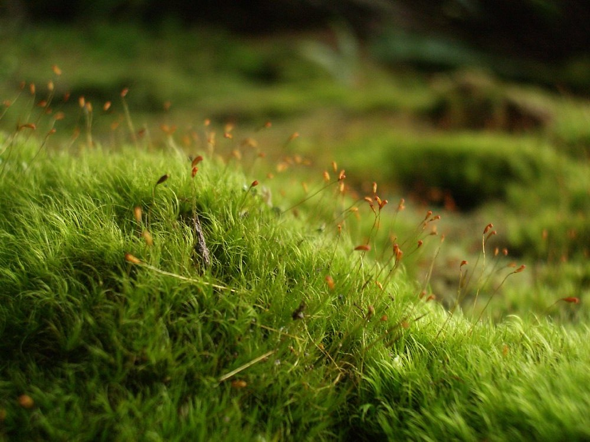
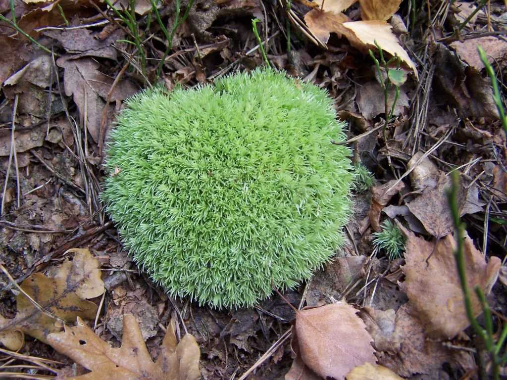
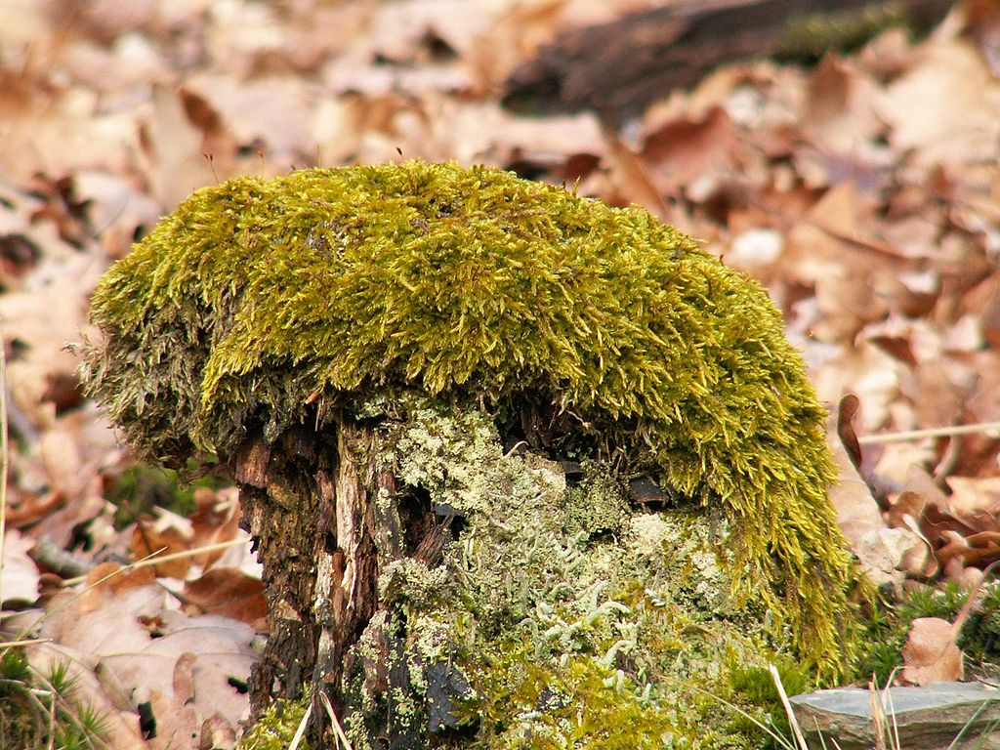
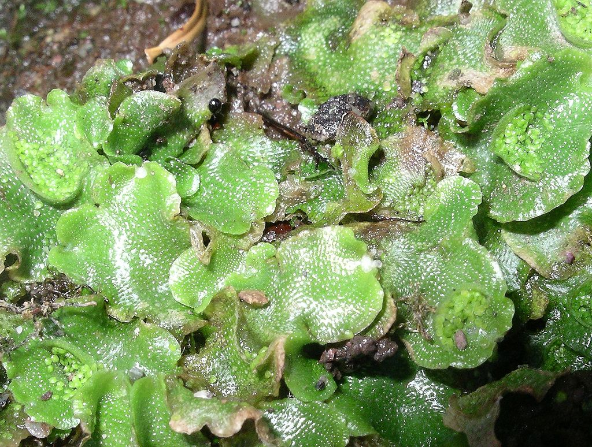
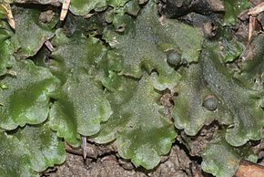

### POLYTRICACEES, *Atrichum undulatum*

###  POLYTRICHACEES, *Polytrichum formosum*

### DICRANACEES, *Dicranum scoparium*

### BRACHYTHECIACEES, *Eurhynchium striatum*

### MNIACEES, *Mnium hormum*

### DICRANACEES, *Dicranella heteromalla*

### LEUCOBRYACEES, *leucobryum glaucum*

### HYPNACEES, *Hypnum cupressiforme*

### LUNULARIACEES, *Lunularia cruciata*

### HYLOCOMIACEES, *Rhytidiadelphus triqueter*

### PELLIACEES,*Pellia epiphylla*

