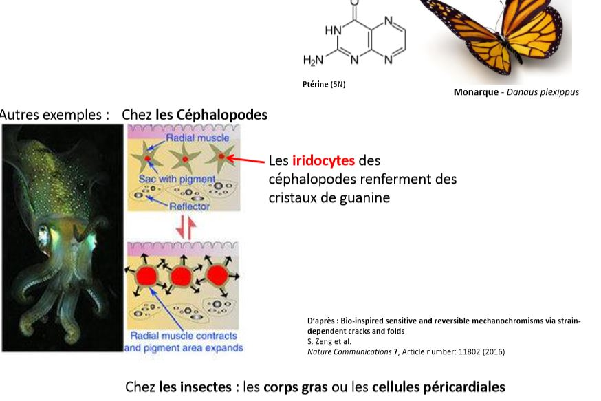

# Les modalités d'excrétion

## I) Excrétion par accumulation 

Les déchets azotés s’accumulent dans des cellules, des tissus et parfois des organes =  Reins d’accumulation 

### A) Accumulation dans des cellules 

Les **chloragocytes** des annélides 

Les **Corps fongiformes** ou **fongosités** des Céphalopodes (majoritairement ammoniotèles) 

Les déchets se forment en grande partie dans la glande digestive (fonction analogue au foie dans la synthèse de l’Urée), ils passent dans le sang et sont repris par les corps fungiformes et les corps lymphoïdes. 

### B) Accumulation dans les tissus

La ptérine et ses dérivés (pigments « d’excrétion » azotée)

## II) Excrétion par élimination

**Elimination directe** chez les organismes unicellulaires et chez les diploblastiques

**Elimination indirecte** : Chez les triploblastiques, l’apparition du mésoderme et éventuellement d’une cavité développée = cœlome implique le passage des déchets vers un compartiment interne.  Et donc le développement d’organes  spécialisés dans l’épuration de ces liquides internes. 

Formation de l'urine

**Formation de l’urine** = Diurèse par ultrafiltration. L’urine primitive ou ultrafiltrat  (composition proche du liquide interne) est modifiée par des mécanismes de réabsorption et de sécrétion (mécanismes actifs qui nécessitent de l’énergie) puis éliminée vers l’extérieur sous forme d’urine définitive (secondaire ou finale).

Remarque : R et S constituent des transports actifs contre un gradient chimique ou électrochimique donc nécessitent de l’énergie.

Représentation schématique des appareils excréteurs : 

Selon les appareils excréteurs, on distingue 3 types de mécanismes de filtration : 

