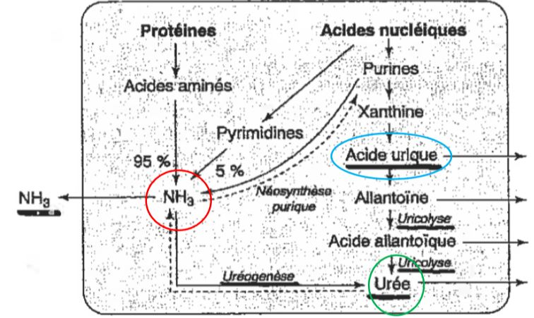
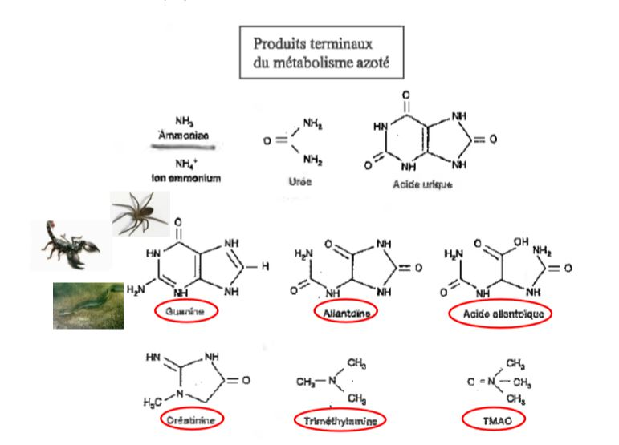

# Les produits d'excrétion azotée

## I) La diversité

Le métabolisme des protéines et des acides nucléiques à l’origine de la libération de composés azotés.

Désamination des acides aminées et des bases azotées pyrimidiques (C et T pour l'ADN et C et U pour l’ARN) et puriques (A et G)  

La cellule des protozoaires est capable de dégrader ses acides aminés Chez les métazoaires les réactions de dégradation des AA se sont régionalisées au cours de l’évolution Hépatopancréas (invertébrés) Corps gras (insectes) et Foie ( Vertébrés) 

### A) L'ammoniac

L'ammoniac: 

* 1 seul atome d'azote
* molécule gazeuse donc très diffusible au travers des membranes biologiques
* **très toxique** (au niveau du système nerveux en jouant sur la synthèse de neurotransmetteurs comme le glutamate et du GABA, réduit la synthèse d’ATP mitochondrial par découplage, perturbe la pompe Na+/K+ en se substituant au NA+..)  
* **très soluble** dans l'eau
* il faut **500 mL** d'eau pour éliminer **1g** d'azote
* animaux **ammoniotéliques** ou **ammpniotèles**

NH3 + H2O <-----> NH4OH AMMONIAQUE 
NH4OH <-----> NH4+ + OH- 
NH3 + H+ <-----> NH4+ AMMONIUM

NH4+ représente la forme majeure de déchet azoté, il traverse la membrane plasmique et il sort aussi facilement au niveau des cellules branchiales des poissons (antipore NH4+ /Na+) ou bien dans les cellules rénales des vertébrés.  NH3 est donc très facilement éliminé sans beaucoup d’énergie dépensée, si on compare ce mode d’excrétion azotée à celui de l’urée ou l’acide urique. 
 
Le milieu interne de l’animal sera dans ce cas le lieu de passage des NH3 ou NH4+ puis ils seront éliminés au niveau d’organes excréteurs (téguments, reins... ) 

Ex : chez les Téléostéens au niveau de l’épithélium des branchies soit par diffusion ou pas le système antipore NH4+/Na+ . Les reins n’ont donc ici qu’un rôle mineur dans l’excrétion azotée. 

L'**ammoniotélie** prédomine chez les **animaux aquatiques**.

### B) L'urée

L'uréé:

* 2 atomes d'azote 
* neutre et **peu toxique**, elle peut s'accumuler dans le sang
* très soluble dans l'eau
* diffuse rapidement au travers des membranes cellulaires
* **50 mL d'eau** pour éliminer **1g** d'azote
* animaux **uréotéliques**

Chez les vertébrés, l’urée est synthétisée dans le foie au cours d’un cycle découvert par Krebs en 1932 - Cycle de l’Urée ou cycle de l’ Ornithine-urée 

1937 - Mise en évidence des processus chimiques à l’origine  de la production d’énergie dans les cellules : Cycle de Krebs 

1953 - Prix Nobel de Physiologie ou de Médecine 

**Uréogenèse chez les vertébrés** = Une partie des NH4+ produite par le métabolisme des protéines et acides nucléiques est utilisée pour les biosynthèses et le reste est éliminé sous forme d’urée chez certains organismes comme les amphibiens, les sélaciens ou les mammifères. 

**L’ uréotélie** = chez les animaux terrestres qui possèdent les enzymes du cycle de l’Urée 

Rappel Cours « Osmorégulation », les Sélaciens sont uréotéliques mais  l’urée n’est pas éliminée. Elle joue un rôle dans l’osmorégulation et dans le fonctionnement des organes de l’animal. 

Chez *Squalus acanthias* (Sélacien), 90% de l’urée filtrée au niveau rénal est réabsorbée, de plus chez les Sélaciens tous les organes possèdent les enzymes du cycle de l’urée et sont donc capables de produire l’urée qui devient même indispensable au bon fonctionnement des organes. 

### C) L'acide urique

* 4 atomes d’azote 
* **peu toxique**
* **Très peu soluble** dans l’eau précipite facilement 
* **~ 10 ml d’eau** pour éliminer **1g** d’azote 
* Animaux **uricotéliques** - Uricotélie 

Chez l’Homme, un excès d’acide urique dans le sang  =  **Hyperuricémie** provoque la « goutte » car l’acide urique ne peut pas être dégradée  (uricolyse impossible chez l’homme car les enzymes ne sont pas présentes)

**Uricogenèse** = L’acide urique est le produit final de la dégradation des bases azotées purique (A+G)  

L’acide urique est éliminée dans un minimum d’eau, c’est la partie « blanche » retrouvée dans la fiente des oiseaux et mélangée aux fèces. L’économie d’eau leur permet aussi d’éviter de produire beaucoup d’urine, cela facilite la locomotion et pour certains le vol. (idem Chiroptères). 

Chez certaines espèces, l’acide urique peut être dégradée par uricolyse.

### D) Les autres "déchets" azotés

En réalité, les animaux n’excrètent pas qu’un seul produit mais souvent une combinaison de plusieurs de ces composés : 

## II) Hypothèse de Needham et Baldwin

Plus le milieu est osmotiquement stressant, plus le déchet azoté est insoluble et nécessite de moins en moins d’eau pour être éliminé. Cela va dans le sens de l’économie d’eau  

Têtard **ammonotélique** -> Adulte **uréotélique** 

Chez le Xénope, l'adulte reste exclusivement aquatique : **Ammoniotélisme**

**Ammonotélique** -> **Uréotélique** 

L’alternance des modalités d’excrétion peut se dérouler de façon journalière 

Mollusques gastéropodes prosobranches 

Même mode de vie intertidale que les littorines et pourtant ces mollusques sont uricotéliques quel que soit le cycle de la marée. 

