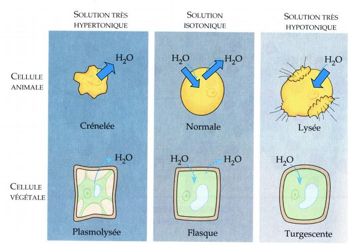
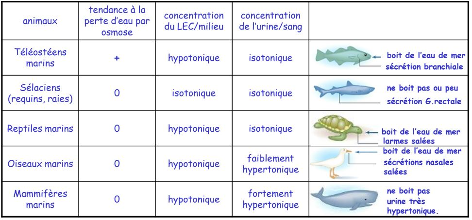
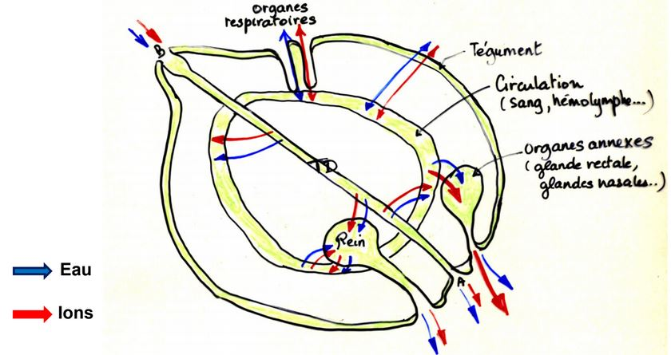

**L'Osmorégulation**

Processus servant au maintien de l'équilibre hydrique et électrolytique

**Notion d'homéostasie**

L'Homéostasie est un **état d'équilibre dynamique** d'un organisme qui permet le maintien de la **stabilité du milieu interne**. Les systèmes de régulation protègent le milieu interne des effets des variations du milieu externe.

**L'Osmose**

Deux solutions dont les concentrations sont égales sont dites **isotoniques**. Si on compare deux solutions dont la concentration en solutés est différente. La plus concentrée est dite **Hypertonique** et la moins concentrée **Hypotonique**.

Si on imagine deux solutions séparées par une memebrane perméable au sovant (eau par exemple) mais imperméable au soluté. Si les concentrations des deux solutions sont différentes, on observe un mouvement d'eau au travers de la membrane de la solution hypotonique vers la solution hypertonique. Cette diffusion au travers de la membrane semi-perméable est appelé **osmose**, ainsi, les concentrations de soluté tendent petit à petit à s'égaliser de part et d'autre de la membrane.

Si les concentrations des milieux intracellulaire et extracellulaire sont
différentes, l’eau passe au travers de la membrane. Contrairement aux cellules
végétales, les cellules animales n’ont **pas de paroi cellulaire**, ainsi une cellule animale ne peut tolérer une entrée ou une sortie d’eau excessive.

**Mécanismes inévitables**

Les cellules d’un animal ne peuvent survivre à une perte ou un gain importants d’eau, et ceci que l’animal soit terrestre, d’eau douce ou marin.

Et même dans le cas où l’animal présente une enveloppe qui empêche les pertes ou les gains d’eau, il y aura
**toujours** un niveau d’épithéliums spécialisés qui doivent absolument être exposés au milieu (pour les échanges gazeux par exemple) un épithélium perméable et donc des «*fuites*».

## Introduction

Le tégument des animaux n’est pas imperméable. Toute différence de concentration et de composition entre le compartiment corporel et le milieu entraîne des mouvements d’eau , d’ions et/ou desolutés à travers la paroi du corps.

Cependant, la stabilité du milieu intérieur est une condition essentielle au bon fonctionnement cellulaire.

Donc l'organisme met en oeuvre des méca,ismes pour limiter ces flux:

* soit au niveau de son tégument (mécanisme assez limité)
* soit en créant un flux inverse par diffusion ou par osmose

## I) La vie en milieu aquatique

### A) En milieu marin

L'osmolarité (concentration totale de solutés dans l'eau) de l'eau de mer est en moyenne de 1000 à 1100 mOsmoles/L. Cela varie en fonction des mer étudiées.

En plus des ions, l'eau de mer contient de petites quantités de tous les éléments ou presque présent sur Terre.

### B) Les animaux marins

**Espèces osmoconformes et les espèces osmorégulatrices

Il existe différents types d’adaptation des animaux à l’eau de mer, on distingue les osmoconformes et les osmorégulateurs.

Certaines espèces osmoconformes seront dites **sténohalines** (sténos = étroit, halin : qui se rapporte au sel) sont cantonnées à des milieux où la salinité
varie peu, d’autres capables de supporter des variations de salinité plus importantes comme dans les zones intertidales ou les estuaires sont dites
**euryhalines**.

* Chez la Myxine (Cyclostome marin et sténohalin) la concentration saline est voisine de celle de l’eau de mer donc pas d’osmorégulation. Par contre, chez les Sélaciens et le Coelacanthe, la concentration saline du milieu intérieur est différente de celle de l’eau de mer et pourtant, ces organismes sont en équilibre osmotique avec l’eau de mer. Ceci est lié à l’accumulation dans l’organisme de composés organiques «*osmotiquement actifs*» appelés Osmolytes donc pas de mouvements d’eau (exemple : urée, TMAO et autres amines méthylées).

* Chez Squalus acanthias (Sélacien), 90% de l’urée filtrée au niveau rénal est réabsorbée, de plus chez les Sélaciens tous les organes possèdent les enzymes du cycle de l’urée et sont donc capables de produire l’urée qui devient même indispensable au bon fonctionnement des organes. **Il n'y a donc pas de mouvement d'eau mais une entrée de sel**. Cet équilibre osmotique avec l’eau de mer permet aux Sélaciens de conserver l’eau de leurs tissus, mais ils ne peuvent pas éviter la diffusion de NaCl de l’eau de mer vers leur milieu intérieur, ils doivent donc constamment éliminer l’excès de sel.
	* par le rein (mésonéphros)
    * par un divercule intestinal : La glande rectale
    
Les Téléostéens marins et les Lamproies (Cyclostomes) sont **hypo-osmotiques**
par rapport au milieu, l’animal est constamment soumis à une **perte hydrique**
par **osmose** (surtout au niveau branchial) et du fait du déséquilibre ionique à un **flux entrant d’ions** (de l’eau de mer vers ses tissus).

La déshydratation est compensée par une faible quantité d’urine émise
(filtration faible, rein souvent aglomérulaire) et par l’absorption d’une grande quantité d’eau. Mais l’eau chargée de sels aggrave le problème de surcharge saline. De plus, le rein des Téléostéens ne permet pas de produire une urine concentrée et n'évacue que des ions divalents.

L'extraction des ions Na+ et Cl- se fait contre un gradient de concentration (mécanisme actif à activité Na+/K+ ATPase) au niveau des cellules spécialisées : les **cellules à chlorure** ou **ionocytes**.

#### Cas des espèces vivant en eaux sur salées

Espèces euryhalines

* Eau de mer (environ 35 pour mille)
	* Polychètes Néréidiens (N.diversicolor)  
	* Mollusques Gastéropodes (Hydrobiidés)
	* Mollusques Bivalves (Cerastoderma glauca)
	* Crustacés (Carcinus moenas)

* Eau de mer (50 pour mille)
	* Arthropodes Acariens 
    * Nématodes
    * Crustacés Copépodes
    * Crustacés Branchiopodes (Atemia salina)
    
Les espèces perdent de l'eau donc boivent beaucoup pour compenser la perte hydrique, elles doivent éliminer les ions en excès.

**Adaptations au milieu sur-salé**

* Élimination des ions divalents (Mg2+, SO42-,Ca2+ ..) et du potassium au niveau des. fécès
* Absorption intestinale du chlorure de Sodium et expulsion des ions Na+ et Cl– au niveau de cellules spécialisées des branchies des phyllopodes antérieurs (cellules identiques aux ionocytes branchiaux des Téléostéens) ou chez la Larve (sans appendices thoraciques) au niveau de l’organe nucal (face dorsale de la région céphalique)

#### Cas des espèces vivant en eau saumâtre

On qualifie d'eaux saumâtres, les eaux littorales ou continentales à salinité variable

1) Espèces marines euryhalines transitoires:
* Polychètes
* Bivalves
* Crustacés
* Téléostéens

2) Espèces saumâtre permanentes: Comportement osmorégulateur très variable suivant les espèces
* Hydraires
* Polychètes
* Crustacés isopodes, crustacés cirripèdes
* Crustacés décapodes : crevette, crabe vert, crabe chinois (**osmorégulatrice**)
* Bivalves : huitres (**osmoconforme**)
* Bryozoaire

3) Espèces dulcicoles tolérantes:
* Crustacés décapodes et amphipodes
* Quelques larves d'insectes
* Mollusques Bivalves

Les capacités osmorégulatrices de espèces marines retrouvées en eau saumâtre sont différentes de celles des espèces dulcicoles.

L’osmolarité de leur milieu intérieur (hémolymphe) reste proche de celle du milieu ext. comme chez les osmoconformes.
Par contre, les espèces d’eau douce, ont un puissant pouvoir osmorégulateur et peuvent ainsi maintenir l’osmolarité de leur hémolymphe à niveau relativement bas.

Dans la mesure où les espèces dulcicoles et espèces d’eau saumâtre ne cohabitent pas, il s’établit donc dans un estuaire un **gradient de peuplement** basé sur les différences de salinité.

* Nereis diversicolor en milieu estuarien (entre 8g/l et 35g/l de salinité Nereis est osmoconforme, si la salinité est inférieure à 8g/l dans ce cas l’osmolarité du milieu interne est > à celle du milieu externe est Nereis devient osmorégulatrice)

Cet osmorégulateur limite les entrées d'eau et la sortie d'ions avec:

* Tégument faiblement perméable 
* Absorption active de Na+ au niveau du tégument
* Urine abondante et diluée, car réabsorption active de Na+ au niveau néphridies

#### Adaptations liées

Chez les tétrapodes amniotes sauropsidés marins (Chéloniens = tortues) - diapsides lépidosauriens (serpents et lézards) - diapsides archosauriens (Crocodiliens et Néornithes = Oiseaux actuels) la respiration pulmonaire implique **une perte d’eau** et l’ingestion d’eau et d’aliments salés entraîne
**une entrée de sels**.

L’excès de sel ne peut pas être éliminé par les reins, en effet chez ces animaux l’urine produite est isotonique au plasma ou elle est faiblement hypertonique (ex : chez les Oiseaux urine 700 à 800mOsm/L)

L’excès de sel est donc éliminé par des glandes spécialisées :
**Les glandes à Sel**

Chez les Mammifères marins, les reins élaborent une urine très hypertonique ce qui permet d’éliminer les ions en excès tout en limitant les pertes d’eau (peu de pertes d’eau par les voies respiratoires).

Résumé «*vie en milieu marin*»:

### C) La vie en eau douce

** Hyper-osmolarité des animaux d'eau douce**

La salinité (variable cf. tableau page suivante) des eaux douces est toujours
inférieure à celle des organismes vivants (~300 mosmol/L).

Les animaux dulcicoles sont donc **hyper-osmotiques** par rapport à leur milieu.

Le flux d’ions se fait au travers du tégument vers l’**extérieur** et l’**eau** àtendance **à pénétrer dans l’organisme** et envahir le compartiment
extracellulaire de l’animal.

#### Mécanismes de régulation osmotique

Pour limiter l’entrée d’eau par osmose et les pertes minérales par diffusion, les espèces dulcicoles disposent de 3 mécanismes distincts :

* Réduire la perméabilité tégumentaire
* Évacuer un maximum d’eau par voie urinaire (excrétion)
* Récupérer des ions au niveau rénal et / ou à partir du milieu extérieur

**La perméabilité tégumentaire** 

Les crustacés décapodes marins (**osmoconformes**) ont une perméabilité tégumentaire à l’eau et aux sels très grande.

Par contre, c’est chez Astacus (Écrevisse) espèce **dulcicole** que l’on observe la plus faible perméabilité membranaire

Chez les espèces dulcicoles ce sont les branchies qui ont un rôle dans le transport actif des ions.

**L'excrétion rénale**

Tous les animaux d’eau douce éliminent l’eau en excès en produisant une urine
abondante, parallèlement le rein doit être capable de récupérer les ions.
Donc l’animal est tributaire de ses performances rénales ou excrétrices.

**Dans tous les cas , il doit y avoir un mécanisme de récupération des ions
à partir du milieu extérieur**.

**Absorption d’ions à partir du milieu extérieur**

* Chez les Amphibiens : Lors de l’immersion, les Amphibiens sont soumis aux mêmes contraintes que les Poissons d’eau douce. La perméabilité tégumentaire est alors régulée grâce à une hormone neurohypophysaire anti- diurétique : ADH De plus, au niveau du tégument, la perte de solutés est compensée par l’absorption active d’ions régulée par les catécholamines, l’aldostérone et ADH.
* Chez les crustacés : au niveau des branchies
* Chez les Actinoptérygiens Téléostéens le tégument assez imperméable intervient peu dans les transferts d’ions et d’eau. Par contre, au niveau des branchies on observe des cellules homologues aux ionocytes des Téléostéens marins mais le flux est inversé : ces cellules sont capables de prélever contre un gradient de concentration (phénomène actif) des ions à partir du milieu extérieur
* Chez des insectes aquatiques au niveau du tube digestif (Rectum) capable de réabsorber activement les ions Na+, K+ et Cl- (mais cette fois pas à partir dumilieu extérieur mais du milieu interne juste avant l’élimination des fécès)
* Chez les larves d’insectes : au niveau d’organes spécialisés par exemple : les papilles anales des larves de moustiques (culicidés)
* Chez les larves de moustique (ici Culex pipiens), l’osmorégulation est assurée par des structures spécialisées, les **papilles anales**.
* Chez Culex pipiens, la longueur des papilles anales est d’autant plus grande que l’osmolarité du milieu est faible. Elle est maximale dans l’eau distillée. Grâce à l’absorption active d’ions par les papilles anales, la larve de Culex est capable de maintenir une osmolarité supérieure à celle de l'environnement, lorsque l'environnement est très pauvre en ions. Par contre, dans une eau contenant plus de 1% de NaCl, l'animal devient osmoconforme.

#### Cas des espèces migratrices(anadromiques ou catadromiques)

Les saumons frayent en hiver, dans des cours d’eau frais, peu profonds et bien oxygénés. Des œufs issus de cette fraye éclosent des alevins.
Les tacons évoluent pendant 2 à 3 ans dans des cours d’eau pour atteindre une taille de 15 à 20 cm (ils ressemblent alors à des truites). Pendant leur descente vers la mer, les tacons prennent une teinte argentée : ils deviennent des smolts. Arrivés dans l’océan atlantique, les saumons migrent vers une zone d’engraissement entre le Canada et le Groenland. Ils atteignent alors 80 cm à 1 m de long... Après quelques années en mer, les saumons effectuent le trajet inverse. Pendant tout ce trajet de retour (jusqu’à 7500 km pour les saumons du Rhin par exemple), les saumons ne s’alimentent pas, ils cherchent juste à trouver un frayère non loin de l’endroit où ils
sont nés...**Migration Anadrome** comme pour les Lamproies

A l’inverse on parle de **Migration Catadrome** dans le cas où le poisson gagne le milieu marin pour se reproduire comme l’Anguille :

La ponte en mer des Sargasses se déroule en février-mars. L'éclosion des oeufs de mars à juillet produit des larves en forme de feuilles de 5 à 10 mm
qui se laissent porter par les courants marins (Gulf Stream) vers les côtes européennes. Sur le plateau continental, les larves subissent une métamorphose pour devenir en août-septembre des civelles transparentes puis pigmentées.
Les civelles remontent les rivières et deviennent des anguillettes, puis des anguilles jaunes et enfin des anguilles argentées. Après plusieurs années en eau douce, les anguilles argentées regagnent la mer des Sargasses pour se
reproduire (départ en automne).

Donc, ces organismes rencontrent des situations osmotiques
totalement opposées au cours de leur cycle Biologique, ces situations leur
imposent une régulation osmotique.

Beaucoup de travaux ont été réalisés sur l’Anguille et le Saumon.

Les mécanismes osmorégulateurs s’inversent lorsque l’animal passe d’un
milieu à l’autre (en partie grâce à une régulation hormonale, adrénaline,
prolactine, hormones tyroïdiennes)

## II) L'eau et la vie en milieu continental

### A) Bilan hydrique des animaux aériens: pertes et apports d'eau

#### Les pertes en eau

L’eau s’échappe du corps par 4 voies possibles, que l’on peut classer de la + importante quantitativement à la moins importante :

* Par évaporation au niveau du tégument
* Par les voies respiratoires
* Par l’urine
* Par les fèces

-> Au niveau du tégument, cette perte est inéluctable car aucun tégument n'est parfaitement imperméable, elle dépend de la surface (plus exactement du rapport **surface corporelle/volume**), du **degré d'hydratation** du milieu extérieur, de la **température ambiante** et des **mouvements de l'air**.

-> Perte par les voies respiratoires, du fait de leur grande surface et de
la faible épaisseur, elles facilitent les pertes d’eau. Chez les Vertébrés, les voies respiratoires sont toujours humides (cf cours de thermorégulation), l’air y est saturé en eau et les pertes sont faibles. Par contre, chez les insectes, les tubes des trachées sont recouverts de chitine, mais les ramifications les plus fines sont perméables à l’eau et donc les pertes sont importantes car les surfaces sont très développées.

-> Pertes par l’excrétion et par les fèces, malgré les phénomènes de
réabsorption, les pertes sont non négligeables (dépendent aussi des espèces
et de la forme d’élimination des déchets azotés: urates, urée ou ammoniaque)

#### L'apport en eau

Les besoins en eau varient suivant le cycle biologique, l’activité de l’animal et en fonction du climat.

L’apport d’eau peut se faire par la boisson, les aliments ou au travers du tégument mais aussi par le métabolisme de l’animal (eau d’oxydation).

**Espèces desertiques**

La rat kangourou du désert est un rongeur commun des déserts d’Amérique du Nord, ne boit pas, il se nourrit exclusivement de plantes sèches et de graines. Poids moyen : 35 g ; osmolarité intérieure normale (env. 300 mOsM) ; teneur en eau totale normale (~66%)

L'eau métabolique produite est supérieur aux pertes totales donc le rat kangourou peut se contenter de l'eau contenue dans les graines sans boire.

Cette adaptation à la vie desertique repose aussi sur la capacité du rein à élaborer une urine très **hypertonique**.

### B) Strctures et mécanismes de l'économie hydrique

#### Les strctures anatomiques

**Imperméabilisation du tégument**

Les **animaux à peau nue** sont les moins bien armés contre l’évaporation, ils vivent généralement près de l’eau ou dans des biotopes humides. Ou bien ont développé des structures protectrices (Opercules et épiphragme des gastéropodes pulmonés par ex).

**Les animaux à exosquelette** : L’ exocuticule et l’épicuticule recouverte d’une couche cireuse, sont une excellente protection contre l’évaporation. Ces animaux ont le mieux « réussi » dans la conquête du milieu aérien. Sauf dans le cas où la température extérieure est proche de la température de fusion de la cire ou bien dans le cas d’Arthropodes terrestres dépourvus de cires cuticulaires (ex : cloportes très sensibles à la déshydratation dans les habitations).

**Les animaux à tégument étanche**: Chez les Vertébrés le tégument présente un
épithélium pluristratifié kératinisé, c’est une barrière imperméable de cellules mortes chargées de kératine. La kératinisation est plus ou moins poussée, de plus chez les Oiseaux et les Mammifères, il existe des annexes supplémentaires (plumes et poils) qui améliorent l’isolation de l’épiderme.
Ils utilisent cependant l’eau pour empêcher l’élévation de leur température corporelle en milieu chaud : **Perspiration** et **Transpiration**.

**Protection des organes respiratoires**: Exemple chez certains Insectes :Les **stigmates**. Quant ils existent, les stigmates ne s’ouvrent que lorsque le taux de CO2 atteint un taux trop élevé dans les trachées.

Ex chez la Blatte : si CO2 contenu dans les trachées est > à 2%. (Taux normal dans l’air 0.03%).
 
#### Les mécanismes physiologiques

* Au niveau intestinal, deshydratation des fèces

Cependant, le site essentiel de la récupération de l'eau est l'organe excréteur (rein)

* Performance rénales

#### Autres mécanismes

* Liés à des comportements spécifiques
	* vie nocture
    * estivation
    * anhydrobiose

Le dromadaire à un comportement thermorégulateur particulier, son organisme «*tolère*» une augmentation de température corporelle quand il est déshydraté est supérieure à celle qu’il tolère quand il est hydraté. Il évite de perdre de l’eau en transpirant.

Qu’ils soient actifs ou passifs, les phénomènes impliqués dans l’osmorégulation mettent en jeu un nombre limité d’organes.
Le **tube digestif**, les **systèmes excréteurs**, le **tégument externe** et les **organes spécifiques** comme les branchies des crustacés, la peau des amphibien, les glandes rectales des sélaciens ou encore les glandes nasales des oiseaux et iguanes marins.

Schéma bilan des différents organes impliqués dans les phénomènes d’osmorégulation:

