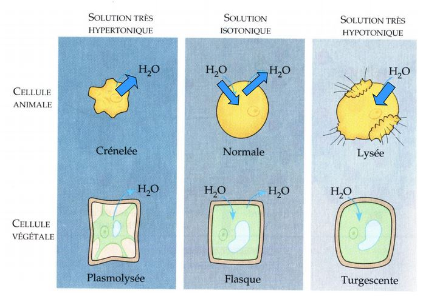

# L'Osmorégulation

Processus servant au maintien de l'équilibre hydrique et électrolytique

## Notion d'homéostasie

L'Homéostasie est un **état d'équilibre dynamique** d'un organisme qui permet le maintien de la **stabilité du milieu interne**. Les systèmes de régulation protègent le milieu interne des effets des variations du milieu externe.

## L'Osmose

Deux solutions dont les concentrations sont égales sont dites **isotoniques**. Si on compare deux solutions dont la concentration en solutés est différente. La plus concentrée est dite **Hypertonique** et la moins concentrée **Hypotonique**.

Si on imagine deux solutions séparées par une memebrane perméable au sovant (eau par exemple) mais imperméable au soluté. Si les concentrations des deux solutions sont différentes, on observe un mouvement d'eau au travers de la membrane de la solution hypotonique vers la solution hypertonique. Cette diffusion au travers de la membrane semi-perméable est appelé **osmose**, ainsi, les concentrations de soluté tendent petit à petit à s'égaliser de part et d'autre de la membrane.

Si les concentrations des milieux intracellulaire et extracellulaire sont
différentes, l’eau passe au travers de la membrane. Contrairement aux cellules
végétales, les cellules animales n’ont **pas de paroi cellulaire**, ainsi une cellule animale ne peut tolérer une entrée ou une sortie d’eau excessive.

## Mécanismes inévitables

Les cellules d’un animal ne peuvent survivre à une perte ou un gain importants d’eau, et ceci que l’animal soit terrestre, d’eau douce ou marin.

Et même dans le cas où l’animal présente une enveloppe qui empêche les pertes ou les gains d’eau, il y aura
**toujours** un niveau d’épithéliums spécialisés qui doivent absolument être exposés au milieu (pour les échanges gazeux par exemple) un épithélium perméable et donc des «*fuites*».

Le tégument des animaux n’est pas imperméable. Toute différence de concentration et de composition entre le compartiment corporel et le milieu entraîne des mouvements d’eau , d’ions et/ou desolutés à travers la paroi du corps.

Cependant, la stabilité du milieu intérieur est une condition essentielle au bon fonctionnement cellulaire.

Donc l'organisme met en oeuvre des méca,ismes pour limiter ces flux:

* soit au niveau de son tégument (mécanisme assez limité)
* soit en créant un flux inverse par diffusion ou par osmose

