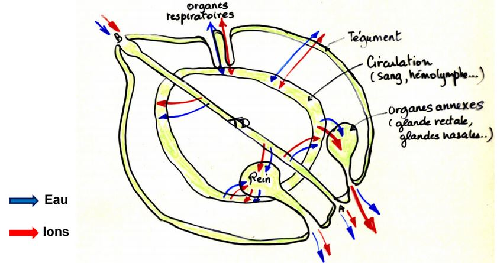

# L'eau et la vie en milieu continental

## I) Bilan hydrique des animaux aériens: pertes et apports d'eau

### Les pertes en eau

L’eau s’échappe du corps par 4 voies possibles, que l’on peut classer de la + importante quantitativement à la moins importante :

* Par évaporation au niveau du tégument
* Par les voies respiratoires
* Par l’urine
* Par les fèces

-> Au niveau du tégument, cette perte est inéluctable car aucun tégument n'est parfaitement imperméable, elle dépend de la surface (plus exactement du rapport **surface corporelle/volume**), du **degré d'hydratation** du milieu extérieur, de la **température ambiante** et des **mouvements de l'air**.

-> Perte par les voies respiratoires, du fait de leur grande surface et de
la faible épaisseur, elles facilitent les pertes d’eau. Chez les Vertébrés, les voies respiratoires sont toujours humides (cf cours de thermorégulation), l’air y est saturé en eau et les pertes sont faibles. Par contre, chez les insectes, les tubes des trachées sont recouverts de chitine, mais les ramifications les plus fines sont perméables à l’eau et donc les pertes sont importantes car les surfaces sont très développées.

-> Pertes par l’excrétion et par les fèces, malgré les phénomènes de
réabsorption, les pertes sont non négligeables (dépendent aussi des espèces
et de la forme d’élimination des déchets azotés: urates, urée ou ammoniaque)

### L'apport en eau

Les besoins en eau varient suivant le cycle biologique, l’activité de l’animal et en fonction du climat.

L’apport d’eau peut se faire par la boisson, les aliments ou au travers du tégument mais aussi par le métabolisme de l’animal (eau d’oxydation).

#### Espèces desertiques

La rat kangourou du désert est un rongeur commun des déserts d’Amérique du Nord, ne boit pas, il se nourrit exclusivement de plantes sèches et de graines. Poids moyen : 35 g ; osmolarité intérieure normale (env. 300 mOsM) ; teneur en eau totale normale (~66%)

L'eau métabolique produite est supérieur aux pertes totales donc le rat kangourou peut se contenter de l'eau contenue dans les graines sans boire.

Cette adaptation à la vie desertique repose aussi sur la capacité du rein à élaborer une urine très **hypertonique**.

## II) Structures et mécanismes de l'économie hydrique

### Les structures anatomiques

**Imperméabilisation du tégument**

Les **animaux à peau nue** sont les moins bien armés contre l’évaporation, ils vivent généralement près de l’eau ou dans des biotopes humides. Ou bien ont développé des structures protectrices (Opercules et épiphragme des gastéropodes pulmonés par ex).

**Les animaux à exosquelette** : L’ exocuticule et l’épicuticule recouverte d’une couche cireuse, sont une excellente protection contre l’évaporation. Ces animaux ont le mieux « réussi » dans la conquête du milieu aérien. Sauf dans le cas où la température extérieure est proche de la température de fusion de la cire ou bien dans le cas d’Arthropodes terrestres dépourvus de cires cuticulaires (ex : cloportes très sensibles à la déshydratation dans les habitations).

**Les animaux à tégument étanche**: Chez les Vertébrés le tégument présente un épithélium pluristratifié kératinisé, c’est une barrière imperméable de cellules mortes chargées de kératine. La kératinisation est plus ou moins poussée, de plus chez les Oiseaux et les Mammifères, il existe des annexes supplémentaires (plumes et poils) qui améliorent l’isolation de l’épiderme.
Ils utilisent cependant l’eau pour empêcher l’élévation de leur température corporelle en milieu chaud : **Perspiration** et **Transpiration**.

**Protection des organes respiratoires**: Exemple chez certains Insectes 

Les **stigmates**. Quant ils existent, les stigmates ne s’ouvrent que lorsque le taux de CO2 atteint un taux trop élevé dans les trachées.

Ex chez la Blatte : si CO2 contenu dans les trachées est > à 2%. (Taux normal dans l’air 0.03%).
 
### Les mécanismes physiologiques

* Au niveau intestinal, deshydratation des fèces

Cependant, le site essentiel de la récupération de l'eau est l'organe excréteur (rein)

* Performance rénales

### Autres mécanismes

* Liés à des comportements spécifiques
	* vie nocture
    * estivation
    * anhydrobiose

Le dromadaire à un comportement thermorégulateur particulier, son organisme «*tolère*» une augmentation de température corporelle quand il est déshydraté est supérieure à celle qu’il tolère quand il est hydraté. Il évite de perdre de l’eau en transpirant.

Qu’ils soient actifs ou passifs, les phénomènes impliqués dans l’osmorégulation mettent en jeu un nombre limité d’organes.
Le **tube digestif**, les **systèmes excréteurs**, le **tégument externe** et les **organes spécifiques** comme les branchies des crustacés, la peau des amphibien, les glandes rectales des sélaciens ou encore les glandes nasales des oiseaux et iguanes marins.

Schéma bilan des différents organes impliqués dans les phénomènes d’osmorégulation:

