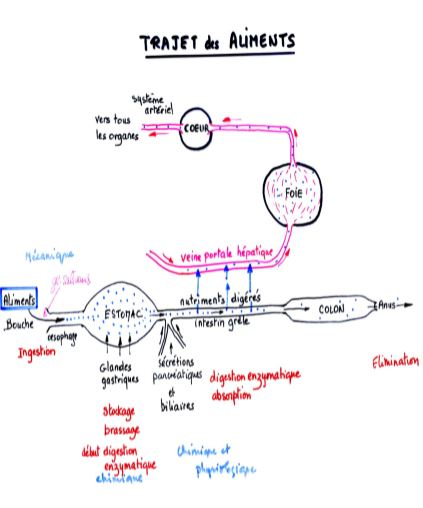
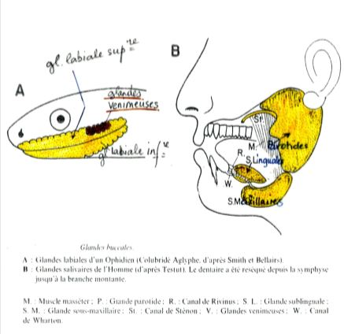

#  Structure et fonctions du tube digestif chez les Mammifères 

D'une manière générale, chez les Vertébrés la digestion est purement extracellulaire, elle met en œuvre 3 séries de phénomènes classiques 

* **Mécaniques** : transport et fragmentation des aliments 
* **Chimiques** : hydrolyse enzymatique des molécules complexes contenues dans les aliments (amidon, graisses, protéines …) en molécules simples (Oses, glycérol, acides gras et acides aminés)
* **Physiologiques** : absorption des molécules simples par la paroi digestive et transfert vers la lymphe ou le sang 

Plan anatomique : Long tube +/-  contourné divisé en 5 segments différents histologiquement et physiologiquement avec 3 tuniques fondamentales.

* La Muqueuse  
* La Musculeuse  
* La Séreuse 

## A) La digestion buccale

