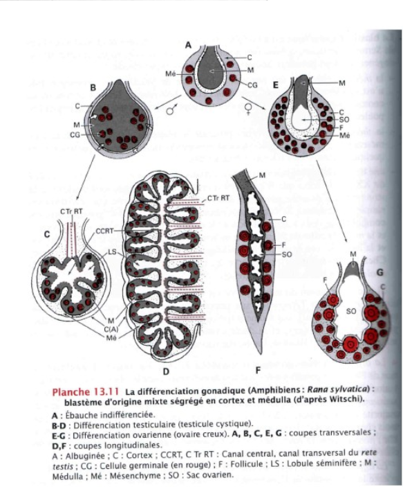
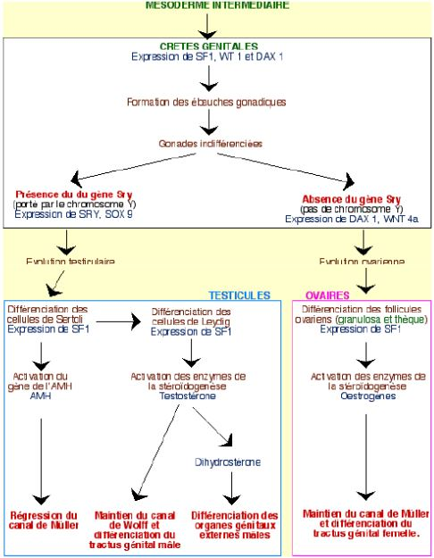
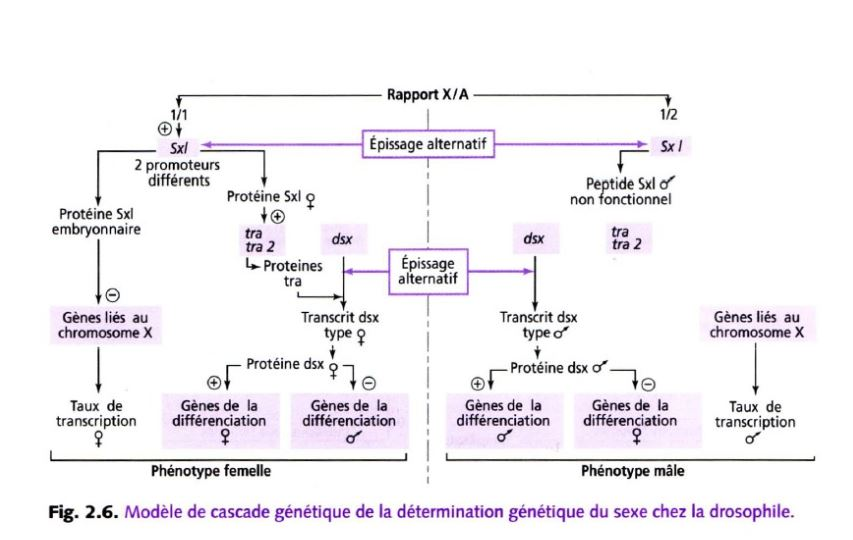
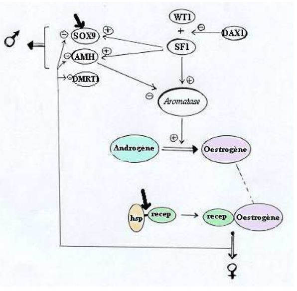

# Determination du sexe

## I) Sexualisation des gamètes

On va séparer deux types de sexe, soit des mâles soit des femelles.

*Quel mécanisme fait que certains animaux deviennent mâles ou femelle ?*

Chez certaines espèces/groupe actuelles comme par exemple les foraminifères, des organismes unicellulaire, la cellule est protégée par un test et vit dans les eaux salées. Tous les indivus produisent des **gamètes** (petite cellule flagellée avec aucune différence entre les gamètes -> pas de mâle et de femelle) les gamètes sont libérés dans l'eau et se rencontrent au hasard, il y a beaucoup de gamètes qui ne se rencontreront pas, c'est un mode de fécondation peu rentable.

Lorsque les gamètes sont identiques, il y a **isogamie**. En général, il y a une **anisogamie** avec un gros gamète (gamète femelle) et un petit gamète qui se déplace vite (gamète mâle).

On pense qu'au cours de l'évolution, les espèces avaient des gamètes semblables (**isogamie**), l'apparition de l' **anisogamie** est dû à une sélection disruptive (deux formes séparées -> gamète volumineux et petit gamète qui se déplace vite).

Les gamètes auront de plus de plus de chance à se rencontrer:

* ils vont de plus en plus vite en parcourant de longues distances 
* augmentation du volume 

Cela va permettre d'augmenter les chances de rencontre entre les deux gamètes de morphologie différentes.

Pour désigner un organisme capable de se déplacer par lui même et un **motilité**.

## II) Différenciation des gonades et des voies génitales chez les vertébrés

### Developpement des gonades

Les gamètes peuvent être produits dans des gonades.

Chez les vertébrés **les gonades** se forme à partir du **mésoderme**, au niveau de la cavité abdominale à partir de la **paroi coelomnique** (cavité dans le mésoderme) qui va former un petit bourgeon. Le bourgeon possède deux parties

* **le cortex** partie externe
* **la médula** partie interne

Les gonades sont des cellules **somatiques** (incapable de former des gamètes)

La gonade va être colonisée par des cellules migrantes qui sont les **cellules germinales**. Au départ, la gonade est indifférenciée, si elle se transforme en ovaire, les cellules germinales vont toutes se loger dans le cortex, la partie médulaire disparaît plus ou moins complètement contrairement au testicule où ils vont se loger dans la partie médulaire.

Les voies génitales vont permettre aux gamètes de sortir.

 Rappels :

* Chez grenouille mâle, les testicules sont situés à côté des reins, le conduit entre les deux est appelé urosperiducte ou **canal de Wolff**, **les canalicules** reliant à un réseau de canaux issus des **tubes séminifères** appellé **rete testi**. **Mésomephros** n'est pas le premier rein, les testicules se forment d'abord dans le **pronephros** qui se forme et disparaît et où le deuxième rein se formera dans la partir postérieur

* Chez la souris mâle, l'organisation est différente, chez les mammifères le canal évacuant l'urine et le sperm est le **speriducte** lié au developpement embryonnaire. On forme d'abord un premier rein le **promephros**, ensuite le mésonephros qui va aussi disparaître pour former le **métanephros**, le canal de Wolff ne sert qu'à évacuer le sperm.

* Chez l'appareil génital femelle de la grenouille, la gonade est un ovaire, qui est relié à un canal qui est complètement indépendant du canal de Wolff, qui est un **oviducte**. Le rein,  lui a un canal de Wolff pour expulser l'urine

* Chez la souris femelle, l'ovaire est relié à un **oviducte**, on ne retrouve pas le canal de Wolff, le **canal de Miller** est fait pour évacuer les ovules.*

**On a d'abord formation d'une gonade indifférenciée et les deux canaux Miller/Wolff. Lorsque les gonades évoluent pour faire les testicules, le canal de Miller disparaît, si les gonades forment des ovaires, chez les mammifères le canal de Wolff disparaît.**

### Contrôle de la différenciation des voies génitales

Par défaut, les canaux de Wolff régressent et les canaux de Miller subistent dans les embryons en absence de gonades. **On a donc en absence de gonades, le phénotype femelle**.

*Sur un foetus femelle, on a implanté des cristaux de testostérone, les canaux de Miller se sont dvp normalement mais les canaux de Wolff ont subsister.* 

**La testostérone permet le maintient des canaux de Wolff. Mais d'autres substances doivent exister pour faire disparaître le canal de Miller.**

**Quand on a implanter un testicule entier, chez un foetus de femelle, les canaux de Miller disparaîssent.** 

**Les testicules produisent la testostérone et l'hormone anti mullérienne.**

## III) Contrôle génétique de la determination du sexe

### A l'echelle du caryotype

Le contrôle génétique est dans un premier temps à l'**échelle du caryotype**.
Chez les vertébrés, on a remarqué que chez bcp d'espèces, il y avait souvent une paire de chromosomes qui était différente entre les deux sexes.

Les chromosomes sexuels ou **hétérochromosomes**, sont identiques chez la femelle et différents chez le mâle, il est **hétérogamétique**.
Chez d'autre groupe que les mammifères, c'est la femelle qui est hétérogamétique, par exemple chez les abeilles, il y a une différence caryotypique entre le mâle (X0) et la femelle (XX), ce qui est lié au mode de reproduction des abeilles, en effet, elles utilisent la **parténogénèse facultative**, **la reine décide si elle fait de la parténogénèse (mâle) ou fécondation (femelle)**.

*Le syndrome de Klinefelter affecte un nouveau né sur 1000 ceux-ci ont deux chromosomes XX et un chromosome Y. Cela se traduit par des modifications phénotypique comme l'apparition d'une grande taille pas tout à fait proportionnée et d'autres troubles comme les caractères sexuels secondaires. On a aussi un dvp anormal des glandes mammères (**la gynécomastie**), une grande pilosité corporelle et le dvp de caractères sexuels secondaires comme l'appararition des testicules. Le nouveau né a donc un phénotype mâle mais est stérile.*

*Le syndrome de Turner est un syndrome ou un individu et XO, on a ici une 
**dygénésie gonadique**, taille réduite, odèmes et l'individu est stérile.*

### A l'echelle du gène chez les Mammifères

**Le bras court** du chromosome sexuel possède le gène sexualisé, l'endroit qui produit les testicules.
On qualifiait le gène du chromosome Y, comme le tdf.
En 1990 on arrive à avoir le gène impliqué qui est le **gène SRY**. Ce gène ne s'exprime que dans la gonade sur un intervalle de temps très bref. Ce n'est pas le seul gène qui va provoquer les testicules et les ovaires.

En effet, le gène AMH va être exprimé seulement chez le mâle et le gène SOX9 n'est pas exprimé au même moment chez le mâle et chez la femelle. 
On a pu determiner la cascade d'expression des gènes. 

Pendant le dvp de la gonade, on a dans un premier temps l'expression de différents gènes qui vont servir à former l'ébauche de la gonade. Une fois que cette ébauche et assez avancée, si on a présence de Y dans les cellules, on a le gène SRY qui va servir à l'expression d'autres gènes. Le gène SF1 qui va permettre de contrôler le dvp d'autres structures et produire l'hormone anti mullerienne. Cela va permettre le dvp des cellules de Leydig qui va permettre le dvp de la testostérone et permettre aussi la différentiation des organes génitaux, chez le mâle. En absence du gène SRY, on va dvp des voies génitales femelle.

Chez les mammifères, la dertermination du sexe est dûe à un gène SRY présent dans toutes les cellules mais il ne s'exprimera que dans les gonades et aura des conséquences sur tout l'organisme.

### A l'echelle du gène des insectes

Chez la drosophile, on a prit des insectes présentant des caractères femelle et mâle (gynandromorphe)

Drosophile partie gauche -> femelle et partie droite -> mâle

Du côté gauche de l'animal les cellules sont XX et du côté droit sont X0.

Le rapport et le les chromosomes sexuels et non sexuels qui est important. Pour un mâle il faut deux fois plus d'aumosome que de chromosomes sexuels.

Il y a deux vagues de transcription des gènes chez la drosophiles, celui dont l'expression va dépendre du sexe c'est le gène **sexe létal**. Le gène est capable d'avoir des information de X/A, si X/A = 1 le gène SXL va être exprimé sur le chromosome X, taux de transcription typique du sexe femelle, si le rapport X/A = 0,5, pas de prod de SXL, donc transcription typique du sexe mâle.

Il y a une deuxième vague, le gène SXL va être exprimé parce qu'un autre promotteur sera en jeu, un épissage alternatif, ce sera un mâle.

Protéines transformeurs vont agir sur le taux de transcription appellé double sexe pour le X/A = 1. Sinon la protéine SXL ne servira à rien, ce qui ne pourra pas modifier le gène double sexe, donc il sera différent que celui de la femelle.Cela se passe dans toutes les cellules de la drosophile 

 
## IV) Le contrôle environnemental de la détermination du sexe

### Par des substances masculinisantes ou féminisantes

Les facteurs environnementaux qui agissent sur le sexe sont très très variables:

* substance environnementale produites par des individus de la même espèce

	* Chez les Boweilla virulis, animal dont la particularité est que la femelle est volumineuse et possède une trompe pouvant s'allonger jusqu'à un mètre de longueur. Le mâle est bcp plus petit, c'est un organisme allant de 1 à 3 mm qui vit en parasite sur la femelle; ces larves ne sont pas seules, au moment de la métamorphose, la larve va quitter son mode de vie et va migrer vers le fond. Si elle tombe sur un rocher, la larve va former une femelle, par contre si elle tombe sur un endroit ou il y a déjà une femelle, elle deviendra un mâle.

	* Chez les gastéropes étant des espèces invasives sur nos côtes, ils vivent en colonie, 6 peut être fixés les uns au dessus des autres. L'individu qui se trouve en dessous est une femelle, l'individu qui se trouve au dessus est un mâle et entre les deux ils sont à la fois mâle et femelle. Cette répartition favorise la reproduction ,ils se reproduisent rapidement. Chaque individu va féconder celui qui est en dessous. La determination du sexe est donc dû à la répartition dans la colonie. Ils ont deux types de substances:

* substance féminisante libérée par chaque individu vers le bas pour que ceux ci dvp le sexe femelle
*  substance masculinisante libérée vers le haut de la colonie, les larves au centre possèdent les deux sexes. Il ne change pas naturellement de colonie

### Par la température d'incubation

Chez beaucoup de vertébrés notamment les reptiles, c'est la température d'incubation des oeufs qui va determiner le sexe de la progéniture.

* Chez les tortues, pour les plus faibles température, l'individu sera un mâle. Arrivé à la température de transition, on obtiendra les deux sexes, puis des femelle. On peut avoir le cas de figure inverse suivant les espèces. Il n'y a cependant qu'une seule température de transition.

* Chez certains crocodiles, on peut avoir deux températures de transition.

* Chez les alligators, il faut 5 femelles pour 1 mâle, les nids sont construits dans les zones humides entre 29 et 30 °C ne produisant que des mâles. Dans les zones sèches (34-35 °C) ce ne seront que des femelles.

Une enzyme (**aromatase**) capable de transformer l'andogène en omogène. Chez les reptiles, son activité dépend de la température d'incubation.

## V) L'hermaphrodisme

Il existe beaucoup d'animaux qui sont hermaphrodites. L'hermaphrodisme est très peu simultanné. Ils se modifient au fur et à mesure du temps, les individus sont d'abord mâle et ensuite femelle, c'est de l'hermaphrodisme **protandre**, si c'est simultanée c'est de l'hermaphrodisme **protogyne**.