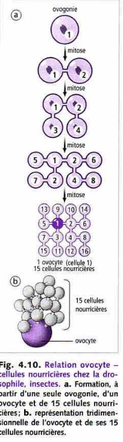
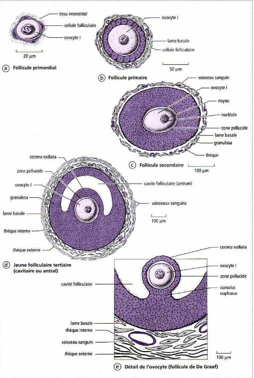
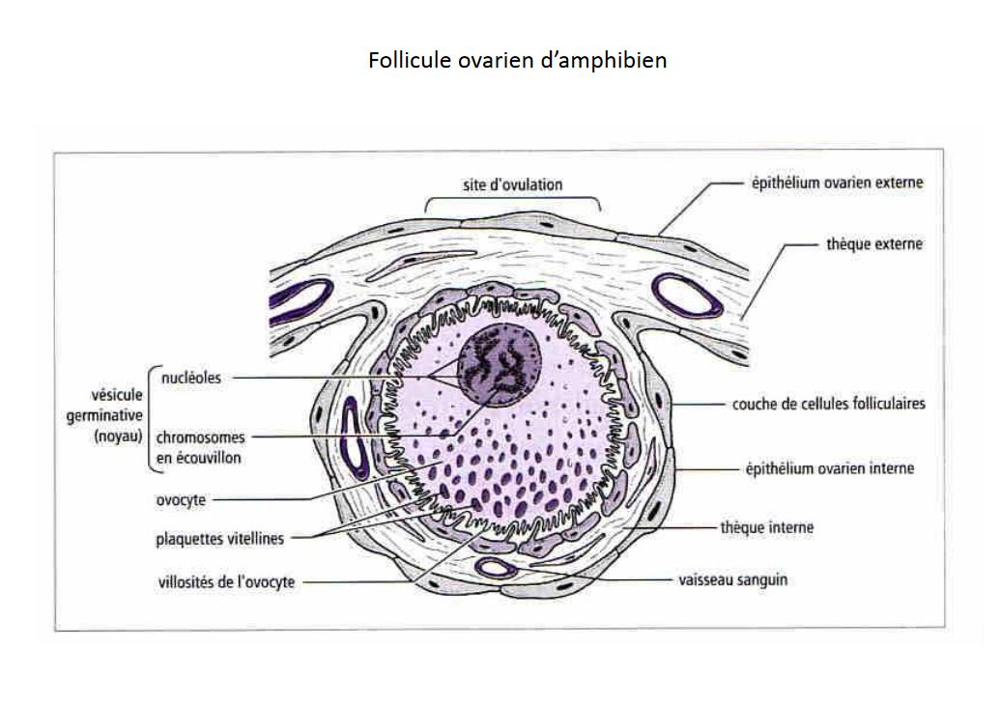

# Déroulement de la gamétogenèse

## Gamétogenèse femelle

### L'origine des réserves

L'orsque l'on fait un gamète femelle, les reserves qui sont dans les ovules sont de type energétique dans le **vitellus** possédant en majorité des lipides et des protéines. En plus, on a d'autres types des **réserves informationnelles** (ARN maternelle, protéines, mitochondrie).
Ces reserves sont dans l'ovocyte, peuvent soit synthétiser directement dans l'ovocyte (cas des reserves informationnelles). Le vitellus est en général produit par d'autres cellules soit **cellules folliculaire somatiques** vont synthétiser le vitellus.

### Le déroulement de l'ovogenèse

* Chez les vertébrés, le gamète libéré par la femelle est une cellule qui n'a pas terminé sa différenciation et est bloquée en première division de méiose, c'est un ovocyte II. Dès le stade embryonnaire les cellules germinales vont former des ovogonies qui se multiplient (jusqu'à 7 000 000 dans les ovaires). Un petit peu avant la naissance, le nombre d'ovogonies diminuent fortement et reste 2 000 000 d'ovogonies dans les ovaires. Après la naissance on arrive à quelques centaines de milliers au moment de la puberté.

* Chez les amphibiens les ovogonies se reproduisent à chaque reproduction.

Dans l'ovaire des mammifères, les ovogonies qui ont terminé leur multiplications s'enroulent de **cellules folliculaires** qui vont former une couche de cellule aplatis autour de notre **ovogonie**, et celui-ci a subit des modifications cytoplasmique est va être appelé **ovocyte**, **follicule primordiale**. Pendant l'enfance, les follicules arrivent à s'échapper de la réserve vont changer d'aspect et deviennent cubiques, et deviennent un **follicule primaire** et progressivement le nombre de follicule va augmenter et on va parler de **folicule secondaire**, un espace va se créer **zone pélucide** qui est une enveloppe qui entoure l'ovocyte. Autour des cellules folliculaires, des cellules conjonctif qui s'aplatissent et vont former l'**athèque**. Il va apparaitre une cavité dans la **granulosa** on parle de **follicule tertiaire**. 

Cette cavité remplie de liquide va accuellir des oestrogènes. En même temps que la thèque se divise en deux parties, une partie interne qui est très vascularisée, rôle sécrétoire et autour une partie riche en vittelus. 
La thèque interne secrète des substances mâle et sont convertis en oestrogène par une enzyme qui est l'aromatase. Cette cavité grandit. L'un des follicules qui commence sa différenciation va arriver au stade terminal. Le pédoncule est appelé le **cumulus oophorus**. **Corona radiata** l'ovule va éclater et est libéré de ce follicule et va se tranformer en **corps jaune** et va secrèter la progestérone.

* Chez les amphibiens l'ovocyte va synthétiser lui même son vitellus, la quantité folliculaire autour est plus faible. Au niveau du noyau il y a bcp d'éléments de synthèse. Les chromosomes prennent un aspect très varié.

Ces chromosomes dans les ovocytes amphibiens sont des chromosomes en écouvillon *baguette avec des poils raides autour*.

L'ADN est décondensé au niveau des boucles.

### Contrôle de l'ovogenèse

L'activité des gonades est modulée par les sécrétions dans l'hypophyse où il y a des cellules capables de secreter des substances comme l'hormone FSH qui intervient à partir du stade follicule tertiaire. Les stades de la croissance sont stimulés par des sécrétions locales. Dans l'ovaire des cellules vont secreté EGF qui stimule la croissance en passant de  l'étape primaire à secondaire et va stimuler les recepteurs de la FSH.

L'apparition d'un corps jaune provoque une augmentation du temps de progestérone.

> Gamétogenèse mâle

Les **protamines** vont permettre de condenser plus fortement l'ADN

**Flagelle** formée par l'un des deux **centrioles**

Les spermatozoïdes ne vont pas finir leur maturation. D'abord dans les voies génitales mâle et elle se termine dans les voies génitales femelle **capacitation des spermatozoïdes**.  

