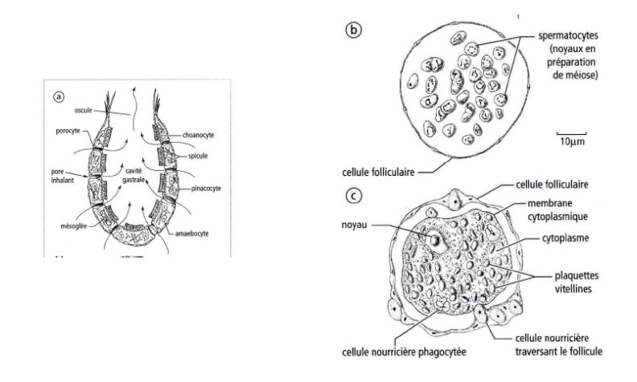

#  Les organes assurant la formation des gamètes

## I) Des régions indiff

*Annélides polychètes, animaux marins, en général, les gamètes se forment au niveau de **la paroi coelome** (cavité se trouvant dans le **mésoderme**) des gamètes vont passer dans la cavité coelomique, chez certaines espèces. l'évacuation des gamètes se fait par la cavité excrétrice, d'autres ont une cavité permettant de les libérer, parfois les gamètes explosent.*

Chez les éponges, on a une structure appellé la **mésoglé**, au moment de la reproduction, des cellules vont se spécialiser pour former des gamètes et vont s'entourer d'une petite membrane, ce qui va former des petits sacs dans la mésoglé. Chez les métazoaire, ils ont des gonades.

## II) Les gonades

### Les gonades mâles 

Deux grands types de testicules

* le **testicule cystique** (poissons et amphibiens), sac formé par des cellules aplatie, au sein de ce sac sphérique va être retrouvé des cellules germinales entrain de se diff. Dans la périphérie du testicule on a des spermatogonies qui vont s'entourer d'une couche de cellule appellé **folliculaire**, ce sont des **cellules somatiques**. Cette spermatogonie va se diviser pour former plusieurs spermatogonies mais dans un même follicule toutes les spermatogonie vont être ensemble, la differenciation va se faire de façon synchrone. Une fois qu'il arrrive à maturité, ils éclatent pour libérer les spermatozoïdes.Dans ces **cystes**, en plus des **cellules germinales**, on trouve aussi d'autre type de cellules, ce sont les **cellules de Sertoli** et entre les cystes on retrouve des **cellules de Leydig** qui produisent **la testostérone**.

* le **testicule à tube séminnifère** dans ce testicule les cellules de Leydig se retrouve entre les cystes. On va retrouver des **cellules germinales mâles** qui sont associés aux **cellules de Sertoli**, elles forment un revêtement continu et elles entourent complètement les cellules germinales. L'évolution ne se fait pas de façon anarchique, **les spermatogonies** sont capable de se multiplier et quand certaines spermatogonies entre en différenciation, elles vont petit à petit migrer vers le centre du **tube séminiphère** entouré de la **cellule de Sertoli**. Entre les cellules de Sertoli, il existe des jonctions  étanches. les substances qui circulent dans le sang et dans la lymphe arrivent avant les spermatogonies à cause de la **barrière hémato-testiculaire** pour éviter que l'organisme ne les détruise car elles sont considérés comme des cellules étrangères.

### Les gonades femelles = ovaires

Chez les insectes, on distingues 3 types d'**ovarioles** (tube ouvert d'un côté mais pas de l'autre, à l'extrémité aveugle) 

* On distingue des cellules germinales primordiales qui se divise et vont débuter **une homogénèse**, elles vont migrer petit à petit vers l'autre extrémité de l'ovariole et vont s'entourer d'une cellule somatique (folliculaire) qui va nourir la cellule germinale formant dans l'ensemble un follicule. Ce sont des ovarioles de types **panoïstique**. 

* Pour les autres en plus des cellules folliculaires on retrouve des cellules nourrissiaires (cellules germinales qui vont se sacrifier), et vont assurer la nutrition. Ce sont des ovarioles de type **méoristique paloistique**.

* Les cellules nourrisières restent à l'extrémité aveugle et sera lié à la cellule par des cordons. L'ovariole va migrer attachée au cordon vers l'extrémité ouvert. Ce sont des ovarioles de type **méoristique athrotophique**

L'ovaire se forme à partir de cortex de l'ébauche gonatique. Chez les vertébré, la médula regresse presque complètement, un ovaire de poisson ou d'amphibien ou oiseaux, on verra pleins de creux, ovaire est donc considéré comme creux.

* Chez les mammifères, la médula persiste. 

