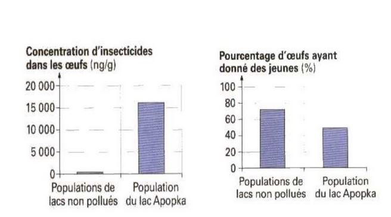

# Les perturbations environnementales de la reproduction

## I) Effets du réchauffement climatique

* Ours polaire : Sa période de chasse à lieu principalement d'avril à juillet. Malheureusement, il y a une diminution de la banquise, ils sont donc en sous alimentation les portés ont une taille diminuée (de 2-3 petits à 1 petit).

* Puceron vert du pêcher, migre mi-mai dans les années 1960 en Angleterre, alors qu'ajourd'hui, ils migrent à partir du 7 mai.

## II) Les perturbateurs endocriniens

### Découverte

* Les alligators du lac Apopka (Floride) ont un pénis relativement petit lié à la présence d'un insecticide appelé DDE

### Autre exemple

### L'origne 

* Médicaments
* Substances utilisées comme pesticide
* Incinération des déchets

Pendant longtemps, nous avons ignoré le rôle possible de ces substances

### Effets des faibles modifications des équilibres hormonaux

* Le distibène (limiter le risque de fausse couche), provoque une très forte augmentation de risque de cancer utérins chez les enfants issus. Provoque un effet sur la génération suivante 

* Le comportement des souris : Normalement le mâle est plus agressif que la femelle qui est plus maternelle. Les femelles ayant été dans l'utérus developpé à côté d'un mâle deviennent aussi agressives que ceux-ci. Il y a donc un contrôle du comportement par les hormones sexuels. Dans l'utérus, une partie des hormones produites peuvent recevoir des hormones de ceux d'à côté.

### Reconnaissance

