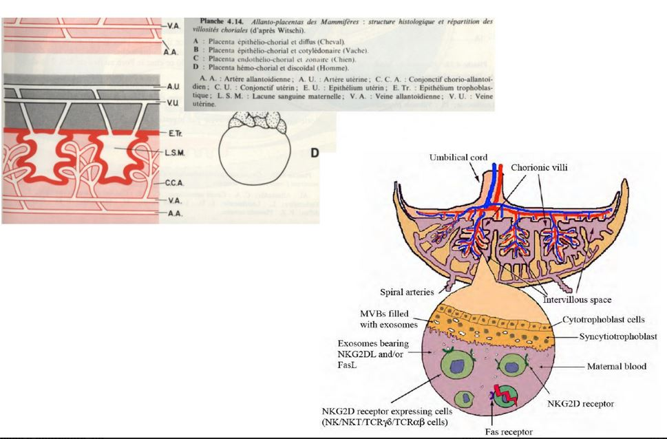
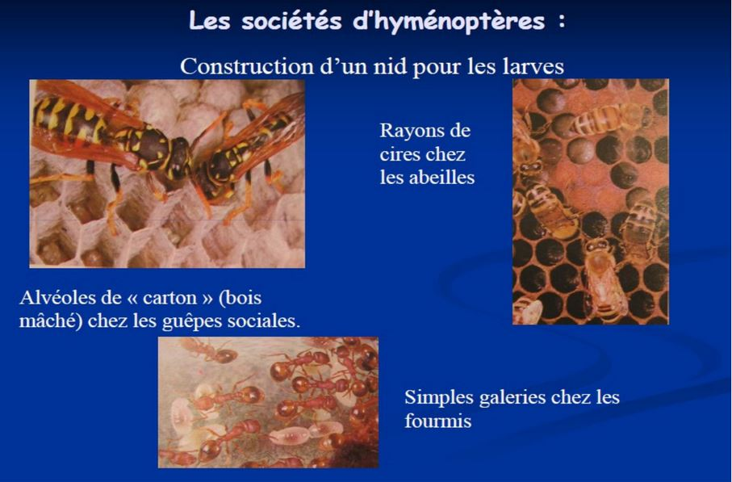

# Les soins à la progéniture

**Progéniture** = descendance

**Oeuf** = corps organique contenant une cellule oeuf ou un embryon 

**Jeune** = stade de dvp qui ne diffère de l'adulte que par sa taille et son incapacité à se reproduire

**Larve** stade de vp différent 

## I) La protection de la progéniture augmente ses chances de survie:

### Les stratégies consistent à:

1) **Déposer les oeufs dans un milieu favorable**

* Les amphibiens terrestres pondent leurs oeufs dans la mare où ils sont nés.

* Ponte entérrée dans le sol ou végétaux

* Le poisson clown dépose leurs oeufs parmi les tentacules d'une anémone de mer

2) **Entourer la progéniture d'une structure protectrice**

* oothèques, permet à l'oeuf de se fixer à la végétation
* nids
* cocons
* organes situés en dehors du corps de l'embryon, assurant sa protection 

**annexes embryonnaire** dont l'**amnios**:

* Chez les tétrapodes, l'amnios est une cavité qui va entourer l'embryon **cavité amniotique** qui va proteger l'embryon qui recreer un milieu aquatique pour l'embryon.

3) **Garder sa progéniture**

* comportement de gardénage 

4) **Incuber sa progéniture**

* région exterieur
	* crapeau accoucheur, les mâles collecte les oeufs qui vont être coller sur la face dorsale du mâle restant tout le long de leur dvp

	* chez les homards, face ventrale de la femelle

* régions plus protectrices
	
    * hippocampe, le mâle à une poche sur son abdomen
    
    * chez les crapeaux gastroteca, l'incubation des oeufs se fait dans l'oestomac, le mâle va césser de se nourrir ou ils seront chez d'autres crapeaux dans des cavités buccales
  
## II) La nutrition de la progéniture, stade embryonnaire
  
> De l'oviparité chez les Chondrichtyens
   
* **lécithotrophie**
	* Les requins possède un grand sac renmplie de vittelus qui va nourrir l'embryon 
  
* **histotrophie**
    * Chez la raie,l'oeuf est retenu dans les voies g la paroi utérinne va provoquer des tampons qui vont qui viennent au contaénitale de la femellect de l'embryon **trophonemata** qui vont sécréter du lait pour nourrir l'embryon.
 	* Chez le requin taureau, les embryons va manger les autres embryons, la femelle va produire des ovules non féconder qui vont être manger par l'embryon
    
* **hémotrophie**

	* Chez les requins, on a une nutrition de l'embryon par le placenta. Le placenta n'a pas la même origine que les mammifères, il se forme par accolement du vesticule vitérine avec la paroi vitteline et va fusionner partiellement avec celle ci. L'embryon est donc nourrit avec les substances situés dans le sang maternelle **hémotrophie**.
  

### Le placenta chez l'Homme

Lorsque l'oeuf a été fécondé (dure 5 à 6 jours), on a des divisions cellulaires et on aboutit à un embryon.

 
* Chez les primates, le synnacytiotrophoblaste, va détruire la paroi des capillaires maternelle **les capilluims**. Le sang maternelle arrive dans les lacunes où baignent des ramifications. Pas de mélange maternelle et le sang phétal, la proximité qui va faciter des échanges entre les deux sangs. Le placenta est dit **hémochorial**.

### Echange placentaire

* Passif par diffusion simmple:

	* acides gras libres, gaz respiratoires, sodium
    
* Passif par diffusion facilitée:
 
	* lactate
   
    * sucres simples
    
* Transport actif:

	* acides aminés neutres
    * vitamines hydrosolubles
    
* Endocytose:
  
	* immunoglobulines maternelles

Le placenta a un rôle nutritionnel et endocrine. L'Homme a une hormone appelée progestérone qui va permette des modifications chez la femme pour la gestation. 

Le placenta, va aussi participer à la synthèse des oestrogènes mais l'HCG (gonatropine chorionique) qui va jouer le même rôle que l'HLP (hormone lactogène placentaire). 

### Le placenta chez les autres mammifères

Une **implatation différente** est une implantation qui va attendre différents évenements, comme par exemple les saisons: 

* Chez le blaireau, la fécondation peut avoir lieu à différent moment de l'année, l'implatantion a lieu en décembre.

## 	II) La nutrition de la progéniture : stades post - embryonnaire

### La placer dans un milieu approprié

* Chez coléoptères nécrophores, ils enterrent des cadavres  et déposent leur oeuf dans le cadavre.

* C'est les hyménoptères, son organe de ponte **ovipositeur** n'est pas trasformer en éguillon vénéneux.  Ils pondent les oeufs dans une larve d'un autre insecte (souvent chenilles)  qui vont écolore dans celle-ci. La chenille est paralysée mais est toujours vivante, les larves vont donc se nourrir de la chenille de l'intérieur.

###  Collecter la nourrir pour l'apporter à la progéniture

* Chez les oiseaux , le petits se débrouillent tout seul **nidifuge**

* Chez d'autres oiseaux, le petit est dépourvu de plume à la naissance et les parents doivent leur rapporter de la nourriture **nidicole**

* Chez le bousier, il va enrouler une pelote jusqu'à son terrier, ensuite le bousier dépose son oeuf à l'intérieur de la boulette. Le petit va pouvoir manger la pelote avant sa métamorphose. 

### Utiliser les sécrétions nutrituves

* Chez les pigeons, leur jabot est capable de sécréter du *lait* et de nourrir son petit

> Le lait des mammifères

### Mécanisme de la synthèse du lait

Produit par les cellules aciineuses:

* Filtration du sang qui se trouve au niveau des globulnes , la filtration sélective de l'eau et sels, albumines et globulines du sang et de la lymphe

* Secrétion de lactose, caséine, graisses et acide critique par éclatement des cellules

Controle endocrine de la lactation:

* Pendant la gestation, la folliculine et la progestérone (corps jaune) provoquent la multiplication des celulles sécrétrices et la ramification des canaux glactophores

* Pendant la parturition, la folliculine placentaire disparait ce qui permet la synthèse de prolactine hypophysaire

* La proclatine provoque la sécrétion de lait qui s'accumule dans les sinus galactophores

* Lors de la tétée, la stimulation du trayon (mamelon chez la femme), simule par voie nerveuse l'hypophyse qui libère de l'ocytocine

* L'ocytocine provoque l'excrétion du lait

## III) Soins à la progéniture apportés par d'autres individus

### La reproduction communautaire coopérative

* Chez les manchots empereur, les jeunes sont rassemblés en *crèches* termes par des adultes pendant que les parents vont pêcher. Il n'y a pas d'échanges de nourriture.

* Chez les abeilles, il y a une protection physique mais aussi la nutrition des larves est assrué en , le pollen est utilisé  et le miel, le pollen est riche en protéine et le miel est riche en sucre. Le miel est une substance produite à partir du nectard. Lorsqu'elle rentre à la ruche,  elles va le faire passer dans le chapeau d'une autre ouvrière . Et rajouter des sécrétions salivaire et va être déposé dans des cellules spécifiques . Le venin va favoriser le conservation. Les abeilles vont le deshydrater et l'avéole sera recouvert d'une opercule pour nourrir les larves.

* Chez la guepe commune,  le nid est construit par une substance ressemblant à du carton

### Le parasitisime reproducteur

* Le moineau domestique s'empare parfois du nid de l'hirondelle 

* La buse variable va pondre parfois l'un de ses oeufs dans le nid d'autres rapaces; idem chez les Anatidés

* Chez le coucou, il pond ses oeufs dans le nid d'autres espèces dont la coloration ressemble à celle des oeufs de Corvidés, ces oeufs sont pondus dans le nid de la deuxième espèce, après l'éclosion, le néonate expulse les oeufs des corvidés.**prarasitisme obligatoire**

### Les fourmis esclavagistes

* La fourmi rousse pénètre des les fourmillières de *Serviformea fusca*, tue les femelles reproductrices et fait élever sa ponte par la formilière parasitée.

* Les fourmis sanguines dérobent des nymphes de *Serviformica glabaris*, à leur naissance, ces dernières forment une caste de nourrices