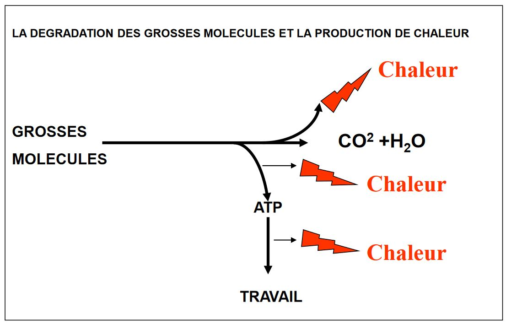
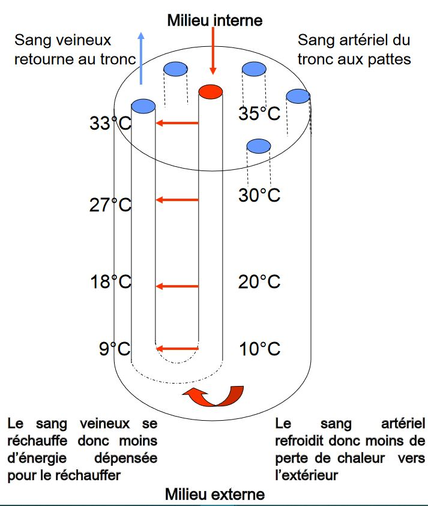

## La Thermorégulation

## Avant propos

**Homeostasie** = permet de maintenir, dans un état dynamique, un organisme où son milieu sera stable

Le milieu extérieur varie tout le temps (température, pression...). Cependant à l'intérieur de l'organisme, le milieu extracellulaire doit avoir des changements minimes grâce à des **mécanismes de rétroaction**. Pour cela, il faut qu'il y est des recepteurs qui captent les changements extérieurs qui vont être analyses et des mécanismes vont permettre de répondre efficacement à ces information **rétro-inhibition**.

**Préférendum** = habitats dans une espèce va se retrouver préférenciellement

## I) Impact biologique de la température

### A) Au niveau moléculaire

Plus la température augmente, plus la vitesse de réaction enzymatique augmente. On aura un maximal de vitesse (optimum). Mais au delà de l'optimum, la température, qui continuera à augmenter, dégradera l'enzyme.

**La température va avoir un effet considérable sur une réaction enzymatique**.

### B) Au niveau d'un organisme tout entier

Plus la température augmente, plus le consommation en taux d'oxygène de l'animal augmente.

### C) Les limites de la thermorégulation

Théoriquement il n'y a pas de vie possible en dessous de -2°C et au dessus de 55°C. Ceci est dû à: 

* le gel de l'eau continue dans les cellules

* la thermoabilité des protéines

Il y a toujours des exceptions sauf pour certains cas particuliers dû aux formes déshydratés ou autre. Mais ils peuvent être capable aussi de résister au froid en dessous de -10°C. Ce sont des organismes qui subissent les variations de températures. Ils vont prendre une diminution de température.

* présente dans leur liquide interne une substance anti-gel

* protéines de nucléation

* deshydratation progressive des cellules et du volume cellulaire

Certains organismes sont **ectotherme** luttant contre la congelation en systhétisant des substances "anti-gel". Ces substances sont des **osmolytes** (glycérol, sels..) ou des protéines qui diminuent le point de congélation, c'est le mécanisme de **surfusion**.

*Chez certains Lépidoptères, on mesure un taux de glycérol croissant à l'approche de l'hiver, ils peuvent geler complètement et supporter des températures inférieurs à -50°C. Pas de mouvement, pas de respiration, pas de battements cardiaques. La chenille peut subir ces mécanisme de congélation décongélation plusieurs fois au cours de son cycle de vie (jusqu'à 7 ans de vie larvaire)*

*Chez les poissons des eaux polaires, on retrouve des AFGP (Anti-Freeze GlycoProteins)*

Les protéines antigel interagissent avec les cristaux de glace et empêchent leur croissance.

D’autres organismes au contraire **favorisent** la congélation mais celle - ci est dirigée, maitrisée et lente .
Ils synthétisent des **protéines dites de nucléation**.

La congélation est ménagée et l’organisme synthétise également des protéines antigel et autres substances protectrices pour protéger les compartiments non congelés.

L'organisme de l'animal va pouvoir protéger certains organes vitaux en choississant les organes qui vont être congeler grâce aux protéines de nucléation mais si l'animal est blessé, il peut mourir. Le processus total peut durer 24h.

L’état de surfusion permet de conserver liquide une solution ou de l'eau même si la température est inférieure à 0°C. Mais seul, c'est un état assez instable. La congélation ménagée permet d'atteindre cet état de surfusion et de protéger les organismes du froid intense de façon moins risquée.

## II) Les animaux produisent de la chaleur et émergent cette chaleur avec leur environnement

### A) Transferts de chaleur avec l'environnement

La chaleur se propage toujours du chaud vers le froid.

* la conduction (contact entre l'élement chaud et l'élement froid)

* le rayonnement ou la radiation

* la convection (contact avec un fluide eau/vent)

* l'évaporation

La température corporelle reflète l'équilibre entre les gains et les pertes de chaleur : **la balance thermique**

### B) La production de chaleur liée au métabolisme énergétique

Les échanges doivent être tout le temps équilibrés avec une température centrale qui va représenter chaque groupe d'espèce (37°C pour l'Homme). En fonction des gains ou des pertes, notre organisme va tout le temps essayer de compenser (pertes de chaleur **thermolyse** et gains de chaleur **thermogénèse**).

La thermogénèse est une production de chaleur liée au métabolisme energétique.

Le rendement énergétique des réactions exothermique est d'environ 25%, le reste est dissipé sous forme de chaleur. 

Le métabolisme de base est le métabolisme énergétique, au repos à jeun dans un environnement ni trop chaud ni trop froid. Les différents organes produisent tout de même de la chaleur. Cela correspond à une **vitesse de métabolisme minimale**.

*Chez l'Homme, viscère 56%, cerveau 18%, peau 18%*

Elle a permit de distinguer deux grands types d'animaux

* les animaux **endothermes** : la source de chaleur pour l'organisme est principalement interne

* les animaux **ectothermes** : la source de chaleur est principalement externe

Les capacités de régulation thermique des animaux sont différentes

Les **homéothermes**, animaux dont la température corporelle est constante en toutes circonstances. La plupart des endothermes qui ont developpé un dispositif de régulation de la chaleur qui leur permet de maintenir dans les conditions normales leur température centrale dans des limites de variation qui n'excèdent pas 2°C sont homéothermes. On distingue les espèces **endohoméothermes** et les espèces **exohoméothermes**, la constance de la température centrale est due à un habitat à  température constante.

Les espèces **homéothermes** peuvent exercer leurs activités usuelles dans un rang important de variation de la température externe: en terme de **répartition**, ils peuvent conquérir de nombreuses **niches écologiques**.  

Les espèces **poïkilothermes** dont la température centrale varie avec celle de l'environnement ont une activité dépendante de la température externe. Ces espèces n'ont pas les moyens énéergétiques d'assurer la thermorégulation. Elles n'ont pas la capacité de production de chaleur nécessaire pour compenser les pertes dans des conditions extérieurs variables, la pluaprt des animaux ectothermes sont poïkilothermes.

Les **hétérothermes**, certains animaux endothermes ne sont pas strictement homéothermes, placés dans des conditions extrêmes vont adopter des stratégies comportementales qui vont leur permettre de maintenir la température. De même certains ectothermes ne sont pas strictement poïkilothermes.

Il existe également : **les hétérothermes temporels**

Certains animaux maintiennent une température corporelle seulement à certains moments de la journée ou de l'année.

**Torpeur** : état physiologique caractérisé par une baisse de l'activité physique et une diminution du métabolisme.

## III) Les adaptations thermique des endothermes

### A) Morphologiques

#### L'isolation

Un endotherme est un animal capable d'élever sa température interne lorsque la température externe diminue grâce à son **métabolisme** élevé et aussi grâce à l'**isolation** efficace de son corps qui diminue la **conductivité** de leur corps. L'air emprisonné dans les plumes ou les poils est un puissant isolant de même que la graisse sous cutanée.

* Les plumes de duvet 
	
    * emprisonne l'air (mauvais conducteur thermique)
    * elles sont légères
    * elles sont vasculariser (protège les vaisseaux au niveau de la peau)
    * peuvent éventuellement recouvrir les pattes et le bec
   
La **piloerection** chez les oiseaux est un mécanisme rapide qui permet de faire évoluer l'isolation afin d'emprisonner plus d'air sur un temps très court.

* La fourrure, efficace contre le froid avec un sous poil très dense. Les animaux peuvent se retrouver dans un milieu très froid qui va varier. Elle va donc varier selon les saisons. Chez l'ours brun, la mue d'été permet une diminution de 50% du pouvoir isolant de la fourure de l'animal 

* La graisse

La **piloerection** des mammifères est un vestige ancestrale grâce à des **muscles horipilateurs** qui vont redresser le poil.

Cas particulier chez les enxothermes aquatiques. 

*Chez les oiseaux, leur couches isolantes vont mouiller, il entretiennent leur plumage avec un substance mais ce n'est pas suffisant donc il vont sécher.*

*Chez les mammifères exclusivement marins, la graisse va prendre le poids sur les poils*

La morphologie d'une même espèce peut changer en fonction des conditions climatiques. Un animal vivant dans un climat chaud sera plus maigre et plus élancé qu'un animal vivant dans un environnement froid.

#### Le rapport Surface/Volume

Les animaux endothermes de climat froid ont en général des extrémités plus courtes. **Règle de Allen**.

Selon la règle dite de Bergmann, les petits animaux comme le renard seraient plus gros dans les régions froides. En effet, c'est le rapport Surface/Volume qui importe.

S/V doit être faible car, plus il est faible moins il n'y aura de perte d'énergie sous forme de chaleur

D'une manière générale, les aniamaux des régions polaires sont trapus et ceux des régions chaudes élancés.

Les animaux trapus des régions chaudes vivent dans l'eau ou ont des structures particulières facilitant les pertes de calories.

Plus la masse corporelle est forte, plus le rapport S/V est faible, donc moins l'animal perd de chaleur (car la chaleur perdue est directement proportionnelle à la surface)

### B) Anatomiques et Physiologiques

#### Les adaptations circulatoires

La température corporelle des endothermes est **constante** mais elle n'est **pas homogène** au sein de l'organsime il existe des tranferts de chaleur entre les différents organes grâce au flux sanguin (les plus chauds internes vers les plus froids externes): du noyau central à la périphérie.

**Zone interne stable** thermiquement (noyau central) et zone **externe** (enveloppe = peau, extrémités) variable thermiquement 

La régulation de la circulation sanguine au niveau cutané par **vasoconstriction** ou **vasodilation** constitue un échangeur thermique.

Pour le porc,  il y a une réaction de chasse au niveau de l'oreille placé à une température de 5°C. Régulièrement, le sang irrigue l'oreille et en augmente la température ce qui évite l'**anoxie** et le risque de **gelure**.

**Echangeur thermique à contre-courant** = Autre type d'échangeur thermique lié à des arrangements anatomiques de veines autour d'une artère centrale au niveau des extrémités des membres. Ils évitent des pertes de chaleur trop importants (fréquent chez les Mammifères marins et Oiseaux)

Chez certaines espèces, les échangeurs thermiques peuvent permettre le refroidissement du milieu externe

Comme le chien où les échangeurs thermiques permettent de refroidir le cerveau lorsque la température ambiante est élevée.

#### Les échangeurs thermiques de certains hétérothermes

Contrairement à la majorité de poissons (ectothermes), certains sont qualifiés d'**hétérothermes régionaux**. Ils ne bénéficient pas des rayonnements solaires pour se réchauffer et ce sont des grands nageurs.

Produisent assez de chaleur pour élever la température de leurs muscles de parfois +10°C par rapport à la température entre l'enveloppe et le centre des muscles.

Certains échangeurs thermiques mettent en jeu des muscles profonds

Ce qui est valable pour les gains de chaleur peut l'être aussi pour les pertes

#### Adaptation au niveau moléculaire

Chez les oiseaux par exemple, une partie des pattes et des doigts est dépourvue de plumes.

Les cellules des tissus en contact avec le substrat froid sont adaptées. Les acides gras des membranes sont en majorité des adcides gras insaturés (avec au moins une liaison c=c entre les deux atomes de carbone). Ces acides gras insaturés ont la particularité de rester fluides à basse température.

Ainsi, la membrane cellulaire garde ses fonctions en particulier pour les échanges gazeux de part et d'autre et la cellule reste fonctionelle.

### C) Comportementales

* Le choix de l'environnement
* La construction de microenvironnements
* Les migrations 
* Comportements spécifiques

## IV) La thermogénèse

#### Les contractions musculaires volontaires

Les valeurs de l'Homme au repos.

Facilement observé ce comportement est fatiguant donc de durée limitée

#### La thermogénèse avec frisson

Région dorso-médiane de l'hypothalamus postérieur normalement inhibé par l'aire préoptique.

Contractions de tès courtes durées qui n'entraîenent pas de mouvement et répétées de façon cyclique de muscles squelettiques agonistes et antagonistes.

#### La thermogénèse (sans frisson) liée à l'augmentation du métabolisme

Elle passe par la sécrétion d'hormones principalement l'**Adrénaline** et la **Noradrénaline** (glandes surrénales)

* effet **vasoconstricteur**
* effet **métabolique**, en effet, elles augmentent le métabolisme cellualire en augmentant la **glycogénolyse** (foie et muscles) et la **lipolyse** (graisses)

Ces hormones sont sécrétées en cas de stress ou d'exposition brutale au froid, **hormones de coup de froid**

A l'opposé, si l'exposition au froid se fait graduellement, au cours des saisons par ex, on observera une augmentation du taux d'hormones **thyroïdiennes**, qui favorisera une augmentation du métabolisme oxydatif des mitochondries d'organes cibles.

**Hormones d'accllimatement au froid**

Cas particulier de thermogénèse métabolique: celle du tissu adipeux brun

(voir schémas)

#### La thermogénèse musculaire particulière sans contraction

Certains poissons téléostéens présentent des organes thermogéniques comme l'Espadon.

Organes thermogéniques oculaires réchauffent les yeux et le cerveau (interviendrait dans la qualité de la vision et donc des capacités de prédation de l'Espadon)

## V) La thermolyse

### A) Contrôles physiologiques des pertes

#### La sudation

La densité des glandes sudoripares est importante chez l'Homme, la vache et le cheval. Elle est faibe chez les carnivores

#### La polypnée

Les échanges respiratoires nécéssitent que l'air inspiré soit humidifié, donc la respiration intervient dans la thermorégulation. La polypnée thermique se traduit par une brusque accélération du rythme respiratoire.

Chez le chien, la fréquence respiratoire peut ainsi passer de 30-40 inspirations par minutes à 300-400.

Les oiseaux, augmentent l'évaporation par la polypnée et le *Gular flutter* oscillations rapides du plancher fin du bec et de la partie supérieure du gosier.

### B) Les contrôles comportementaux
 
* Le léchage
* Les bains
* La posture (exposition des surfaces au contact avec l'extérieur)

## VI) La boucle de thermorégulation des endothermes

### A) La reception

Sensibilité thermique liée aux recepteurs centraux (renseignent sur la température interne) et aux récepteurs périphériques (renseignent sur la température externe)

* Sensibilité thermique aux récepteurs périphériques de la peau

**Terminaisons nerveuses libres**, ce sont des fibres nerveuses avec ou sans myéline qui transmettent l'influx vers les centres nerveux intégrateurs.

**Nocicepteurs** qui se transmettent la sensation douloureuse du *chaud* quand la température est > 40°C ou au *froid* quand la température est < 10°C

Les **recepteurs** peuvent renseigner des variations de température mais aussi sont capables de répondre à une température précise par des fréquences précises = **réponse tonique ou statique**.

Dans le premier cas, c'est la température de départ, l'amplitude de la variation et la rapidité de la variation qui sont importantes = réponse **phasique ou dynamique**.

Suivant la température, le message sera codé de façon différente en potentiels d'action/min (Hz) mesurables sur les fibres sensitives des recepteurs cutanés.

* Sensibilité thermique aux récepteurs internes

Au niveau des muscles, des gros vaisseaux internes mais surtout au niveau des centres nerveux

### B) L'intégration

Chez les Mammifères, **l'aire préoptique (dans l'hypothalamus)** joue un rôle majeur dans la régulation de la température alors que chez les oiseaux, la sensibilité de la **moelle épinière** jouerait un rôle prédominant.

**L'aire préotique contient un grand nombre de neurones sensibles à la chaleur**, ces neurones sont activés lorsque la température augmente (10 fois pour une augmentation de température de 10°C).

Parallèlement, des neurones sensibles au froid sont retrouvés dans l'hypothalamus, le septum et la substance réticulée du mésencéphale.

L'hypothalamus est le principal centre d'intégration de la thermorégulation: rôle de *thermostat*.

Les nombreux signaux de détection de température en provenance des recepteus périphériques aident au contrôle de la température à travers l'hypothalamus. Ces signaux sont combinés avc ceux qui ont pour origine les recepteurs périphériques pour induire des réactions de pertes ou de production de chaleur du corps.

Lorsque la température hypothalamique augmente, et devient supérieur à la **température de consigne** (température centrale critique caracteristique d'une espèce ex: 37,2°C chez l'Homme), il y a activation des neuronaux effecteurs de la thermolyse et inhibition de l'activité des systèmes neuronaux effecteurs de la thermogénèse.

### C) Les effecteurs
 

