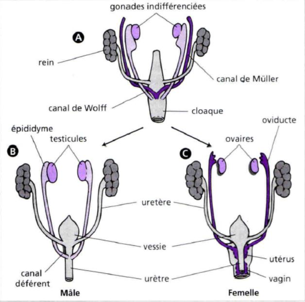
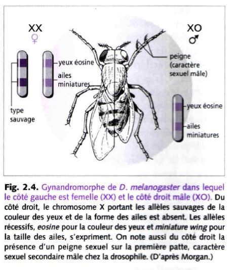
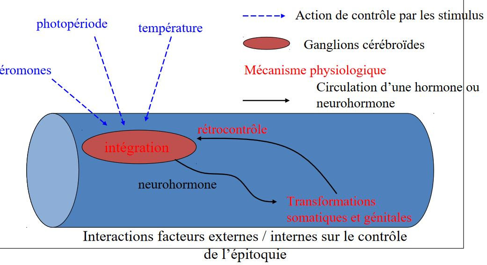
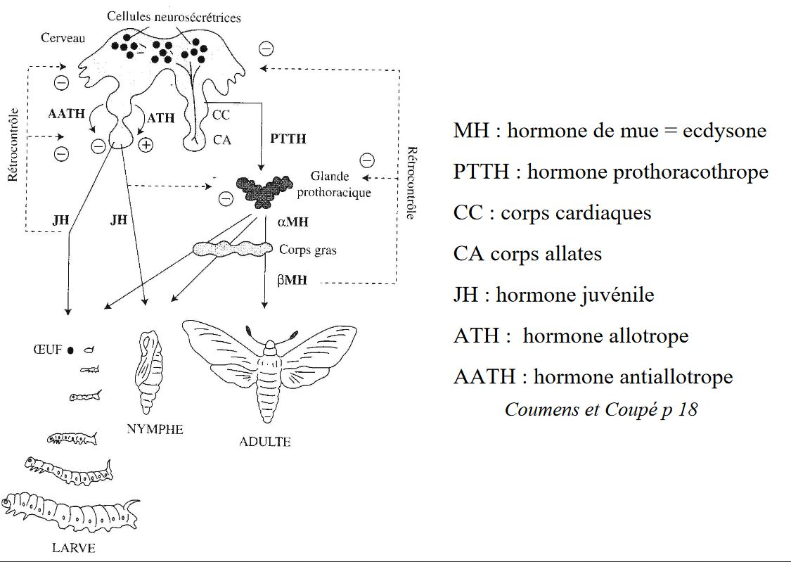
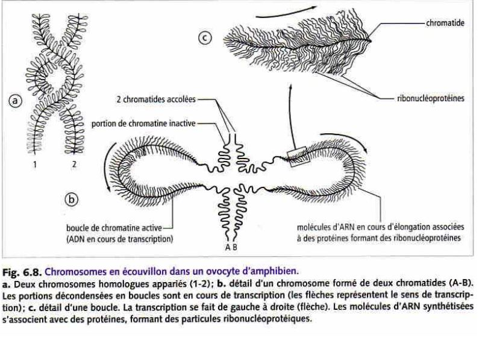
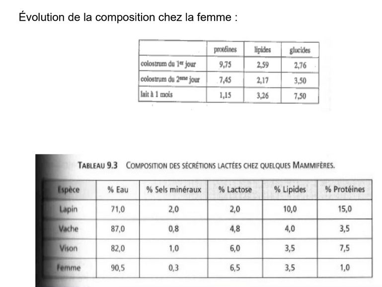

## Introduction

**Reproduction asexuée** = monoparentale (un seul parent)

**Reproduction sexuée** = biparentale, où intervient des cellules spécialisées  (gamètes) et provoquant la fécondation mais parfois il n'y aura pas de fécondation

Il y a une reproduction assexuée dans lequel intervient une gamète mais il n'y aura pas de fécondation = **la parténogénèse**

Chez la majeure partie des animaux, la formation des gamètes se fait à partir de cellules (**cellules germinales**) qui vont former les gamètes. Au départ ce ne seront pas de cellules germinales non différenciées et diploïdes. Lorsque cellules germinales commencent à se différencier des autres ce qu'on appelle des **gonies**, elles deviennent des cellules diploïdes (2n).

Les cellules sont soit des ovulogonies, soit des spermatogonies. Elle sont capable de se multiplier par mitose. Les gonies vont ensuite poursuivre leur différenciation et former un deuxième type de cellule qu'on appellera selon l'état **spermatocyte** ou **ovocyte**. Le passage se traduit par une modification de la cellule mais elle sera toujours diploïde.

Les cellules sont capable de se diviser en méïose. La première division de méiöse va les transformer en cellule **haploïde** dit **spermatocyte II** ou **ovocyte II**. Elles vont encore se diviser en meïose 2 d'où elles deviendront des **spermatides** ou **ovotides**. 

Ensuite, elles doivent encore se former afin de pouvoir former des gamètes qui sont des cellules **haploïdes**, elles vont donc former des **spermatozoïdes** par la **spermatogénèse**.

## I) Determination du sexe

### A) Sexualisation des gamètes

On va séparer deux types de sexe, soit des mâles soit des femelles.

*Quel mécanisme fait que certains animaux deviennent mâles ou femelle ?*

Chez certaines espèces/groupe actuelles comme par exemple les foraminifères, des organismes unicellulaire, la cellule est protégée par un test et vit dans les eaux salées. Tous les indivus produisent des **gamètes** (petite cellule flagellée avec aucune différence entre les gamètes -> pas de mâle et de femelle) les gamètes sont libérés dans l'eau et se rencontrent au hasard, il y a bcp de gamètes qui ne se rencontreront pas, c'est un mode de fécondation peu rentable.

Lorsque les gamètes sont identiques, il y a **isogamie**. En général, il y a une **anisogamie** avec un gros gamète (gamète femelle) et un petit gamète qui se déplace vite (gamète mâle).

On pense qu'au cours de l'évolution, les espèces avaient des gamètes semblables (**isogamie**), l'apparence de la **anisogamie** est dû à une sélection disruptive (deux formes séparées -> gamète volumineux et petit gamète qui se déplace vite).

Les gamètes auront de plus de plus de chance à se rencontrer:

* ils vont de plus en plus vite en parcourant de longues distances 

* augmentation du volume 

Cela va permettre d'augmenter les chances de rencontre entre les deux gamètes de morphologie différentes.

Pour désigner un organisme capable de se déplacer par lui même et un **motilité**.

### B) Différenciation des gonades et des voies génitales chez les vertébrés

> Dvp des gonades

Les gamètes peuvent être produits dans des gonades.

Chez les vertébrés **les gonades** se forme à partir du **mésoderme**, au niveau de la cavité abdominale à partir de la **paroi coelomnique** (cavité dans le mésoderme) qui va former un petit bourgeon. Le bourgeon possède deux parties

* **le cortex** partie externe

* **la médula** partie interne

Les gonades sont des cellules **somatiques** (incapable de former des gamètes)

La gonade va être colonisée par des cellules migrantes qui sont les **cellules germinales**. Au départ, la gonade est indifférenciée, si elle se transforme en ovaire, les cellules germinales vont toutes se loger dans le cortex, la partie médulaire disparaît plus ou moins complètement contrairement au testicule où ils vont se loger dans la partie médulaire.

Les voies génitales vont permettre aux gamètes de sortir.

> Rappels

* Chez grenouille mâle, les testicules sont situés à côté des reins, le conduit entre les deux est appelé urosperiducte ou **canal de Wolff**, **les canalicules** reliant à un réseau de canaux issus des **tubes séminifères** appellé **rete testi**. **Mésomephros** n'est pas le premier rein, les testicules se forment d'abord dans le **pronephros** qui se forme et disparaît et où le deuxième rein se formera dans la partir postérieur

* Chez la souris mâle, l'organisation est différente, chez les mammifères le canal évacuant l'urine et le sperm est le **speriducte** lié au dvp embryonnaire. On forme d'abord un premier rein le **promephros**, ensuite le mésonephros qui va aussi disparaître pour former le **métanephros**, le canal de Wolff ne sert qu'à évacuer le sperm.

* Chez l'appareil génital femelle de la grenouille, la gonade est un ovaire, qui est reliée à un canal qui est complètement indépendant du canal de Wolff, qui est un **oviducte**. Le rein,  lui a un canal de Wolff pour expulser l'urine

* Chez la souris femelle, l'ovaire est relié à un **oviducte**, on ne retrouve pas le canal de Wolff, le **canal de Miller** est fait pour évacuer les ovules.*

**On a d'abord formation d'une gonade indifférenciée et les deux canaux Miller/Wolff. Lorsque les gonades évoluent pour faire les testicules, le canal de Miller disparaît, si les gonades forment des ovaires, chez les mammifères le canal de Wolff disparaît.**

> Contrôle de la différenciation des voies génitales

Par défaut, les canaux de Wolff régressent et les canaux de Miller subistent dans les embryons en absence de gonades. **On a donc en absence de gonades, le phénotype femelle**.

*Sur un foetus femelle, on a implanté des cristaux de testostérone, les canaux de Miller se sont dvp normalement mais les canaux de Wolff ont subsister.* 

**La testostérone permet le maintient des canaux de Wolff. Mais d'autres substances doivent exister pour faire disparaître le canal de Miller.**

**Quand on a implanter un testicule entier, chez un foetus de femelle, les canaux de Miller disparaîssent.** 

**Les testicules produisent la testostérone et l'hormone anti mullérienne.**

## C) Contrôle génétique de la determination du sexe

> A l'echelle du caryotype

Le contrôle génétique est dans un premier temps à l'**échelle du caryotype**.
Chez les vertébrés, on a remarqué que chez bcp d'espèces, il y avait souvent une paire de chromosomes qui était différente entre les deux sexes.

Les chromosomes sexuels ou **hétérochromosomes**, sont identiques chez la femelle et différents chez le mâle, il est **hétérogamétique**.
Chez d'autre groupe que les mammifères, c'est la femelle qui est hétérogamétique, par exemple chez les abeilles, il y a une différence caryotypique entre le mâle (X0) et la femelle (XX), ce qui est lié au mode de reproduction des abeilles, en effet, elles utilisent la **parténogénèse facultative**, **la reine décide si elle fait de la parténogénèse (mâle) ou fécondation (femelle)**.

*Le syndrome de Klinefelter affecte un nouveau né sur 1000 ceux-ci ont deux chromosomes XX et un chromosome Y. Cela se traduit par des modifications phénotypique comme l'apparition d'une grande taille pas tout à fait proportionnée et d'autres troubles comme les caractères sexuels secondaires. On a aussi un dvp anormal des glandes mammères (**la gynécomastie**), une grande pilosité corporelle et le dvp de caractères sexuels secondaires comme l'appararition des testicules. Le nouveau né a donc un phénotype mâle mais est stérile.*

*Le syndrome de Turner est un syndrome ou un individu et XO, on a ici une 
**dygénésie gonadique**, taille réduite, odèmes et l'individu est stérile.*

> A l'echelle du gène chez les Mammifères

**Le bras court** du chromosome sexuel possède le gène sexualisé, l'endroit qui produit les testicules.
On qualifiait le gène du chromosome Y, comme le tdf.
En 1990 on arrive à avoir le gène impliqué qui est le **gène SRY**. Ce gène ne s'exprime que dans la gonade sur un intervalle de temps très bref. Ce n'est pas le seul gène qui va provoquer les testicules et les ovaires.

En effet, le gène AMH va être exprimé seulement chez le mâle et le gène SOX9 n'est pas exprimé au même moment chez le mâle et chez la femelle. 
On a pu determiner la cascade d'expression des gènes. 

Pendant le dvp de la gonade, on a dans un premier temps l'expression de différents gènes qui vont servir à former l'ébauche de la gonade. Une fois que cette ébauche et assez avancée, si on a présence de Y dans les cellules, on a le gène SRY qui va servir à l'expression d'autres gènes. Le gène SF1 qui va permettre de contrôler le dvp d'autres structures et produire l'hormone anti mullerienne. Cela va permettre le dvp des cellules de Leydig qui va permettre le dvp de la testostérone et permettre aussi la différentiation des organes génitaux, chez le mâle. En absence du gène SRY, on va dvp des voies génitales femelle.

Chez les mammifères, la dertermination du sexe est dûe à un gène SRY présent dans toutes les cellules mais il ne s'exprimera que dans les gonades et aura des conséquences sur tout l'organisme.

> A l'echelle du gène des insectes

Chez la drosophile, on a prit des insectes présentant des caractères femelle et mâle (gynandromorphe)

Drosophile partie gauche -> femelle et partie droite -> mâle

Du côté gauche de l'animal les cellules sont XX et du côté droit sont X0.

Le rapport et le les chromosomes sexuels et non sexuels qui est important. Pour un mâle il faut deux fois plus d'aumosome que de chromosomes sexuels.

Il y a deux vagues de transcription des gènes chez la drosophiles, celui dont l'expression va dépendre du sexe c'est le gène **sexe létal**. Le gène est capable d'avoir des information de X/A, si X/A = 1 le gène SXL va être exprimé sur le chromosome X, taux de transcription typique du sexe femelle, si le rapport X/A = 0,5, pas de prod de SXL, donc transcription typique du sexe mâle.

Il y a une deuxième vague, le gène SXL va être exprimé parce qu'un autre promotteur sera en jeu, un épissage alternatif, ce sera un mâle.

Protéines transformeurs vont agir sur le taux de transcription appellé double sexe pour le X/A = 1. Sinon la protéine SXL ne servira à rien, ce qui ne pourra pas modifier le gène double sexe, donc il sera différent que celui de la femelle.Cela se passe dans toutes les cellules de la drosophile 

 
## D) Le contrôle environnemental de la détermination du sexe

> Par des substances masculinisantes ou féminisantes

Les facteurs environnementaux qui agissent sur le sexe sont très très variables:

* substance environnementale produites par des individus de la même espèce

	* Chez les Boweilla virulis, animal dont la particularité est que la femelle est volumineuse et possède une trompe pouvant s'allonger jusqu'à un mètre de longueur. Le mâle est bcp plus petit, c'est un organisme allant de 1 à 3 mm qui vit en parasite sur la femelle; ces larves ne sont pas seules, au moment de la métamorphose, la larve va quitter son mode de vie et va migrer vers le fond. Si elle tombe sur un rocher, la larve va former une femelle, par contre si elle tombe sur un endroit ou il y a déjà une femelle, elle deviendra un mâle.

	* Chez les gastéropes étant des espèces invasives sur nos côtes, ils vivent en colonie, 6 peut être fixés les uns au dessus des autres. L'individu qui se trouve en dessous est une femelle, l'individu qui se trouve au dessus est un mâle et entre les deux ils sont à la fois mâle et femelle. Cette répartition favorise la reproduction ,ils se reproduisent rapidement. Chaque individu va féconder celui qui est en dessous. La determination du sexe est donc dû à la répartition dans la colonie. Ils ont deux types de substances:

* substances féminisante libéré par chaque individu vers le bas pour que ceux ci dvp le sexe femelle

*  substance masculinisante libéré vers le haut de la colonie, les larves au centre possèdent les deux sexes. Il ne change pas naturellement de colonie

> Par la température d'incubation

Chez bcp de vertébrés notamment les reptiles, c'est la température d'incubation des oeufs qui va determiner le sexe de la progéniture.

* Chez les tortues, pour les plus faibles température, l'individu sera un mâle, arriver à la température de transition, on obtiendra les deux sexes, puis des femelle. On peut avoir le cas de figure inverse suivant les espèces. Il n'y a cependant qu'une seule température de transition.

* Chez certains crocodiles, on peut avoir deux températures de transition.

* Chez les alligators, il faut 5 femelles pour 1 mâle, les nids sont construits dans les zones humides entre 29 et 30 °C ne produisant que des mâles. Dans les zones sèches (34-35 °C) ce ne seront que des femelles.

Une enzyme (**aromatase**) capable de transformer l'andogène en omogène. Chez les reptiles, son activité dépend de la température d'incubation.

### E) L'hermaphrodisme

Il existe bcp d'animaux qui sont hermaphrodites. L'hermaphrodisme est très peu simultanné. Ils se modifient au fur et à mesure du temps, les individus sont d'abord mâle et ensuite femelle, c'est de l'hermaphrodisme **protandre**, si c'est simultanée c'est de l'hermaphrodisme **protogyne**.

##  II) Les organes assurant la formation des gamètes

### A) Des régions indiff

*Annélides polychètes, animaux marins, en général, les gamètes se forment au niveau de **la paroi coelome** (cavité se trouvant dans le **mésoderme**) des gamètes vont passer dans la cavité coelomique, chez certaines espèces. l'évacuation des gamètes se fait par la cavité excrétrice, d'autres ont une cavité permettant de les libérer, parfois les gamètes explosent.*

Chez les éponges, on a une structure appellé la **mésoglé**, au moment de la reproduction, des cellules vont se spécialiser pour former des gamètes et vont s'entourer d'une petite membrane, ce qui va former des petits sacs dans la mésoglé. Chez les métazoaire, ils ont des gonades.

### B) Les gonades

> Les gonades mâles 

Deux grands types de testicules

* le **testicule cystique** (poissons et amphibiens), sac formé par des cellules aplatie, au sein de ce sac sphérique va être retrouvé des cellules germinales entrain de se diff. Dans la périphérie du testicule on a des spermatogonies qui vont s'entourer d'une couche de cellule appellé **folliculaire**, ce sont des **cellules somatiques**. Cette spermatogonie va se diviser pour former plusieurs spermatogonies mais dans un même follicule toutes les spermatogonie vont être ensemble, la differenciation va se faire de façon synchrone. Une fois qu'il arrrive à maturité, ils éclatent pour libérer les spermatozoïdes.Dans ces **cystes**, en plus des **cellules germinales**, on trouve aussi d'autre type de cellules, ce sont les **cellules de Sertoli** et entre les cystes on retrouve des **cellules de Leydig** qui produisent **la testostérone**.

* le **testicule à tube séminnifère** dans ce testicule les cellules de Leydig se retrouve entre les cystes. On va retrouver des **cellules germinales mâles** qui sont associés aux **cellules de Sertoli**, elles forment un revêtement continu et elles entourent complètement les cellules germinales. L'évolution ne se fait pas de façon anarchique, **les spermatogonies** sont capable de se multiplier et quand certaines spermatogonies entre en différenciation, elles vont petit à petit migrer vers le centre du **tube séminiphère** entouré de la **cellule de Sertoli**. Entre les cellules de Sertoli, il existe des jonctions  étanches. les substances qui circulent dans le sang et dans la lymphe arrivent avant les spermatogonies à cause de la **barrière hémato-testiculaire** pour éviter que l'organisme ne les détruise car elles sont considérés comme des cellules étrangères.

> Les gonades femelles = ovaires

Chez les insectes, on distingues 3 types d'**ovarioles** (tube ouvert d'un côté mais pas de l'autre, à l'extrémité aveugle) 

* On distingue des cellules germinales primordiales qui se divise et vont débuter **une homogénèse**, elles vont migrer petit à petit vers l'autre extrémité de l'ovariole et vont s'entourer d'une cellule somatique (folliculaire) qui va nourir la cellule germinale formant dans l'ensemble un follicule. Ce sont des ovarioles de types **panoïstique**. 

* Pour les autres en plus des cellules folliculaires on retrouve des cellules nourrissiaires (cellules germinales qui vont se sacrifier), et vont assurer la nutrition. Ce sont des ovarioles de type **méoristique paloistique**.

* Les cellules nourrisières restent à l'extrémité aveugle et sera lié à la cellule par des cordons. L'ovariole va migrer attachée au cordon vers l'extrémité ouvert. Ce sont des ovarioles de type **méoristique athrotophique**

L'ovaire se forme à partir de cortex de l'ébauche gonatique. Chez les vertébré, la médula regresse presque complètement, un ovaire de poisson ou d'amphibien ou oiseaux, on verra pleins de creux, ovaire est donc considéré comme creux.

* Chez les mammifères, la médula persiste. 

## III) Origine des cellules germinales

Les cellules germinales sont des cellules provenant d'autres territoires de l'embryon et migrent dans les gonades.

### A) Détermination précoce

> La diminution chromosomique

Cette différence entre **cellule germinale** et **cellule somatique** apparaît parfois très tôt. C'est ce qu'on va rencontrer chez les Ascaris, segmentation de la cellule oeuf, dans celle ci et dans des cellules de l'embryon on trouve un territoire coloré, **le plasma germinatif**. Celui ci ne se sépare pas de façon équitable car ce plasma se trouve que dans une des deux cellules venant de se diviser etc.

A chaque cycle de division, les cellules qui ne possedaient pas de plasma détruisaient une partie de leur chromosomes. **Les cellules germinales vont se former à partir des cellules qui vont garder la totalité des chromosomes**.
Les cellules somatiques ne vont pas hérité de tout le patrimoine génétique, seulement ce qui leur sert. Ce processus s'appelle une **diminution chromosomique**.

Souvent, lorsque c'est précoce c'est lié à la présence de substances dans le cytoplasme qui va être distribué à certaines cellules mais pas à d'autres.

* Chez les amphibiens, dans la cellule on a au pôle végétatif un plasma germinale qui va être hérité par certaines cellules seulement. Quand on arrive au stade blastula, ils ont une paroi plus granuleuse et ces cellules vont migrer entre les autres cellules, ou emprunter la circulation sanguine*

### B) La determination tardive des cellules germinales

Elle intervient chez l'adulte au moment de la reproduction. 

## IV) L'ascquisition de la capacité à se reproduire

### A) Chez les Annélides

* Chez certaines Annélides polyquètes (animaux marins benthiques), le passage à la reproduction s'accompagne par la transformation comportementale, de milieu de vie, de la physiologie ect. Cette sorte de métamorphose chez certaines espèces et l'**hépitoquie**. Lorsqu'il passe de l'état **atoque** (avant la transf) à l'état **épitoque**, l'animal vient nager près de la surface (un mode de vie **pélagique**), cela  va modifier la forme des parapodes, la forme des yeux, des fibres musculaire ect. Lorsqu' ils vont se reproduire, ils vont s'associer par deux et vont nager en cercle de plus en plus rapidement. A un moment donné, il libère leur gamète dans l'eau, la fécondation est alors externe. La **photopériode** est un facteur qui a été utilisé pour les variations d'insité lumineuse la nuit et lorsque cela se produit, c'est au moment de la nouvelle Lune.

* Chez les Néréis atoque, lorsqu'on les coupe en deux, tous les membres arrières de la section vont passer à l'état épitoque. On fait l'ablation du cerveau de l'animal, on observe qu'il devient épitoque. Quand on fait l'ablation du cerveau et qu'one le greffe vers l'arrière de l'animal, elle ne passe pas à l'étape épitoquie. **C'est donc une substance sécrétée dans l'organisme. On appelle ça la neurohormone**

**Plus on augmente la quantité d'hormone, plus le diamètre des ovocyte et grand**. Elle inhibe le dvp de la maturité sexuelle.Si on injecte des ovocytes dans le coelome on a un fort taux d'épitoquie. **Les organes reproducteurs va inhiber l'activité inhibitrice du cerveau**. **Les follicules sercètent une substence qui inhibe le cerveau**.

Les Néréis vivent plusieurs années, on a mesuré le taux de sécrétion durant la vie de celui ci.** Il y a une variation cyclique de ce taux de sécrétion. On voit aussi que l'on a une diminution de ce taux au cours du temps**. 

### B) Chez les insectes

Chez les insectes, le **dvp poste embryonnaire** peut se réaliser de trois façons:

* métamorphose assez discrete, **paurométaboles**, même mode de vie, chez la larves les paurométaboles, les ailes ne sont présentes que sous forme d'ébauche alors que chez l'aldulte, les ailes sont dvp. De plus, la larve est incapable de se reproduire

* developpement **hémi-métabole** métamorphose assez dicrete (*libellule*), les larves possèdes des ailes sou forme d'ébauche mais peut changer de mode de vie, larve aquatique et adulte aérien.

* developpement d'**holométabole**, où la métamorphose est complète par opposition au deux ex précédents, qui sont des métamorphoses incomplètes. La larve est dépourvue d'ailes, possède un mode de vie différent de celui de l'adulte et la métamorphose n'ecéssite un stade immobile appelé **la nymphe** ou **stade nymphale**, certains organes de la larves vont être remplacé par des organes qui serviront à l'adulte. Un nymphe n'est pas enveloppé par une pâte protectrice. Chez les papillons on parle de **chrystalide**, et chez les mouches une **pupe**.

Mécanisme qui va contrôler la métamorphose

Le criquet, est un insecte à métamorphose dite incomplète.

Chez les insectes, la croissance se fait discontinuellement, une suite de mue, on considère la dernière mue comme étant la métamorphose appelé **mue imaginale** passant du stade larvaire au stade adulte.

L'**hormone juvénile** a un pic avant la mue, mais avant la métamorphose,  on a pas ce pic de concentration. On sait que les mues chez les insectes sont dû à l'**hormone ecdyson**. Si en plus de celle ci, on a l'hormone juvéniele c'est une **mue larvaire** sinon c'est la **mue imaginale**.

Les **corps allates** semblent stimulé la **croissance des ovocytes**. L'implantation rétablit l'effet des corps allates, c'est une **action hormonale**.
Les corps allates produisent l'**hormone juvénile** qui après la métamorphose, elle stimule la croissance d'ovocyte.

La **pars intercerebralis** possède plusieurs cellules, lorsque l'on détruit une partie des cellules C, la sécrétion de l'hormone juvénile.

### C) Chez les mammifères et les oiseaux

**Oestrus** : état physiologique de la femelle qui accepte l'accouplement

**Chien**: monoestrus

**Souris, Cheval**: polyestrus

**Lapin** :oestrus permanent, ovulation déclenchée par accouplement

**Primates**: cycle menstruel

**expériences de Jacques Benoît sur le Canard**

1) des canetons impubères, de race Pékin ou Rouen, de 3 à 5 mois, soumis  à des éclairements quotidiens de 15h en lumière blanche présentent une très forte croissance testiculaire ( de 60 à 80 fois en poids).

2) un éclairement intermitent pendant la même durée est particulièrement actif

3) Dans les mêmes conditions, des canards recouverts d'un casque de plomb sur la tête ne présentent pas de croissance testiculaire

4) L'**épiphyse** (glande pinéale) antérieur est absolument nécessaire à la gonadostimulation photique

Cette épiphyse produit la **mélatomine** (neurosécrétion précurseur de la **sérotonine**)

Si on produit la sécrétion de mélatonine. Chez le Renne, la mélatonine est produite en mars et septembre et est sécrétée seulement la nuit.

* Chez les non mammaliens, l'épiphyse est elle même photoreceptrice

* Chez les mammifères elle est reliée à la rétine. Chez le mouton, (reproduction en jours courts), le traitement à la mélatonine permet d'avancer la période de reproduction.

La photopériode va contrôler la reproduction de certains vétébrés, comme le régime alimentaire.

Croissance pubertaire : 7 cm/ an chez la fille, 9 cm/ an chez le garçon. Grâce au cartilage de croissance à l'extrémité des os longs. Les **oestrogènes**  stimulent la croissance et la différenciation des chondrocytes (soudure des cartilages de croissance). Les **androgènes** rendent les cellules hypophysaires plus sensibles au GHRH et sont transformés en oestrogènes dasn les tissus périphériques. 
DHAS et DHA produits par la zone réticulée du cortex surrénalien entre 5 et 13 ans.
La puberté surrénalienne est appelé l'**adrénarche**
La **gonardache** précède la puberté gonadique.
Cela n'existe pas chez les autres mammifères.

La puberté est liée au dvp des gonades. La sécrétion lutinisante contrôle la sécrétion de testostérone.

* Chez le poisson, pas d'influence de la présence des gonades, chez la femme aussi.

Les variations de sécrétion des **gonadotropines** est indépendant de la présence des gonades, ce n'est pas la rétroaction négative des stéroïdes qui les contrôle.

GABA est un inibiteur et la glutamate est un activateur

La **leptine** est une hormone produite par l'organisme est dépend de la masse corporelle. Elle évite que la personne se reproduise à un âge trop avancée.
L'obésité peut retarder l'âge de la puberté. 

## IV) Déroulement de la gamétogénèse

### A) Gamétogénèse femelle

> L'origine des réserves

L'orsque l'on fait un gamète femelle, les reserves qui sont dans les ovules sont de type energétique dans le **vitellus** possédant en majorité des lipides et des protéines. En plus, on a d'autres types des **réserves informationnelles** (ARN maternelle, protéines, mitochondrie).
Ces reserves sont dans l'ovocyte, peuvent soit synthétiser directement dans l'ovocyte (cas des reserves informationnelles) mais le vitellus est en général produit par d'autres cellules soit **cellules folliculaire somatiques** vont synthétiser le vitellus.

> Le déroulement de l'ovogenèse

* Chez les vertébrés, le gamète libéré par la femelle est une cellule qui n'a pas terminé sa différenciation et est bloquée en première division de méiose, c'est un ovocyte II. Dès le stade embryonnaire les cellules germinales vont former des ovogonies qui se multiplient (jusqu'à 7 000 000 dans les ovaires). Un petit peu avant la naissance, le nombre d'ovogonies diminuent fortement et reste 2 000 000 d'ovogonies dans les ovaires. Après la naissance on arrive à quelques centaines de milliers au moment de la puberté.

* Chez les amphibiens les ovogonies se reproduisent à chaque reproduction.

Dans l'ovaire des mammifères, les ovogonies qui ont terminé leur multiplications s'enroulent de **cellules folliculaires** qui vont former une couche de cellule aplatis autour de notre **ovogonie**, et celui-ci a subit des modifications cytoplasmique est va être appelé **ovocyte**, **follicule primordiale**. Pendant l'enfance, les follicules arrivent à s'échapper de la réserve vont changer d'aspect et deviennent cubiques, et deviennent un **follicule primaire** et progressivement le nombre de follicule va augmenter et on va parler de **folicule secondaire**, un espace va se créer **zone pélucide** qui est une enveloppe qui entoure l'ovocyte. Autour des cellules folliculaires, des cellules conjonctif qui s'aplatissent et vont former l'**athèque**. Il va apparaitre une cavité dans la **granulosa** on parle de **follicule tertiaire**. 

Cette cavité remplie de liquide va accuellir des oestrogènes. En même temps que la thèque se divise en deux parties, une partie interne qui est très vascularisée, rôle sécrétoire et autour une partie riche en vittelus. 
La thèque interne secrète des substances mâle et sont convertis en oestrogène par une enzyme qui est l'aromatase. Cette cavité grandit. L'un des follicules qui commence sa différenciation va arriver au stade terminal. Le pédoncule est appelé le **cumulus oophorus**. **Corona radiata** l'ovule va éclater et est libéré de ce follicule et va se tranformer en **corps jaune** et va secrèter la progestérone.

* Chez les amphibiens l'ovocyte va synthétiser lui même son vittelus, la quantité folliculaire autour est plus faible. Au niveau du noyau il y a bcp d'éléments de synthèse. Les chromosomes prennent un aspect très varié.

Ces chromosomes dans les ovocytes amphibiens sont des chromosomes en écouvillon *baguette avec des poils raides autour*.

L'ADN est décondensé au niveau des boucles.

> Contrôle de l'ovogénèse

L'activité des gonades est modulée par les sécrétions dans l'hypophyse où il y a des cellules capables de secreter des substances comme l'hormone FSH qui intervient à partir du stade follicule tertiaire. Les stades de la croissance sont stimulés par des sécrétions locales. Dans l'ovaire des cellules vont secreté EGF qui stimule la croissance en passant de  l'étape primaire à secondaire et va stimuler les recepteurs de la FSH.

L'apparition d'un corps jaune provoque une augmentation du temps de progestérone.

> Gamétogénèse mâle

Les **protamines** vont permettre de condenser plus fortement l'ADN

**Flagelle** formée par l'un des deux **centrioles**

Les spermatozoïdes ne vont pas finir leur maturation. D'abord dans les voies génitales mâle et elle se termine dans les voies génitales femelle **capacitation des spermatozoïdes**.  

## V) La rencontre des gamètes

### A) La fécondation externe

Le premier grand type de stratégie, et la fécondation externe. Cette fécondation peut se faire :

* les géniteurs ne vont pas se rencontrer **sans appariement**

	* Ce que l'on rencontre chez les oursins, animaux extrêment marins. Au moment de la repro, on a des individus mâles et femelles qui vont éjecter leurs gamètes dans l'eau de mer. Il y a bcp de pertes dans les gamètes. Il existe des mécanismes qui vont rapprocher les différents gamètes. Les spermatozoïdes nagent tous dans la même direction les ovules. Ils sont attirés par celles -ci. Autour des ovules il y a une ou plusieurs enveloppe qui va se dissoudre dans l'eau de mer, ce sont des **fertilisines** qui sont detecter par les spermatozoïdes car ils possèdent des recepteurs aux vefertilisines, des **anti-fertilisines** et sont capable de détecter le taux de fertilisine pour trouver les ovules, c'est du **chimiotactine**.

* les géniteurs vont s'accoupler **avec appariement**

	* Chez les homards, il y a chez le mâle un orifice au niveau de la dernière pâte du thorax. Chez  les deux premières paires abdonimaux **cléopodes** vont porter les oeufs est ont donc des petites excrassance. Les homard vont s'accoupler et s'unissent en se faisant face-ventrale-face ventrale, la femelle va lacher ses ovules et le mâle va arroser les ovules avec sa semence. Il y a bcp moins de pertes. Les oeufs vont rester fixer sur la face ventrale de la femelle. Les individus sont plus vulnérables face aux prédateurs.

	* Chez les amphibiens anoures, on a un accouplement **amplexus**. Elle est axilaire quand le mâle est sur la femelle, lambaire quand le mâle est au niveau du bassin. La femelle va émettre les ovules et le mâle va les arroser. La peau de la femelle doit être humide pour que les spermatozoïdes puissent nager à la surface.

	* Chez les vers de terre sont hermaphrodites, la fécondation des ovules aura lieu après l'accouplement et les spermatozoïdes du partenaire vont être stocker dans la femelle. Le **clitellum** qui va sécréter du mucus et qui va entourer les deux patenaires. Les deux individus sont male donc chacun va liberer des spermatozoïde et vont se déplacer sur une goutière et puis vont être stockés dans des petits reservoirs **spermathèque**. Les deux individus se séparent et chacun va aller féconder ses ovules.Ils vont créer un trou et vont déposés le mucus qui va servir dans l'enveloppe des oeufs et vont déposer ses propres ovules et va utiliser les spermatozoïdes pour les féconder puis abandonne les oeufs.

	* Chez les épinoches (poissons), le mâle est rouge avec des épines sur le dos et la femelle a des couleurs ternes. Au mooment de la reproduction , les mâles va construire des nids sur le fond des cours d'eau au niveau de la végétation. Lorsque les femelles passent, il les motive pour savoir si elle pond ou pas, si ça lui convient, elle va déposer des ovules dans le nid et s'en aller. Le mâle va garder les oeufs et les protéger pendant tout leur dvp. 

## B) La fécondation interne directe

> Fécondation interne indirect fait appelle au **spermatophore** (sac qui enveloppe les spermatozoïdes)

* sans accouplement

	* Chez certains insectes, le mâle va abandonner dans l'environnement les spermatophores. Quand une femelle passe par là, elle va récupere le spermatophore et va assurer la fécondation

* avec accouplement

	* Chez les seiches, au moment de la reproduction les deux grandes tentacules du mâle va se différencier pour former **l'hectocotyle** qui va servir d'organe copulateur. Il va collecter des spermatophores libérés dans sa cavité paléale et il va mettre son héctocotyle dans la femelle et va mettre les spermatophore juste en face de l'appareil génital de la femelle. Les spermatophores sont très élaboré. Les tuniques étant perméables à l'eau, l'eau va passer entre les deux tuniques se qui va gonfler le spermatophore et le mettre ssous pression, ce qui va faire sauter le bouchon et projetter le sperm vers les voies génitale de la femelle.

   * Chez les scorpions, la fécondation est précéder d'une parade nuptiale qui peut durer plus de 24h. Le mâle va maintenir la femelle par ses grosses pinces et le mâle va emmener la femelle en  promenade (souvent la femelle le tue et le mange). Si la femelle accepte, le mâle l'emmène dans son terrier, le mâle va déposer tout en reculant un spermatophore sur le sol avec une goutte de sperm dessus et va devoir faire avancer la femelle au dessus de ce spermatophore o ù la goutte passera dans l'orifice génital de la femelle. Une fois que la fécondation est effectuée, la femelle mange le mâle.

   * Chez les amphibiens urodèle (queue à l'âge adulte ex salamdre). Il y a une parade niptiale avent la fécondation, le mâle avec déposer un spermatophore au sol qui sera repris par la femelle.

## C) Fécondation interne directe

> Pas d'organe copulateur

* Chez les collembolles, le mâle va déposé les spermatozoïdes dans la femelle avec ses pièces bucales.

* Chez les oiseaux, pour féconder la femmelle le mâle va coller son cloaque contre celui de la femelle.

> Possède des organes copulateurs

* Chez les Odonates, il existe deux sous ordres (Zygoptère et Anésoptères). Le male est plus joli, la femelle est plus terne. Le mâle maintient la tête de la femelle. La femelle va mettre son orifice génitale au contact de l'appareil reproducteur mâle. Avant l'accouplement, le mâle doit lui même se recourber pour se recharger en spermatozoïdes dans ses organes copulateurs. 

* Chez les araignées mâles, les orifices sont sur la région postérieur mais les organes copulateurs se trouvent dans les parties d'appendices **pédipalpes**. Le mâle doit charger ses organes copulateurs en sperm. Sur sa toile il va déposé son sperm, et va aspirer son sperm avec l'organe copulateur qui est constitué d'un **bulbe** (reservoir) qui se prolonge d'un petit canal le **style**.

> Reliés aux voies génitales

* Chez les Sélaciens (requins, raies..), les organes copulateurs (**ptérygopodes**) se font à partir du bord interne des nageoires pelviennes.

* Chez la vipère et les lézards, les organes copulateurs se forment à partir du coacle qui peuvent se dévaginer, ils sont doubles **hémipénis**. Chez le serpent il est recouvert d'épines.

* Chez les anatifes, l'organe copulateur est capable de s'allonger 

> Adaptations favorisant l'accouplement

* Chez les dytiques (coléoptères), le mâle doit monter sur le dos de la femelle qui est recouvert par les élytes (ailes glissantes et rigides). Chez la femelle , les ailes présentent une zone plane qui présente une striation assez porte. Le mâle possède des ventouse au niveau de ses pattes pour pouvoir se fixer  àa la femelle.

* Chez les animaux parasites,	
	* le shistosoma mansoni les sexes sont séparés, le mâle possède une goutière sur sa face ventrale **canal gynécophore** qui permet de porter la femelle et vivent accolés l'un à l'autre. La femelle va être nourrie par le mâle. 
    
    * la sacculine, le mâle sera en parasite chez la femelle réduit à un testicule et vit sur l'**extrenat** l'ovaire de la femelle
    
    * diplozon paradoxum, vit fixé sur une branchie de Cyprimidés (poissons comme la Carpe), ce sont des hermaphrodites, la fusion est plus poussée. Le vagin est fusionnée avec le canal d'éfférent de l'autre individu.
   
### D) Mecanismes favorisant le rapprochement  des partenaires

> Signaux sonores

* Chez les insectes, 
	* (cigales), les mâles vont faire des émissions sonores **stridulation** grâce à des tambours qui se trouve sur la face ventrale du thorax. Parfois le tambours sont recouverts par des opercules **cymbacalyptes**. Ils sont consitués d'une caisse de raisonnance avec au dessus des petites lamelles faites de cuticules. Leur mouvement va permettre le signal sonore

	* sauterelles et grillions (Orthoptères), on observe, ce phénomène mais les organes sont différents de chez la cigale.  La stridulation est dû au frottement entre les ailes postérieurs et les ailes inférieurs. Sur l'aile antérieur, il y a une nervure possèdant des épines **harchée** va frotter contre une nervure spécalisée **la corde**. Les vibrations émises sont amplifiées par une structure **le miroir**. La femelle possède des organes **tympaniques** qui se trouve sur le tibia		
    
    * les criquets, le mâle utilise les ailes antérieurs qui vont frotter le fémur des pattes postérieur
    
* Chez les anoures, le mâle va émettre des croassements, grâce aux **sacs vocaux**

* Chez les oiseaux, le chant n'est pas utilisé que pour leur partenaire, . Il est produit par la **syrinx** qui se trouve au niveau de l'union des deux trachées, le cartilage est capable de faire une petite lame qui va vibrer avec le passage de l'air. Ils peuvent faire de sons en même temps.

> Signaux olfactifs

* Chez les papillons de nuit (hétérocères), la femelle possède une phéromone qui attire les mâles **bombycol**, cette substance qui s'attirer des mâles jusqu'à plusieurs km (0,01 microg pour 4km). Chez le mâle possède des antennes plus larges que chez les femelles, ells ont des ramifications sur les côtés formant deux peignes **bipectinées** (très allongés chez le mâle)Chez les femelles se sont des antennes en massues **rhopalocères**
 
> Signaux visuels

* Chez les vers luisants (coléoptères), les femelles, produisent de la lumière pour être repéré par les mâles dû à la **luciférine**.

> Signaux tactiles

* Chez les araignées, les femelles chassent à l'affût sur leur toile, le mâle doit venir sur la toile de la femelle pour la féconder. Le mâle va faire vibrer la toile d'une façon différente.

** La dépense énergétique est très importante pour ces signaux. De plus, ils peuvent être repérer par des prédateurs**

* signaux sonnores : couteux à émettre, peuvent être perçues à grandes distances mais lorsque l'animal détecte un prédateur, le son disparaît intantannément

* signaux olfactifs : portée longue, coût assez faible en énergie mais lorsque l'animal va detecter un prédateur, le signal ne disparaît pas instantannément

* signaux visuels : faible persitance

### E) Les mécanismes cellulaires de la fécondation

> Structure de l'ovule

Chez la majeur partie des animaux, les ovules sortant de l'ovaire ne sont pas nues, ils vont être recouverts, d'un nombre variable de l'enveloppe;
* L'enveloppe primaire  est une structure produite par l'ovule lui - même
* Les enveloppes secondaires vont se situer en périphérie et sont produites par les cellules folliculaires
	* Chez les mammifères, on a une zone pélucide
* L'enveloppe tertaire va se créer dans les voies génitales femelle
    
> Les étapes de la fécondation

* Chez les oursins,  il y aura une réaction de l'**acrosome**, provoquer par la reconnaissance des cellules et va s'accompagner  du **processus acrosomien** pour avoir contact avec la **membrane vitteline**  (membrane primaire). Quand le spermatozoïde se fixe sur la membrane, la membrane vitteline va s'écarter de la membrane plasmique pour empêcher les autres de passer.

* Chez les mammifères, le spermatozoïde va reconnaître l'enveloppe secondaire **enveloppe pélucides**. Des enzymes vont détruire les molécules de reconnaissance pour empêcher les autres spermatooïdes de reconnaïtre l'ovule.

On va avoir une première réaction (modification potentielle de la membrane de l'ovule provoqué par les ions sodium). On va passer de -70mV à +20mV. Cela empêche la fixation d'autres spermatozoïdes.L'ovule va reprendre sa méïose et va la terminer. Il va y avoir des modifications à l'interieur de la cellule. Le noyau du spermatozoïde va entrer au contact de l'ovule et va se transfomer **pronucléus**. L'ADN du spermatozoïde va se décondenser et va former une membrane nucléaire. Les deux noyax vont s'approcher et vont fusionner, ensuite on reprend le cycle cellulaire.

## VII) Le choix du partenaire

### A) Le choix peut-être fait par la femelle

> Sur des bases comportementales

* Chez les guppys, la femelle a des couleur ternes et le mâle des couleurs vives. Les femelles s'accouplaient  avec le mâle qui a des couleurs les plus vives et les plus forts. Les mâles étant plus proche du prédateur gagne.

> Sur des bases morphologiques

* Chez les mouches avec des yeux pédonculées, il y a une **selection sexuelle** au niveau de la longueur des yeux engendrer par le choix effectué par les femelles

Il peut y avoir un developpement disproportionné des caractères **hypertélie**. 

* Chez les pans, le mâle disposent ses rectrices en arc de cercle. Le mâle a donc du mal à monter dans les arbres et donc ils sont plus vulnérable des prédateurs.

* Chez les magaceros giganteus, cerf d'une espèce éteinte, ses bois pouvant atteindre plus de deux mètres de longueur.

> Sur des bases territoriales

* Chez les hippoppotames, les territoires sont défendus par des mâles, kes femelles vont parcourir les territoires et choisir celui qui leur plaît le mieux et vont chercher le mâle dans le fleuve.

* Chez les chevaliers combattant, le territoire servira juste à la reproduction. Les mâles vont se rassembler sur des **leks** petit territoire défendus par les mâles. Le mâle le plus vigoureux va obtenir le territoire au centre. Les femelles vont visiter, majoritairement, c'est le mâle central qui va assurer les accouplements.

> Principe du handicap

* Chez le crapeau, plus le crapeau est grand, plus il émet un son grave car il en sont capable physiquement.

### B) Le choix peut-être fait par la femelle après l'accouplement

> La compétition spermatique

* Chez les agrillons, la femelle va stocker le sperm dans les **spermatèques**. Quand un ovule va passer devant les spermatèque, il va ejecter quelques spermatozoïdes. Le pénis du mal présente  deux ex- croissances pour pouvoir retirer les spermatozoïdes de la femelle.

* Chez la bruche (coléoptère), le mâle possède un pénis avec un  goupillon premettant de netoyer en profondeur, au bout d'un certain nombre d'accouplement les voies génitale de la femelle ne fonctionne plus.

> Le choix cryptique des femelles

* Avant la fécondation
	* La poule est capable d'expluser le sperm du mal après l'accouplement.

* Après la fécondation
	* Chez les humains, 20-25% des fécondations n'ont pas lieux. Les causes sont multiples, comme notamment un problème de compatibilité des deux parents. Quand les  CMH sont proches, on a deux patrimoines génétique qui sont proches aussi, il y aura plus de fausses couches. 
    
## VII) Les soins à la progéniture

**Progéniture** = descendance

**Oeuf** = corps organique contenant une cellule oeuf ou un embryon 

**Jeune** = stade de dvp qui ne diffère de l'adulte que par sa taille et son incapacité à se reproduire

**Larve** stade de vp différent 

### A) La protection de la progéniture augmente ses chances de survie:

> Les stratégies consistent à:

1) **Déposer les oeufs dans un milieu favorable**

* Les amphibiens terrestres pondent leurs oeufs dans la mare où ils sont nés.

* Ponte entérrée dans le sol ou végétaux

* Le poisson clown dépose leurs oeufs parmi les tentacules d'une anémone de mer

2) **Entourer la progéniture d'une structure protectrice**

* oothèques, permet à l'oeuf de se fixer à la végétation

* nids

* cocons

* organes situés en dehors du corps de l'embryon, assurant sa protection **annexes embryonnaire** dont l'**amnios**:
	* Chez les tétrapodes, l'amnios est une cavité qui va entourer l'embryon **cavité amniotique** qui va proteger l'embryon qui recreer un milieu aquatique pour l'embryon.

3) **Garder sa progéniture**

* comportement de gardénage 

4) **Incuber sa progéniture**

* région exterieur
	* crapeau accoucheur, les mâles collecte les oeufs qui vont être coller sur la face dorsale du mâle restant tout le long de leur dvp

	* chez les homards, face ventrale de la femelle

* régions plus protectrices
	
    * hippocampe, le mâle à une poche sur son abdomen
    
    * chez les crapeaux gastroteca, l'incubation des oeufs se fait dans l'oestomac, le mâle va césser de se nourrir ou ils seront chez d'autres crapeaux dans des cavités buccales
  
## B) La nutrition de la progéniture, stade embryonnaire
  
> De l'oviparité chez les Chondrichtyens
   
* **lécithotrophie**
	* Les requins possède un grand sac renmplie de vittelus qui va nourrir l'embryon 
  
* **histotrophie**
    * Chez la raie,l'oeuf est retenu dans les voies g la paroi utérinne va provoquer des tampons qui vont qui viennent au contaénitale de la femellect de l'embryon **trophonemata** qui vont sécréter du lait pour nourrir l'embryon.
 	* Chez le requin taureau, les embryons va manger les autres embryons, la femelle va produire des ovules non féconder qui vont être manger par l'embryon
    
* **hémotrophie**

	* Chez les requins, on a une nutrition de l'embryon par le placenta. Le placenta n'a pas la même origine que les mammifères, il se forme par accolement du vesticule vitérine avec la paroi vitteline et va fusionner partiellement avec celle ci. L'embryon est donc nourrit avec les substances situés dans le sang maternelle **hémotrophie**.
  

> Le placenta chez l'Homme

Lorsque l'oeuf a été fécondé (dure 5 à 6 jours), on a des divisions cellulaires et on aboutit à un embryon.

 
 
* Chez les primates, le synnacytiotrophoblaste, va détruire la paroi des capillaires maternelle **les capilluims**. Le sang maternelle arrive dans les lacunes où baignent des ramifications. Pas de mélange maternelle et le sang phétal, la proximité qui va faciter des échanges entre les deux sangs. Le placenta est dit **hémochorial**.

> Echange placentaire

* Passif par diffusion simmple:

	* acides gras libres, gaz respiratoires, sodium
    
* Passif par diffusion facilitée:
 
	* lactate
   
    * sucres simples
    
* Transport actif:

	* acides aminés neutres
    * vitamines hydrosolubles
    
* Endocytose:
  
	* immunoglobulines maternelles

Le placenta a un rôle nutritionnel et endocrine. L'Homme a une hormone appelée progestérone qui va permette des modifications chez la femme pour la gestation. 

Le placenta, va aussi participer à la synthèse des oestrogènes mais l'HCG (gonatropine chorionique) qui va jouer le même rôle que l'HLP (hormone lactogène placentaire). 

> Le placenta chez les autres mammifères

Une **implatation différente** est une implantation qui va attendre différents évenements, comme par exemple les saisons: 

* Chez le blaireau, la fécondation peut avoir lieu à différent moment de l'année, l'implatantion a lieu en décembre.

### C) La nutrition de la progéniture : stades post - embryonnaire

> La placer dans un milieu approprié

* Chez coléoptères nécrophores, ils enterrent des cadavres  et déposent leur oeuf dans le cadavre.

* C'est les hyménoptères, son organe de ponte **ovipositeur** n'est pas trasformer en éguillon vénéneux.  Ils pondent les oeufs dans une larve d'un autre insecte (souvent chenilles)  qui vont écolore dans celle-ci. La chenille est paralysée mais est toujours vivante, les larves vont donc se nourrir de la chenille de l'intérieur.

>  Collecter la nourrir pour l'apporter à la progéniture

* Chez les oiseaux , le petits se débrouillent tout seul **nidifuge**

* Chez d'autres oiseaux, le petit est dépourvu de plume à la naissance et les parents doivent leur rapporter de la nourriture **nidicole**

* Chez le bousier, il va enrouler une pelote jusqu'à son terrier, ensuite le bousier dépose son oeuf à l'intérieur de la boulette. Le petit va pouvoir manger la pelote avant sa métamorphose. 

> Utiliser les sécrétions nutrituves

* Chez les pigeons, leur jabot est capable de sécréter du *lait* et de nourrir son petit

> Le lait des mammifères

> Mécanisme de la synthèse du lait

Produit par les cellules aciineuses:

* Filtration du sang qui se trouve au niveau des globulnes , la filtration sélective de l'eau et sels, albumines et globulines du sang et de la lymphe

* Secrétion de lactose, caséine, graisses et acide critique par éclatement des cellules

Controle endocrine de la lactation:

* Pendant la gestation, la folliculine et la progestérone (corps jaune) provoquent la multiplication des celulles sécrétrices et la ramification des canaux glactophores

* Pendant la parturition, la folliculine placentaire disparait ce qui permet la synthèse de prolactine hypophysaire

* La proclatine provoque la sécrétion de lait qui s'accumule dans les sinus galactophores

* Lors de la tétée, la stimulation du trayon (mamelon chez la femme), simule par voie nerveuse l'hypophyse qui libère de l'ocytocine

* L'ocytocine provoque l'excrétion du lait

### D) Soin à la progéniture apportés par d'autres individus

> La reproduction communautaire coopérative

* Chez les manchots empereur, les jeunes sont rassemblés en *crèches* termes par des adultes pendant que les parents vont pêcher. Il n'y a pas d'échanges de nourriture.

* Chez les abeilles, il y a une protection physique mais aussi la nutrition des larves est assrué en , le pollen est utilisé  et le miel, le pollen est riche en protéine et le miel est riche en sucre. Le miel est une substance produite à partir du nectard. Lorsqu'elle rentre à la ruche,  elles va le faire passer dans le chapeau d'une autre ouvrière . Et rajouter des sécrétions salivaire et va être déposé dans des cellules spécifiques . Le venin va favoriser le conservation. Les abeilles vont le deshydrater et l'avéole sera recouvert d'une opercule pour nourrir les larves.

* Chez la guepe commune,  le nid est construit par une substance ressemblant à du carton

> Le parasitisime reproducteur

* Le moineau domestique s'empare parfois du nid de l'hirondelle 

* La buse variable va pondre parfois l'un de ses oeufs dans le nid d'autres rapaces; idem chez les Anatidés

* Chez le coucou, il pond ses oeufs dans le nid d'autres espèces dont la coloration ressemble à celle des oeufs de Corvidés, ces oeufs sont pondus dans le nid de la deuxième espèce, après l'éclosion, le néonate expulse les oeufs des corvidés.**prarasitisme obligatoire**

> Les fourmis esclavagistes

* La fourmi rousse pénètre des les fourmillières de *Serviformea fusca*, tue les femelles reproductrices et fait élever sa ponte par la formilière parasitée.

* Les fourmis sanguines dérobent des nymphes de *Serviformica glabaris*, à leur naissance, ces dernières forment une caste de nourrices

## VIII) Les perturbations environnementales de la reproduction

### A) Effet du réchauffement climatique

* Ours polaire : Sa période de chasse à lieu principalement d'avril à juillet. Malheureusement, il y a une diminution de la banquise, ils sont donc en sous almentation et on a une diminution de taille des portées de 2-3 petits à 1 petit.

* Puceron vert du pêcher, migre mi mai dans les années 1960 en Angleterre, alors qu'ajourd'hui, ils migrent à partir du 7 mai.

### B) Les perturbateurs endocriniens

> Découverte

* Les alligators du lac Apopka (Floride) ont une taille relativement petite de leur pénis lié à la présence d'un insecticide appelé DDE

> Autre exemple

> L'origne 

* Médicaments
* Substances utilisées comme pesticide
* Incinération des déchets

Pendant longtemps, nous avons ignoré le rôle possible de ces substances

> Effets des faibles modifications des équilibres hormonaux

* Le distibène (limiter le risque de fausse couche), provoque une très forte augmentation de risque de cancer utérins chez les enfants issus. Provoque un effet sur la génération suivante 

* Le compotement des souris : Normalement le mâle est plus agressif que la femmelle qui est plus maternelle. Les femelles ayant été dans l'utérus developpé à côté d'un mâle deviennent autant agressifs que ceux-ci. Il y a donc un contrôle du comportement par les hormones sexuels. Dans l'utérus, une partie des hormones produites peuvent recevoir des hormones de ceux d'à côté.

> Reconnaissance

