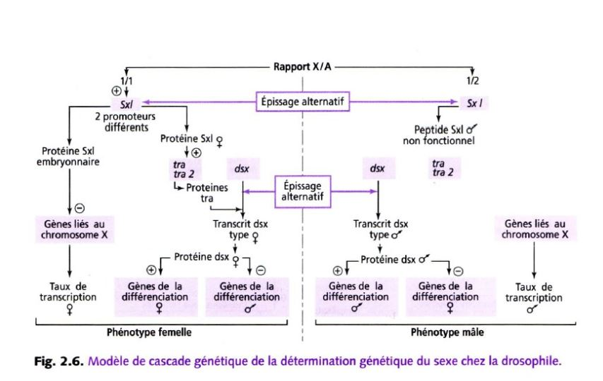
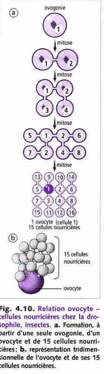

*Semestre 5*

# Zoologie fonctionnelle

## Introduction

**Reproduction asexuée** = monoparentale (un seul parent)

**Reproduction sexuée** = biparentale, où intervient des cellules spécialisées  (gamètes) et provoquant la fécondation mais parfois il n'y aura pas de fécondation

Il y a une reproduction assexuée dans lequel intervient une gamète mais il n'y aura pas de fécondation = **la parténogénèse**

Chez la majeure partie des animaux, la formation des gamètes se fait à partir de cellules (**cellules germinales**) qui vont former les gamètes. Au départ ce ne seront pas de cellules germinales non différenciées et diploïdes. Lorsque cellules germinales commencent à se différencier des autres ce qu'on appelle des **gonies**, elles deviennent des cellules diploïdes (2n).

Les cellules sont soit des ovulogonies, soit des spermatogonies. Elle sont capable de se multiplier par mitose. Les gonies vont ensuite poursuivre leur différenciation et former un deuxième type de cellule qu'on appellera selon l'état **spermatocyte** ou **ovocyte**. Le passage se traduit par une modification de la cellule mais elle sera toujours diploïde.

Les cellules sont capable de se diviser en méïose. La première division de méiöse va les transformer en cellule **haploïde** dit **spermatocyte II** ou **ovocyte II**. Elles vont encore se diviser en meïose 2 d'où elles deviendront des **spermatides** ou **ovotides**. 

Ensuite, elles doivent encore se former afin de pouvoir former des gamètes qui sont des cellules **haploïdes**, elles vont donc former des **spermatozoïdes** par la **spermatogénèse**.

## I) Determination du sexe

### A) Sexualisation des gamètes

On va séparer deux types de sexe, soit des mâles soit des femelles.

*Quel mécanisme fait que certains animaux deviennent mâles ou femelle ?*

Chez certaines espèces/groupe actuelles comme par exemple les foraminifères, des organismes unicellulaire, la cellule est protégée par un test et vit dans les eaux salées. Tous les indivus produisent des **gamètes** (petite cellule flagellée avec aucune différence entre les gamètes -> pas de mâle et de femelle) les gamètes sont libérés dans l'eau et se rencontrent au hasard, il y a bcp de gamètes qui ne se rencontreront pas, c'est un mode de fécondation peu rentable.

Lorsque les gamètes sont identiques, il y a **isogamie**. En général, il y a une **anisogamie** avec un gros gamète (gamète femelle) et un petit gamète qui se déplace vite (gamète mâle).

On pense qu'au cours de l'évolution, les espèces avaient des gamètes semblables (**isogamie**), l'apparence de la **anisogamie** est dû à une sélection disruptive (deux formes séparées -> gamète volumineux et petit gamète qui se déplace vite).

Les gamètes auront de plus de plus de chance à se rencontrer:
* ils vont de plus en plus vite en parcourant de longues distances 
* augmentation du volume 

Cela va permettre d'augmenter les chances de rencontre entre les deux gamètes de morphologie différentes.

Pour désigner un organisme capable de se déplacer par lui même et un **motilité**.

## B) Différenciation des gonades et des voies génitales chez les vertébrés

### 1) Dvp des gonades

Les gamètes peuvent être produits dans des gonades.

Chez les vertébrés **les gonades** se forme à partir du **mésoderme**, au niveau de la cavité abdominale à partir de la **paroi coelomnique** (cavité dans le mésoderme) qui va former un petit bourgeon. Le bourgeon possède deux parties
* **le cortex** partie externe
* **la médula** partie interne

Les gonades sont des cellules **somatiques** (incapable de former des gamètes)

La gonade va être colonisée par des cellules migrantes qui sont les **cellules germinales**. Au départ, la gonade est indifférenciée, si elle se transforme en ovaire, les cellules germinales vont toutes se loger dans le cortex, la partie médulaire disparaît plus ou moins complètement contrairement au testicule où ils vont se loger dans la partie médulaire.

Les voies génitales vont permettre aux gamètes de sortir.

### 2) Rappels

*ex grenouille mâle, les testicules sont situés à côté des reins, le conduit entre les deux est appelé urosperiducte ou **canal de Wolff**, **les canalicules** reliant à un réseau de canaux issus des **tubes séminifères** appellé **rete testi**. **Mésomephros** n'est pas le premier rein, les testicules se forment d'abord dans le **pronephros** qui se forme et disparaît et où le deuxième rein se formera dans la partir postérieur*

*ex chez la souris mâle, l'organisation est différente, chez les mammifères le canal évacuant l'urine et le sperm est le **speriducte** lié au dvp embryonnaire. On forme d'abord un premier rein le **promephros**, ensuite le mésonephros qui va aussi disparaître pour former le **métanephros**, le canal de Wolff ne sert qu'à évacuer le sperm.*

*ex appareil génital femelle de la grenouille, la gonade est un ovaire, qui est reliée à un canal qui est complètement indépendant du canal de Wolff, qui est un **oviducte**. Le rein,  lui a un canal de Wolff pour expulser l'urine*

*ex chez la souris femelle, l'ovaire est relié à un **oviducte**, on ne retrouve pas le canal de Wolff, le **canal de Miller** est fait pour évacuer les ovules.*

> On a d'abord formation d'une gonade indifférenciée et les deux canaux Miller/Wolff. Lorsque les gonades évoluent pour faire les testicules, le canal de Miller disparaît, si les gonades forment des ovaires, chez les mammifères le canal de Wolff disparaît.

### 3) Contrôle de la différenciation des voies génitales

Par défaut, les canaux de Wolff régressent et les canaux de Miller subistent dans les embryons en absence de gonades. **On a donc en absence de gonades, le phénotype femelle**.

*Sur un foetus femelle, on a implanté des cristaux de testostérone, les canaux de Miller se sont dvp normalement mais les canaux de Wolff ont subsister.* 

>La testostérone permet le maintient des canaux de Wolff. Mais d'autres substances doivent exister pour faire disparaître le canal de Miller.

*Quand on a implanter un testicule entier, chez un foetus de femelle, les canaux de Miller disparaîssent.* 

>Les testicules produisent la testostérone et l'hormone anti mullérienne.

## C) Contrôle génétique de la determination du sexe

### 1) A l'echelle du caryotype

Le contrôle génétique est dans un premier temps à l'**échelle du caryotype**.
Chez les vertébrés, on a remarqué que chez bcp d'espèces, il y avait souvent une paire de chromosomes qui était différente entre les deux sexes.

Les chromosomes sexuels ou **hétérochromosomes**, sont identiques chez la femelle et différents chez le mâle, il est **hétérogamétique**.
Chez d'autre groupe que les mammifères, c'est la femelle qui est hétérogamétique, par exemple chez les abeilles, il y a une différence caryotypique entre le mâle (X0) et la femelle (XX), ce qui est lié au mode de reproduction des abeilles, en effet, elles utilisent la **parténogénèse facultative**, **la reine décide si elle fait de la parténogénèse (mâle) ou fécondation (femelle)**.

*Le syndrome de Klinefelter affecte un nouveau né sur 1000 ceux-ci ont deux chromosomes XX et un chromosome Y. Cela se traduit par des modifications phénotypique comme l'apparition d'une grande taille pas tout à fait proportionnée et d'autres troubles comme les caractères sexuels secondaires. On a aussi un dvp anormal des glandes mammères (**la gynécomastie**), une grande pilosité corporelle et le dvp de caractères sexuels secondaires comme l'appararition des testicules. Le nouveau né a donc un phénotype mâle mais est stérile.*

*Le syndrome de Turner est un syndrome ou un individu et XO, on a ici une **dygénésie gonadique**, taille réduite, odèmes et l'individu est stérile.*

### 2) A l'echelle du gène chez les Mammifères

**Le bras court** du chromosome sexuel possède le gène sexualisé, l'endroit qui produit les testicules.
On qualifiait le gène du chromosome Y, comme le tdf.
En 1990 on arrive à avoir le gène impliqué qui est le **gène SRY**. Ce gène ne s'exprime que dans la gonade sur un intervalle de temps très bref. Ce n'est pas le seul gène qui va provoquer les testicules et les ovaires.

En effet, le gène AMH va être exprimé seulement chez le mâle et le gène SOX9 n'est pas exprimé au même moment chez le mâle et chez la femelle. 
On a pu determiner la cascade d'expression des gènes. 

Pendant le dvp de la gonade, on a dans un premier temps l'expression de différents gènes qui vont servir à former l'ébauche de la gonade. Une fois que cette ébauche et assez avancée, si on a présence de Y dans les cellules, on a le gène SRY qui va servir à l'expression d'autres gènes. Le gène SF1 qui va permettre de contrôler le dvp d'autres structures et produire l'hormone anti mullerienne Cela va permettre le dvp des cellules de Leydig qui va permettre le dvp de la testostérone et permettre aussi la différentiation des organes génitaux, chez le mâle. En absence du gène SRY, on va dvp des voies génitales femelle.

Chez les mammifères, la dertermination du sexe est dûe à un gène SRY présent dans toutes les cellules mais il ne s'exprimera que dans les gonades et aura des conséquences sur tout l'organisme.

### 3) A l'echelle du gène des insectes

Chez la drosophile, on a prit des insectes présentant des caractères femelle et mâle (gydengromorphe)

Drosophile partie gauche -> femelle et partie droite -> mâle

Du côté gauche de l'animal les cellules sont XX et du côté droit sont X0.

Le rapport et le les chromosomes sexuels et non sexuels qui est important. Pour un mâle il faut deux fois plus d'aumosome que de chromosomes sexuels.

Il y a deux vagues de transcription des gènes chez la drosophiles, celui dont l'expression va dépendre du sexe c'est le gène **sexe létal**. Le gène est capable d'avoir des information de X/A, si X/A = 1 le gène SXL va être exprimé sur le chromosome X, taux de transcription typique du sexe femelle, si le rapport X/A = 0,5, pas de prod de SXL, donc transcription typique du sexe mâle.

Il y a une deuxième vague, le gène SXL va être exprimé parce qu'un autre promotteur sera en jeu, un épissage alternatif, ce sera un mâle.

Protéines transformeurs vont agir sur le taux de transcription appellé double sexe pour le X/A = 1. Sinon la protéine SXL ne servira à rien, ce qui ne pourra pas modifier le gène double sexe, donc il sera différent que celui de la femelle.

ça se passe dans toutes les cellules de la drosophile 

 
## D) Le contrôle environnemental de la détermination du sexe

### 1) Par des substances mascllinisantes ou féminisantes

Les facteurs environnementaux qui agissent sur le sexe sont très très variables:

* substance environnementale produites par des individus de la même espèce
*ex Boweilla virulis, animal dont la particularité est que la femelle est volumineuse et possède une trompe pouvant s'allonger jusqu'à un mètre de longueur. Le mâle est bcp plus petit, c'est un organisme allant de 1 à 3 mm qui vit en parasite sur la femelle; ces larves ne sont pas seules, au moment de la métamorphose, la larve va quitter son mode de vie et va migrer vers le fond. Si elle tombe sur un rocher, la larve va former une femelle, par contre si elle tombe sur un endroit ou il y a déjà une femelle, elle deviendra un mâle.*

*ex gastéropes étant des espèces invasives sur nos côtes, ils vivent en colonie, 6 peut être fixés les uns au dessus des autres. L'individu qui se trouve en dessous est une femelle, l'individu qui se trouve au dessus est un mâle et entre les deux ils sont à la fois mâle et femelle. Cette répartition favorise la reproduction ,ils se reproduisent rapidement. Chaque individu va féconder celui qui est en dessous. La determination du sexe est donc dû à la répartition dans la colonie. Ils ont deux types de substances:*

* substances féminisante libéré par chaque individu vers le bas pour que ceux ci dvp le sexe femelle
*  substance masculinisante libéré vers le haut de la colonie, les larves au centre possèdent les deux sexes. Il ne change pas naturellement de colonie

### 2) Par la température d'incubation

Chez bcp de vertébrés notamment les reptiles, c'est la température d'incubation des oeufs qui va determiner le sexe de la progéniture.

*ex tortues, pour les plus faibles température, l'individu sera un mâle, arriver à la température de transition, on obtiendra les deux sexes, puis des femelle. On peut avoir le cas de figure inverse suivant les espèces. Il n'y a cependant qu'une seule température de transition.*

Chez certaines crocodiles, on peut avoir deux températures de transition.

*ex les alligator, il faut 5 femelles pour 1 mâle, les nids sont construits dans les zones humides entre 29 et 30 °C ne produisent que des mâles. Dans les zones sèches (34-35 °C) ce ne seront que des femelles.*

Une enzyme (aromatase) capable de transformer l'andogène en omogène. Ches les reptiles, son activité dépend de la température d'incubation.

### E) L'hermaphrodisme

Il existe bcp d'animaux qui sont hermaphrodites. L'hermaphrodisme est très peu simultanné. Ils se modifient au fur et à mesure du temps, les individus sont d'abord mâle et ensuite femelle, c'est de l'hermaphrodisme **protandre**, Si c'est simultané c'est de l'hermaphrodisme **protogyne**.

##  II) Les organes assurant la formation des gamètes

### A) Des régions indiff

*Annélides polychètes, animaux marins, en général, les gamètes se forment au niveau de **la paroi coelome** (cavité se trouvant dans le **mésoderme**) des gamètes vont passer dans la cavité coelomique, chez certaines espèces, l'évacuation des gamète se fait par la cavité excrétrice, d'autres ont une cavité permettent de les libérer, parfois les gamètes explosent.*

Chez les éponges, on a une structure appellé la **mésoglé**, au moment de la reproduction, des cellules vont se spécialiser pour former des gamètes et vont s'entourer d'une petite membrane, ce qui va former des petits sacs dans la mésoglé. Chez les métazoaire, ils ont des gonades.

### C) Les gonades

#### 1) Les gonades mâles 

Deux grands types de testicules
* le **testicule cystique** (poissons et amphibiens), sac formé par des cellules aplatie, au sein de ce sac sphérique va être retrouvé des cellules germinales entrain de se diff. Dans la périphérie du testicule on a des spermatogonies qui vont s'entourer d'une couche de cellule appellé **folliculaire**, ce sont des **cellules somatiques**. Cette spermatogonie va se diviser pour former plusieurs spermatogonies mais dans un même follicule toutes les spermatogonie vont être ensemble, la differenciation va se faire de façon synchrone. Une fois qu'il arrrive à maturité, ils éclatent pour libérer les spermatozoïdes.

Dans ces **cystes**, en plus des **cellules germinales**, on trouve aussi d'autre type de cellules, ce sont les **cellules de Sertoli** et entre les cystes on retrouve des **cellules de Leydig** qui produisent **la testostérone**.

* le **testicule à tube séminnifère** dans ce testicule les cellules de Leydig se retrouve entre les cystes. On va retrouver des **cellules germinales mâles** qui sont associés aux **cellules de Sertoli**, elles forment un revêtement continu et elles entourent complètement les cellules germinales.
L'évolution ne se fait pas de façon anarchique, **les spermatogonies** sont capable de se multiplier et quand certaines spermatogonies entre en différenciation, elles vont petit à petit migrer vers le centre du **tube séminiphère** entouré de la **cellule de Sertoli**. Entre les cellules de Sertoli, il existe des jonctions  étanches. les substances qui circulent dans le sang et dans la lymphe arrivent avant les spermatogonies à cause de la **barrière hémato-testiculaire** pour éviter que l'organisme ne les détruise car elles sont considérés comme des cellules étrangères.

#### 2) Les gonades femelles = ovaires

Ches les insectes, on distingues 3 types d'**ovarioles** (tube ouvert d'un côté mais pas de l'autre, à l'extrémité aveugle) 

* On distingue des cellules germinales primordiales qui se divise et vont débuter **une homogénèse**, elles vont migrer petit à petit vers l'autre extrémité de l'ovariole et vont s'entourer d'une cellule somatique (folliculaire) qui va nourir la cellule germinale formant dans l'ensemble un follicule. Ce sont des ovarioles de types **panoïstique**. 

* Pour les autres en plus des cellules folliculaires on retrouve des cellules nourrissiaires (cellules germinales qui vont se sacrifier), et vont assurer la nutrition. Ce sont des ovarioles de type **méoristique paloistique**.

* Les cellules nourrisières restent à l'extrémité aveugle et sera lié à la cellule par des cordons. L'ovariole va migrer attachée au cordon vers l'extrémité ouvert. Ce sont des ovarioles de type **méoristique athrotophique**

L'ovaire se forme à partir de cortex de l'ébauche gonatique. Chez les vertébré, la médula regresse presque complètement, un ovaire de poisson ou d'amphibien ou oiseaux, on verra pleins de creux, ovaire est donc considéré comme creux.
Chez les mammifères, la médula persiste. 

## III) Origine des cellules germinales

Les cellules germinales sont des cellules provenant d'autres territoires de l'embryon et migrent dans les gonades.

### A) Détermination précoce

#### 1) La diminution chromosomique

Cette diff entre **cellule germinale** et **cellule somatique** apparaît parfois très tôt. C'est ce qu'on va rencontrer chez les Ascaris, segmentation de la cellule oeuf, dans celle ci et dans des cellules de l'embryon on trouve un territoire coloré, **le plasma germinatif**. Celui ci ne se sépare pas de façon équitable car ce plasma se trouve que dans une des deux cellules venant de se diviser etc.
A chaque cycle de division, les cellules qui ne possedaient pas de plasma détruisait une partie de leur chromosomes. **Les cellules germinales vont se former à partir des cellules qui vont garder la totalité des chromosomes**.
Les cellules somatiques ne vont pas hérité de tout le patrimoine génétique, seulement ce qui leur sert. Ce processus s'appelle une **diminution chromosomique**.

Souvent, lorsque c'est précoce c'est lié à la présence de substances dans le cytoplasme qui va être distribué à certaines cellules mais pas à d'autres.

*ex chez les amphibiens, dans la cellule on a au pôle végétatif un plasma germinale qui va être hérité par certaines cellules seulement. Quand on arrive au stade blastula, ils ont une paroi plus granuleuse et ces cellules vont migrer entre les autres cellules, ou emprunter la circulation sanguine*

### B) La determination tardive des cellules germinales

Elle intervient chez l'adulte au moment de la reproduction. 

## IV) L'ascquisition de la capacité à se reproduire

### A) Chez les Annélides

Chez certaines Annélides polyquètes (animaux marins benthiques), le passage à la reproduction s'accompagne par la transformation comportementale, de milieu de vie, de la physiologie ect. Cette sorte de métamorphose chez certaines espèces et l'**hépitoquie**. Lorsqu'il passe de l'état **atoque** (avant la transf) à l'état **épitoque**, l'animal vient nager près de la surface (un mode de vie **pélagique**), cela  va modifier la forme des parapodes, la forme des yeux, des fibres musculaire ect. 

Lorsqu' ils vont se reproduire, ils vont s'associer par deux et vont nager en cercle de plus en plus rapidement. A un moment donné, il libère leur gamète dans l'eau, la fécondation est alors externe.

La **photopériode** est un facteur qui a été utilisé pour les variations d'insité lumineuse la nuit: 

Lorsque cela se produit, c'est au moment de la nouvelle Lune.

Chez les Néréis atoque, lorsqu'on les coupe en deux, tous les membres arrières de la section vont passer à l'état épitoque. On fait l'ablation du cerveau de l'animal, on observe qu'il devient épitoque. Quand on fait l'ablation du cerveau et qu'one le greffe vers l'arrière de l'animal, elle ne passe pas à l'étape épitoquie. **C'est donc une substance sécrétée dans l'organisme. On appelle ça la neurohormone**

**Plus on augmente la quantité d'hormone, plus le diamètre des ovocyte et grand**. Elle inhibe le dvp de la maturité sexuelle.Si on injecte des ovocytes dans le coelome on a un fort taux d'épitoquie. **Les organes reproducteurs va inhiber l'activité inhibitrice du cerveau**. **Les follicules sercètent une substence qui inhibe le cerveau**.

Les Néréis vivent plusieurs années, on a mesuré le taux de sécrétion durant la vie de celui ci.** Il y a une variation cyclique de ce taux de sécrétion. On voit aussi que l'on a une diminution de ce taux au cours du temps**. 

### B) Chez les insectes

Chez les insectes, le **dvp poste embryonnaire** peut se réaliser de trois façons:

* métamorphose assez discrete, **paurométaboles**, même mode de vie, chez la larves les paurométaboles, les ailes ne sont présentes que sous forme d'ébauche alors que chez l'aldulte, les ailes sont dvp. De plus, la larve est incapable de se reproduire

* dvp **hémi-métabole** métamophose assez dicrete (*libellule*), les larves possèdes des ailes sou forme d'ébauche mais peut changer de mode de vie, larve aquatique et adulte aérien.

* dvp d'**holométabole**, où la métamorphose est complète par opposition au deux ex précédents, qui sont des métamorphoses incomplètes. La larve est dépourvue d'ailes, possède un mode de vie différent de celui de l'adulte et la métamorphose n'ecéssite un stade immobile appelé **la nymphe** ou **stade nymphale**, certains organes de la larves vont être remplacé par des organes qui serviront à l'adulte. Un nymphe n'est pas enveloppé par une pâte protectrice. Chez les papillons on parle de **chrystalide**, et chez les mouches une **pupe**.

Mécanisme qui va contrôler la métamorphose

Le criquet, est un insecte à métamorphose dite incomplète.
Chez les inctes, la croissance se fait discontinuellement, une suite de mue, on considère la dernière mue comme étant la métamorphose appelé **mue imaginale** passant du stade larvaire au stade adulte.

L'**hormone juvénile** a un pic avant la mue, mais avant la métamorphose,  on a pas ce pic de concentration. On sait que les mues chez les insectes sont dû à l'**hormone ecdyson**. Si en plus de celle ci, on a l'hormone juvéniele c'est une **mue larvaire** sinon c'est la **mue imaginale**.

Les **corps allates** semblent stimulé la **croissance des ovocytes**. L'implantation rétablit l'effet des corps allates, c'est une **action hormonale**.
Les corps allates produisent l'**hormone juménile** qui après la métamorphose, elle stimule la croissance d'ovocyte.

La **pars intercerebralis** possède plusieurs cellules, lorsque l'on détruit une partie des cellules C, la sécrétion de l'hormone juvénile.

*schéma bilan du contrôle endocrine chez les insectes*

### C) Chez les mammifères et les oiseaux

**Oestrus** : état physiologique de la femelle qui accepte l'accouplement

**Chien**: monoestrus

**Souris, Cheval**: polyestrus

**Lapin** :oestrus permanent, ovulation déclenchée par accouplement

**Primates**: cycle menstruel

**expériences de Jacques Benoît sur le Canard**

1) des canetons impubères, de race Pékin ou Rouen, de 3 à 5 mois, soumis  à des éclairements quotidiens de 15h en lumière blanche présentent une très forte croissance testiculaire ( de 60 à 80 fois en poids).

2) un éclairement intermitent pendant la même durée est particulièrement actif

3) Dans les mêmes conditions, des canards recouverts d'un casque de plomb sur la tête ne présentent pas de croissance testiculaire

4) L'**épiphyse** (glande pinéale) antérieur est absolument nécessaire à la gonado stimulation photique

Cette épiphyse produit la **mélatomine** 

Si on produit la sécrétion de mélatonine chez le Renne, la mélatonine est produite en mars et septembre est sécrétée seulement la nuit, (voir diapo)

Chez les mammifères elle est reliée à la rétine. Chez le mouton, (reproduction en jours courts), le traitement à la mélatonine permet d'avancer la période de reproduction.

La photopériode va contrôler la reproduction de certains vétébrés, mais aussi le régime alimentaire.

Croissance pubertaire : 7 cm/ an chez la fille, 9 cm/ an chez le garçon. Grâce au cartilage de croissance à l'extrémité des os longs. Les **oestrogènes**  stimulent la croissance et la différenciation des chondrocytes (soudure des cartilages de croissance). Les **androgènes** rendent les cellules hypophysaires plus sensibles au GHRH et sont transformés en oestrogènes dasn les tissus périphériques. 
DHAS et DHA produits par la zone réticulée du cortex surrénalien (voir diapo)

La puberté est lié au dvp des gonades. La sécrétion lutinisante contrôle la sécrétion de testostérone.

Chez le poisson, pas d'influence de la présence des gonades, chez la femme aussi.

Les variations de sécrétion des gonadotropines est indépendant de la présence des gonades, ce n'est pas la rétroaction négative des stéroïdes (voir diapo)

GABA est un inibiteur et la glutamate est un activateur

La leptine est une hormonne produite par l'organisme est dépend de la masse corporelle. Elle évite que la personne se reproduise à un âge trop avancée.
L'obésité peut retarder l'âge de la puberté. 

## IV) Déroulement de la gamétogénèse

### A) Gamétogénèse femelle

L'origine des réserves

L'orsque l'on fait un gamète femelle, les reserves qui sont dans les ovules sont de type energétique dans le **vitellus** possédant en majorité des lipides et des protéines. En plus, on a d'autres types des **réserves informationnelles** (ARN maternelle, protéines, mitochondrie).
Ces reserves sont dans l'ovocyte, peuvent soit synthétiser directement dans l'ovocyte (cas des reserves informationnelles) mais le vitellus est en généréle produit par d'autres cellules soit **cellules folliculaire somatiques** vont synthétiser le vitellus.

Le déroulement de l'ovogenèse

Chez les vertébrés, la gmète libéré par la femelle est une cellule qui n'a pas terminer sa différenciattion et est bloquée en première division de méiose, c'est un ovocyte II. Dès le stade embryonnaire les cellules germinales vont former des ovogonies qui se multiplient (jusqu'à 7000000 dans les ovaires). Un petit peu avant la naissance, le nombre d'ovogonies diminuent fortement et reste 2 000000 d'ovogonies dans les ovaires. Après la naissance on arrive à quelques centaines de milliers au moment de la puberté.

Ches les amphibiens les ovogonies se reproduisent à chaque reproduction.

Dans l'ovaire des mammifères, les ovogonies quii ont terminer leur multiplications s'enroulent de **cellules folliculaires** qui vont former une couche de cellule aplatis autour de notre ovogonie, et l'**ovogonie** a subit des modificatiosn cytoplasmique est va être appelé **ovocyte**, **follicule primordiale**. Pendant l'enfance, les follicules arrivent à s'échapper de la réserve vont changer d'aspect et deviennent cubiques, et devient un **follicule primaire** et progressivement le nombre de follicule va augmenter et on va parler de folicule secondaire, un espace va se créer **zone pélucide** qui est une enveloppe qui entoure l'ovocyte. Autour des cellules folliculaires, des cellules conjonctif qui s'aplatisssent et vont former l'athèque. Il va apparaitre une cavité dans la **granulosa** on parle de **follicule tertiaire**. 

Cette cavité remplie de liquide va accuellir des oestrogènes. En même temps que la thèque se divise en deux parties, une partie interne qui est très vascularisé, rôle sécrétoire et autour une partir riche en 
La thèque interne secrète des substances mâle et sont convertis en oestrogène par une enzyme qui est l'aromatase. Cette cavité grandit. L'un des follicules qui commence sa différenciation va arriver au stade terminal. Le pédoncule est appelé le **cumulus oophorus**. **Corona radiata** L'ovule va éclater et est libéré de ce follicule et va se tranformer en **corps jaune** et secrète la progestérone.

Chez les amphibiens l'ovocyte va synthétiser lui même son vittelus, la quantité folliculaire autour est plus faible. Au niveau du noyau il y a bcp d'éléments de synthèse. Les chromosomes prennent un aspect très varié.

Ces chromosomes dans les ovocytes amphibiens sont des chromosomes en écouvillon *baguette avec des poils raides autour*.

L'ADN est décondensé au niveau des boucles.

Contrôle de l'ovogénèse

L'activité des gonades est modulé par les sécrétions dans l'hypophyse ou il y a des cellules capables de secreter des substances comme l'hormone fsh intervient à partir du stade follicule tertiaire. Les stades de la croissance sont stimulés par des sécrétions locales. Dans l'ovaire des cellules vont secreté EgF QUI STIMULE LA CROISSANCE DU FOLLICULE en passant de  l'étape primaire à secondaire et va stimuler les recepteurs de la FSH.

La FSH va aussi stimuler l'apparition de recepteur à la LH (voir diapo)

l'apparaition d'un coprs jaune provoque une augmentation du temps de progestérone.

Gamétogénèse mâle

Les **protamines** vont permettre de condenser plus fortement l'ADN

**Flagelle** former par l'un des deux **centrioles**

Les spermatozoïdes ne vont pas finir leur maturation. D'abord dans les voies génitales mâles et elle se termine dans les voies génitales femelle **capacitation des spermatozoïdes**.  

